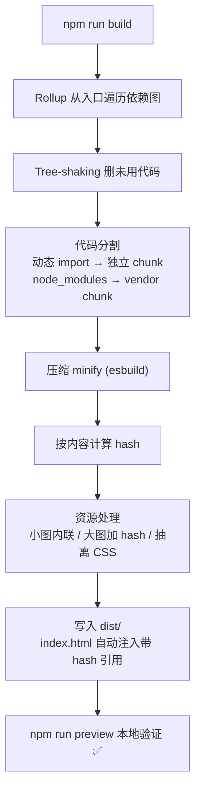
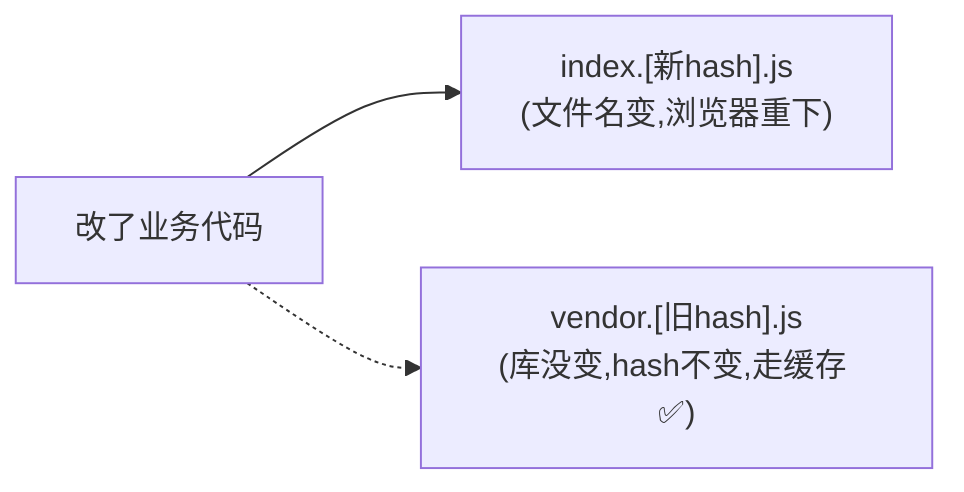

# 08 · 生产构建与产物分析（Production Build）
> `npm run build` 不只是「打个包」，它还压缩、加 hash、分包、按需切割。本模块讲清生产构建做了什么、产物长什么样、怎么分析和优化。

## 📖 知识讲解

### 一、`npm run build` 到底做了什么

执行 `vite build` 时，Vite 用 Rollup 把应用打包，依次完成：

1. **打包合并**：从入口出发遍历依赖图，把模块合并成少数几个 JS chunk。
2. **Tree-shaking**：删掉没用到的导出（见模块 06）。
3. **压缩（minify）**：去空格/注释、缩短变量名（默认用 esbuild）。
4. **加内容 hash**：产物文件名带一段 hash（如 `index.4a8f.js`）。
5. **代码分割（code splitting）**：把动态 import 的模块、第三方库拆成独立 chunk。
6. **资源处理**：小图内联为 base64，大图加 hash 拷到 `assets/`，CSS 抽离成独立文件。

产物默认输出到 `dist/`，结构大致是：

```
dist/
├── index.html              ← 自动注入了带 hash 的 js/css 引用
└── assets/
    ├── index.[hash].js     ← 业务入口
    ├── vendor.[hash].js    ← 第三方库（手动分包）
    ├── heavy.[hash].js     ← 动态 import 的懒加载 chunk
    └── index.[hash].css
```

### 二、为什么文件名要带 hash

hash 是根据文件**内容**算出来的。内容不变 → hash 不变 → 浏览器可以**长期缓存**这个文件（配合服务器 `Cache-Control: max-age=31536000`）。内容一变 → hash 变 → 文件名变 → 浏览器自动重新下载。这套机制叫「**缓存失效（cache busting）**」，既能极致利用缓存，又不会让用户拿到旧代码。

### 三、代码分割（Code Splitting）

把所有代码打成一个巨大的 JS 文件，首屏要等它全下载完才能跑，很慢。代码分割把代码拆成多个 chunk，**按需加载**：

- **动态 import** `import('./heavy.js')`：运行到才下载，常用于路由懒加载、点击才用的功能。Rollup 自动把它打成独立 chunk。
- **手动分包 `manualChunks`**：把不常变的第三方库（React/Vue/lodash）拆成 `vendor` chunk。业务代码天天改，库很少变；分开后改业务只让浏览器重下业务 chunk，vendor 仍走缓存。

### 四、产物分析

构建完终端会打印每个 chunk 的体积和 gzip 后大小。想更直观地看「谁占了体积大头」，用可视化分析插件：

```bash
npm i -D rollup-plugin-visualizer
```

```js
// vite.config.js
import { visualizer } from 'rollup-plugin-visualizer';
export default defineConfig({
  plugins: [visualizer({ open: true })], // build 后自动打开体积分析图
});
```

它会生成一张「矩形树图」，一眼看出哪个依赖最占体积，据此优化（换轻量库、按需引入、懒加载）。

### 五、上线前必做：preview 自测

```bash
npm run build      # 构建
npm run preview    # 起静态服务器跑 dist/，模拟线上环境
```

开发态能跑 ≠ 构建产物没问题（路径、环境变量、动态 import 都可能出岔子），上线前务必 preview 验证一遍。

## 🔄 流程图 / 原理图

下图展示生产构建的完整流水线：



带 hash 的缓存策略：



## 💻 代码说明

`main.js` 用动态 `import()` 实现懒加载：

```js
document.querySelector('#load').addEventListener('click', async () => {
  const { renderReport } = await import('./heavy.js'); // 点击时才下载 heavy.js
  document.querySelector('#report').innerHTML = renderReport();
});
```

`vite.config.js` 用 `manualChunks` 做手动分包：

```js
build: {
  rollupOptions: {
    output: {
      manualChunks(id) {
        if (id.includes('node_modules')) return 'vendor'; // 第三方库单独成 chunk
      },
    },
  },
}
```

构建后看 `dist/assets/`：会有独立的 `heavy.[hash].js`（懒加载 chunk）。打开页面点按钮，Network 面板能看到 `heavy.js` 是**点击后才请求**的。

## ▶️ 运行方式

```bash
cd 12-build-tools/08-build-production
npm install

# 生产构建：观察终端打印的各 chunk 体积
npm run build

# 查看产物结构
# dist/assets/ 下应有 index.[hash].js 和 heavy.[hash].js（懒加载 chunk）

# 本地预览构建产物
npm run preview
```

打开预览页面，开 F12 → Network，点击按钮，观察 `heavy.js` 是「点击那一刻」才发起的请求——这就是代码分割的效果。

## ⚠️ 常见坑 / 最佳实践

- ❌ 把所有东西打成一个大 bundle，首屏巨慢。善用动态 import 做路由级懒加载。
- ❌ `manualChunks` 切得过细，反而产生大量小请求；过粗又失去缓存收益。常见做法是把大的稳定依赖单独切。
- ❌ 部署到 CDN/子路径却没配 `base`，导致产物里资源路径全错、白屏。
- ❌ 线上排错没有 source map。需要时开 `build.sourcemap: true`（注意 map 文件别公开暴露源码，可只上传到错误监控平台）。
- ✅ 上线前一定 `build` + `preview` 自测，别只在 `dev` 验证。
- ✅ 用 `rollup-plugin-visualizer` 定期体检产物体积，揪出「不小心引入的大依赖」。
- ✅ 给带 hash 的 `assets/` 配长缓存，给 `index.html` 配不缓存（保证用户总能拿到最新入口）。

## 🔗 官方文档

- [Vite · 构建生产版本](https://cn.vitejs.dev/guide/build.html)
- [Vite · 构建选项（build.*）](https://cn.vitejs.dev/config/build-options.html)
- [Vite · 功能 · 构建优化（代码分割/动态导入）](https://cn.vitejs.dev/guide/features.html#构建优化)
- [Rollup · manualChunks 手动分包](https://cn.rollupjs.org/configuration-options/#output-manualchunks)
- [rollup-plugin-visualizer 产物分析](https://github.com/btd/rollup-plugin-visualizer)
