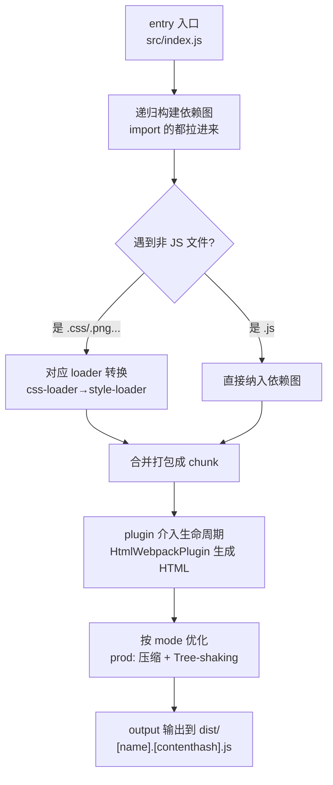

# 09 · Webpack 核心概念（Webpack Basics）
> Webpack 是统治了前端近十年的老牌打包器。即便你主力用 Vite，也要懂 Webpack——大量存量项目、复杂定制场景仍在用它。本模块讲清它的五大核心概念，并和 Vite 对比。

## 📖 知识讲解

### 一、Webpack 是什么

Webpack 是一个**静态模块打包器（module bundler）**。它从一个或多个入口出发，递归地构建出整个应用的**依赖图（dependency graph）**，然后把所有模块打包成少数几个浏览器可用的静态文件（bundle）。

和 Vite 最大的不同：Webpack **开发态也是先打包**（把整个应用打包进内存再提供服务），项目大时启动慢；Vite 开发态用原生 ESM 免打包，所以快（见模块 06）。

### 二、五大核心概念

| 概念 | 一句话 | 配置位置 |
| --- | --- | --- |
| **entry** 入口 | 从哪个文件开始构建依赖图 | `entry: './src/index.js'` |
| **output** 出口 | 打包结果放哪、叫什么名 | `output: { path, filename }` |
| **loader** 加载器 | 教 Webpack 如何处理**非 JS** 文件（CSS、图片、TS…） | `module.rules` |
| **plugin** 插件 | 干 loader 干不了的更广的活（生成 HTML、注入变量、优化） | `plugins: []` |
| **mode** 模式 | development / production / none，决定优化策略 | `mode` 或 `--mode` |

**① entry**：依赖图的起点。

```js
entry: './src/index.js'
```

**② output**：产物输出。`[contenthash]` 让文件名带内容 hash，实现缓存失效。

```js
output: { path: path.resolve(__dirname, 'dist'), filename: '[name].[contenthash].js', clean: true }
```

**③ loader**：Webpack 原生只认 JS/JSON，其它类型全靠 loader 转换。loader 在 `use` 数组里**从右到左 / 从下到上**链式执行：

```js
{ test: /\.css$/, use: ['style-loader', 'css-loader'] }
//                       ↑ 后执行       ↑ 先执行
// css-loader：把 CSS 解析成 JS 模块；style-loader：把它注入 <style> 标签
```

常见 loader：`babel-loader`（转 ES6+/JSX）、`ts-loader`（转 TS）、`css-loader`/`style-loader`/`sass-loader`、`vue-loader`。

> Webpack 5 内置「资源模块（Asset Modules）」用 `type: 'asset'` 处理图片字体，不再需要旧的 `file-loader`/`url-loader`。

**④ plugin**：作用范围比 loader 广，能介入整个构建生命周期。

```js
plugins: [ new HtmlWebpackPlugin({ template: './src/index.html' }) ]
// 自动生成 index.html 并注入打包出的带 hash 的 <script>
```

常见 plugin：`HtmlWebpackPlugin`（生成 HTML）、`MiniCssExtractPlugin`（抽离 CSS 成独立文件）、`DefinePlugin`（注入全局常量）、`CopyWebpackPlugin`（拷贝静态资源）。

**⑤ mode**：

- `development`：不压缩、保留可读性、利于调试。
- `production`：压缩、Tree-shaking、各种优化（默认）。

### 三、loader vs plugin 的区别（高频面试题）

- **loader**：聚焦「**文件转换**」，作用在「单个模块」级别，把某类文件转成 Webpack 能处理的模块。
- **plugin**：聚焦「**功能扩展**」，作用在「整个构建流程」级别，通过 hook 介入打包的各个生命周期阶段。

### 四、Webpack vs Vite 对照表

| 维度 | Webpack | Vite |
| --- | --- | --- |
| 开发态 | 先打包整个应用再服务，**慢** | 原生 ESM 免打包，**秒启动** |
| 生产态 | Webpack 自己打包 | Rollup / Rolldown 打包 |
| 配置文件 | `webpack.config.js`（CommonJS） | `vite.config.js`（ESM） |
| HTML | 用 plugin **生成**（是产物） | `index.html` 是**入口**（是源码） |
| 非 JS 资源 | 靠 **loader** | 内置支持，开箱即用 |
| 配置复杂度 | 高、灵活、生态最全 | 低、约定优于配置 |
| 适合 | 复杂定制 / 存量老项目 | 新项目 / 追求开发体验 |

## 🔄 流程图 / 原理图

下图展示 Webpack 五大概念如何协作把源码打成产物：



loader 链式执行顺序（从右到左）：


## 💻 代码说明

`webpack.config.js` 一个文件里集齐五大概念，重点看 loader 和 plugin：

```js
module: {
  rules: [{ test: /\.css$/i, use: ['style-loader', 'css-loader'] }], // loader
},
plugins: [ new HtmlWebpackPlugin({ template: './src/index.html' }) ], // plugin
```

`src/index.js` 里 `import './style.css'` 之所以能成立，正是因为配了 css-loader + style-loader。`src/index.html` 只是个**模板**，不写 `<script>`——脚本由 `HtmlWebpackPlugin` 自动注入。

## ▶️ 运行方式

```bash
cd 12-build-tools/09-webpack-basics
npm install

# 开发服务器（webpack-dev-server，默认开 http://localhost:8090）
npm run dev

# 生产构建，产物在 dist/
npm run build
```

构建后看 `dist/`：会有自动生成的 `index.html`（里面注入了带 hash 的 js）和 `main.[contenthash].js`。对比模块 02 的 Vite 产物，体会两者差异。

## ⚠️ 常见坑 / 最佳实践

- ❌ loader 顺序写反。`use: ['css-loader', 'style-loader']` 是错的，正确是 `['style-loader', 'css-loader']`（右先左后）。
- ❌ `output.path` 写相对路径。它**必须是绝对路径**，用 `path.resolve(__dirname, 'dist')`。
- ❌ 混淆 loader 和 plugin。「转换某类文件」用 loader，「扩展构建功能」用 plugin。
- ❌ 在 `index.html` 模板里又手写 `<script src="index.js">`，导致和插件注入的脚本重复。模板里不要写入口脚本。
- ✅ 生产环境记得用 `--mode production`（开启压缩和优化），开发用 `development`（快、可调试）。
- ✅ 大型 Webpack 项目用 `webpack-bundle-analyzer` 分析体积，思路同 Vite 的 visualizer。
- ✅ 新项目优先 Vite；维护老的 Webpack 项目时，本模块的概念能帮你看懂配置。

## 🔗 官方文档

- [Webpack 中文文档 · 概念](https://webpack.docschina.org/concepts/)
- [Webpack · 入口起点 entry](https://webpack.docschina.org/concepts/entry-points/)
- [Webpack · 输出 output](https://webpack.docschina.org/concepts/output/)
- [Webpack · loader](https://webpack.docschina.org/concepts/loaders/)
- [Webpack · 插件 plugin](https://webpack.docschina.org/concepts/plugins/)
- [Webpack · 模式 mode](https://webpack.docschina.org/configuration/mode/)
