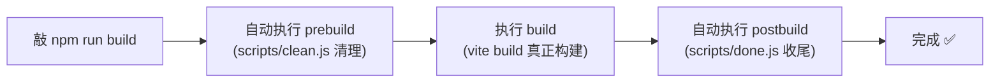
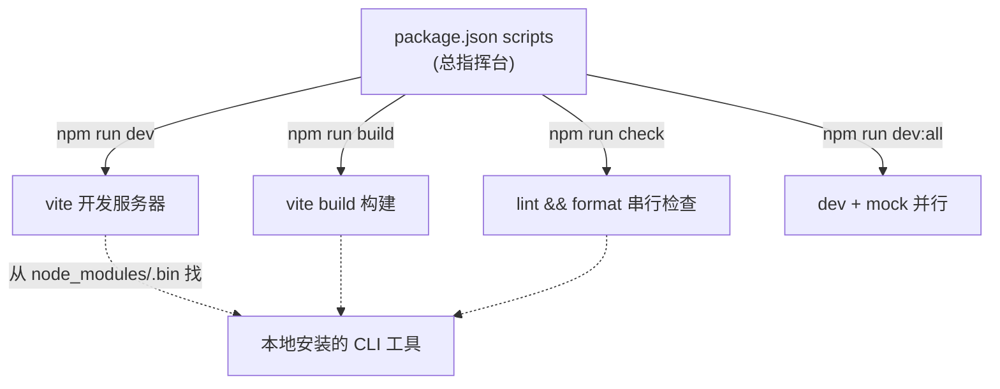

# 10 · npm scripts 工程化工作流（npm Scripts Workflow）
> `npm run dev`、`npm run build` 这些命令从哪来？答案是 `package.json` 的 `scripts` 字段。它是把所有构建工具、检查工具「串成工作流」的总指挥台。

## 📖 知识讲解

### 一、npm scripts 是什么

`package.json` 里的 `scripts` 字段定义了一组「命名命令」。用 `npm run <名字>` 即可执行：

```json
{
  "scripts": {
    "dev": "vite",
    "build": "vite build"
  }
}
```

```bash
npm run dev    # 等价于直接运行 vite
npm run build  # 等价于运行 vite build
```

> `dev`、`build`、`start`、`test` 等少数名字可省略 `run`（如 `npm test`、`npm start`），其余必须带 `run`。

### 二、为什么用 npm scripts（而不是直接敲命令）

1. **不用全局安装**：脚本里写 `vite` / `eslint`，npm 会自动去 `node_modules/.bin` 找本地安装的版本。团队成员版本统一，不污染全局。
2. **统一入口**：无论项目底层用 Vite 还是 Webpack，对外都是 `npm run dev` / `npm run build`，记忆成本低。
3. **可组合**：用 `&&`、`pre/post` 钩子、并行工具把多个步骤串成完整工作流。

### 三、生命周期钩子：`pre` 和 `post`

npm 有个约定：运行 `npm run X` 时，会**自动**先跑 `preX`、后跑 `postX`（如果存在）：

```json
{
  "scripts": {
    "prebuild": "node scripts/clean.js",   // build 前自动执行
    "build": "vite build",
    "postbuild": "node scripts/done.js"     // build 后自动执行
  }
}
```

只敲 `npm run build`，实际执行顺序是：`prebuild` → `build` → `postbuild`。常用于「构建前清理、构建后上传 source map / 发通知」。

### 四、串行与并行

- **串行 `&&`**：前一个成功才跑下一个。

  ```json
  "check": "npm run lint && npm run format"
  ```

- **并行**：同时跑多个（如前端 dev server + mock 后端）。Shell 的 `&` 不跨平台，推荐用工具：

  ```bash
  npm i -D npm-run-all   # 或 concurrently
  ```

  ```json
  "dev:all": "npm-run-all --parallel dev mock"
  ```

### 五、传参：`--`

给底层命令传参时，用 `--` 分隔，`--` 后面的参数会原样传给脚本对应的命令：

```bash
npm run dev -- --host --port 8080    # 等价于 vite --host --port 8080
```

### 六、npm 注入的环境变量

脚本运行时，npm 会注入一批 `npm_package_*` 环境变量，脚本里可通过 `process.env` 读取：

```js
process.env.npm_package_name     // 包名
process.env.npm_package_version  // 版本号
```

## 🔄 流程图 / 原理图

下图展示 `npm run build` 时生命周期钩子的自动触发顺序：



npm scripts 作为「工作流总指挥」的全景：



## 💻 代码说明

本模块的 `package.json` 是讲解重点，覆盖了 5 类用法（用 `"//x"` 作分隔注释，npm 会忽略这些键）：

```json
"prebuild": "node scripts/clean.js",  // ① pre 钩子
"build": "vite build",
"postbuild": "node scripts/done.js",  // ① post 钩子
"check": "npm run lint && npm run format", // ③ 串行
"dev:all": "npm-run-all --parallel dev mock", // ④ 并行
"clean": "rimraf dist"                 // ⑤ 调用本地依赖 CLI
```

`scripts/hello.js` 演示了脚本里读 npm 注入的环境变量。`scripts/mock-server.js` 用 Node 内置 `http` 起了个零依赖的 mock 接口服务器，配合并行脚本模拟真实联调工作流。

> 注意：`dev:all`、`check`、`clean` 依赖 `npm-run-all`、`eslint`、`prettier`、`rimraf` 等包，本 demo 未全部安装，重在讲解写法。可运行的是 `npm run hello` 和 `pre/post` 钩子链。

## ▶️ 运行方式

```bash
cd 12-build-tools/10-npm-scripts-workflow
npm install

# ① 跑最简单的脚本，看 npm 注入的环境变量
npm run hello

# ② 体验 pre/post 钩子链（注意：只敲 build，clean 和 done 会自动前后执行）
npm run build
# 终端输出顺序应为：[prebuild]清理 → vite 构建 → [postbuild]收尾

# ③ 单独跑 mock 服务器，浏览器访问 http://localhost:3001
node scripts/mock-server.js
```

## ⚠️ 常见坑 / 最佳实践

- ❌ 以为要全局装工具。脚本里直接写工具名即可，npm 自动从 `node_modules/.bin` 找，**不要 `npm i -g`**。
- ❌ 用 Shell 的 `cmd1 & cmd2` 做并行。`&` 在 Windows 行为不同，跨平台请用 `npm-run-all` / `concurrently`。
- ❌ 传参忘了 `--`。`npm run dev --port 8080` 是错的，参数没传给 vite；正确是 `npm run dev -- --port 8080`。
- ❌ `pre/post` 钩子滥用导致执行链不透明。复杂流程建议显式写 `&&` 串联，更易读。
- ✅ 善用 `pre/post` 做「构建前清理 / 提交前校验（配合 husky）」等自动化。
- ✅ 脚本变多时，用命名空间约定（`build:dev`、`build:prod`、`test:unit`）保持清晰。
- ✅ npm scripts 是工程化的「胶水」——它本身不构建，而是把 Vite/Webpack/ESLint/Prettier 等工具编排成统一的工作流。

## 🔗 官方文档

- [npm 官方 · scripts](https://docs.npmjs.com/cli/v10/using-npm/scripts)
- [npm 官方 · npm run 命令](https://docs.npmjs.com/cli/v10/commands/npm-run-script)
- [npm-run-all（并行/串行编排）](https://github.com/mysticatea/npm-run-all)
- [Vite · 命令行界面](https://cn.vitejs.dev/guide/cli.html)
