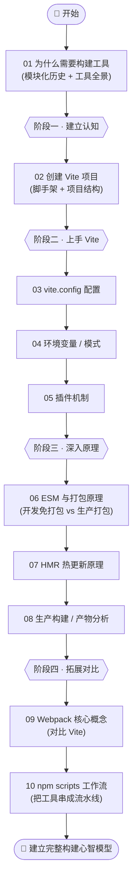
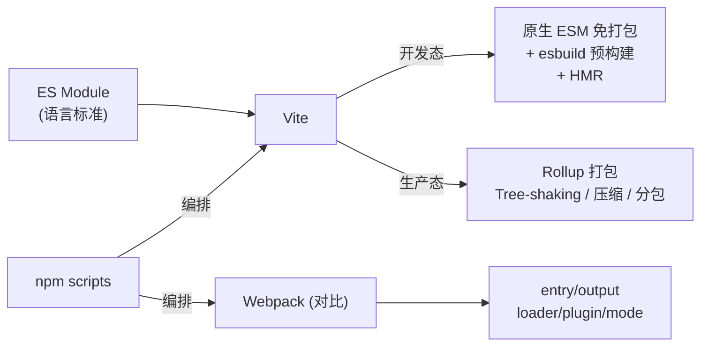

# 12 · 前端工程化与构建工具（Build Tools · 以 Vite 为主）

> 现代前端早已不是「写个 HTML 丢浏览器」那么简单：TypeScript 要编译、组件要打包、上线要压缩、开发要热更新……这一切都由**构建工具**完成。本工程以 **Vite** 为主线，系统讲解前端工程化，并用 **Webpack** 作对比，帮你建立完整的「现代前端构建心智模型」。

## 📚 这个工程讲什么

前端工程化要解决的核心矛盾是：

- **开发时**：我们写模块化的、需要编译的、对人友好的代码，希望「改完即见、启动飞快」。
- **上线时**：浏览器需要兼容的、合并压缩的、加载最快的代码，希望「包小、请求少、缓存好」。

构建工具就是连接这两端的桥。本工程从「为什么需要构建工具」讲起，逐步深入 Vite 的配置、环境变量、插件机制、ESM 打包原理、HMR 热更新、生产构建，最后对比 Webpack 并落到 npm scripts 工作流。

技术栈与版本：**Vite 5.x**（主）、**Webpack 5.x**（对比）、Node.js 18+。

## 🗂 模块索引

| 模块 | 知识点 | 你将学会 | 运行方式 |
| --- | --- | --- | --- |
| [01](./01-why-build-tools/) | 为什么需要构建工具 | 模块化演进史、构建工具解决的 6 类问题、主流工具对比 | 浏览器 / 本地服务器 |
| [02](./02-vite-getting-started/) | 创建第一个 Vite 项目 | 脚手架命令、项目结构、index.html 为何是入口 | `npm run dev` |
| [03](./03-vite-config/) | vite.config.js 配置 | 别名、代理、server、build、define 等常用配置 | `npm run dev` |
| [04](./04-vite-env-vars/) | 环境变量与模式 | `import.meta.env`、`.env` 文件、VITE_ 前缀、多环境 | `npm run dev/build` |
| [05](./05-vite-plugins/) | 插件机制 | 插件钩子、enforce 顺序、手写一个插件 | `npm run dev` |
| [06](./06-esm-bundling/) | ESM 与打包原理 | 原生 ESM、依赖预构建、Tree-shaking、开发/生产双态 | `npm run dev/build` |
| [07](./07-hmr/) | 热模块替换 HMR | WebSocket 推送原理、`import.meta.hot` API、状态保留 | `npm run dev` |
| [08](./08-build-production/) | 生产构建与产物分析 | 打包/压缩/hash、代码分割、手动分包、体积分析 | `npm run build` |
| [09](./09-webpack-basics/) | Webpack 核心概念 | entry/output/loader/plugin/mode、与 Vite 对比 | `npm run dev/build` |
| [10](./10-npm-scripts-workflow/) | npm scripts 工作流 | scripts、pre/post 钩子、串行/并行、传参 | `npm run hello` |

## 🧭 学习路线

建议按编号顺序学习。整体分四个阶段：**建立认知 → 上手 Vite → 深入原理 → 拓展对比**。



核心概念之间的关系：



## ▶️ 运行说明

每个模块都是**独立**的小项目，有自己的 `package.json`。进入对应模块目录安装依赖即可：

```bash
# 以模块 02 为例
cd 12-build-tools/02-vite-getting-started
npm install        # 安装该模块依赖（首次）
npm run dev        # 启动开发服务器，按终端提示打开浏览器

# Vite 类模块通用命令：
npm run dev        # 开发服务器（默认 http://localhost:5173）
npm run build      # 生产构建，产物在 dist/
npm run preview    # 预览构建产物
```

特殊说明：

- **模块 01** 部分 demo 是纯 HTML，可直接浏览器打开；含 ES Module 的页面需用本地服务器（`npx serve .`）。
- **模块 09（Webpack）** 用 `npm run dev` / `npm run build`，底层是 webpack-dev-server / webpack。
- **模块 10（npm scripts）** 用 `npm run hello` 等命令体验脚本工作流。

环境要求：Node.js 18+（建议 LTS 版本），自带 npm。

## ⚠️ 学习建议

- 不要只读 README，**一定要把每个模块跑起来**，对着浏览器 Network / Console / WebSocket 面板观察现象，原理才能落地。
- 重点理解模块 06（ESM 打包原理）和 07（HMR），它们是「Vite 为什么快」的答案，也是面试高频。
- Vite 是主线，但模块 09 的 Webpack 概念别跳过——存量项目和复杂定制场景仍大量使用 Webpack。

## 🔗 权威文档

- [Vite 官方中文文档](https://cn.vitejs.dev/)
- [Webpack 中文文档](https://webpack.docschina.org/)
- [Rollup 中文文档](https://cn.rollupjs.org/)
- [esbuild 官方文档](https://esbuild.github.io/)
- [MDN · JavaScript 模块](https://developer.mozilla.org/zh-CN/docs/Web/JavaScript/Guide/Modules)
