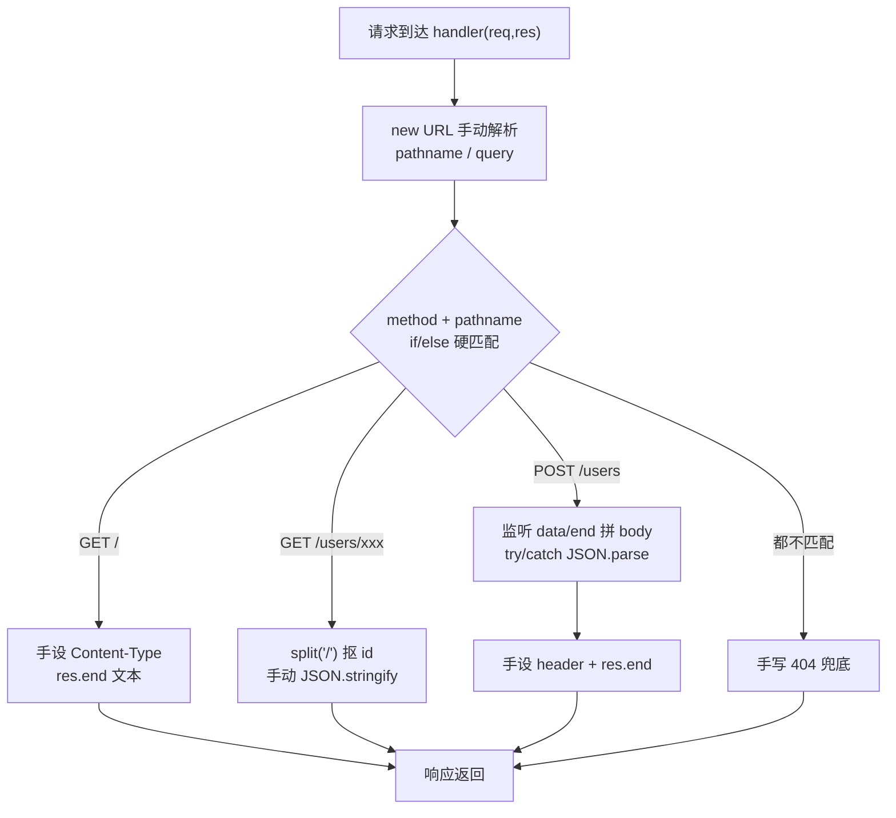
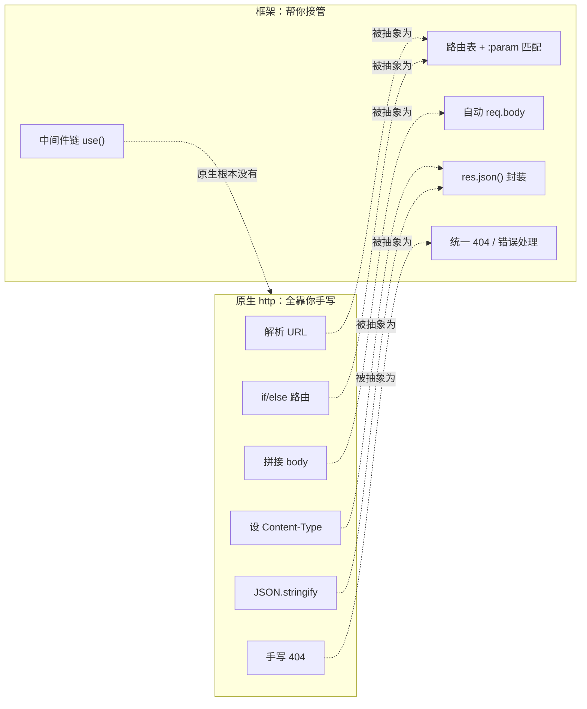

# 01 · 从原生 http 到框架（From Native HTTP to Framework）
> 用纯内置 `http` 模块手写一个服务，把「路由、body 解析、响应」全靠手撸的痛点全暴露出来；再手写一个 ~80 行极简框架跑同样接口，看清 Express 这类框架到底替你做了什么。

## 📖 知识讲解

Node 内置 `http.createServer((req, res) => {...})` 已经能起 Web 服务，但**只给了最原始的原料**：一个可读流 `req` 和一个可写流 `res`。真正写业务时，你会被迫反复手写一堆样板代码。这就是「原生 http 的 5 大痛点」：

1. **URL 要自己解析**：`req.url` 是 `"/users/1?verbose=1"` 这种 path+query 混在一起的字符串，得用 `new URL()` 手动切分出 pathname 和 query。
2. **路由靠 if/else 硬堆**：每加一个接口就多一段 `if (method === ... && pathname === ...)`；而 `/users/:id` 这种**路径参数**没有现成支持，只能 `pathname.split('/')` 自己抠。
3. **Content-Type 每次手动设**：每个响应都要 `res.writeHead(200, { 'Content-Type': 'application/json; charset=utf-8' })`，漏了 `charset` 就中文乱码。
4. **返回 JSON 要手动序列化**：每次都得 `JSON.stringify(obj)`，没有 `res.json()` 这种便捷方法。
5. **body 解析代码到处重复**：`req` 是流，POST body 要监听 `'data'`/`'end'` 一块块拼接再 `JSON.parse`，每个 POST 接口都复制一遍，还得自己 try/catch 防坏 JSON。

**更致命的是没有中间件机制**：日志、鉴权、跨域这些「每个请求都要做的事」无处安放，只能塞进每个 handler 里，无法复用、无法插拔。

**框架解决什么**：把上面这些「每个请求都要做的重复劳动」抽象成通用能力——
- 路由表 + 路径参数匹配（`app.get('/users/:id', ...)`）
- 自动 body 解析（`req.body` 直接可用）
- 便捷响应方法（`res.json()`、`res.status()`）
- **中间件链**（`app.use()`，用洋葱模型把横切逻辑串起来）

本模块的 `mini-framework.js` 就亲手实现了这些能力，让你明白框架不是魔法。

## 🔄 流程图 / 原理图

原生 http 一次请求的处理流程（全靠手写分支）：



原生 vs 框架的「职责划分」——框架把重复劳动接管过去：



## 💻 代码说明

**`native-server.js`（痛点版，端口 3001）**：`http.createServer` 里用 `new URL` 手动拆 path/query，用一连串 `if (method && pathname)` 做路由；`GET /users/:id` 靠 `pathname.split('/')[2]` 抠 id；`POST /users` 手动监听 `data`/`end` 拼 body 再 `JSON.parse`（还要 try/catch）；每个响应都手动 `writeHead` 设 Content-Type、手动 `JSON.stringify`；最后手写 404 兜底。注释里逐条标了 5 大痛点。

**`mini-framework.js`（框架版，端口 3002）**：一个 `App` 类实现了框架核心——
- `use(fn)` 把中间件推进 `this.middlewares`；
- `get/post` 把路由推进 `this.routes`；
- `listen` 里统一在 `createServer` 回调中读完 body 并 `req.body` 解析好（**自动 body 解析，业务不用再写 data/end**）；
- `_handle` 用一个 `next()` 递归依次执行中间件链（洋葱模型简化版），跑完再 `_route` 做路由匹配；
- `matchPath` 支持 `/users/:id` 路径参数，匹配成功把参数挂到 `req.params`；
- `res.json(obj, status)` 封装了「设 header + 序列化」。

同样三个接口，业务代码变得极其干净：`app.get('/users/:id', (req, res) => res.json(...))`。对比之下框架的价值一目了然。

## ▶️ 运行方式

两个文件都零依赖，`node` 直接跑：

```bash
# 痛点版（端口 3001）
node native-server.js         # 或 npm start
# 另开终端测试：
curl http://localhost:3001/
curl http://localhost:3001/users/1
curl -X POST -H "Content-Type: application/json" -d '{"name":"张三"}' http://localhost:3001/users
curl http://localhost:3001/nope        # 404

# 框架版（端口 3002）
node mini-framework.js        # 或 npm run mini
curl http://localhost:3002/
curl "http://localhost:3002/users/1?verbose=1"
curl -X POST -H "Content-Type: application/json" -d '{"name":"李四"}' http://localhost:3002/users
```

按 `Ctrl + C` 停止服务。

## ⚠️ 常见坑 / 最佳实践

- ❌ 原生里 POST 分支异步读 body，读完前**必须 `return`**，否则代码会继续往下走到 404 分支。
- ❌ 忘设 `charset=utf-8` → 中文响应乱码。
- ⚠️ 中间件不调用 `next()`，请求就永远卡住——洋葱模型靠 `next()` 传递控制权。
- ⚠️ 手写框架只为教学：真实框架（Express）还处理了流式 body、超大 body 限制、编码、错误边界等大量细节，别用于生产。
- ✅ 理解「框架 = 把每请求的重复劳动抽象成通用能力」后，再学 Express 会非常轻松——你已经知道 `app.get` / `use` / `req.body` 背后是什么了。

## 🔗 官方文档

- [Node.js HTTP 模块](https://nodejs.org/docs/latest/api/http.html)
- [Anatomy of an HTTP Transaction](https://nodejs.org/en/learn/modules/anatomy-of-an-http-transaction)
- [WHATWG URL API](https://nodejs.org/docs/latest/api/url.html)
