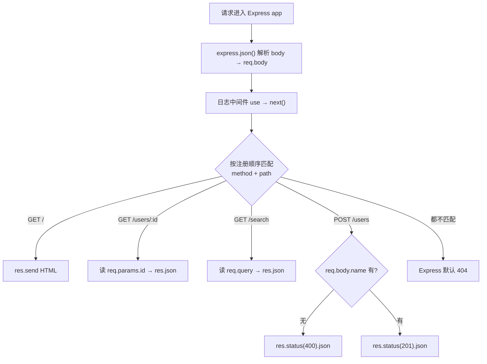

# 02 · Express 核心（Express Core：Routing / req·res / Middleware）
> 用 Express 5 演示路由、路由参数、查询参数、`req.body`、`res.json/status` 与一个日志中间件——把上一模块「手写框架」的能力换成成熟框架的标准写法。

## 📖 知识讲解

Express 是 Node 最主流的 Web 框架，核心就三件事：**路由（Routing）、请求/响应对象（req/res）、中间件（Middleware）**。

**路由**：`app.METHOD(path, handler)` 注册。
- `app.get('/', fn)` / `app.post('/users', fn)` 按方法+路径匹配。
- **路由参数**：`/users/:id` 里的 `:id` 会解析到 `req.params.id`。
- **查询参数**：`/search?keyword=x` 的 `?` 后面部分解析到 `req.query`（值都是字符串，需要数字要自己 `Number()`）。

**req（请求对象）常用**：`req.params`（路径参数）、`req.query`（查询串）、`req.body`（请求体，需 body 解析中间件）、`req.method`、`req.url`、`req.headers`。

**res（响应对象）常用**：
- `res.send(x)`：智能发送，字符串当 HTML/文本，对象自动转 JSON。
- `res.json(obj)`：明确发 JSON，自动 `JSON.stringify` + 设 `application/json`。
- `res.status(code)`：设状态码，**返回 res 本身**，所以能链式 `res.status(201).json(...)`。

**中间件**：`app.use(fn)` 注册的 `(req, res, next)` 函数，每个请求按注册顺序流经它们，必须调用 `next()` 才能往下走。`express.json()` 就是官方内置的 body 解析中间件。

### Express 5 与 4 的关键区别（本 demo 用通用写法，不踩这些坑）
- **路由匹配引擎升级到新版 path-to-regexp**：不再支持 `/foo*` 这种裸通配，通配要写命名形式 `/foo/*splat`；可选参数从 `:id?` 改为 `{/:id}` 语法。普通 `/users/:id` 两版都一样。
- **默认支持异步错误**：Express 5 里 `async` 路由 handler 抛出的 reject 会**自动**转给错误处理中间件，不用再手动 `try/catch + next(err)`（Express 4 里未捕获的 async 错误会挂起）。
- **`req.body` 默认 undefined**：没装 body 解析中间件时，Express 5 的 `req.body` 是 `undefined`（4 里某些情况是 `{}`），所以取值要 `req.body || {}` 兜底。
- **移除了一些老 API**：如 `app.del()`（用 `app.delete`）、`res.sendfile` 小写版等。

## 🔄 流程图 / 原理图

一个请求在 Express 里的路由匹配流程：



## 💻 代码说明

`app.js`：
- `app.use(express.json())` + `express.urlencoded()`：内置 body 解析，让 `req.body` 可用。
- 自定义**日志中间件** `app.use((req,res,next)=>{...; next()})`：打印方法与 URL 后放行。
- `app.get('/')` 用 `res.send` 发 HTML。
- `app.get('/users/:id')` 演示**路由参数** `req.params.id`。
- `app.get('/search')` 演示**查询参数** `req.query`，并把字符串 `page` 转数字。
- `app.post('/users')` 演示 `req.body` 取值、`res.status(400/201).json()` 链式响应与简单校验。
- `app.listen(3003)` 启动。

## ▶️ 运行方式

```bash
npm install       # 安装 express ^5.1.0
npm start         # node app.js，监听 3003

# 另开终端测试：
curl http://localhost:3003/
curl http://localhost:3003/users/42
curl "http://localhost:3003/search?keyword=node&page=2"
curl -X POST -H "Content-Type: application/json" -d '{"name":"张三"}' http://localhost:3003/users
curl -X POST -H "Content-Type: application/json" -d '{}' http://localhost:3003/users   # 400
```

按 `Ctrl + C` 停止。

## ⚠️ 常见坑 / 最佳实践

- ❌ 不装 `express.json()` 就想读 `req.body` → Express 5 下是 `undefined`，务必先 `app.use(express.json())`。
- ❌ 中间件里忘了 `next()`（且没结束响应）→ 请求永久挂起。
- ⚠️ `req.query` 的值**永远是字符串**，`?page=2` 拿到的是 `"2"`，比较/计算前要转类型。
- ⚠️ 路由**按注册顺序匹配**，把更具体的路由写在通配/兜底前面。
- ⚠️ 从 Express 4 迁移注意 path-to-regexp 语法变化（`*` → `*splat`，`:id?` → `{/:id}`）。
- ✅ Express 5 下 `async` 路由可以直接 `throw`，错误会自动进错误处理中间件（见模块 03）。

## 🔗 官方文档

- [Express 官网](https://expressjs.com/)
- [Routing 指南](https://expressjs.com/en/guide/routing.html)
- [Express 5 迁移指南](https://expressjs.com/en/guide/migrating-5.html)
- [req / res API](https://expressjs.com/en/5x/api.html)
