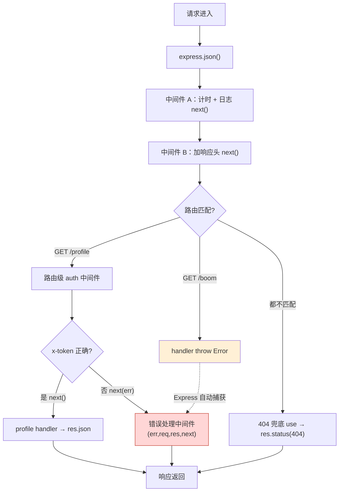

# 03 · Express 中间件机制与错误处理（Middleware & Error Handling）
> 讲透中间件的「洋葱式串联」、应用级 vs 路由级、`next(err)` 如何短路到**错误处理中间件**，再加上 `express.static` 静态资源和 404 兜底——这是 Express 的灵魂。

## 📖 知识讲解

**中间件（Middleware）** 就是签名为 `(req, res, next)` 的函数。每个请求像水流一样按**注册顺序**依次流经它们：
- 调用 `next()` → 交给下一个中间件/路由；
- 直接 `res.send/json/end` → 结束响应，后面的不再执行；
- 调用 `next(err)`（传参数）→ **短路**，跳过所有普通中间件和路由，直达**错误处理中间件**。

**洋葱模型**：中间件是一层层包裹的。`next()` 之前的代码在「进入」时执行，`next()` 之后的代码在内层返回后执行（想在响应结束后统计耗时，更稳妥是监听 `res` 的 `'finish'` 事件）。

**应用级 vs 路由级**：
- **应用级**：`app.use(fn)`，对**所有**请求生效（如日志、加响应头、body 解析）。
- **路由级**：`app.get('/profile', auth, handler)`，把中间件写在**某条路由**上，只有这条路由会经过它（如针对性鉴权）。

**错误处理中间件**：签名是**四个参数** `(err, req, res, next)`——Express 靠「参数个数正好是 4」来识别它，**少一个都不行**，且必须放在**所有路由和其它中间件之后**。任何地方 `next(err)`、或路由里 `throw`（Express 5 下同步和 async 都会自动捕获），都会跳到这里统一处理。

**express.static**：`app.use('/static', express.static('public'))` 把 `public` 目录当静态资源服务器，`/static/hello.txt` 直接返回文件。

**404 兜底**：放在所有路由之后、错误中间件之前的一个普通 `app.use`——能走到它说明前面没有任何路由匹配，于是回 404。

## 🔄 流程图 / 原理图

中间件链：正常流（层层 next）vs `next(err)` / throw 短路到错误中间件：



洋葱模型（进入顺序 vs 返回顺序）：


## 💻 代码说明

`app.js`：
- **应用级中间件 A/B**：A 记录 `req._start` 并打印进入日志；B 给所有响应 `res.setHeader` 加自定义头；都 `next()` 放行。
- **`express.static`**：`app.use('/static', express.static(path.join(__dirname,'public')))`，映射 `public/hello.txt` → `/static/hello.txt`。
- **路由级中间件 `auth`**：挂在 `GET /profile` 上，检查 `x-token` 头；对了 `next()`，错了造一个带 `status=401` 的 Error 并 `next(err)` 短路。
- **`GET /boom`（async）与 `/boom-sync`（同步）**：直接 `throw`，演示 Express 5 自动把错误送进错误中间件，无需手写 try/catch。
- **404 兜底**：所有路由之后的 `app.use`，回 `404 + originalUrl`。
- **错误处理中间件**：四参 `(err, req, res, next)`，读 `err.status`（默认 500）统一回 JSON，放在最后。

## ▶️ 运行方式

```bash
npm install
npm start          # node app.js，监听 3004

# 正常首页
curl http://localhost:3004/
# 静态文件
curl http://localhost:3004/static/hello.txt
# 路由级鉴权：无 token → 401（短路到错误中间件）
curl -i http://localhost:3004/profile
# 带正确 token → 200
curl -i -H "x-token: secret" http://localhost:3004/profile
# 故意抛错 → 500（被错误中间件捕获）
curl -i http://localhost:3004/boom
curl -i http://localhost:3004/boom-sync
# 未匹配 → 404 兜底
curl -i http://localhost:3004/not-exist
```

`-i` 可看到 `X-Powered-By-Demo` 响应头（证明中间件 B 生效）。按 `Ctrl + C` 停止。

## ⚠️ 常见坑 / 最佳实践

- ❌ 错误处理中间件写成三个参数 `(req,res,next)` → Express 当成普通中间件，错误不会进来。**必须四个参数**。
- ❌ 把错误处理中间件放在路由**前面** → 它捕获不到后面路由的错误。**必须放最后**。
- ❌ 404 兜底放在具体路由**前面** → 所有请求都 404。顺序：具体路由 → 404 兜底 → 错误处理。
- ⚠️ Express 4 里 async 路由的 reject **不会**自动被捕获，需手动 `.catch(next)` 或包一层；Express 5 才自动捕获。
- ⚠️ `next()` 与 `next(err)` 语义不同：无参=继续，有参=进错误流。别把普通数据传给 `next()`。
- ✅ 横切逻辑（日志、鉴权、CORS、限流）都做成中间件，保持路由 handler 干净、可复用、可组合。

## 🔗 官方文档

- [Using middleware](https://expressjs.com/en/guide/using-middleware.html)
- [Writing middleware](https://expressjs.com/en/guide/writing-middleware.html)
- [Error handling](https://expressjs.com/en/guide/error-handling.html)
- [Serving static files](https://expressjs.com/en/starter/static-files.html)
