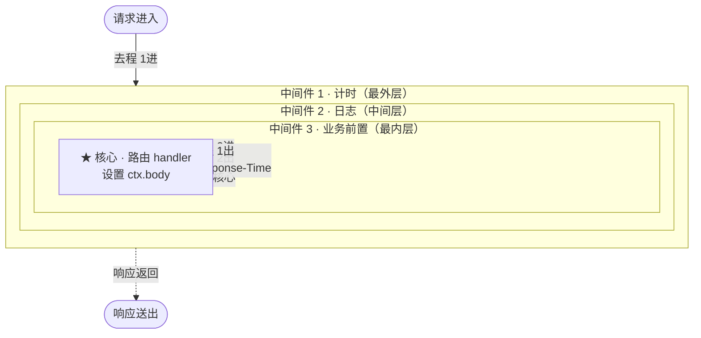
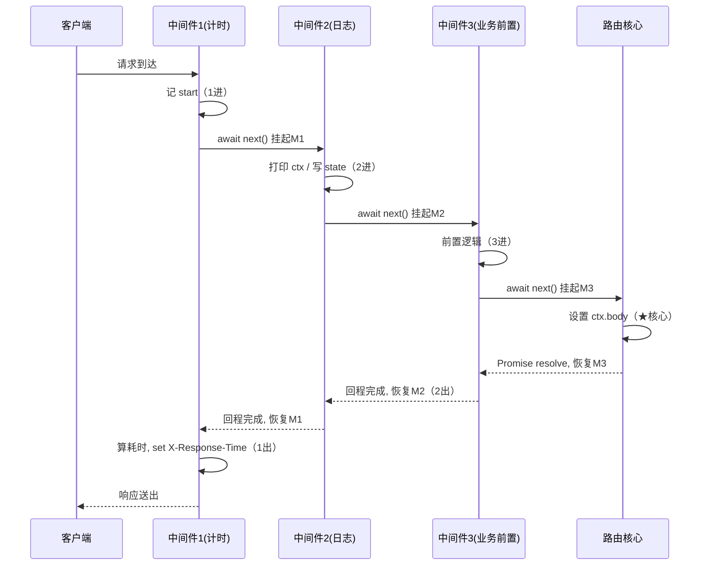

# 04 · Koa 洋葱模型（Koa Onion Model）
> Koa 用 `async/await` + `next()` 把中间件组织成「洋葱」：请求去程逐层向内穿透到核心，再回程逐层向外穿出，`await next()` 前后各执行一段代码——这是 Koa 区别于 Express 的灵魂。

## 📖 知识讲解

**Koa** 是 Express 原班人马打造的更轻量框架。它核心只有三样东西：`ctx`（上下文）、`app.use` 注册中间件、以及 **基于 `async/await` 的洋葱模型**。

### 中间件与洋葱模型

每个中间件签名是 `async (ctx, next) => {}`：

- `await next()` **之前**的代码：请求的「**去程**」（由外向内）。
- `await next()`：把控制权交给**下一层**中间件，并**暂停**当前中间件（await 挂起）。
- `await next()` **之后**的代码：等内层全部执行完，控制权「**回程**」（由内向外）逆序回到这里。

所以 3 个中间件的执行顺序是：`1进 → 2进 → 3进 → 核心 → 3出 → 2出 → 1出`。像一根针穿过一颗洋葱：先穿进每一层到达核心，再原路逆序穿出。

### ctx 上下文

Koa 把 Node 原生的 `req`/`res` 封装、并揉进一个 `ctx` 对象：

| ctx 属性 | 说明 |
|---|---|
| `ctx.request` / `ctx.response` | Koa 封装的请求 / 响应对象 |
| `ctx.req` / `ctx.res` | Node 原生的 `req` / `res`（少用） |
| `ctx.method` / `ctx.url` | 等价 `ctx.request.method` / `.url` 的快捷方式 |
| `ctx.body` | **设置响应体**，Koa 自动推断 `Content-Type`（对象→JSON，字符串→text/html） |
| `ctx.state` | 本次请求内、**跨中间件传数据**的推荐容器 |
| `ctx.set(k, v)` | 设置响应头（必须在 body 真正发送前） |
| `ctx.params` | `@koa/router` 注入的路由参数 |

### 计时中间件（洋葱的经典用法）

把它放在**最外层**：去程记 `start`，回程（`await next()` 之后）算耗时并 `ctx.set('X-Response-Time', ...)`。因为回程发生在所有内层处理之后、body 真正写出之前，正好能量出「整条链」的耗时。

## 🔄 流程图 / 原理图

### 洋葱模型图（层层包裹 + 去程/回程）



> 实线 = 去程（由外向内 `await next()` 之前）；虚线 = 回程（由内向外 `await next()` 之后）。

### await next() 的挂起 / 恢复（时序图）



## 💻 代码说明

`app.js` 用 `new Koa()` 建应用，`app.use` 依次注册 3 个 `async (ctx, next)` 中间件：

- **中间件 1（计时）**：`await next()` 前记 `start`，之后算 `ms` 并 `ctx.set('X-Response-Time', ...)`。
- **中间件 2（日志）**：打印 `ctx.method` / `ctx.url` / `ctx.request.headers`，并往 `ctx.state.requestId` 写数据供下游读取。
- **中间件 3（业务前置）**：`await next()` 交给路由，回程时可统一加工 `ctx.body`。
- **路由**：`@koa/router` 的 `router.get('/')` 和 `router.get('/hello/:name')` 设置 `ctx.body`（核心处理），再用 `app.use(router.routes())` + `app.use(router.allowedMethods())` 挂载。

每个中间件在 `await next()` 前后各 `console.log` 一行，跑一次请求即可在控制台看到洋葱顺序。

## ▶️ 运行方式

```bash
source ~/.nvm/nvm.sh
npm install
npm start                       # 启动在 http://localhost:3004

# 另开终端：
curl http://localhost:3004/
curl http://localhost:3004/hello/张三
curl -i http://localhost:3004/   # -i 可看到 X-Response-Time 响应头
```

跑一次请求，服务端控制台会打印洋葱顺序：

```
1 进入 —— 最外层（计时）开始
2 进入 —— 中间层（日志）开始
   ctx.method = GET
   ctx.url    = /
   ...
3 进入 —— 最内层（业务前置）开始
   ★ 核心：命中路由 GET /，设置 ctx.body
3 离开 —— 最内层（业务前置）结束，ctx.body 已被设置
2 离开 —— 中间层（日志）结束
1 离开 —— 最外层（计时）结束，耗时 Xms
```

按 `Ctrl + C` 停止服务。

## ⚠️ 常见坑 / 最佳实践

- ❌ 忘了 `await next()`：后续中间件和路由**不会执行**，请求可能挂起或直接返回 404。
- ❌ 用 `next()` 但没 `await`：回程时序错乱，计时 / 错误捕获全失效——Koa 里**永远 `await next()`**。
- ⚠️ `ctx.set()` 设响应头必须在 body 真正发送前；放在 `await next()` 回程里最稳妥（body 尚未 flush）。
- ⚠️ 跨中间件传数据用 `ctx.state`，不要挂在 `ctx` 根上污染命名空间。
- ✅ Koa 本身**不内置路由 / body 解析**，按需装 `@koa/router`、`koa-bodyparser`——这正是它「轻量」的体现。
- ✅ 错误处理：在最外层中间件用 `try { await next() } catch (e) { ctx.status = 500; ... }`，洋葱模型让一层就能兜住内层所有异步错误。

## 🔗 官方文档

- [Koa 官网](https://koajs.com/)
- [Koa Context (ctx) 文档](https://koajs.com/#context)
- [@koa/router](https://github.com/koajs/router)
