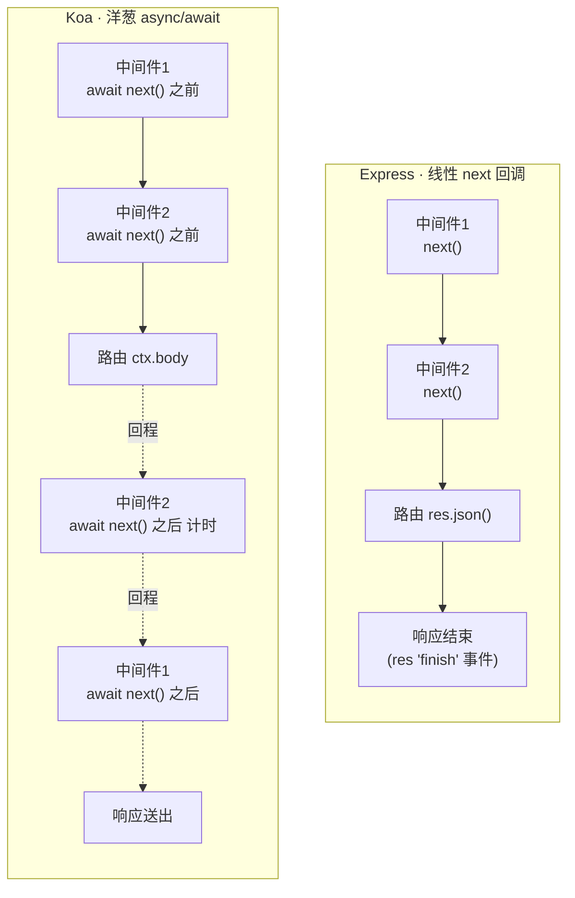

# 05 · Koa 与 Express 对比（Koa vs Express）
> 同一个接口（日志 + 计时 + JSON 路由 + 错误处理）分别用 Express 和 Koa 实现，并排看清两者最本质的差别：**线性 next 回调** vs **洋葱 async/await**。

## 📖 知识讲解

Express 和 Koa 出自同一批人。Express 老牌、生态大、内置多；Koa 更轻、更现代、把「异步中间件」做到了极致。核心差异在**中间件模型**：

- **Express（线性 / 洋葱都可，但回调式）**：中间件是 `(req, res, next)`，调用 `next()` 进入下一个。它**本质是回调链**——`next()` 只是「触发下一个」，`next()` 之后的代码会**同步立刻执行**，无法可靠地等待下游异步完成。想在「响应结束后」做事（如计时），得监听 `res` 的 `'finish'` 事件。
- **Koa（洋葱 / async-await）**：中间件是 `async (ctx, next)`，`await next()` 会**真正暂停**当前函数直到内层全部 `resolve`，因此 `await next()` 之后就是可靠的「回程」，计时、错误捕获都极自然。

### 逐项对比表

| 维度 | Express 5 | Koa 3 |
|---|---|---|
| 中间件模型 | 线性 `next()` 回调链 | 洋葱 `await next()`（async/await） |
| 中间件签名 | `(req, res, next)` | `async (ctx, next)` |
| 请求/响应对象 | 分开的 `req` / `res`（Node 原生增强） | 合一的 `ctx`（含 `ctx.request`/`ctx.response`） |
| 设置响应体 | `res.send()` / `res.json()` / `res.end()` | `ctx.body = ...`（自动推断 Content-Type） |
| 「回程」逻辑 | 不可靠，需 `res.on('finish')` 等事件 | `await next()` 之后天然回程 |
| 错误处理 | 4 参数错误中间件 `(err,req,res,next)`，放最后 | 最外层 `try { await next() } catch {}` |
| 异步错误 | Express 5 支持 `async` 路由自动捕获（Express 4 需 next(err)） | 天然支持，try/catch 一把兜住 |
| 内置功能 | 多：路由、静态服务、`res.json`、模板等开箱即用 | 极少：路由/body 解析都要装中间件，主打轻量 |
| 路由 | 内置 `app.get/post...` | 需 `@koa/router` |
| 体积 / 风格 | 大而全，偏传统回调 | 小而美，拥抱 Promise |

### 计时中间件：两种写法的对照

- Express：`next()` 后的代码不等于「响应结束后」，所以要 `res.on('finish', () => 算耗时)`。
- Koa：`await next()` 之后就是响应即将送出前，直接 `Date.now() - start` 即可，并能 `ctx.set('X-Response-Time')`。

### 错误处理：两种写法的对照

- Express：定义一个**四参数**中间件 `(err, req, res, next)` 放在最后，路由里 `throw`（Express 5 会自动转给它）。
- Koa：在**最外层**中间件 `try { await next() } catch (err) {}`，因为洋葱模型让最外层能捕获内层所有异步异常。

## 🔄 流程图 / 原理图

### 两种中间件执行模型对比（左线性 / 右洋葱）



> Express 是一条「单向」流水线（回程靠事件补救）；Koa 去程之后还有一条对称的「回程」，天然适合计时 / 收尾 / 错误兜底。

## 💻 代码说明

- `express-demo.js`（端口 **3051**）：`app.use` 注册日志、计时（`res.on('finish')`）中间件；`app.get('/api/hello')` 用 `res.json` 返回；`/api/boom` `throw` 错误；末尾四参数错误中间件兜底。
- `koa-demo.js`（端口 **3052**）：最外层 `try/catch` 错误兜底；日志、计时（`await next()` 回程）中间件；`@koa/router` 的 `/api/hello` 用 `ctx.body` 返回；`/api/boom` `throw`。

两份代码接口一致、行为一致，唯一不同就是「中间件模型」，方便对照阅读。

## ▶️ 运行方式

```bash
source ~/.nvm/nvm.sh
npm install

# 启 Express（端口 3051）
npm run express
curl http://localhost:3051/api/hello
curl http://localhost:3051/api/boom     # 触发错误处理

# 启 Koa（端口 3052）
npm run koa
curl -i http://localhost:3052/api/hello  # -i 可见 X-Response-Time
curl http://localhost:3052/api/boom      # 触发 try/catch 错误兜底
```

分别观察两个服务端控制台打印的顺序，体会「线性」与「洋葱回程」的差别。按 `Ctrl + C` 停止。

## ⚠️ 常见坑 / 最佳实践

- ❌ 在 Express 里以为 `next()` 之后的代码是「响应之后」执行——它是**同步立刻**执行，下游异步还没跑完。计时/收尾请用 `res.on('finish')`。
- ❌ 在 Koa 里写 `next()` 忘了 `await`——回程时序错乱、错误无法被 `try/catch` 捕获。
- ⚠️ Express 4 的 `async` 路由抛错**不会**自动进错误中间件（要 `next(err)`）；Express 5 才自动捕获。
- ✅ 需要开箱即用、生态成熟、团队熟悉回调 → 选 **Express**；追求轻量、全异步、优雅的洋葱收尾/错误处理 → 选 **Koa**。
- ✅ 两者中间件思想相通，Koa 的洋葱其实就是 Express 中间件的「Promise 化 + 对称回程」升级版（见模块 14 手写 compose）。

## 🔗 官方文档

- [Express 官网](https://expressjs.com/)
- [Express 5 迁移指南](https://expressjs.com/en/guide/migrating-5.html)
- [Koa 官网](https://koajs.com/)
- [@koa/router](https://github.com/koajs/router)
