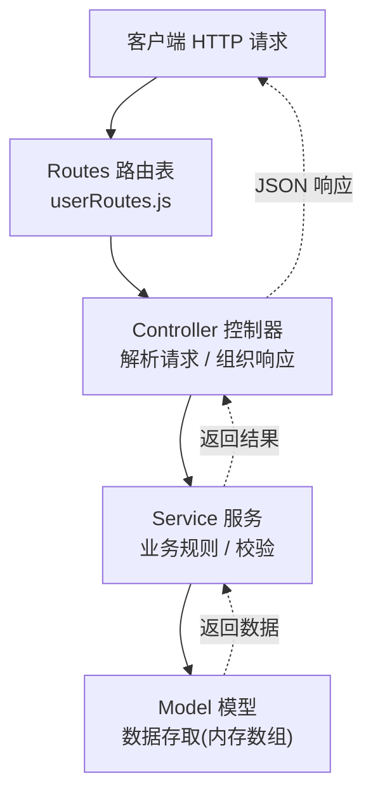
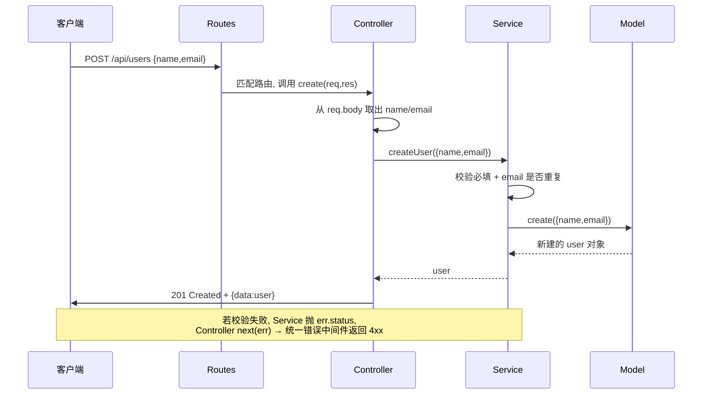

# 06 · MVC 分层架构（MVC Architecture）
> 把一个 Web 应用按职责拆成「路由 → 控制器 → 服务 → 模型」几层，每层只干一件事，让代码可测试、可维护、关注点分离。

## 📖 知识讲解

**MVC** 是最经典的后端分层思想。在 Node/Express 实战里，通常细化成这样几层，请求**自上而下**穿过、结果**自下而上**返回：

| 层 | 文件 | 职责 | 不该做的事 |
| --- | --- | --- | --- |
| **Routes 路由** | `src/routes/userRoutes.js` | URL + HTTP 方法 → 映射到控制器方法 | 不写任何逻辑 |
| **Controller 控制器** | `src/controllers/userController.js` | 解析请求（params/body/query）、组织响应（状态码 + JSON）、`next(err)` 抛错 | 不写业务规则、不直接读写数据 |
| **Service 服务** | `src/services/userService.js` | 业务规则、校验、编排（如“email 不能重复”） | 不碰 req/res、不关心数据怎么存 |
| **Model 模型** | `src/models/userModel.js` | 数据存取（这里用内存数组，真实项目是 SQL/ORM） | 不写业务规则、不关心 HTTP |

**为什么要分层？**

- **关注点分离**：改数据库（Model）不影响业务（Service），改接口格式（Controller）不影响业务。
- **可测试**：Service 是纯函数式的业务逻辑，单测时直接 `require` 调用，不用起 HTTP 服务。
- **可维护 / 可复用**：同一个 Service 既能被 HTTP 控制器调用，也能被定时任务、CLI 复用。
- **依赖方向单一**：Controller → Service → Model，永远单向，不会绕回去，杜绝环形依赖。

**Express 5 关键点**：`express.json()` 内置解析 JSON body（不再需要 body-parser）；错误处理中间件是**带 4 个参数** `(err, req, res, next)` 的函数，控制器里 `next(err)` 抛出的错误会冒泡到它。

## 🔄 流程图 / 原理图

分层架构（依赖方向自上而下单向）：



一次 `POST /api/users` 请求穿过各层的时序：



## 💻 代码说明

- **`src/models/userModel.js`**：`users` 数组当“表”，`nextId` 模拟自增主键。`findAll/findById/create/update/remove` 五个纯数据方法，返回对象副本避免外层误改内存。
- **`src/services/userService.js`**：业务规则写在这里。`createUser` 校验 `name/email` 必填、`email` 唯一，冲突时 `throw` 一个带 `err.status` 的错误（400/409/404），让控制器据此设状态码。
- **`src/controllers/userController.js`**：每个方法从 `req` 取参数（注意 `req.params.id` 是字符串，`Number()` 转一下）、调用 service、组织响应。出错 `next(err)`，不自己 try/catch 写响应逻辑。
- **`src/routes/userRoutes.js`**：`express.Router()` 子路由，5 行绑定 5 个 REST 端点，一目了然。
- **`app.js`**：唯一的“接线”处——挂 `express.json()`、挂 `/api/users` 路由、挂兜底 404 和统一错误处理中间件。

## ▶️ 运行方式

```bash
source ~/.nvm/nvm.sh
npm install
npm start   # 监听 http://localhost:3006

# 另开终端测试：
curl http://localhost:3006/api/users                       # 列表
curl http://localhost:3006/api/users/1                     # 单个
curl -X POST http://localhost:3006/api/users \
     -H 'Content-Type: application/json' \
     -d '{"name":"王五","email":"ww@example.com"}'         # 创建 → 201
curl -X PUT http://localhost:3006/api/users/1 \
     -H 'Content-Type: application/json' \
     -d '{"name":"张三改"}'                                 # 更新
curl -X DELETE http://localhost:3006/api/users/2           # 删除 → 204
curl http://localhost:3006/api/users/999                   # 不存在 → 404 JSON
```

按 `Ctrl + C` 停止服务。

## ⚠️ 常见坑 / 最佳实践

- ❌ 把业务逻辑写进 Controller（“胖控制器”）→ 逻辑无法复用、难单测。业务一律下沉到 Service。
- ❌ 在 Model 里写“email 不能重复”这类**业务规则** → 规则应在 Service，Model 只管存取。
- ❌ Service 里 `import express` 或读 `req.body` → 一旦这样，Service 就绑死了 HTTP，无法被 CLI/定时任务复用。
- ⚠️ `req.params.id` 是**字符串**，与 Model 里数字 `id` 比较前要 `Number()` 转换，否则永远查不到。
- ⚠️ 错误处理中间件必须**放在所有路由之后**，且必须是 4 个参数，Express 才认它为错误处理器。
- ✅ 依赖方向保持单向 Controller → Service → Model；上层依赖下层，下层绝不反向 import 上层。
- ✅ 分层的收益随项目变大而放大：小 demo 看着“文件变多”，但真实项目里这是可维护性的基石。

## 🔗 官方文档

- [Express 路由](https://expressjs.com/en/guide/routing.html)
- [Express 错误处理](https://expressjs.com/en/guide/error-handling.html)
- [express.Router()](https://expressjs.com/en/5x/api.html#router)
