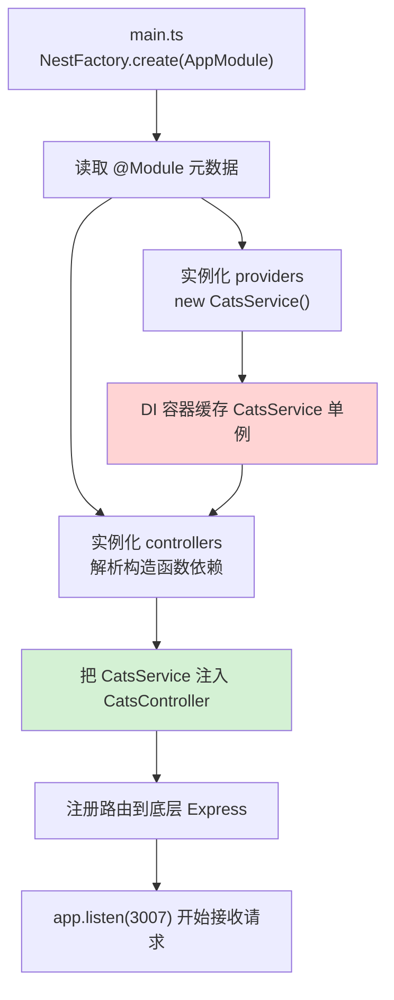
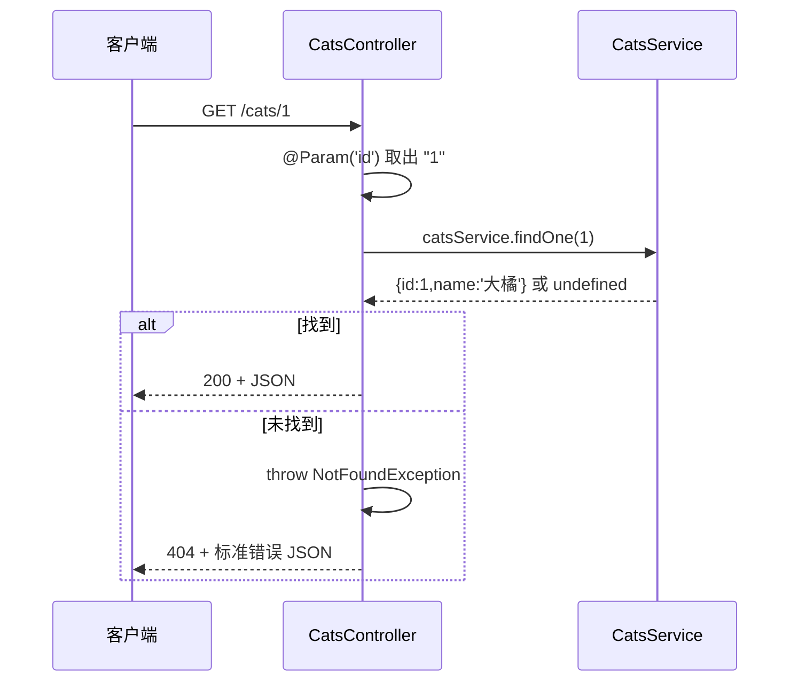

# 07 · NestJS 入门（NestJS Intro）
> 用装饰器把后端拆成 **Module / Controller / Provider** 三件套，配上开箱即用的依赖注入，写出像 Spring 一样「架构化」的 Node 后端。

## 📖 知识讲解

**NestJS** 是构建在 Express（默认）/ Fastify 之上的**架构层框架**：它不重造 HTTP 服务器，而是在其上提供一套 **TypeScript + 装饰器 + 依赖注入（DI）** 的强约束架构，特别适合大型、复杂、需要长期维护的后端。

三个核心概念（本 demo 的猫咪接口就是它们的最小组合）：

| 概念 | 装饰器 | 职责 | 本 demo 文件 |
| --- | --- | --- | --- |
| **Module 模块** | `@Module({...})` | 组织单元：声明本模块由哪些 controller / provider 组成、依赖/导出哪些模块 | `src/app.module.ts` |
| **Controller 控制器** | `@Controller('cats')` | 定义路由、接收请求、返回响应；方法级用 `@Get()`/`@Post()` 绑定子路径 | `src/cats.controller.ts` |
| **Provider 提供者** | `@Injectable()` | 可被注入的服务，业务逻辑放这里，能被多个 controller 复用、可单测 | `src/cats.service.ts` |

**关键机制**：
- **依赖注入**：`CatsController` 的构造函数写 `constructor(private readonly catsService: CatsService) {}`，我们**从不自己 `new CatsService()`**，Nest 容器扫描到依赖后自动实例化并注入（控制反转，详见 08 模块）。
- **参数装饰器**：`@Param('id')` 取路径参数、`@Body()` 取请求体（Nest 内置 body 解析，无需手动 body-parser）。
- **内置异常**：`throw new NotFoundException(...)` 会被 Nest 的异常过滤器自动转成 `404` + 标准错误 JSON，无需手写 `res.status(404)`。
- **自动序列化**：controller 方法 `return` 的对象/数组会被自动序列化成 JSON。
- **`reflect-metadata`**：Nest 依赖装饰器元数据，`main.ts` 顶部必须 `import 'reflect-metadata'`；`tsconfig.json` 要开 `experimentalDecorators` + `emitDecoratorMetadata`。

## 🔄 流程图 / 原理图

启动时 Nest 如何用 `@Module` 元数据装配整个应用：



一次 `GET /cats/1` 请求在三件套间的流转：



## 💻 代码说明

- **`src/main.ts`**：入口。`import 'reflect-metadata'` 必须在最顶部；`NestFactory.create(AppModule)` 根据根模块创建应用，`app.listen(3007)` 启动。
- **`src/app.module.ts`**：`@Module({ controllers, providers })` 声明本模块的组成，Nest 据此构建 DI 容器。
- **`src/cats.service.ts`**：`@Injectable()` 标记为 provider，用内存数组模拟数据库，`findAll/findOne/create` 三个业务方法。
- **`src/cats.controller.ts`**：`@Controller('cats')` 定路由前缀；构造函数注入 service；`@Get()/@Get(':id')/@Post()` 绑定方法；`@Param`/`@Body` 取参；`NotFoundException` 抛 404。
- **`tsconfig.json`**：`experimentalDecorators` + `emitDecoratorMetadata` 是 Nest 装饰器 + DI 能工作的前提。

## ▶️ 运行方式

```bash
cd 13-node-backend-frameworks/07-nestjs-intro
npm install       # 安装 @nestjs/* + ts-node（依赖较多，首次略慢）
npm start         # ts-node 直接跑 TS，监听 http://localhost:3007

# 另开终端测试：
curl http://localhost:3007/cats                 # 列表
curl http://localhost:3007/cats/1               # 单个 → 大橘
curl http://localhost:3007/cats/999             # 不存在 → 404 标准错误 JSON
curl -X POST http://localhost:3007/cats \
     -H 'Content-Type: application/json' \
     -d '{"name":"咪咪","age":2}'               # 新增
```

按 `Ctrl + C` 停止。（真实工程一般用 `@nestjs/cli` 生成脚手架并 `nest start --watch`，本 demo 为最小化用 `ts-node` 直跑。）

## ⚠️ 常见坑 / 最佳实践

- ❌ 忘记在入口 `import 'reflect-metadata'` → 装饰器元数据读不到，DI 报 `Cannot resolve dependencies`。
- ❌ `tsconfig` 没开 `emitDecoratorMetadata` → Nest 拿不到构造函数参数类型，无法自动注入。
- ❌ 忘了把 provider 写进 `@Module` 的 `providers` 数组 → 注入时报 `Nest can't resolve dependencies`。
- ⚠️ 想在别的模块用某个 provider，必须在它所在模块的 `exports` 里导出，否则跨模块注入不到。
- ✅ 业务逻辑一律下沉 Service（薄控制器），Controller 只做「取参 → 调 service → 返回」。
- ✅ 抛错优先用内置 `HttpException` 子类（`NotFoundException`/`BadRequestException`…），让框架统一成标准错误响应。

## 🔗 官方文档

- [NestJS 首页](https://docs.nestjs.com/)
- [Controllers 控制器](https://docs.nestjs.com/controllers)
- [Providers 提供者](https://docs.nestjs.com/providers)
- [Modules 模块](https://docs.nestjs.com/modules)
- [Exception filters 异常处理](https://docs.nestjs.com/exception-filters)
