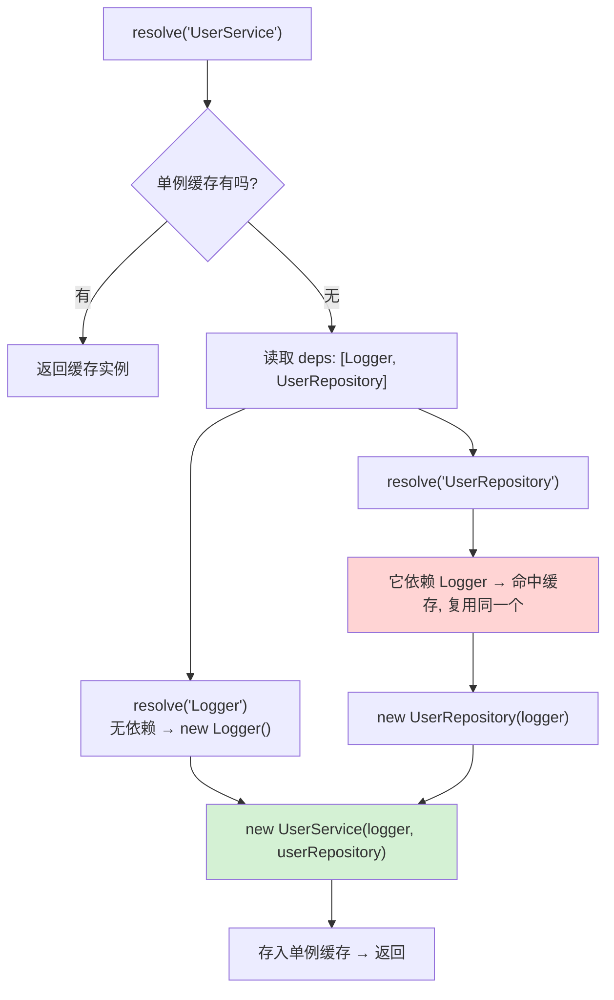
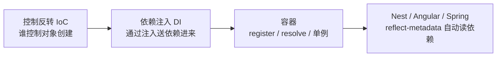

# 08 · IoC / DI 原理（Dependency Injection）
> 手写一个 50 行的依赖注入容器，把 Nest / Angular / Spring「构造函数一写、依赖自动进来」的魔法拆开看清楚：什么是控制反转，容器到底做了什么。

## 📖 知识讲解

**控制反转（IoC，Inversion of Control）** 是一种思想；**依赖注入（DI，Dependency Injection）** 是它最常见的实现手段。

**传统写法**——对象自己 new 依赖，控制权在自己手里：

```js
class UserService {
  constructor() {
    this.logger = new Logger();          // 硬编码依赖，换实现要改源码
    this.repo   = new UserRepository();  // 单测时无法替换成假对象
  }
}
```

**IoC 写法**——对象只「声明我需要什么」，创建依赖的控制权反转给**容器**，由容器造好并「注入」进来：

```js
class UserService {
  constructor(logger, userRepository) {  // 只声明依赖，绝不自己 new
    this.logger = logger;
    this.userRepository = userRepository;
  }
}
```

**容器（Container）做的三件事**：
1. **注册**：`register(token, { useClass, deps })` 记录「这个 token 怎么造、依赖谁」。
2. **解析**：`resolve(token)` 时**递归**把依赖先造好，再 `new Target(...依赖)`（构造函数注入）。
3. **单例缓存**：默认每个 token 只造一次，之后复用同一个实例。

三种注册方式：`useClass`（用类 new）、`useValue`（直接给现成对象，便于测试注入假实现）、`useFactory`（用工厂函数造）。

**框架怎么做到不用手写 `deps`？** 靠 `reflect-metadata`：TypeScript 开启 `emitDecoratorMetadata` 后，编译器把构造函数参数**类型**写进 `design:paramtypes` 元数据，框架运行时用 `Reflect.getMetadata` 读出来即得依赖列表——`reflect-demo.js` 完整模拟了这一过程。

## 🔄 流程图 / 原理图

`resolve('UserService')` 的递归解析与注入过程：



概念关系：IoC（思想）→ DI（手段）→ Container（基础设施）：



## 💻 代码说明

- **`container.js`**：核心。`register` 记录服务定义（`useClass`/`useValue`/`useFactory` + `deps` + `singleton`）；`resolve` 递归解析依赖再实例化，含**单例缓存**与**循环依赖检测**（`resolving` 集合记录解析链，A→B→A 时提前报错）。
- **`demo.js`**：三层依赖 `UserService → (Logger, UserRepository)`、`UserRepository → Logger`。注册后 `container.resolve('UserService')` 一行拿到装配好的实例；末尾验证依赖已注入、Logger 是同一个单例、`useValue` 可注入假 Logger（演示可测试性）。
- **`reflect-demo.js`**：【加餐】用 `Reflect.defineMetadata('design:paramtypes', ...)` 模拟 TS 编译器产物，容器不用手写 `deps` 就能从元数据自动推断依赖——这正是 Nest/Angular 的底层原理。

## ▶️ 运行方式

```bash
cd 13-node-backend-frameworks/08-dependency-injection
node demo.js          # 核心 demo，无需安装任何依赖

# 加餐（需要 reflect-metadata 包）：
npm install
node reflect-demo.js  # 看框架如何「自动」读出依赖类型
```

`demo.js` 零依赖，直接 `node` 即可。预期输出会打印查询日志、验证依赖注入成功、验证单例是同一实例、并展示假 Logger 捕获的日志。

## ⚠️ 常见坑 / 最佳实践

- ⚠️ **循环依赖**：A 依赖 B、B 又依赖 A 会无限递归。本容器用解析链检测并抛出可读的错误链（真实框架用 `forwardRef` 等手段化解）。
- ⚠️ `deps` 顺序必须与构造函数参数顺序**严格一致**，否则依赖会错位注入。
- ❌ 在类内部 `new` 依赖 → 依赖被硬编码，无法替换、无法单测，就失去了 DI 的全部意义。
- ✅ 单测时用 `useValue` 注入 mock/stub，业务代码一行不改就能被测试（demo 末尾已演示）。
- ✅ 默认单例足够，只有确实需要「每次都新实例」时才 `singleton: false`。

## 🔗 官方文档

- [NestJS 自定义 Providers（DI 深入）](https://docs.nestjs.com/fundamentals/custom-providers)
- [Angular 依赖注入](https://angular.dev/guide/di)
- [reflect-metadata 提案](https://github.com/rbuckton/reflect-metadata)
- [TS emitDecoratorMetadata](https://www.typescriptlang.org/tsconfig/#emitDecoratorMetadata)
