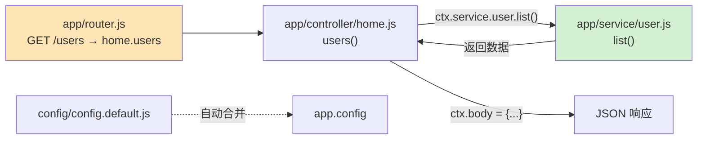
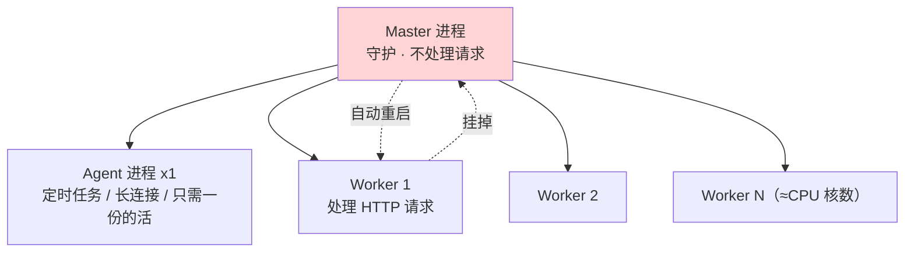

# 09 · Egg 企业级框架（Egg Enterprise）
> 基于 Koa、由阿里开源的企业级框架。核心卖点是**「约定优于配置」**：目录放对位置就自动加载，团队几百人也能写出结构一致的代码；再加**多进程模型**保证稳定长跑。

## 📖 知识讲解

**Egg** = Koa（洋葱内核）+ **约定式加载** + **插件机制** + **多进程管理**。它牺牲一点自由度，换来大团队最看重的**一致性与规范**。

**约定优于配置**——不用手写「引入哪个文件、`app.use` 谁」，把文件**放到约定目录**，Egg 启动时自动扫描装配：

| 约定目录 / 文件 | 作用 | 自动挂到 |
| --- | --- | --- |
| `app/router.js` | 路由映射（URL → controller 方法） | 启动自动加载 |
| `app/controller/*.js` | 控制器，`extends Controller` | `ctx` 上可调 |
| `app/service/*.js` | 服务层，`extends Service` | `ctx.service.xxx`（文件名即属性名） |
| `config/config.default.js` | 默认配置 | `this.config` / `app.config` |
| `config/config.{env}.js` | 按环境（local/prod）叠加覆盖 | 合并进 config |
| `app/middleware/*.js` | 中间件 | 按 config 挂载 |

**关键点**：
- Egg 基于 Koa，`ctx` 用法与 Koa 一致（`ctx.body` 设响应、`ctx.params` 取路由参数、`ctx.status` 设状态码）。
- `app/service/user.js` 自动挂成 `ctx.service.user`，controller 里 `await ctx.service.user.list()` 直接调用——**约定式装配**，没有任何手动 `require`。
- **配置分环境**：`config.default.js` 是基线，`EGG_SERVER_ENV` 决定叠加 `config.prod.js` / `config.local.js`，合并成最终 `app.config`。
- **多进程模型**：生产用 `egg-cluster` 起 1 个 **Master** + N 个 **Worker**（按 CPU 核数）+ 1 个 **Agent**；Master 守护、Worker 处理请求挂了自动重启，Agent 跑定时任务/长连接等只需一份的活。

## 🔄 流程图 / 原理图

约定式加载 + 一次 `GET /users` 的分层调用：



多进程模型（Master / Agent / Worker）：



## 💻 代码说明

- **`app/router.js`**：约定的路由文件，`module.exports = app => {...}`，用 `router.get(path, controller.home.xxx)` 建立映射，只做路由不写逻辑。
- **`app/controller/home.js`**：`extends Controller`，通过 `this.ctx` 拿上下文；`index` 返回欢迎信息，`users`/`userById` 调 service 拿数据、组织响应（404 时设 `ctx.status = 404`）。
- **`app/service/user.js`**：`extends Service`，封装业务/数据访问（这里 mock 三条用户）；文件名 `user.js` → 自动成为 `ctx.service.user`。
- **`config/config.default.js`**：`config.keys`（cookie 签名密钥，Egg 必填）；`config.security.csrf.enable = false` 方便 curl 测试（真实项目按需开启安全中间件）。

## ▶️ 运行方式

```bash
cd 13-node-backend-frameworks/09-egg-enterprise
npm install          # 依赖较多，首次略慢
npm run dev          # egg-bin 开发模式，热重载，监听 http://localhost:3009

# 另开终端测试：
curl http://localhost:3009/            # 欢迎信息
curl http://localhost:3009/users       # 用户列表（controller → service）
curl http://localhost:3009/users/1     # 单个 → 张三
curl http://localhost:3009/users/999   # 不存在 → 404 JSON
```

`Ctrl + C` 停止。生产环境用 `npm start`（`egg-scripts` 多进程守护）+ `npm stop`。

## ⚠️ 常见坑 / 最佳实践

- ⚠️ **文件必须放对约定目录**：controller 放 `app/controller/`、service 放 `app/service/`，放错位置不会被加载，且不报明显错误——排查从「目录约定」入手。
- ⚠️ `config.keys` 不配会启动报错；真实项目要用随机私密值并放环境变量，别硬编码进代码库。
- ⚠️ **多进程下不要用模块级全局变量存状态**：每个 Worker 是独立进程，内存不共享，共享状态要放 Redis / DB。
- ⚠️ POST 默认开 CSRF 校验，前后端分离/接口测试时要正确处理 token 或按需关闭（本 demo 已关便于演示）。
- ✅ 保持「薄 controller、厚 service」：controller 只收发，业务全放 service，跨接口复用。
- ✅ 用配置分环境（default/local/prod）而非在代码里 `if (env === ...)`。

## 🔗 官方文档

- [Egg 官网](https://www.eggjs.org/)
- [渐进式开发 / 目录约定](https://www.eggjs.org/zh-CN/basics/structure)
- [Controller](https://www.eggjs.org/zh-CN/basics/controller) ｜ [Service](https://www.eggjs.org/zh-CN/basics/service)
- [Config 配置](https://www.eggjs.org/zh-CN/basics/config) ｜ [多进程模型](https://www.eggjs.org/zh-CN/core/cluster-and-ipc)
