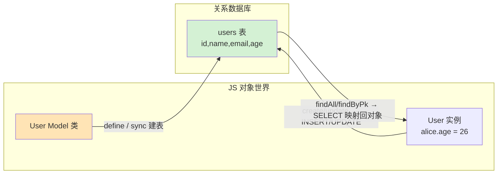
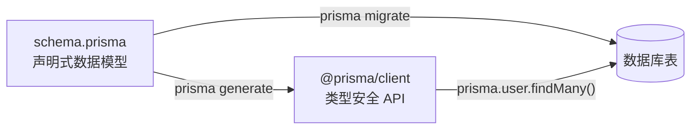

# 10 · ORM 数据建模（ORM Basics · Sequelize + Prisma）
> ORM（对象关系映射）让你用**对象/方法**操作数据库，而不是手拼 SQL 字符串。本模块用 Sequelize 跑一遍完整 CRUD，再用 Prisma 展示「schema 驱动」的现代写法。

## 📖 知识讲解

**ORM（Object-Relational Mapping）** 在「面向对象的代码」与「关系型数据库的表」之间做映射：

```
类 Class      ↔  表 Table
实例 Instance ↔  行 Row
属性 Property ↔  列 Column
```

好处：不手写 SQL、跨数据库方言（换 MySQL/Postgres/SQLite 改一行 dialect）、有类型/校验、防手拼 SQL 注入。代价：复杂查询有性能/表达力损耗，需懂它生成的 SQL。

**两种主流范式**：

| | **Sequelize** | **Prisma** |
| --- | --- | --- |
| 建模方式 | 代码里 `sequelize.define(...)` | 独立 `schema.prisma` 声明式文件 |
| 类型安全 | 弱（JS 为主） | 强（自动生成带类型的 Client） |
| 迁移 | `sync()` / migrations | `prisma migrate`（生成 SQL 迁移） |
| 风格 | 传统 Active Record 式 | schema 单一事实来源 + 生成式 |

**Sequelize 核心 API**（本 demo 全覆盖）：
- 连接：`new Sequelize({ dialect, storage })`
- 定义模型：`sequelize.define('User', { 字段: { type, allowNull, unique, defaultValue, validate } }, { tableName, timestamps })`
- 建表：`sequelize.sync({ force: true })`（force 先 DROP 再建，仅开发用）
- CRUD：`create` / `bulkCreate` / `findAll` / `findByPk` / `update` / `destroy`
- 条件：`where: { age: { [Op.gte]: 25 } }`（`Op` 是查询操作符）

**Prisma 核心**：一份 `schema.prisma` 同时驱动 ① 迁移建表 ② 生成类型安全 Client。`model User { id Int @id @default(autoincrement()) ... }`，关系用 `@relation` 声明（本例 User 1—N Post）。

## 🔄 流程图 / 原理图

ORM 在对象与数据库之间的映射与 CRUD 走向：



Prisma 的「schema 单一事实来源」生成流：



## 💻 代码说明

- **`sequelize-demo.js`**：用 SQLite **内存库**（`storage: ':memory:'`，跑完即销毁、不留文件、不用装数据库服务）演示完整 CRUD：
  - 定义 `User` 模型（自增主键、`allowNull`、`unique`、`isEmail` 校验、`defaultValue`、`timestamps`）；
  - `sync({ force: true })` 建表；
  - **增** `create` / `bulkCreate`、**查** `findAll` / `findByPk` / `Op.gte` 条件、**改** `update`、**删** `destroy`，每步打印结果。
- **`prisma/schema.prisma`**：声明式 schema，`generator` + `datasource(sqlite)` + `model User` / `model Post`（`@id`、`@unique`、`@default`、`@relation` 一对多）。文件顶部注释列了 `prisma migrate/generate/studio` 命令；本 demo **不强制执行**这些命令（避免生成/联网开销）。

## ▶️ 运行方式

```bash
cd 13-node-backend-frameworks/10-orm-basics
npm install                 # 装 sequelize + sqlite3（+ prisma devDep）
node sequelize-demo.js      # 跑完整 CRUD，看控制台输出

# Prisma（可选，了解 schema 驱动流程，本 demo 不强制）：
# npx prisma migrate dev --name init   # 按 schema 建表并生成迁移
# npx prisma generate                  # 生成类型安全 Client
# npx prisma studio                    # 浏览器可视化查看数据
```

`sequelize-demo.js` 预期依次打印：建表 → CREATE → findAll/findByPk/条件查 → UPDATE → DELETE → 最终剩余，最后关闭连接。

## ⚠️ 常见坑 / 最佳实践

- ⚠️ `sync({ force: true })` 会 **DROP 表再重建**，**只能用于开发**；生产用 migrations，绝不 force。
- ⚠️ `unique`/`validate: { isEmail }` 是两类校验：`unique` 是数据库约束，`isEmail` 是 Sequelize 应用层校验，插入非法数据会抛错。
- ⚠️ SQLite `:memory:` 进程退出即清空；想留数据把 `storage` 改成文件路径如 `./db.sqlite`。
- ⚠️ 复杂查询别过度依赖 ORM 魔法，开 `logging: true` 看它真正生成的 SQL，防止 N+1 查询。
- ✅ Prisma 把 schema 作为**单一事实来源**，改模型 → migrate → generate，代码里享受类型提示，适合 TS 项目。
- ✅ 密钥/连接串放环境变量（Prisma 用 `env("DATABASE_URL")`），别硬编码。

## 🔗 官方文档

- [Sequelize 官网](https://sequelize.org/) ｜ [Model 基础](https://sequelize.org/docs/v6/core-concepts/model-basics/) ｜ [查询 Op](https://sequelize.org/docs/v6/core-concepts/model-querying-basics/)
- [Prisma 文档](https://www.prisma.io/docs) ｜ [Prisma Schema](https://www.prisma.io/docs/orm/prisma-schema) ｜ [Relations 关系](https://www.prisma.io/docs/orm/prisma-schema/data-model/relations)
