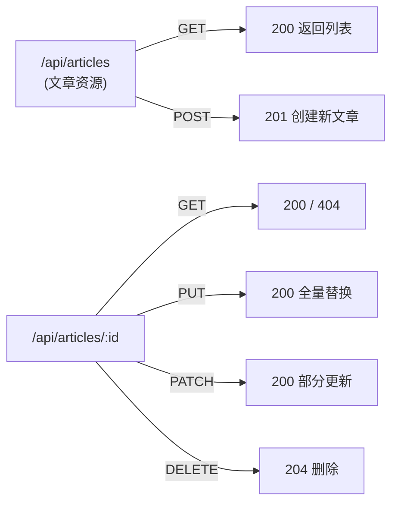
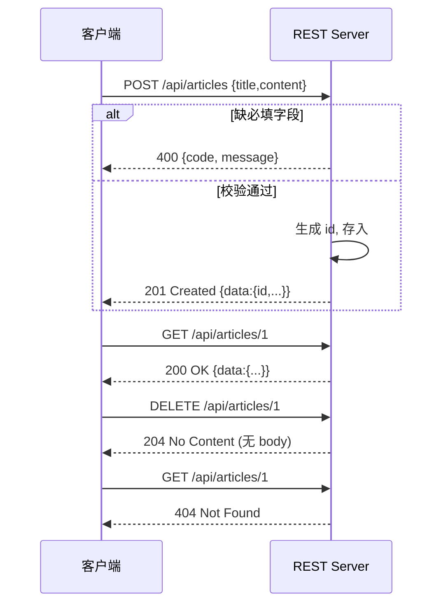

# 11 · RESTful API 设计规范（REST API Design）
> REST 是一套用「资源 + HTTP 方法 + 状态码」表达接口的约定。用对了方法语义和状态码，接口才自解释、可缓存、易协作。

## 📖 知识讲解

**REST（Representational State Transfer）六大约束**（Roy Fielding 提出）：

1. **客户端-服务器（Client-Server）**：前后端分离，各自演进。
2. **无状态（Stateless）**：每个请求自带全部信息，服务器不存会话上下文（认证信息随请求带）。
3. **可缓存（Cacheable）**：响应要标明能否缓存（GET 天然可缓存）。
4. **统一接口（Uniform Interface）**：核心——资源用 URI 标识，用标准 HTTP 方法操作，是 REST 的灵魂。
5. **分层系统（Layered System）**：客户端不感知中间是否有网关/负载均衡。
6. **按需代码（Code-On-Demand，可选）**：服务器可下发可执行代码（少用）。

**资源命名规范**：URI 表示**资源（名词）**，用**复数**；层级用路径表达，**不要把动词放进 URL**。

- ✅ `GET /api/articles`、`GET /api/articles/1`、`POST /api/articles`
- ❌ `/api/getArticle`、`/api/createArticle?id=1`、`/api/deleteArticle`

**方法与状态码对照表**：

| 方法 | 语义 | 安全性 | 幂等性 | 典型成功状态码 |
| --- | --- | :---: | :---: | --- |
| `GET /articles` | 查列表 | ✅ 安全 | ✅ 幂等 | 200 OK |
| `GET /articles/:id` | 查单个 | ✅ 安全 | ✅ 幂等 | 200 / 404 |
| `POST /articles` | 新建 | ❌ | ❌ | 201 Created |
| `PUT /articles/:id` | 全量替换 | ❌ | ✅ 幂等 | 200 / 404 |
| `PATCH /articles/:id` | 部分更新 | ❌ | ⚠️ 视实现 | 200 / 404 |
| `DELETE /articles/:id` | 删除 | ❌ | ✅ 幂等 | 204 No Content |

- **安全性（Safe）**：不改变服务器状态（只读）。只有 GET/HEAD 安全。
- **幂等性（Idempotent）**：同一请求发 1 次和发 N 次，**服务器最终状态一致**。GET/PUT/DELETE 幂等；POST 不幂等（连发两次建两条）。

**常用状态码**：`200` 成功、`201` 已创建、`204` 成功但无内容（删除）、`400` 请求参数错、`401` 未认证、`403` 无权限、`404` 资源不存在、`409` 冲突、`500` 服务器错误。

**统一响应结构**：无论成功失败，都返回一致的 JSON 外壳（本 demo 用 `{ code, message, data }`），前端好统一处理。

## 🔄 流程图 / 原理图

资源 + 方法映射（同一个资源 URI，用不同方法表达不同动作）：



一次“创建并查询”的 CRUD 时序：



## 💻 代码说明

- **统一响应助手**：`ok(res, status, data, message)` 和 `fail(res, status, message)` 两个函数，强制所有出口都是 `{ code, message, data }` 结构。
- **`GET /api/articles`**：返回全量数组，200。
- **`GET /api/articles/:id`**：`find` 命中返回 200，否则 404。
- **`POST`**：校验 `title/content` 必填，缺则 400；成功 `201` 并返回新资源（含服务端生成的 `id`）。
- **`PUT`**：全量替换语义，因此必填字段缺了同样是 400；成功 200。
- **`PATCH`**：只更新“确实传了”的字段（`!== undefined` 判断），体现“部分更新”与 PUT 的区别。
- **`DELETE`**：成功 `res.status(204).end()`，**不返回 body**；找不到 404。

## ▶️ 运行方式

```bash
source ~/.nvm/nvm.sh
npm install
npm start   # 监听 http://localhost:3011

# 测试各方法：
curl http://localhost:3011/api/articles                    # 列表 200
curl http://localhost:3011/api/articles/1                  # 单个 200
curl -i -X POST http://localhost:3011/api/articles \
     -H 'Content-Type: application/json' \
     -d '{"title":"新文章","content":"正文"}'              # 201 Created
curl -i -X POST http://localhost:3011/api/articles \
     -H 'Content-Type: application/json' -d '{"title":"缺正文"}'  # 400
curl -X PUT http://localhost:3011/api/articles/1 \
     -H 'Content-Type: application/json' \
     -d '{"title":"改","content":"全量替换"}'              # 200
curl -X PATCH http://localhost:3011/api/articles/1 \
     -H 'Content-Type: application/json' -d '{"title":"只改标题"}' # 200
curl -i -X DELETE http://localhost:3011/api/articles/2     # 204
curl -i http://localhost:3011/api/articles/999             # 404
```

按 `Ctrl + C` 停止服务。

## ⚠️ 常见坑 / 最佳实践

- ❌ **动词式 URL**：`/getArticle`、`/api/article/delete/1`。动作应由 HTTP 方法表达，URL 只放名词资源。
- ❌ 用 GET 去改数据（如 `GET /deleteArticle?id=1`）→ 破坏安全性，可能被爬虫/预加载误触发。
- ❌ 无论成功失败都返回 200，把错误塞进 body → 前端和网关无法靠状态码判断结果。
- ⚠️ 资源命名用**复数名词**（`/articles` 而非 `/article`），层级关系用嵌套路径（`/articles/1/comments`）。
- ⚠️ `DELETE` 成功用 `204` 且**不带 body**；若返回 body 应该用 200。
- ✅ POST 创建成功返回 `201`，并在 `Location` 头或 body 里给出新资源地址/id。
- ✅ PUT 幂等（重复发结果一致）、DELETE 幂等（删已删的返回 404 也算幂等结果）；POST 不幂等，注意防重复提交。
- ✅ 统一响应外壳 + 一致的错误码，能大幅降低前后端联调成本。

## 🔗 官方文档

- [Express 路由](https://expressjs.com/en/guide/routing.html)
- [MDN · HTTP 请求方法](https://developer.mozilla.org/zh-CN/docs/Web/HTTP/Methods)
- [MDN · HTTP 状态码](https://developer.mozilla.org/zh-CN/docs/Web/HTTP/Status)
- [Roy Fielding 的 REST 论文](https://ics.uci.edu/~fielding/pubs/dissertation/rest_arch_style.htm)
