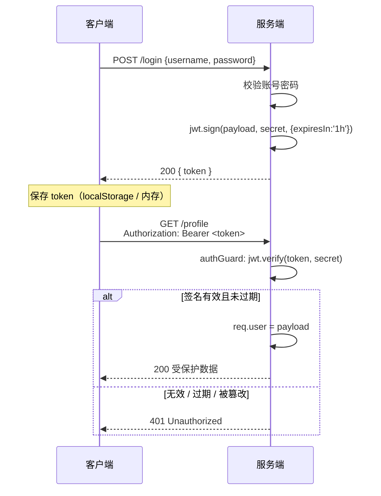
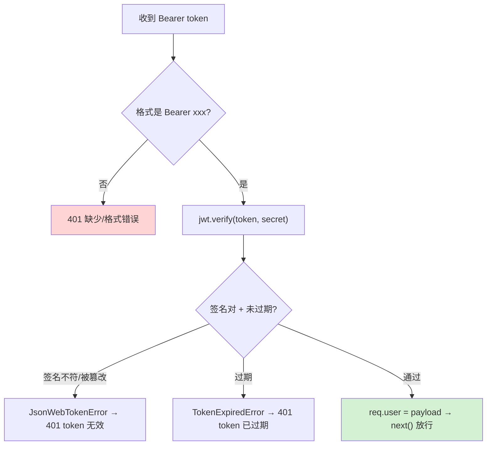

# 12 · JWT 鉴权（Auth with JWT）
> JWT（JSON Web Token）是一枚**自包含、可自校验**的令牌。服务端签发后不用存 session，客户端每次带着它来，服务端只校验签名即可确认身份——**无状态鉴权**。

## 📖 知识讲解

**JWT 结构**：三段用 `.` 连接的 Base64Url 字符串 `header.payload.signature`：

| 段 | 内容 | 说明 |
| --- | --- | --- |
| **Header** | `{ alg: "HS256", typ: "JWT" }` | 签名算法 |
| **Payload** | `{ sub, username, role, iat, exp }` | 载荷（业务声明 + 签发/过期时间） |
| **Signature** | `HMACSHA256(header.payload, secret)` | 用密钥对前两段签名，**防篡改** |

⚠️ **Payload 只是 Base64，不是加密**，任何人都能解开看到内容——所以**绝不放密码等敏感信息**。它的安全性来自 **Signature**：不知道 `secret` 就伪造不出合法签名；改了 payload 签名就对不上，`verify` 直接失败。

**核心流程**：
1. `POST /login` 校验账号密码 → `jwt.sign(payload, secret, { expiresIn })` 签发 token。
2. 客户端保存 token，之后请求带 `Authorization: Bearer <token>` 头。
3. 鉴权中间件 `jwt.verify(token, secret)`：验签名 + 验过期 → 通过则把 payload 挂 `req.user` 放行；失败返回 **401**。

**JWT vs Session-Cookie**：

| | **Session + Cookie** | **JWT** |
| --- | --- | --- |
| 状态 | 有状态（服务端存 session） | 无状态（服务端不存） |
| 扩展 | 多机需共享 session（Redis） | 天然适合分布式/多服务 |
| 失效 | 删服务端 session 即刻失效 | 签发后到期前**难主动失效**（需黑名单） |
| 载体 | Cookie（自动带、防 CSRF 需处理） | Header 手动带（天然免 CSRF） |

## 🔄 流程图 / 原理图

登录签发 + 携带访问受保护接口的完整时序：



`jwt.verify` 的校验分支：



## 💻 代码说明

- **`POST /login`**：从假用户表匹配账号密码；成功用 `jwt.sign({ sub, username, role }, JWT_SECRET, { expiresIn: '1h' })` 签发；失败统一返回 401（不透露是账号还是密码错，防枚举）。
- **`authGuard` 中间件**：从 `Authorization` 头按空格拆出 `Bearer` 和 token；`jwt.verify` 校验，通过则挂 `req.user` 并 `next()`；`catch` 里按 `err.name` 区分「过期」`TokenExpiredError` 与「无效/被篡改」`JsonWebTokenError`，都返回 401。
- **`GET /profile`**：受保护接口，`app.get('/profile', authGuard, handler)`——只有过了 `authGuard` 才拿得到 `req.user`。
- **`GET /public`**：公开接口，无需 token，用于对比。
- **`JWT_SECRET`**：demo 给了默认值，注释强调真实项目必须放环境变量。

## ▶️ 运行方式

```bash
cd 13-node-backend-frameworks/12-auth-jwt
npm install
npm start        # 监听 http://localhost:3012

# 1) 公开接口，无需 token
curl http://localhost:3012/public

# 2) 不带 token 访问受保护接口 → 401
curl http://localhost:3012/profile

# 3) 登录拿 token
curl -X POST http://localhost:3012/login \
     -H 'Content-Type: application/json' \
     -d '{"username":"alice","password":"123456"}'

# 4) 带上 token 访问受保护接口（把 <TOKEN> 换成上一步返回的 token）
curl http://localhost:3012/profile \
     -H 'Authorization: Bearer <TOKEN>'
```

`Ctrl + C` 停止。

## ⚠️ 常见坑 / 最佳实践

- ❌ **把敏感信息放进 payload**：payload 是明文 Base64，能被任何人解开。只放 id/role 等鉴权最小信息。
- ❌ 密钥硬编码进代码库 → 泄漏即可伪造任意 token。必须放环境变量 / 密钥管理系统。
- ⚠️ JWT **签发后到期前难主动失效**（改密码/登出后旧 token 仍有效）。方案：设短 `exp` + refresh token，或维护黑名单。
- ⚠️ 存储位置权衡：`localStorage` 易受 XSS；`httpOnly cookie` 防 XSS 但要防 CSRF。按场景选择。
- ⚠️ 用足够强的算法与长密钥（HS256 + 高熵密钥，或 RS256 非对称）；别用空/弱密钥。
- ✅ 真实项目密码要 `bcrypt` 哈希存储并比对，绝不明文（本 demo 为聚焦 JWT 简化了）。
- ✅ 校验逻辑收敛到一个中间件，受保护路由挂上即可，避免每个 handler 重复写。

## 🔗 官方文档

- [JWT 官网 / 调试器](https://jwt.io/) ｜ [RFC 7519](https://datatracker.ietf.org/doc/html/rfc7519)
- [jsonwebtoken (npm)](https://github.com/auth0/node-jsonwebtoken)
- [Express 中间件](https://expressjs.com/en/guide/using-middleware.html)
