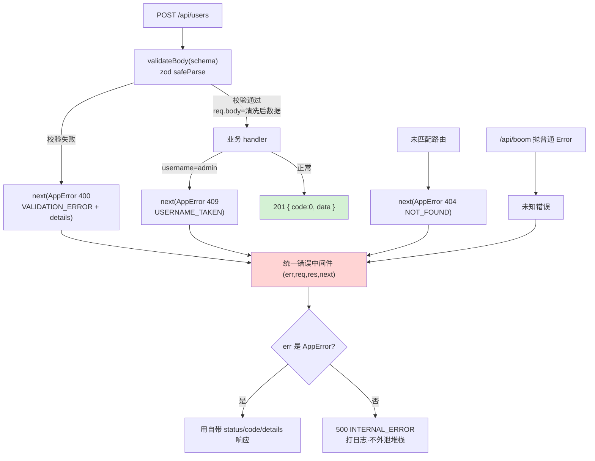

# 13 · 参数校验 + 统一错误处理（Validation & Error Handling）
> 两件后端必做的「脏活」：① 用 **zod** 在入口把非法请求挡在门外，让业务代码永远只拿到合法数据；② 用**一个统一错误处理中间件**把所有错误收成一致的 JSON，前端好处理、堆栈不外泄。

## 📖 知识讲解

**为什么要「集中校验 + 统一错误」？**
- 校验散落在每个 handler 里 → 重复、易漏、格式不一。集中到**校验中间件**，路由函数拿到的一定是干净数据。
- 错误响应格式五花八门（有的返回字符串、有的 500）→ 前端难处理。用**一个错误出口**统一成 `{ code, message, details }`。

**zod（声明式校验）**：用 schema 描述「请求体长什么样」，比手写一堆 `if` 简洁，且能**一次性收集所有错误**。
- `z.object({...})` 定义结构；`z.string().min(3).max(20)`、`z.string().email()`、`z.number().int().min(0).optional()` 链式加约束，每个约束可带自定义中文消息。
- `schema.safeParse(data)` **不抛异常**，返回 `{ success, data | error }`；成功的 `data` 已做类型转换 / 去除多余字段（用它覆盖 `req.body` 得到「清洗后」数据）。

**统一错误处理三要素**：
1. **自定义 `AppError`**：携带 `status`（HTTP 码）+ `code`（业务码字符串，前端可 switch）+ `details`（如校验失败字段列表），让错误「可分类」。
2. **抛错而非就地 `res.json`**：handler / 中间件里 `next(new AppError(...))`，把错误冒泡出去。
3. **末尾一个 4 参数错误中间件** `(err, req, res, next)`：唯一出口。`AppError` 用自带 status/code；未知 `Error` 一律 500 + 通用信息（打日志但**不外泄堆栈**）。

**Express 5 关键**：中间件按注册顺序执行，错误中间件必须**放最后**且是 **4 个参数**才会被识别为错误处理器。

## 🔄 流程图 / 原理图

请求穿过「校验中间件 → 业务 → 统一错误出口」的分流：



## 💻 代码说明

- **`AppError` 类**：`extends Error`，构造时接收 `{ status, code, details }`，让业务错误带上 HTTP 码 + 业务码 + 细节。
- **`registerSchema`**：zod schema，约束 `username`（3–20 字符）、`email`（邮箱格式）、`age`（可选、0–150 整数），每条带中文错误消息。
- **`validateBody(schema)`**：校验中间件**工厂**，返回中间件。`safeParse` 失败 → 把 zod `issues` 整理成 `[{ field, message }]` 装进 `AppError(400)` 并 `next` 抛出；成功 → `req.body = result.data`（清洗后数据）再 `next`。
- **`POST /api/users`**：挂了 `validateBody`，到这里数据必合法；演示一条**业务错误**——`username === 'admin'` 抛 `AppError(409, USERNAME_TAKEN)`（区别于校验错误）。
- **`GET /api/boom`**：故意 `throw new Error`，演示未知错误被 500 兜底。
- **404 中间件 + 统一错误中间件**：放在所有路由之后；错误中间件是唯一出口，`AppError` 与未知 Error 走不同分支。

## ▶️ 运行方式

```bash
cd 13-node-backend-frameworks/13-validation-error
npm install
npm start        # 监听 http://localhost:3013

# 1) 合法请求 → 201
curl -X POST http://localhost:3013/api/users \
     -H 'Content-Type: application/json' \
     -d '{"username":"tom","email":"tom@example.com","age":20}'

# 2) 校验失败 → 400 + details 数组（用户名太短 + 邮箱非法）
curl -X POST http://localhost:3013/api/users \
     -H 'Content-Type: application/json' \
     -d '{"username":"ab","email":"not-an-email"}'

# 3) 业务错误 → 409 USERNAME_TAKEN
curl -X POST http://localhost:3013/api/users \
     -H 'Content-Type: application/json' \
     -d '{"username":"admin","email":"a@example.com"}'

# 4) 未知错误 → 500 兜底
curl http://localhost:3013/api/boom

# 5) 找不到路由 → 404
curl http://localhost:3013/nope
```

`Ctrl + C` 停止。

## ⚠️ 常见坑 / 最佳实践

- ⚠️ 错误处理中间件**必须放最后**且必须是 **4 个参数** `(err, req, res, next)`，否则 Express 5 不认它、错误冒不到它这里。
- ⚠️ 用 `safeParse`（返回结果对象）而非 `parse`（抛异常）更好在中间件里控流；若用 `parse` 要 try/catch 转成 `AppError`。
- ❌ 把 zod 的 `error.issues` 原样丢给前端过于冗长，整理成 `{ field, message }` 更好用。
- ❌ 500 时把 `err.stack` / 数据库报错原文返给客户端 → **信息泄漏**。对外只给通用信息，堆栈只写日志。
- ✅ 校验通过后用 `result.data` 覆盖 `req.body`，享受 zod 的类型转换与多余字段剔除。
- ✅ 区分「校验错误(400)」与「业务错误(409/404…)」，用不同 `code`，前端能精准分支处理。
- ✅ 校验中间件做成工厂 `validateBody(schema)`，可复用到任意路由。

## 🔗 官方文档

- [Zod 官网](https://zod.dev/) ｜ [基本用法](https://zod.dev/?id=basic-usage)
- [Express 错误处理](https://expressjs.com/en/guide/error-handling.html)
- [Express 编写中间件](https://expressjs.com/en/guide/writing-middleware.html)
