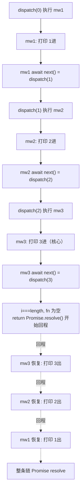
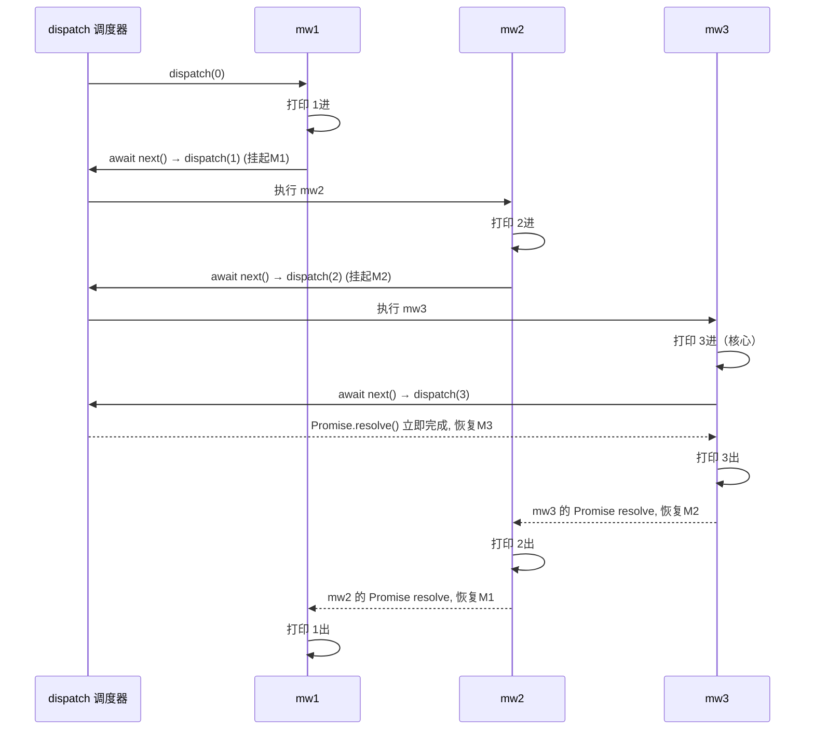

# 14 · 手写洋葱 compose（Middleware Compose Principle）
> 只用约 20 行代码，手写实现 `koa-compose` 的核心算法——把中间件数组组合成一个函数，通过「递归 dispatch + Promise + next 返回 Promise」实现 Koa 洋葱模型的暂停/恢复。看懂它，就彻底看穿了洋葱模型。

## 📖 知识讲解

Koa 洋葱模型的魔法，全在一个叫 `koa-compose` 的小函数里。它做的事只有一句话：

> **把中间件数组 `[m1, m2, m3]` 组合成一个函数 `fn`，调用 `fn(ctx)` 就能让它们按洋葱顺序执行（去程 1→2→3，回程 3→2→1）。**

### 核心算法：递归 dispatch

```js
function compose(middleware) {
  return function (ctx, next) {
    let index = -1;
    function dispatch(i) {
      if (i <= index) return Promise.reject(new Error('next() called multiple times'));
      index = i;
      let fn = middleware[i];
      if (i === middleware.length) fn = next;
      if (!fn) return Promise.resolve();               // 到底了，开始回程
      return Promise.resolve(fn(ctx, () => dispatch(i + 1))); // 核心一行
    }
    return dispatch(0);
  };
}
```

拆解那「核心一行」`fn(ctx, () => dispatch(i + 1))`：

1. **`fn`** 是第 `i` 个中间件，签名 `async (ctx, next)`。
2. 传给它的第二个参数 **`next` = `() => dispatch(i + 1)`**——即「执行下一个中间件」的触发器，且它**返回一个 Promise**（因为 `dispatch` 返回 Promise）。
3. 中间件里写 `await next()`，其实就是 `await dispatch(i + 1)`：递归进入下一层。
4. 下一层的 Promise `resolve` 后，当前的 `await` 才恢复，执行 `await next()` 之后的「回程」代码。

### 三个「为什么」

**为什么用递归闭包？**
每一层 `dispatch(i)` 都通过闭包捕获了同一个 `ctx` 和 `index`，并把「下一层」`dispatch(i+1)` 封装成 `next` 交给当前中间件。递归天然形成「函数调用栈」，去程是入栈、回程是出栈，和洋葱「进去再出来」完全对应。

**为什么每个 dispatch 返回 Promise？**
因为中间件是 `async` 的，`await next()` 需要一个「可等待对象」。`dispatch` 返回 Promise，`await next()` 才能真正**挂起**当前中间件，直到内层链条全部 `resolve`。用 `Promise.resolve(fn(...))` 包一层，是为了兼容「不是 async、返回普通值」的中间件，统一成 Promise。

**`await next()` 如何实现「暂停-恢复」？**
`async` 函数遇到 `await` 会**让出执行权**（把后续代码注册成 `.then` 回调，函数在此暂停）。`await next()` 让出后，控制权递归进入下一层中间件……直到最内层 `resolve`，promise 微任务队列再逐层唤醒之前暂停的 `await`，于是回程代码逆序执行。这就是「暂停-恢复」，本质是 JS 引擎对 async/await + Promise 微任务的调度。

### 防止 next() 被多次调用

`index` 记录上次调度到的下标。正常时 `i` 严格递增；若某中间件里 `await next()` 调了两次，第二次 `dispatch(i+1)` 时 `i <= index` 成立 → 抛错。防止洋葱链被重复驱动导致状态混乱。

### 和 Express 线性中间件的本质区别

Express 的 `next()` 只是「触发下一个」的回调，**不返回 Promise、不可 await**，所以 `next()` 之后的代码同步立刻执行，没有真正的「回程等待」。Koa 的 `next()` 返回 Promise，`await` 之后才是内层跑完的回程——这就是「线性回调链」升级为「对称洋葱」的关键：**让 next 可等待**。

## 🔄 流程图 / 原理图

### compose 递归 dispatch 调用栈（flowchart）



### 洋葱回程：await 的挂起与逐层恢复（sequenceDiagram）



## 💻 代码说明

- `compose.js`：手写 `compose`。校验入参 → 返回 `composed(ctx, next)` → 内部递归 `dispatch(i)`：用 `index` 防重复 next；`i === middleware.length` 时取外部 `next`；`fn` 为空返回 `Promise.resolve()` 开始回程；核心用 `Promise.resolve(fn(ctx, () => dispatch(i+1)))` 执行当前中间件并把「下一层」作为 `next` 传入。全程详细中文注释。
- `demo.js`：定义 `mw1/mw2/mw3`（`mw2` 里故意 `await setTimeout` 模拟异步 IO），`compose([...])` 组合后执行，打印去程 `1→2→3` 与回程 `3→2→1`，最后核对顺序字符串；并额外验证「同一中间件里调两次 `next()` 会抛错」。

## ▶️ 运行方式

```bash
source ~/.nvm/nvm.sh
node demo.js        # 无依赖，直接运行
```

预期输出（顺序即洋葱模型）：

```
1 进入（去程）
2 进入（去程）
3 进入（去程）—— 到达核心
3 离开（回程）
2 离开（回程）
1 离开（回程）

实际执行顺序: 123321
期望洋葱顺序: 1→2→3→3→2→1（去程 123 + 回程 321）

验证：同一个中间件里调用两次 next() 应报错
  ✓ 已捕获错误: next() 在同一个中间件里被调用了多次!
```

## ⚠️ 常见坑 / 最佳实践

- ❌ 忘了 `Promise.resolve(...)` 包裹中间件返回值：非 async 中间件返回 `undefined` 时 `await next()` 会出错。
- ❌ 不校验 `next()` 重复调用：洋葱链被重复驱动，`ctx` 状态错乱、响应可能被写两次。
- ⚠️ `dispatch` 必须返回 Promise，否则 `await next()` 无法挂起，回程时序全乱。
- ⚠️ 中间件里 `next()` 必须 `await`（或 `return next()`），否则回程逻辑在内层完成前就跑了。
- ✅ 这段代码就是生产级 `koa-compose` 的精简版——理解它 = 理解 Koa/@koa/router 乃至很多洋葱式框架的底层。
- ✅ 同样的思路可用于任何「可插拔、需前后置钩子」的场景（如请求拦截、埋点、事务包裹）。

## 🔗 官方文档

- [koa-compose 源码](https://github.com/koajs/compose/blob/master/index.js)
- [Koa 官网](https://koajs.com/)
- [MDN: async function / await](https://developer.mozilla.org/zh-CN/docs/Web/JavaScript/Reference/Statements/async_function)
