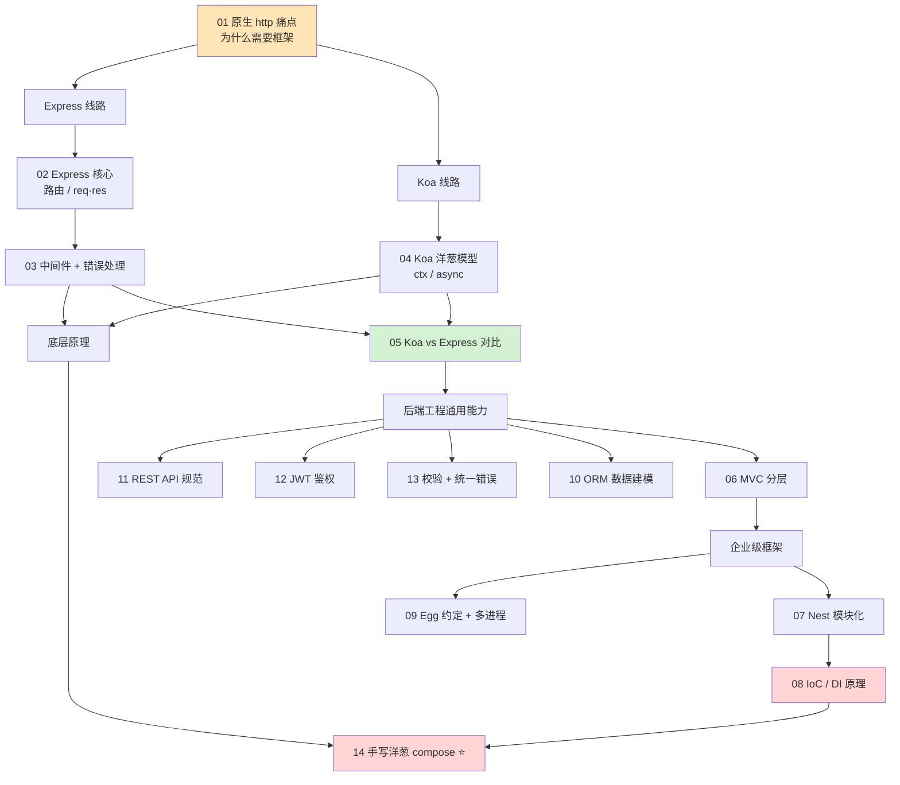

# 13 · Node 后端框架 —— 从原生 http 到 Express / Koa / Egg / Nest

> 前端进阶到「全栈」，绕不开 Node 后端框架。本工程从**原生 `http` 的痛点**出发，讲清「为什么需要框架」，然后依次吃透四大主流框架的核心思想：Express（极简中间件）、Koa（洋葱模型）、Egg（企业级约定）、Nest（模块化 + 依赖注入）；再横向补齐后端工程必备的 **MVC 分层、IoC/DI、ORM、REST 规范、JWT 鉴权、参数校验与统一错误处理**；最后**手写洋葱 compose** 把中间件机制的底层原理彻底打穿。
>
> 本工程属于**进阶层**：除每个模块的可运行 demo + README 外，工程根目录另有一篇核心文档 **[《原理详解.md》](./原理详解.md)**，深挖中间件洋葱机制、MVC 分层、IoC/DI 原理，以及 Express / Koa / Egg / Nest 的横向对比（多图）。

## 📚 模块索引

| 模块 | 知识点 | 核心内容 | 框架/依赖 | 运行命令 |
| --- | --- | --- | --- | --- |
| [01-http-to-framework](./01-http-to-framework/) | 原生 http 痛点 📊 | 手写原生服务的 5 大痛点 → 50 行手写微框架 | 无依赖 | `node native-server.js` / `node mini-framework.js` |
| [02-express-core](./02-express-core/) | Express 核心 📊 | 路由 / req·res / 中间件基础 | Express 5 | `npm i && npm start` |
| [03-express-middleware](./03-express-middleware/) | 中间件机制 📊 | 中间件串联 / next(err) / 错误处理中间件 | Express 5 | `npm i && npm start` |
| [04-koa-onion](./04-koa-onion/) | Koa 洋葱模型 📊 | ctx / async 中间件 / 洋葱去程回程 | Koa 3 | `npm i && npm start` |
| [05-koa-vs-express](./05-koa-vs-express/) | Koa vs Express | 中间件模型 / 错误处理 / ctx vs req·res 对比 | Express 5 + Koa 3 | `npm i && node koa-demo.js` |
| [06-mvc-architecture](./06-mvc-architecture/) | MVC 分层 📊 | Controller → Service → Model 职责分离 | Express 5 | `npm i && npm start` |
| [07-nestjs-intro](./07-nestjs-intro/) | Nest 入门 📊 | Module / Controller / Provider 三件套 | NestJS 11 | `npm i && npm start` |
| [08-dependency-injection](./08-dependency-injection/) | IoC / DI 原理 📊 | 手写 DI 容器 / 控制反转 | 无依赖 | `node demo.js` |
| [09-egg-enterprise](./09-egg-enterprise/) | Egg 企业级 📊 | 约定式目录 / 插件 / 多进程模型 | Egg 3 | `npm i && npm run dev` |
| [10-orm-basics](./10-orm-basics/) | ORM 数据建模 📊 | Sequelize CRUD + Prisma schema | Sequelize 6 / Prisma | `npm i && node sequelize-demo.js` |
| [11-rest-api-design](./11-rest-api-design/) | RESTful 规范 📊 | 资源命名 / 方法语义 / 状态码 | Express 5 | `npm i && npm start` |
| [12-auth-jwt](./12-auth-jwt/) | JWT 鉴权 📊 | JWT 签发/校验 / session·cookie 对比 | Express 5 + jsonwebtoken | `npm i && npm start` |
| [13-validation-error](./13-validation-error/) | 校验 + 统一错误 📊 | zod 参数校验 / 统一错误处理中间件 | Express 5 + zod | `npm i && npm start` |
| [14-middleware-compose-principle](./14-middleware-compose-principle/) | 手写洋葱 compose 📊 | koa-compose 底层算法（递归 + Promise） | 无依赖 | `node demo.js` |

📊 = 含重点流程图 / 原理图。更深的机制解剖见工程根目录 **[《原理详解.md》](./原理详解.md)**。

## 🗺️ 学习路线



**建议顺序**：

1. **打地基**：01 先用原生 http 感受痛点，理解「框架到底帮我们做了什么」。
2. **两条主线并行**：Express 线（02 → 03）走「极简 + 中间件」；Koa 线（04）走「洋葱 + async」；用 05 把两者对比收束。
3. **补齐后端工程通用能力**：06 MVC 分层、11 REST 规范、12 JWT 鉴权、13 校验与错误处理、10 ORM。这些与具体框架无关，是后端通用素养。
4. **进企业级**：07 Nest（模块化）→ 08 吃透它背后的 IoC/DI；09 Egg（约定 + 多进程）。
5. **打穿原理**：14 手写洋葱 compose，把 03/04 的中间件机制从「会用」升级到「懂底层」。⭐
6. 全程配合 **[《原理详解.md》](./原理详解.md)** 深挖 how/why。

## 🧭 四大框架一句话定位

| 框架 | 底层 | 中间件模型 | 定位 | 适合场景 |
| --- | --- | --- | --- | --- |
| **Express** | 原生 http | 线性 `next()` 回调 | 极简、自由、生态最大 | 中小项目、快速起步、最通用 |
| **Koa** | 原生 http | 洋葱 `async/await` | 轻量、现代、只留内核 | 追求优雅异步、自行组装中间件 |
| **Egg** | Koa | 洋葱 + 约定式加载 | 企业级、约定优于配置、多进程 | 大团队、规范统一、稳定长跑 |
| **Nest** | Express / Fastify | 装饰器 + DI + 拦截器 | 架构化、TypeScript、类 Spring | 大型复杂后端、需要强架构约束 |

## ▶️ 运行说明

### 环境要求

- **Node.js**：建议 LTS 18 / 20 / 22 或更高（本工程用 Node 24 验证通过）。检查版本：

  ```bash
  node -v
  npm -v
  ```

- 未安装请到 [nodejs.org](https://nodejs.org/zh-cn) 下载 LTS，或用 [nvm](https://github.com/nvm-sh/nvm) 管理多版本。

### 运行单个模块

```bash
cd 13-node-backend-frameworks/02-express-core
npm install      # 安装该模块依赖（node_modules 已被 .gitignore 忽略）
npm start        # 启动服务，按各模块 README 的 curl 命令测试
# Ctrl + C 停止
```

- **无依赖模块**（01 / 08 / 14）：进目录直接 `node xxx.js` 即可，无需 install。
- **服务类模块**：启动后用浏览器或 `curl` 访问，`Ctrl + C` 停止。每个模块 README 的「运行方式」段有具体命令。
- **Nest（07）/ Egg（09）**：依赖较多、首次启动略慢，请以各自 README 为准。

## 🔗 官方文档

- Express：<https://expressjs.com/>（本工程按 Express 5 编写）
- Koa：<https://koajs.com/>（Koa 3）
- Egg：<https://www.eggjs.org/>（Egg 3）
- NestJS：<https://docs.nestjs.com/>（Nest 11）
- Sequelize：<https://sequelize.org/> ｜ Prisma：<https://www.prisma.io/docs>
- JWT：<https://jwt.io/> ｜ Zod：<https://zod.dev/>
