# Node 后端框架 · 原理详解（how / why / 底层机制）

> 本文是 **13-node-backend-frameworks** 工程的核心交付物。各模块 README 讲「怎么用」，本文讲「**为什么这么设计、底层怎么跑通**」。四条主线：
>
> 1. [中间件与洋葱模型机制](#一中间件与洋葱模型机制)
> 2. [MVC 分层架构原理](#二mvc-分层架构原理)
> 3. [IoC / DI 依赖注入原理](#三ioc--di-依赖注入原理)
> 4. [Express / Koa / Egg / Nest 横向对比](#四express--koa--egg--nest-横向对比)
>
> 阅读前建议先跑过 01（原生 http 痛点）、03/04（中间件）、14（手写 compose）三个模块，本文很多结论都能在那里被 demo 验证。

---

## 〇、从原生 http 说起：框架到底解决了什么

一切框架的起点，是原生 `http` 模块的四个「不爽」：

```js
const http = require('http');
http.createServer((req, res) => {
  // ① 路由靠手写 if/else，url 和 method 都要自己判断
  if (req.method === 'GET' && req.url === '/users') { /* ... */ }
  // ② body 要监听流事件手动拼接
  let body = '';
  req.on('data', c => body += c);
  req.on('end', () => { /* JSON.parse(body) 还要 try/catch */ });
  // ③ 响应要手动 writeHead + 手动 JSON.stringify + 手动设 Content-Type
  // ④ 没有「中间件」概念，鉴权/日志/CORS 等横切逻辑无处安放，只能到处复制粘贴
}).listen(3000);
```

框架做的四件事，正好一一对应：

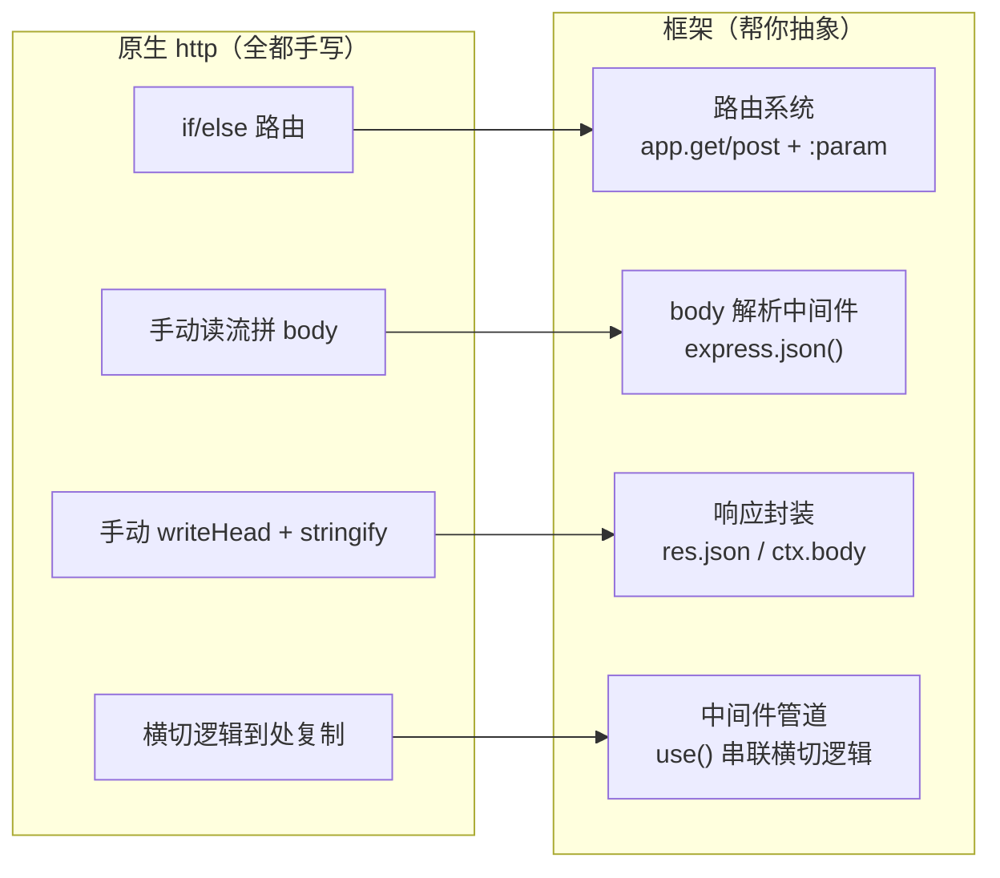

其中**中间件管道**是框架的灵魂——它把「一个请求要依次经过的处理步骤」抽象成一条可插拔的流水线。理解它，就理解了 Express/Koa/Egg/Nest 的共同内核。

---

## 一、中间件与洋葱模型机制

### 1.1 什么是中间件

中间件（middleware）= **一个能拿到请求上下文、并决定「是否把控制权交给下一环」的函数**。一个请求从进入到响应，本质是穿过一串中间件：

- **Express 中间件**：`(req, res, next) => {}`，调用 `next()` 进入下一个。
- **Koa 中间件**：`async (ctx, next) => {}`，`await next()` 进入下一个（并可在其后继续执行）。

关键差别就藏在 `next` 的语义里，这决定了两种截然不同的执行模型。

### 1.2 Express：线性「接力棒」模型

Express 的中间件像**跑步接力**：每个中间件跑完自己那段，调用 `next()` 把棒子交给下一个，通常就不再回头。

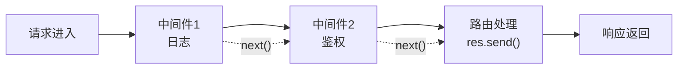

**本质是一个 while 循环 / 递归推进的指针**，伪代码：

```js
// Express 分发的极简本质
function runMiddlewares(middlewares, req, res) {
  let i = 0;
  function next(err) {
    if (err) return handleError(err); // next(err) 跳到错误处理中间件
    const mw = middlewares[i++];
    if (!mw) return;
    mw(req, res, next);               // 调用当前中间件，把 next 传进去
  }
  next();
}
```

- 「回程」不是天然的：如果你想在 `next()` 之后做事（如统计耗时），要么依赖回调时机，要么用 `res.on('finish')` 监听——**不像 Koa 那样自然**。
- **错误处理**：`next(err)` 会跳过后续普通中间件，直达**四参错误中间件** `(err, req, res, next)`。Express 5 起，async 中间件抛出的 reject 也会自动被捕获转成 `next(err)`（这是 v5 相对 v4 的重要改进，v4 需要自己 try/catch 或用 wrapper）。

### 1.3 Koa：洋葱「穿透 + 回溯」模型

Koa 的中间件像**穿过一层层洋葱**：请求从最外层往里穿（去程，`await next()` 之前的代码），到达最内核后，再**逆序穿回来**（回程，`await next()` 之后的代码）。

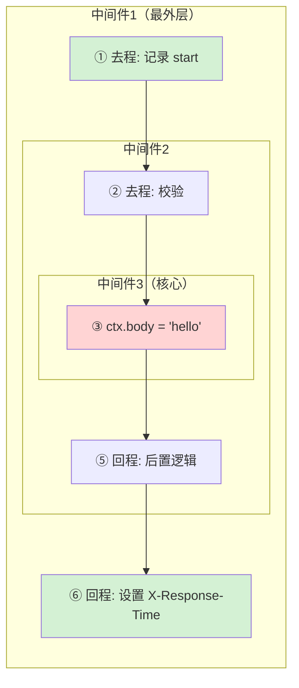

执行顺序是 **1进 → 2进 → 3核心 → 2出 → 1出**，这正是「洋葱」得名的原因。用时序图看 `await next()` 的「挂起-恢复」：

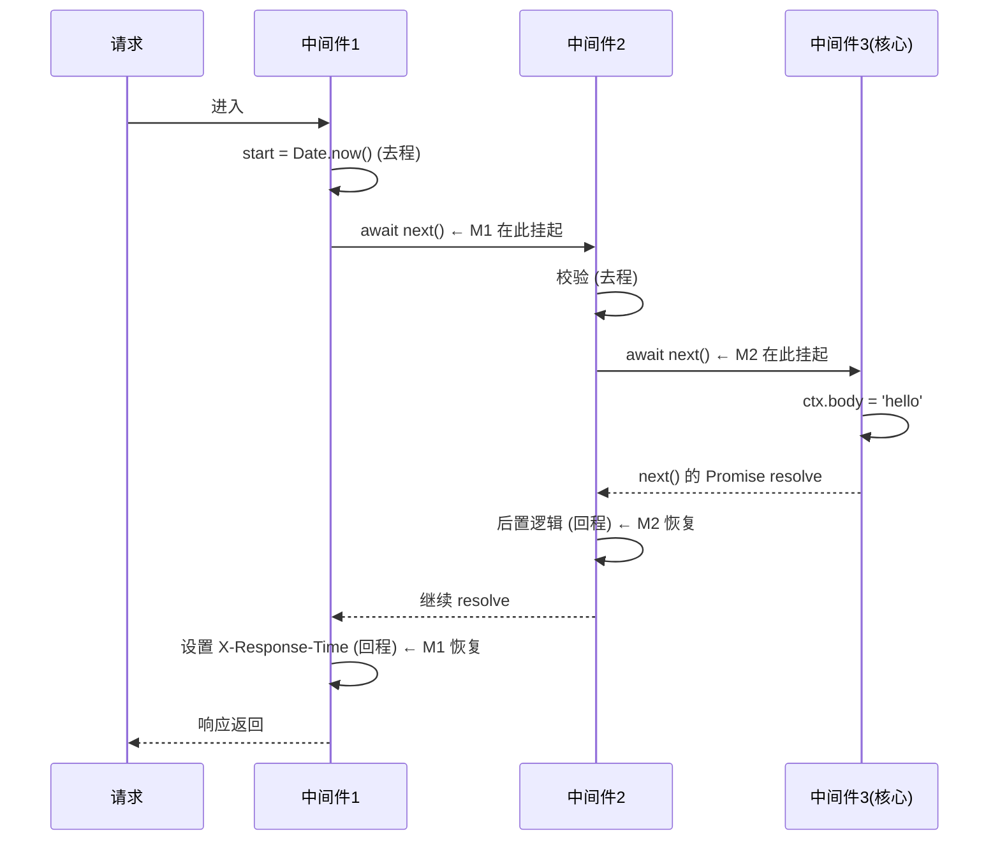

**为什么 Koa 能做到自然的回程？** 因为它建立在 `async/await` + Promise 之上：`await next()` 会**暂停当前中间件**、等待「里面所有中间件」这一整棵 Promise 链 resolve 后，再从暂停处继续。这是语言级的协程能力，Express 那套回调 `next()` 做不到这么优雅。

### 1.4 底层：手写 `compose`（这是 14 号模块的核心）

Koa 的洋葱不是魔法，全靠一个约 20 行的 `compose` 函数把中间件数组「组合」成一个洋葱。原理是**递归闭包 + Promise**：

```js
function compose(middlewares) {
  // 返回一个函数：接收 ctx，返回一条贯穿所有中间件的 Promise 链
  return function (ctx, next) {
    let lastIndex = -1;
    function dispatch(i) {
      // 防御：同一个中间件里 next() 被调用多次 → 洋葱层被重复穿越，报错
      if (i <= lastIndex) return Promise.reject(new Error('next() called multiple times'));
      lastIndex = i;
      const fn = middlewares[i] || next;      // 取第 i 个中间件；越界则用最外层传入的 next
      if (!fn) return Promise.resolve();       // 没有更多了，结束递归
      try {
        // 关键：把 dispatch.bind(null, i+1) 作为 next 传给当前中间件
        // 当前中间件里 await next() 时，就会去执行「下一个中间件」的整棵子树
        return Promise.resolve(fn(ctx, dispatch.bind(null, i + 1)));
      } catch (err) {
        return Promise.reject(err);            // 同步抛错也转成 rejected Promise
      }
    }
    return dispatch(0);                          // 从第 0 个开始，点燃整条链
  };
}
```

三个「为什么」讲透洋葱本质：

- **为什么是递归？** 因为「第 i 个中间件的 `next`」= 「执行第 i+1 个中间件」。`dispatch(i)` 调用中间件时把 `dispatch(i+1)` 塞给它当 `next`，天然形成层层嵌套的调用栈——这就是洋葱的「壁」。
- **为什么每步都 `Promise.resolve(fn(...))` 包一层？** 让同步中间件和 async 中间件统一成 Promise，`await next()` 才能对二者都生效；同步异常也能被 catch 成 rejected。
- **为什么会有「回程」？** 因为 `await next()` 会等「里面那棵 Promise 子树」全部完成再往下走——`next()` 之后的代码自然排在「内层全部执行完」之后，逆序执行。

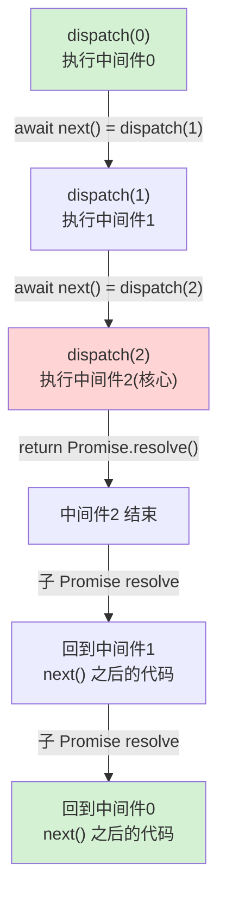

### 1.5 常见误区

- ❌ **「洋葱回程是并行的」**：不是。回程是**严格逆序、串行**的，由 Promise 链决定。
- ❌ **「忘了 `await` next()」**：Koa 里写成 `next()`（不 await）会导致后置逻辑在内层完成前就跑了，耗时统计、错误捕获全乱。
- ❌ **「一个中间件里调用两次 next」**：洋葱层被重复穿越，`compose` 会抛 `next() called multiple times`。
- ❌ **「Express 也能天然拿到回程」**：Express 的 `next()` 是回调不是 await，想在响应后做事得靠 `res.on('finish')` 或把逻辑写在真正的处理器里。

---

## 二、MVC 分层架构原理

### 2.1 为什么要分层：关注点分离

一个接口从「能跑」到「能长期维护」，差的就是**分层**。把所有逻辑塞进路由回调（路由里既解析参数、又写业务、又拼 SQL），短期最快，长期变成「一坨」——无法复用、无法单测、改一处牵全身。MVC 把职责切成三层：

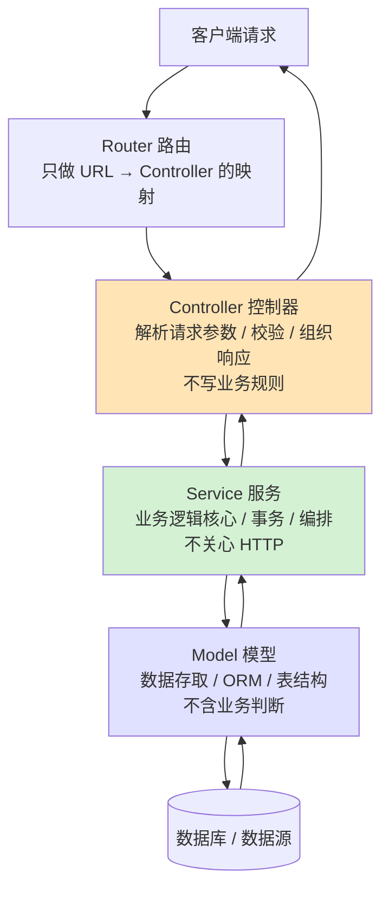

| 层 | 职责 | **不该做的事** | 类比 |
| --- | --- | --- | --- |
| **Controller** | 取请求参数、调用 service、把结果拼成 HTTP 响应 | 不写业务规则、不直接碰数据库 | 前台接待 |
| **Service** | 业务逻辑、编排多个 model、事务、领域规则 | 不解析 `req`、不拼 HTTP 响应 | 后厨主厨 |
| **Model** | 数据结构定义 + 增删改查（ORM/SQL） | 不做业务判断（如"余额够不够"） | 仓库管理员 |

### 2.2 一次请求穿过分层

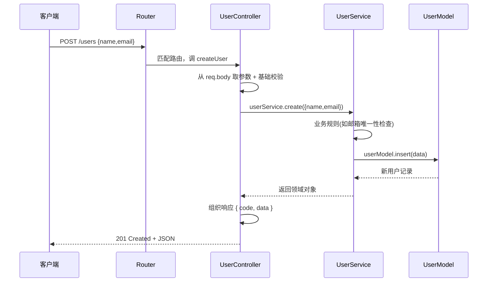

**核心心法**：请求「自上而下」逐层调用、数据「自下而上」逐层返回；**上层依赖下层，下层不知道上层存在**（Model 不知道自己被哪个 Controller 调用）。这让 Service 可以脱离 HTTP 被单元测试，Model 可以被多个 Service 复用。

### 2.3 与框架的关系

- **Express/Koa** 不强制分层，需要你自己按目录约定组织（见 06 模块）。
- **Egg** 用**约定**强制你放进 `app/controller`、`app/service`（见 09）——约定优于配置。
- **Nest** 用 `@Controller` / `@Injectable`（Service）+ 模块，把分层做成**框架级一等公民**，并用 DI 把 Service 注入 Controller（见 07/08）。

### 2.4 常见误区

- ❌ **「胖 Controller」**：把业务逻辑写在控制器里，Service 形同虚设。判断标准：Controller 里不应出现 `if (user.balance < amount)` 这类领域规则。
- ❌ **「Service 里出现 `res.json()`」**：Service 一旦碰 `req/res` 就和 HTTP 耦合，无法被定时任务/消息队列复用。
- ❌ **「Model 里写业务」**：Model 只负责「怎么存怎么取」，不负责「能不能这么做」。

---

## 三、IoC / DI 依赖注入原理

### 3.1 控制反转（IoC）：把「创建依赖」的控制权交出去

传统写法里，对象**自己 new 出**它依赖的东西：

```js
class UserService {
  constructor() {
    this.repo = new UserRepository();     // ← 自己 new，硬编码依赖
    this.logger = new ConsoleLogger();    // ← 换实现要改源码
  }
}
```

问题：`UserService` 和具体实现**强耦合**——想换成 `MySQLRepository`、想在测试里换成 `MockRepository`，都得改 `UserService` 的源码。**控制反转**就是把「创建/组装依赖」的控制权，从对象自己**反转**给外部（容器）：

```js
class UserService {
  constructor(repo, logger) {   // ← 依赖从外面「注入」进来，自己不 new
    this.repo = repo;
    this.logger = logger;
  }
}
```

**DI（依赖注入）是实现 IoC 的手段**：由一个「容器」负责 new 出所有对象，并按依赖关系把它们装配起来。

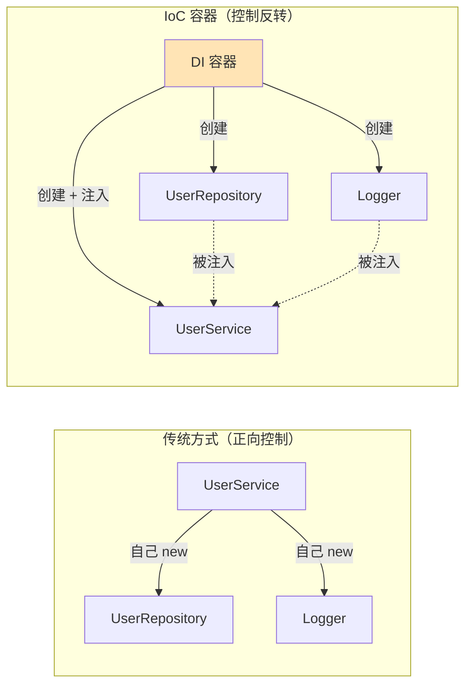

### 3.2 为什么需要 DI

- **解耦**：`UserService` 只依赖「一个有 `save()` 方法的东西」（接口/抽象），不关心是 MySQL 还是内存。
- **可测试**：单测时注入 Mock，不碰真数据库。
- **可替换 / 可配置**：换实现只改容器的注册配置，不改业务代码。
- **单例复用**：容器统一管理生命周期，一个 Logger 全局共享。

### 3.3 DI 容器怎么工作（08 模块手写的核心）

一个最小容器要能：注册（token → 如何创建）、解析（按 token 取实例、递归解析它的依赖）、缓存单例。核心伪码：

```js
class Container {
  constructor() {
    this.providers = new Map();   // token -> { useClass, deps }
    this.singletons = new Map();  // token -> 已创建的单例
  }
  register(token, useClass, deps = []) {
    this.providers.set(token, { useClass, deps });
  }
  resolve(token) {
    if (this.singletons.has(token)) return this.singletons.get(token); // 命中缓存
    const provider = this.providers.get(token);
    if (!provider) throw new Error(`未注册的依赖: ${token}`);
    // 递归解析每个依赖，形成一棵依赖树
    const deps = provider.deps.map(dep => this.resolve(dep));
    const instance = new provider.useClass(...deps);   // 把解析好的依赖注入构造函数
    this.singletons.set(token, instance);              // 缓存为单例
    return instance;
  }
}
```

解析过程是**依赖树的深度优先递归**：

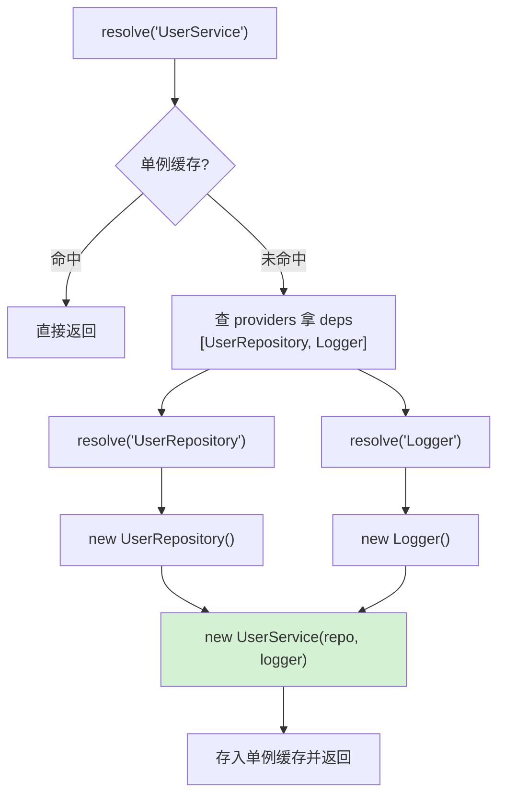

### 3.4 框架怎么知道要注入什么：反射元数据

手写容器要**手动声明 deps 数组**。Nest / Angular / Spring 更进一步——你只要写：

```ts
@Injectable()
export class UserService {
  constructor(private repo: UserRepository) {}  // 只写类型，没写 deps 数组
}
```

框架靠 **`reflect-metadata` + TypeScript 的 `emitDecoratorMetadata`** 在编译期把构造函数参数的**类型信息**写进元数据。运行时 `Reflect.getMetadata('design:paramtypes', UserService)` 就能读出 `[UserRepository]`，容器据此自动解析注入。**这就是为什么 Nest 项目 tsconfig 必须开 `experimentalDecorators` 和 `emitDecoratorMetadata`**——没有元数据，DI 容器就「看不见」依赖类型。

### 3.5 三种注入方式

| 方式 | 形式 | 特点 |
| --- | --- | --- |
| **构造函数注入** | `constructor(dep)` | 最常用，依赖显式、不可变、易测试（Nest 默认） |
| **属性注入** | `@Inject() field` | 灵活但依赖被隐藏，循环依赖时偶用 |
| **方法/setter 注入** | `setDep(dep)` | 可选依赖、运行时可换 |

### 3.6 常见误区

- ❌ **「DI = 一定要用框架」**：不是。08 模块 60 行纯 JS 就能实现 DI，框架只是自动化了「读依赖类型」这步。
- ❌ **「循环依赖无解」**：A 依赖 B、B 依赖 A 会让递归 resolve 爆栈。解法：拆分职责、用 `forwardRef`（Nest）、或改属性注入延迟解析。
- ❌ **「所有东西都该单例」**：请求级状态（如当前用户）应是 request scope，全局单例会串数据。

---

## 四、Express / Koa / Egg / Nest 横向对比

### 4.1 血缘关系图

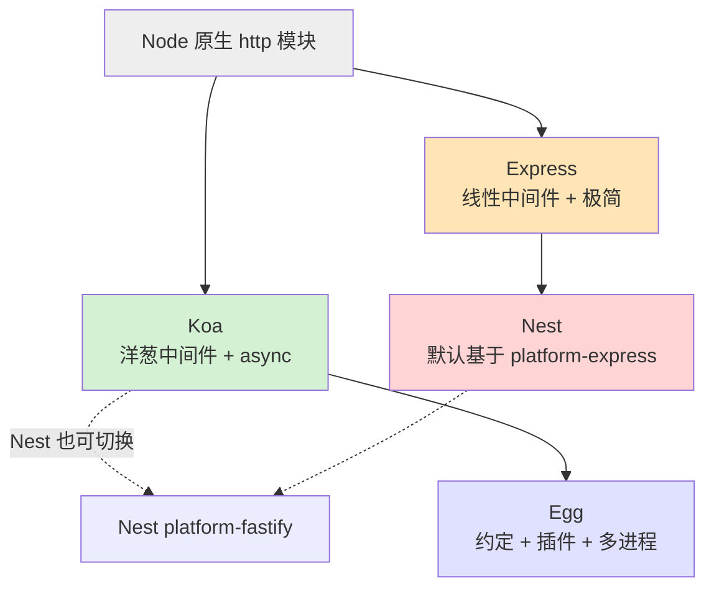

- **Egg 基于 Koa**：Egg 的中间件就是 Koa 洋葱中间件，`ctx` 也来自 Koa。
- **Nest 基于 Express（默认）或 Fastify**：Nest 是「架构层」，底层 HTTP 适配器可换。

### 4.2 逐项对比

| 维度 | Express | Koa | Egg | Nest |
| --- | --- | --- | --- | --- |
| **底层** | 原生 http | 原生 http | Koa | Express/Fastify |
| **中间件模型** | 线性 `(req,res,next)` 回调 | 洋葱 `async(ctx,next)` | 洋葱（同 Koa）| 洋葱 + 拦截器/管道/守卫 |
| **上下文** | `req` / `res` 分离 | `ctx` 聚合 | `ctx`（增强） | 参数装饰器 `@Body/@Param` |
| **异步友好度** | v5 起 async 自动捕获 | 原生 async 最佳 | 原生 async | 原生 async + RxJS |
| **路由** | `app.get` 手动注册 | 需 `@koa/router` | 约定 `app/router.js` | `@Controller`+`@Get` 装饰器 |
| **分层** | 自己组织 | 自己组织 | **约定强制** | **框架级（DI）** |
| **DI** | 无 | 无 | 有（简版） | **核心特性** |
| **TypeScript** | 需自行配置 | 需自行配置 | 支持 | **一等公民** |
| **多进程** | 自己写 cluster | 自己写 | **内置 Master/Agent/Worker** | 自己写/配 PM2 |
| **约定 vs 配置** | 极自由 | 极自由 | 约定优于配置 | 约定 + 装饰器 |
| **学习曲线** | 最平缓 | 平缓 | 中 | 陡（概念多） |
| **生态** | 最大 | 中 | 阿里系为主 | 大且现代 |
| **适合** | 中小/快速起步 | 追求优雅内核 | 大团队规范统一 | 大型复杂后端 |

### 4.3 同一个「计时中间件」四种写法（最能体现差异）

```js
// Express：回调式，回程要靠 res.on('finish')
app.use((req, res, next) => {
  const start = Date.now();
  res.on('finish', () => console.log(Date.now() - start)); // 只能监听事件
  next();
});

// Koa：洋葱式，await 前后天然就是去程/回程
app.use(async (ctx, next) => {
  const start = Date.now();
  await next();                                   // 穿进洋葱内层
  ctx.set('X-Response-Time', `${Date.now() - start}ms`); // 回程，天然拿到耗时
});

// Egg：同 Koa 洋葱，放进约定的 app/middleware/ 目录，config 里挂载
module.exports = () => async (ctx, next) => {
  const start = Date.now();
  await next();
  ctx.set('X-Response-Time', `${Date.now() - start}ms`);
};

// Nest：用拦截器（Interceptor），RxJS 管道处理响应流
@Injectable()
export class TimingInterceptor implements NestInterceptor {
  intercept(ctx, next) {
    const start = Date.now();
    return next.handle().pipe(tap(() => console.log(Date.now() - start)));
  }
}
```

### 4.4 Egg 多进程模型（企业级独有）

Node 单线程跑不满多核，且一个未捕获异常可能拖垮整个进程。Egg 内置**多进程模型**来解决：

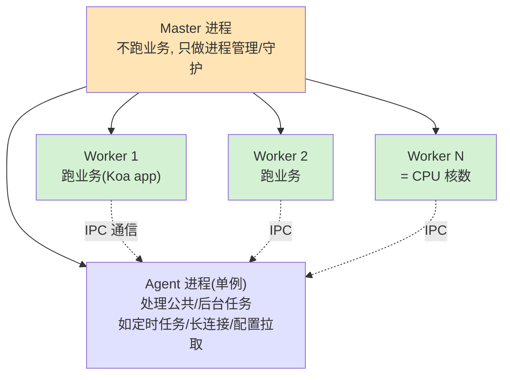

- **Master**：稳定的「大脑」，只负责 fork/守护 Worker，某个 Worker 挂了自动重启——保证服务不中断。
- **Worker**：真正处理请求，数量默认等于 CPU 核数，**吃满多核**。
- **Agent**：全局唯一，跑「只需要一份」的活（定时任务、监听配置中心、维护长连接），避免每个 Worker 都跑一遍造成重复。
- 三者通过 **IPC**（进程间通信）协作，Worker 之间不直接通信，都经 Agent/Master 中转。

### 4.5 怎么选

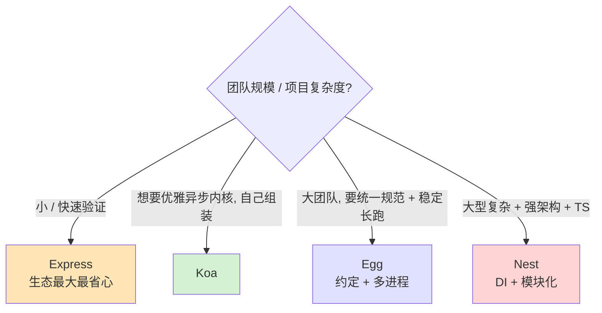

**一句话**：**Express 求快、Koa 求纯、Egg 求稳、Nest 求架构。** 它们不是替代关系而是不同权衡——理解了「中间件洋葱 + 分层 + DI」这三块共同地基，学任何一个都只是换语法。

---

## 🔗 官方文档

- Express：<https://expressjs.com/>（Express 5）
- Koa：<https://koajs.com/> ｜ koa-compose：<https://github.com/koajs/compose>
- Egg：<https://www.eggjs.org/>（多进程模型：<https://www.eggjs.org/core/cluster-and-ipc>）
- NestJS：<https://docs.nestjs.com/>（DI：<https://docs.nestjs.com/fundamentals/custom-providers>）
- reflect-metadata：<https://github.com/rbuckton/reflect-metadata>
- MVC / 分层：<https://developer.mozilla.org/en-US/docs/Glossary/MVC>
