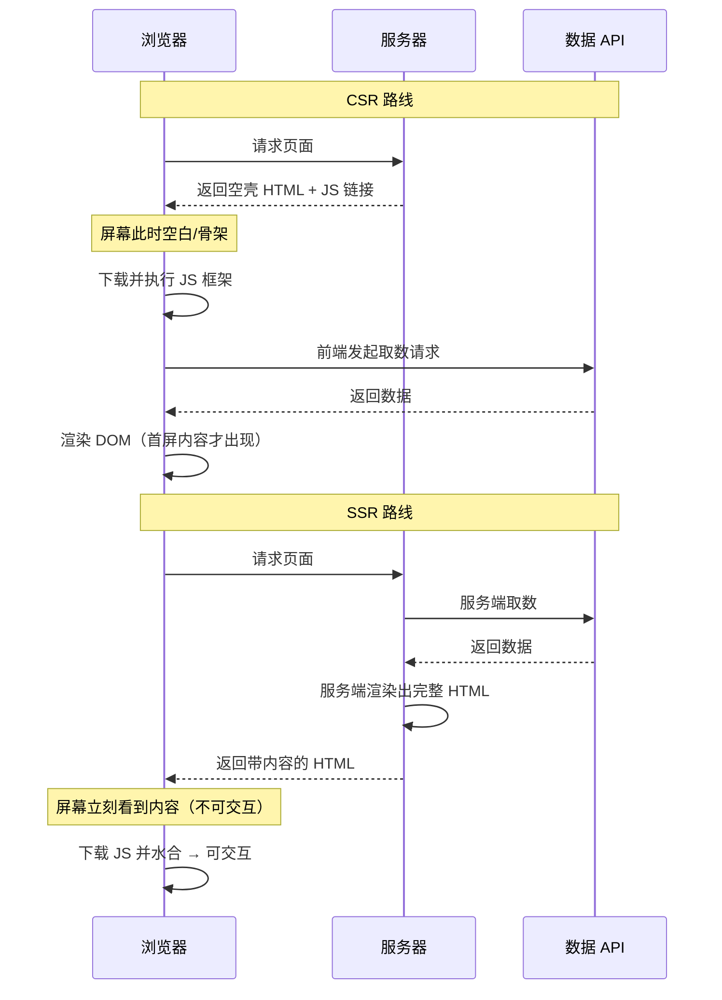
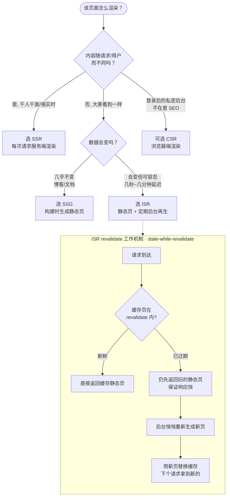

# 01 · 四种渲染模式对比（CSR / SSR / SSG / ISR）

> 一张时间线看懂：页面在**哪里**渲染、在**何时**渲染，以及首屏、SEO、性能各自的取舍。

## 📖 知识讲解

现代前端的「渲染模式」本质上回答两个问题：**HTML 在哪里生成（客户端浏览器 vs 服务端）** 和 **在什么时间生成（构建时 vs 请求时 vs 首次请求后再更新）**。四种主流模式就是这两个维度的不同组合。

### CSR（Client-Side Rendering，客户端渲染）
- **渲染位置**：浏览器。**渲染时机**：JS 下载并执行之后。
- 服务端只返回一个近乎空的 HTML 外壳（通常只有一个 `

`）加一个 JS bundle 链接。浏览器下载 JS，运行框架代码，再通过 API 拉数据，最后把内容塞进 DOM。
- **首屏内容**：JS 执行前是空白（或 loading 骨架）。
- **SEO**：较差。爬虫拿到的初始 HTML 里没有正文（现代 Google 能执行 JS，但有延迟和预算限制，不可靠）。
- 典型代表：传统 Create React App、Vite 默认单页应用（SPA）。

### SSR（Server-Side Rendering，服务端渲染）
- **渲染位置**：服务端。**渲染时机**：每次请求到来时（on-demand，per request）。
- 服务端针对**本次请求**实时生成完整 HTML（可带上当次的用户数据/动态数据）返回，浏览器立刻能看到有内容的首屏；随后下载 JS 对页面做**水合（hydration）**使其可交互。
- **首屏内容**：完整、真实的内容（非交互预览）。
- **SEO**：好，爬虫直接拿到带正文的 HTML。
- **代价**：每个请求都要在服务器上跑一次渲染，TTFB 受服务端计算/取数耗时影响，服务器有持续压力。
- 典型代表：Next.js App Router 里的动态页面（`dynamic = 'force-dynamic'` 或使用了动态数据）。

### SSG（Static Site Generation，静态站点生成）
- **渲染位置**：服务端（准确说是**构建服务器**）。**渲染时机**：`build` 构建时，提前一次性生成好所有 HTML。
- 构建阶段就把每个页面渲染成静态 HTML 文件，部署到 CDN。用户请求直接命中 CDN 上的现成文件，无需服务端实时计算。
- **首屏内容**：完整内容，且 TTFB 极低（CDN 边缘直出）。
- **SEO**：好。
- **代价**：内容是「构建那一刻」的快照，数据变了必须**重新构建**才能更新。不适合高频变动或千人千面的内容。
- 典型代表：文档站、博客、营销落地页。

### ISR（Incremental Static Regeneration，增量静态再生）
- 是 SSG 的增强：先用构建时生成的静态页面直出（快、可缓存），但为每个页面设置一个 `revalidate` 过期时间。过期后的**第一个请求**仍拿到旧的静态页（保证快），服务端则在**后台**悄悄重新生成新页面，替换缓存；之后的请求就拿到新页面。
- 这套策略又叫 **stale-while-revalidate**（先给旧的，同时在后台刷新）。
- **好处**：兼顾 SSG 的速度/可缓存性 与 SSR 的数据新鲜度，且不用为了改一条数据重新构建整站。
- 典型代表：电商商品页、有一定时效但不需要「秒级实时」的列表页。

### 关键指标术语
- **TTFB（Time To First Byte）**：从发起请求到收到第一个字节。SSG/ISR 命中 CDN 时最低；SSR 因需服务端计算而偏高；CSR 的外壳 TTFB 低，但那是空壳。
- **FCP（First Contentful Paint）**：首次绘制出内容。CSR 要等 JS，FCP 晚；SSR/SSG 直出 HTML，FCP 早。
- **TTI（Time To Interactive）**：页面可交互。四种模式最终都要等 JS 水合完才能真正交互，所以 TTI 差距没 FCP 那么大——**SSR/SSG 的核心优势是「更早看到内容」，而不是「更早能点」**。

### 对比表格

| 维度 | CSR | SSR | SSG | ISR |
|---|---|---|---|---|
| 渲染位置 | 浏览器 | 请求时的服务器 | 构建服务器 | 构建服务器 + 后台再生 |
| 渲染时机 | JS 执行后 | 每次请求 | 构建时 | 构建时，之后按 revalidate 再生 |
| 首屏内容 | 空白/骨架 | 完整（当次动态数据） | 完整（构建时快照） | 完整（可能是稍旧快照） |
| TTFB | 低（空壳） | 中/高 | 极低（CDN） | 极低（CDN） |
| FCP | 慢 | 快 | 最快 | 最快 |
| SEO | 差 | 好 | 好 | 好 |
| 数据新鲜度 | 实时（前端取） | 实时（每次请求） | 陈旧（需重构建） | 准实时（revalidate 周期） |
| 服务器压力 | 低 | 高（每请求计算） | 无（纯静态） | 低（仅再生时） |
| 适用场景 | 后台管理、登录后应用 | 千人千面、强实时页面 | 博客/文档/营销页 | 电商列表/详情等准实时页 |

## 🔄 流程图 / 原理图

### 图 1：CSR vs SSR 首屏请求时序对比

### 图 2：渲染模式决策树 + ISR revalidate 流程

## 💻 代码说明

`index.html` 是一个**免构建**的单页 demo，用原生 JS 在同一页面里放三个面板，直观模拟 CSR / SSR / SSG 的差异：

- **SSG 面板**：内容**直接写死在 HTML 里**（`
` 标签内已有文字）。页面一加载，浏览器解析 HTML 就能看到——模拟「构建时已生成好静态内容」。打开页面查看源代码，能在 HTML 里看到这段文字，说明它对爬虫可见。
- **SSR 面板**：内容同样直接写在 HTML 里，但用注释标注「这段是服务端针对本次请求实时渲染的」，并展示一个「服务端渲染时间戳」（demo 里用页面加载时间近似）。关键点：和 SSG 一样对爬虫可见，区别在生成时机。
- **CSR 面板**：HTML 里**初始是空的**（只有 loading 占位）。JS 执行后才通过 `renderCSR()` 把内容填进去，并在页面和控制台**打印时间线**，让你亲眼看到「内容是 JS 跑完才出现的」。

核心逻辑：页面用 `performance.now()` 记录几个关键时刻（HTML 解析完、JS 开始执行、CSR 内容注入完成），把这条时间线同时打印到页面的「时间线」区域和浏览器控制台，从而对比「SSG/SSR 内容早已存在」vs「CSR 内容后注入」。

## ▶️ 运行方式

无需任何依赖或构建，**直接双击 `index.html`** 用浏览器打开即可。

- 打开后即可看到三个面板与底部的时间线打印。
- 按 F12 打开控制台（Console），能看到同样的时间线日志。
- 想验证「谁对 SEO 友好」：右键页面 → 查看网页源代码，SSG/SSR 面板的文字在源码里，CSR 面板的正文不在（是 JS 后插入的）。

## ⚠️ 常见坑 / 最佳实践

- **别把 SSR 当银弹**：SSR 让「看到内容」变早，但「可交互（TTI）」仍要等水合。首屏大 JS 一样会拖慢交互。
- **SSG 的数据是快照**：改了数据不重新构建就不会更新，别拿 SSG 渲染实时价格/库存。
- **ISR 的 `revalidate` 是「最短过期时间」而非「定时任务」**：只有在过期后**有请求进来**时才触发后台再生，没人访问就不会自动刷新。
- **CSR 的 SEO 陷阱**：不要指望爬虫都能可靠执行 JS。需要 SEO 的公开页面优先 SSR/SSG。
- **同一个应用可以混用**：现代框架（Next.js App Router）允许**逐页**甚至逐段选择渲染策略，按页面特性挑最合适的，而不是全站一刀切。
- **TTFB 与 FCP 别混淆**：CSR 的 TTFB 可能很低（空壳返回快），但 FCP 很晚（内容要等 JS），只看 TTFB 会得出错误结论。

## 🔗 官方文档

- Next.js 渲染总览：https://nextjs.org/docs/app/getting-started/partial-prerendering 与 https://nextjs.org/docs/app/building-your-application/rendering
- ISR（Incremental Static Regeneration）：https://nextjs.org/docs/app/guides/incremental-static-regeneration
- Web 指标（TTFB / FCP / TTI）：https://web.dev/articles/vitals
- MDN · 渲染模式对比：https://developer.mozilla.org/en-US/docs/Glossary/SSR
