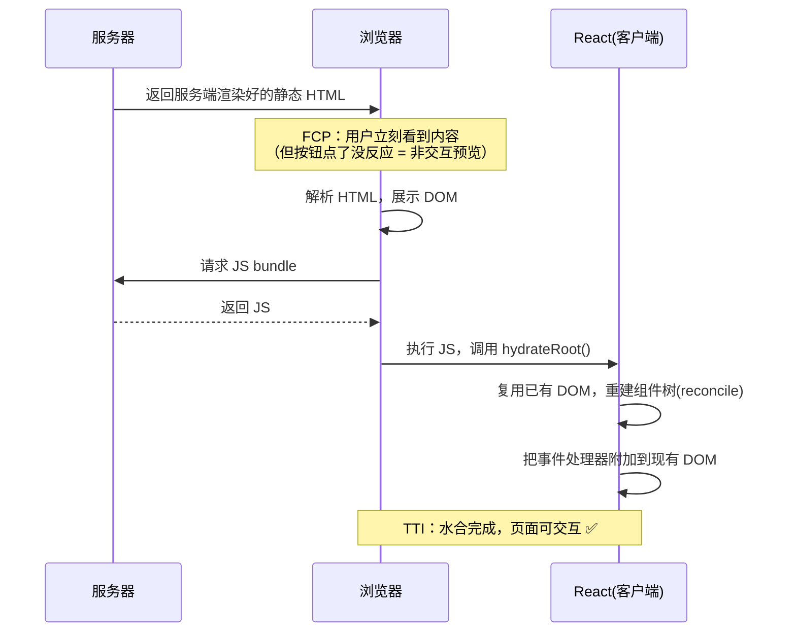
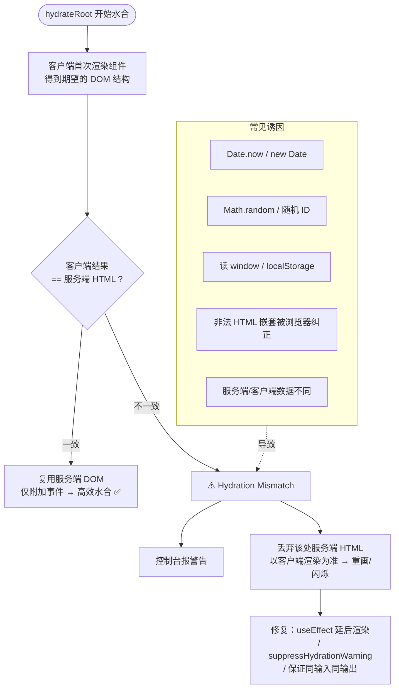

# 02 · 同构与水合（Isomorphic & Hydration）

> 服务端把 HTML 先「画」出来给你看，浏览器再把 JS 的「交互能力」补上去——这个「补」的过程就是水合。

## 📖 知识讲解

### 什么是同构（Isomorphic / Universal）应用
同一套 UI 代码（通常是 React/Vue 组件）**既能在服务端运行**（生成首屏 HTML 字符串），**又能在浏览器端运行**（接管这份 HTML 并让它可交互）。「同构（isomorphic）」与「通用（universal）」是同义词，强调**一份代码，两处执行**。SSR/SSG 之所以能做到「首屏直出内容 + 之后仍是完整 SPA」，靠的就是同构。

### 什么是水合（Hydration）
服务端渲染只产出**静态 HTML**——有内容、能看，但没有任何事件监听，点按钮没反应（就像一具「干」的骨架）。**水合**（hydration，字面意思「注水/浇灌」）就是：浏览器下载并执行 JS 后，React **在客户端重新构建组件树，并把事件处理器附加到服务端已生成的那份静态 HTML 上**，让它「活」过来、变得可交互。

React 官方 API 是 `hydrateRoot(domNode, reactNode)`：它**不重新创建 DOM**，而是**复用**服务端已有的 DOM 节点，只负责「挂事件、接管状态」。这与纯 CSR 的 `createRoot().render()`（从零创建 DOM）本质不同。

### 为什么需要水合
因为「看得到」和「能交互」是两件事：
- SSR/SSG 让内容**更早可见**（好 FCP、好 SEO）。
- 但要响应点击、输入、路由跳转这些交互，必须有客户端 JS 接管。
- 水合就是连接这两个世界的桥：**复用**已经画好的 HTML（不浪费首屏），再**附加**交互能力。如果不复用而是重画，会造成闪烁并浪费首屏优势。

### 水合的过程（三步）
按官方描述，SSR 首屏经历三步：
1. **静态 HTML 先显示非交互预览**：用户立刻看到内容，但点了没反应。
2. **RSC Payload 协调组件树**：React 在客户端根据数据/组件描述，把要渲染的组件树对齐（reconcile）到已有 DOM。
3. **JavaScript 水合 Client Components**：把事件处理器附加上去，页面**变得可交互**。

### 水合不匹配（Hydration Mismatch）
水合时，React 会**拿客户端首次渲染的结果与服务端返回的 HTML 做比对**。如果两者不一致，就报 hydration mismatch（水合不匹配）警告，React 会丢弃服务端 HTML 在该处的内容、以客户端渲染为准（重画），既损失性能又可能页面闪烁。

**常见成因：**
- 渲染依赖了**服务端与客户端会得到不同值**的东西：`new Date()`/`Date.now()`、`Math.random()`、`window`/`localStorage`（服务端没有）、用户时区/语言、随机 ID。
- 服务端与客户端使用了**不同的数据/props**（如客户端读了 localStorage 里的主题）。
- **HTML 结构不合法**：如 `
` 里嵌 `
`、`<table>` 缺 `<tbody>`，浏览器会自动纠正 DOM，导致与服务端字符串不一致。
- 浏览器扩展在水合前修改了 DOM。

**避免手段：**
- 把「仅客户端才确定」的内容延后到水合后再渲染：用 `useEffect` 里 setState，或 Next.js 的 `suppressHydrationWarning`（仅用于确实无法一致的单点，如时间戳）。
- 用 `useSyncExternalStore` 读取仅客户端可用的数据。
- 保证服务端/客户端首次渲染**纯函数、同输入同输出**。

### 水合的性能问题与选择性水合（Selective Hydration，React 18/19）
传统水合是**全量、阻塞式**的：必须等整棵树的 JS 都下载、且从上到下一次性水合完，页面才可交互——大应用里这会造成「看得到但久久点不动」。

React 18 起引入 **Selective Hydration（选择性水合）**：
- 配合 `Suspense` 边界，React 可以**分块、按需**水合。某个还没水合的 `Suspense` 区块，如果用户**点了它**，React 会**优先水合被交互的那块**，其余稍后再水合。
- 水合不再需要「等所有 JS」，也不再严格自上而下，交互响应大幅提前。

### RSC 时代的 Partial Hydration（部分水合）思想
在 React Server Components（Next.js App Router 默认）里，组件分两类：
- **Server Component**：只在服务端渲染，**产出 HTML/RSC Payload，不发送任何 JS 到客户端，也不需要水合**。
- **Client Component**（`'use client'`）：需要交互，会发送 JS 并被水合。

于是**只有真正需要交互的「岛屿」才被水合**，其余静态部分零 JS。这就是 **partial hydration / islands（岛屿架构）** 的核心思想：把水合的范围和成本降到最小。

## 🔄 流程图 / 原理图

### 图 1：SSR → 显示 → 下载 JS → 水合 的时间线

### 图 2：水合不匹配的判定流程

## 💻 代码说明

`index.html` 用原生 JS **模拟 React 的水合过程**，免构建、双击即运行：

- **预渲染的静态 HTML**：页面里先写死一段「服务端已渲染」的卡片，含一个计数按钮。此时按钮**已经在 HTML 里、看得见**，但**没有绑定任何事件**——点它没反应，模拟「非交互预览」。
- **`hydrate()` 函数**：模拟客户端 JS 加载完成后的水合。它**不重建 DOM**（复用已有的按钮节点，正如 `hydrateRoot` 复用而非重建），只做一件事：给按钮 `addEventListener('click', ...)` 绑定计数逻辑。绑定完成后按钮才「活」过来。
- **时间线打印**：记录「静态 HTML 显示」→「JS 加载」→「水合完成」几个时刻，打印到页面和控制台，对应图 1 的三段。demo 用 `setTimeout` 故意延迟水合，让你能在延迟窗口里**先点一次按钮验证「点了没反应」**，水合后再点才生效。
- **水合不匹配演示**：页面上有一处「服务端渲染时间」（写死在 HTML 里的时间戳）和一处「客户端水合时间」（JS 运行时取的 `new Date()`）。两者不同，正是真实水合不匹配的经典成因；demo 用醒目注释与文字说明「如果这个时间戳直接参与 React 渲染，就会触发 hydration mismatch，应改用 useEffect 延后或 suppressHydrationWarning」。

## ▶️ 运行方式

无需依赖或构建，**直接双击 `index.html`** 打开即可。

1. 页面加载后，先看到「服务端渲染」的卡片和按钮。
2. 在提示的「水合前」窗口内点按钮——**没反应**（模拟非交互预览）。
3. 约 1.5 秒后页面提示「水合完成」，再点按钮——**计数生效**。
4. 打开 F12 控制台看时间线；观察「服务端时间」与「客户端水合时间」的差异说明。

## ⚠️ 常见坑 / 最佳实践

- **水合不是「重新渲染」**：`hydrateRoot` 复用服务端 DOM，只挂事件。别误用 `createRoot().render()` 覆盖 SSR 内容，那会丢掉首屏优势并闪烁。
- **首屏 HTML 必须与客户端首次渲染完全一致**：任何 `Date`/`random`/`window` 依赖都可能触发 mismatch。需要客户端专属值时，延后到 `useEffect`。
- **`suppressHydrationWarning` 是止血不是解药**：只对**确实无法一致的单个节点**（如时间戳）使用，别全局滥用来「消警告」。
- **非法 HTML 嵌套是隐形杀手**：`
` 里放块级元素、`<table>` 结构不全，浏览器纠正 DOM 后必然 mismatch，先修 HTML 合法性。
- **大页面警惕「可见但点不动」（TTI 落后 FCP）**：善用 `Suspense` 触发选择性水合，用 RSC 把不需交互的部分做成 Server Component，减少要水合的 JS。
- **岛屿思想**：交互只发生在少数「岛屿」，其余尽量零 JS——这是降低水合成本最有效的架构手段。

## 🔗 官方文档

- React · `hydrateRoot`：https://react.dev/reference/react-dom/client/hydrateRoot
- React · Hydration mismatch 说明：https://react.dev/link/hydration-mismatch
- Next.js · Hydration error 排查：https://nextjs.org/docs/messages/react-hydration-error
- React 18 · Selective Hydration（New Suspense SSR Architecture）：https://github.com/reactwg/react-18/discussions/37
- Next.js · Server 与 Client Components：https://nextjs.org/docs/app/building-your-application/rendering/server-components
