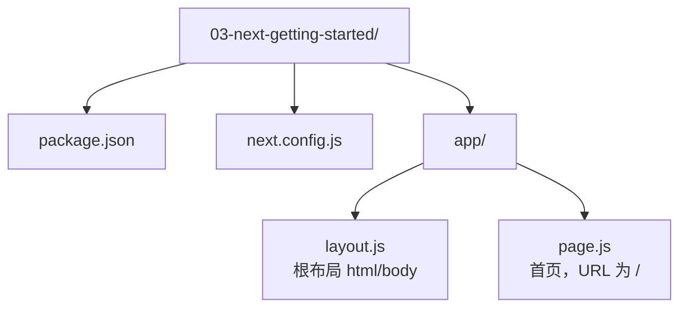

# 03 · 第一个 Next.js 应用（Next.js Getting Started）

> 用最少的文件跑起一个 Next.js（App Router）应用，亲眼看到"服务端每次请求渲染"的 SSR。

## 📖 知识讲解

### Next.js 是什么

Next.js 是基于 React 的全栈框架。React 本身只管"在浏览器里画界面"；Next.js 在它之上补齐了**路由、服务端渲染（SSR）、构建打包、数据获取、API 接口**等工程能力，让你能直接写"能上线的应用"，而不用自己拼一堆构建工具。

### App Router 与目录约定

Next.js 16 推荐使用 **App Router**：约定 `app/` 目录，用**文件系统即路由**。本模块只用到最小两件套：

| 文件 | 作用 | 对应 URL |
| --- | --- | --- |
| `app/layout.js` | 根布局，必须存在，返回 `<html><body>` | 包裹所有页面 |
| `app/page.js` | 首页 | `/` |

其中 `layout.js` 必须由你亲自渲染 `<html>` 和 `<body>` 标签，Next 不会替你补。

### Server Component 默认

App Router 里，`layout.js` 和 `page.js` **默认是服务端组件（Server Component）**：函数体在**服务器上、每次请求时**执行，产出 HTML 再发给浏览器。它的好处是：

- 组件自身的 JS **不会**打包发到浏览器，首屏更快、包更小；
- 可以直接在服务端取数、读环境变量、访问数据库，而不泄露到客户端。

本模块用 `new Date().toISOString()` 做证明：每刷新一次页面，时间戳都会变，说明 HTML 是"服务端实时渲染"的，而不是提前写死的静态字符串。

### 脚手架 create-next-app

真实项目里，官方推荐用脚手架一键生成：

```bash
npx create-next-app@latest my-app
```

它会交互式地问你要不要 TypeScript、Tailwind、ESLint 等。本模块为了降低门槛，**不用脚手架、不用 TS**，直接手写了最小的可运行文件，方便你逐行看懂每个文件的作用。

## 🔄 流程图 / 原理图

浏览器请求首页时，一次 SSR 的完整链路：


项目文件结构：



## 💻 代码说明

- **`package.json`**：声明依赖 `next ^16.2.0`、`react ^19`、`react-dom ^19`，以及 `dev / build / start` 三个脚本。
- **`next.config.js`**：Next 的配置文件，这里是空配置，仅演示它会被自动读取。注意它用 CommonJS 的 `module.exports`。
- **`app/layout.js`**：根布局，返回 `<html lang="zh-CN"><body>{children}</body></html>`，并用 `metadata` 设置页面标题。默认是服务端组件。
- **`app/page.js`**：首页。默认是服务端组件，用 `new Date().toISOString()` 展示服务端渲染时间，并用 `console.log` 在服务器终端打印日志，证明代码运行在服务端。

## ▶️ 运行方式

```bash
# 在本模块目录下
npm install
npm run dev
```

打开浏览器访问 http://localhost:3000 （默认端口 3000）。

- 反复刷新页面 → 页面上的"服务端渲染时间"会变化；
- 回到运行 `npm run dev` 的终端 → 能看到 `[服务端] HomePage 正在服务器上渲染` 的日志。

构建并以生产模式运行：

```bash
npm run build
npm run start
```

## ⚠️ 常见坑 / 最佳实践

- **忘了 `<html>`/`<body>`**：根 `layout.js` 必须自己渲染这两个标签，否则报错。它俩由你负责，不是 Next 自动补的。
- **在服务端组件里用浏览器 API 会报错**：`window`、`localStorage`、`useState`、`useEffect` 只能在客户端用。需要交互时，把那部分拆成单独文件并在顶部加 `'use client'`（见 05 模块）。
- **`console.log` 找不到**：服务端组件的日志打在**服务器终端**，不是浏览器控制台。找不到别急，看跑 `npm run dev` 的那个窗口。
- **`next.config.js` 用错模块语法**：它是 CommonJS，用 `module.exports`，不要写成 `export default`。
- **端口被占用**：3000 被占时用 `npm run dev -- -p 3001` 换端口。

## 🔗 官方文档

- Next.js 安装与起步：https://nextjs.org/docs/app/getting-started/installation
- 项目结构约定：https://nextjs.org/docs/app/getting-started/project-structure
- Layouts 与 Pages：https://nextjs.org/docs/app/getting-started/layouts-and-pages
- Server Components：https://nextjs.org/docs/app/getting-started/server-and-client-components
