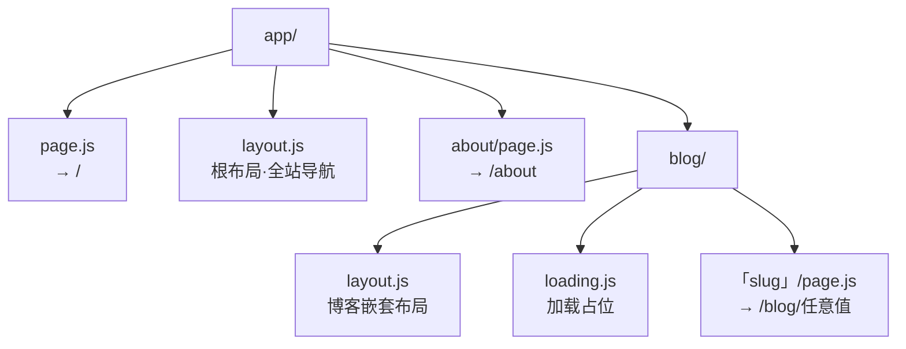

# 04 · App Router 路由（Next.js App Router）

> 在 App Router 里，文件目录就是路由表：建文件夹、放 page.js，URL 就有了。

## 📖 知识讲解

### 文件即路由

App Router 用**文件系统约定**来定义路由，无需手写路由表：

| 文件 | URL | 说明 |
| --- | --- | --- |
| `app/page.js` | `/` | 首页 |
| `app/about/page.js` | `/about` | 文件夹名即 URL 段 |
| `app/blog/[slug]/page.js` | `/blog/任意值` | 动态段 |

核心规则：**文件夹名 = URL 段**，且只有名为 `page.js` 的文件才让该段"可被访问"。像 `layout.js`、`loading.js`、`error.js` 这些是辅助文件，不会单独变成一个 URL。

### 嵌套 layout

每个文件夹里都可以放一个 `layout.js`，它会**包裹该文件夹下的所有页面**。布局会层层嵌套：

```
根 layout（app/layout.js，全站导航）
  └─ 博客 layout（app/blog/layout.js，栏目侧边栏）
       └─ 文章 page（app/blog/[slug]/page.js）
```

布局的价值：**共享 UI + 跨页面保留状态**。在文章之间切换时，外层布局不会重新渲染，导航条、侧边栏保持不动。

### 动态路由段 [slug]

用方括号命名文件夹 `[slug]`，就得到一个"动态段"，一个文件即可匹配无数 URL。参数通过组件的 `params` 拿到。

> ⚠️ Next.js 16 里 `params` 是 **Promise**，必须 `const { slug } = await params`。所以页面组件写成 `async function`（服务端组件天然支持 async）。

### Link 客户端导航

`next/link` 的 `<Link href="...">` 做**客户端导航**：点击时不整页刷新，Next 在前端预取并局部更新页面，体验接近单页应用（SPA），同时保留了 SSR 首屏。用普通 `<a>` 则会触发整页刷新，失去这个优化。

### loading.js / error.js 约定（简述）

- **`loading.js`**：某段正在渲染/取数时自动展示的加载占位，底层是 React `<Suspense>`。本示例在 `app/blog/loading.js` 放了一个。
- **`error.js`**：该段渲染报错时展示的兜底 UI，是一个 Client Component，能拿到 `error` 对象和 `reset()` 重试函数。（本示例未放，了解约定即可。）

## 🔄 流程图 / 原理图

文件树 → URL 映射：



一次动态路由匹配的流程：


## 💻 代码说明

- **`app/layout.js`**：根布局，含全站顶部导航（用 `<Link>`）。
- **`app/page.js`**：首页，列出所有路由入口。
- **`app/about/page.js`**：静态路由 `/about`。
- **`app/blog/layout.js`**：博客区块的嵌套布局，只包裹 `/blog/*`，带侧边栏。
- **`app/blog/[slug]/page.js`**：动态路由，`async` 组件里 `await params` 读取 `slug`。
- **`app/blog/loading.js`**：`/blog` 段的加载占位，演示 `loading.js` 约定。

## ▶️ 运行方式

```bash
npm install
npm run dev
```

访问 http://localhost:3000 ，然后：

- 点击顶部导航在 `/`、`/about`、`/blog/hello-world`、`/blog/nextjs-routing` 之间切换（注意**没有整页刷新**）；
- 直接在地址栏输入 `/blog/随便什么词`，观察页面读取到的 `slug` 变化。

## ⚠️ 常见坑 / 最佳实践

- **忘了 `await params`**：Next.js 16 的 `params` 是 Promise，直接 `params.slug` 会拿到 `undefined`。必须 `const { slug } = await params`。
- **用 `<a>` 代替 `<Link>` 做站内跳转**：会触发整页刷新，丢掉客户端导航与预取。站内用 `<Link>`，站外链接才用 `<a>`。
- **以为文件夹自动成为页面**：只有放了 `page.js` 该段才可访问。只有 `layout.js` 的文件夹不会有对应 URL。
- **动态段命名**：`[slug]` 匹配一段；`[...slug]` 是 catch-all 匹配多段；`[[...slug]]` 是可选 catch-all。别混用。
- **嵌套 layout 别再写 `<html>`/`<body>`**：这两个标签只在根 layout 出现一次，子 layout 里再写会重复报错。

## 🔗 官方文档

- 布局与页面：https://nextjs.org/docs/app/getting-started/layouts-and-pages
- 动态路由：https://nextjs.org/docs/app/api-reference/file-conventions/dynamic-routes
- 链接与导航：https://nextjs.org/docs/app/getting-started/linking-and-navigating
- loading.js 约定：https://nextjs.org/docs/app/api-reference/file-conventions/loading
- error.js 约定：https://nextjs.org/docs/app/api-reference/file-conventions/error
