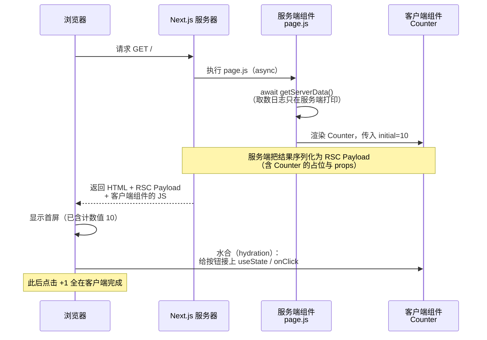

# 05 · React Server Components（React Server Components / RSC）

> 服务端组件负责取数与首屏、客户端组件负责交互；'use client' 是两者的分界线。

## 📖 知识讲解

### Server vs Client Component 的区别

App Router 里组件**默认是服务端组件（Server Component）**，只有在文件顶部写 `'use client'` 才变成客户端组件（Client Component）。

| | 服务端组件（默认） | 客户端组件（'use client'） |
| --- | --- | --- |
| 运行在哪 | 服务器 | 先在服务端预渲染出 HTML，再到浏览器"水合" |
| 能否 async 直接取数 | ✅ 可以 `await` | ❌ 不行 |
| 能否用 useState/useEffect/onClick | ❌ 会报错 | ✅ 可以 |
| 能否访问密钥/数据库 | ✅ 安全，不外泄 | ❌ 代码会发到浏览器，不能放密钥 |
| 自身 JS 是否发到浏览器 | ❌ 不发，减小包体积 | ✅ 会发 |

**怎么选**：默认用服务端组件（取数、读密钥、渲染静态内容）；只有需要**交互、状态、浏览器 API、useEffect** 的那一小块 UI，才拆成客户端组件。

### 'use client' 是边界

`'use client'` 不是"标记一个组件"，而是标记一条**边界**：从这个文件往下（它以及它 import 的子模块），都会被打包进客户端 bundle。所以要把 `'use client'` 放在"交互叶子组件"上，尽量靠近叶子，别放在顶层，否则整棵树都变成客户端组件，白白增大包体积。

### RSC Payload 是什么

服务端组件不会把"组件代码"发给浏览器，而是把**渲染结果**序列化成一种特殊格式，叫 **RSC Payload**。它是对服务端组件树的紧凑描述，包含：渲染出的内容、留给客户端组件的"占位"、以及要传给客户端组件的 props。浏览器拿到 Payload 后，用它来绘制页面，并把标了 `'use client'` 的地方"接上"真正的交互逻辑。

### 组合模式（interleaving）

- **服务端组件可以直接渲染客户端组件**，并通过 props 把数据传下去（本示例：page.js 把 `initial={data.count}` 传给 `Counter`）。
- **客户端组件不能直接 import 服务端组件**，但可以通过 `children` / props 接收服务端组件作为"插槽"（把服务端渲染好的内容当孩子塞进客户端组件）。这种交错嵌套就是 interleaving。
- ⚠️ 传给客户端组件的 props 必须是**可序列化**的（数字、字符串、普通对象、数组等），不能传函数、类实例。

### 为什么能减少 JS 体积、避免泄密

- 服务端组件的代码**不进客户端 bundle**，取数用的库、模板逻辑都留在服务端，浏览器要下载的 JS 更少，首屏更快。
- 因为服务端组件代码不外发，把**数据库连接、API 密钥**放在服务端组件里是安全的 —— 浏览器永远看不到这些代码。本示例的 `getServerData()` 里的 `console.log` 只出现在服务器终端，就是证明。

## 🔄 流程图 / 原理图

从服务端渲染到客户端水合的时序：



## 💻 代码说明

- **`app/layout.js`**：根布局（服务端组件）。
- **`app/page.js`**：首页，**async 服务端组件**。用 `getServerData()` 模拟服务端取数，`console.log` 只在服务器终端出现；把 `data.count` 通过 props 传给客户端组件。
- **`app/ui/counter.js`**：**客户端组件**，顶部有 `'use client'`。用 `useState` 和 `onClick` 实现计数，接收服务端传来的 `initial` 作为初始值。

## ▶️ 运行方式

```bash
npm install
npm run dev
```

访问 http://localhost:3000 ，然后做三个观察实验：

1. **首屏已含数据**：页面一打开，计数器初始值就是 `10`（服务端渲染好的），点按钮 +1 是纯客户端交互。
2. **密钥/取数不外泄**：打开浏览器 DevTools，看不到 `[仅服务端可见]` 的取数日志。
3. **日志在服务端**：回到运行 `npm run dev` 的终端，能看到 `[仅服务端可见] 正在服务端取数……`。

## ⚠️ 常见坑 / 最佳实践

- **在服务端组件里用 useState/useEffect/onClick**：直接报错。这些属于客户端，需要 `'use client'`。
- **`'use client'` 放太靠上**：会让整棵子树都变成客户端组件，JS 体积暴涨。把它放在最靠近交互的叶子组件上。
- **给客户端组件传了不可序列化的 props**：函数、类实例、Date 之外的复杂对象传过去会报错。传纯数据；本示例传的是数字 `initial`。
- **想在客户端组件里 import 服务端组件**：不行。要让服务端内容进入客户端组件，用 `children`/props 插槽的方式传进去。
- **误以为服务端组件的日志在浏览器**：服务端组件的 `console.log` 只在服务器终端。这正是"代码没外发"的证据。
- **把密钥写进客户端组件**：客户端组件代码会打包发到浏览器，任何密钥都会泄露。密钥只放服务端组件。

## 🔗 官方文档

- Server and Client Components：https://nextjs.org/docs/app/getting-started/server-and-client-components
- 组合模式（Composition Patterns）：https://nextjs.org/docs/app/getting-started/server-and-client-components#interleaving-server-and-client-components
- React 官方 Server Components：https://react.dev/reference/rsc/server-components
- 'use client' 指令：https://react.dev/reference/rsc/use-client
