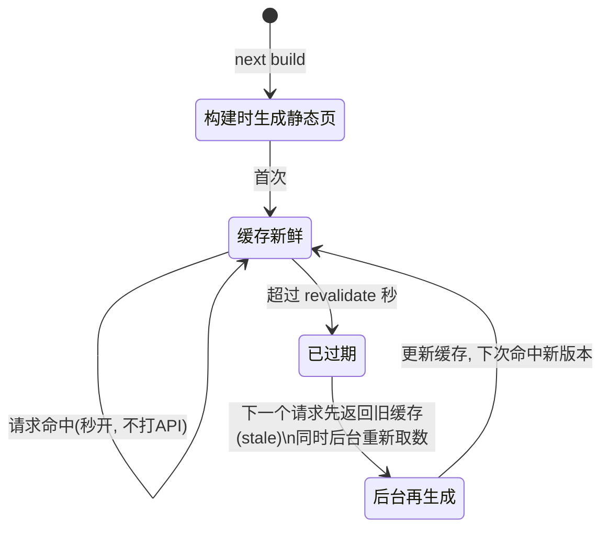

# 06 · 数据获取 / 缓存 / SSG / ISR（Next.js Data Fetching & Caching）

> 在 App Router 里，用一行 `fetch` 配置就能在 CSR（动态）/ SSG（静态）/ ISR（定时再生）之间切换。

## 📖 知识讲解

### 1. Server Component 直接 `await fetch`

App Router 里的组件默认是 **Server Component**，它可以写成 `async` 函数，直接在函数体内 `await fetch(...)`。数据在服务端取好，渲染成 HTML 再发给浏览器。不再需要 Pages Router 时代的 `getServerSideProps` / `getStaticProps`。

```js
export default async function Page() {
  const res = await fetch("https://api.example.com/posts");
  const posts = await res.json();
  return <List posts={posts} />;
}
```

### 2. 关键变化：`fetch` 默认不缓存

从 Next 15 / 16 起，`fetch` 请求**默认不缓存**（等价于以前的 `cache: 'no-store'`）。也就是说，不写任何配置时，每次请求都会真正打后端、并**阻塞渲染**直到数据回来 —— 这就是“动态/SSR 每次现取”的行为。想要缓存必须**显式 opt-in**。

三种典型策略（都是同一个 `fetch`，只改配置）：

| 策略 | 写法 | 行为 | 类比 |
| --- | --- | --- | --- |
| 默认 / 动态 | `fetch(url)` | 每次请求都重新取，阻塞渲染 | CSR/SSR 现取 |
| ISR | `fetch(url, { next: { revalidate: 60 } })` | 缓存 60s，过期后台再生 | 增量静态再生 |
| 强缓存 | `fetch(url, { cache: 'force-cache' })` | 长期缓存，构建时静态化 | SSG |

### 3. ISR（Incremental Static Regeneration）原理

`revalidate: 60` 的含义是“**这份缓存 60 秒内算新鲜**”：

1. 首次请求：取数据、渲染、把结果缓存下来。
2. 60 秒内的后续请求：直接命中缓存，**秒开、不打 API**。
3. 60 秒后第一个请求：先返回**旧缓存**（stale，用户无需等待），**同时在后台**重新取数据并更新缓存。
4. 下一个请求：命中**新版本**。

这就是 **stale-while-revalidate**：既保持秒开，又能定期自动刷新，而不需要重新构建整个站点。

### 4. SSG 与 `generateStaticParams()`

对动态路由 `app/posts/[id]/page.js`，导出 `generateStaticParams()` 返回一组参数，Next 会在 `next build` 时为每个参数**预渲染出静态 HTML**。访问时直接返回静态文件，最快。

```js
export async function generateStaticParams() {
  return [{ id: "1" }, { id: "2" }]; // 构建时生成 /posts/1、/posts/2
}
```

### 5. 请求去重（Memoization）

在**同一次渲染**的组件树里，多个组件如果发起**完全相同**的 `fetch`（同 URL、同参数），Next 只会真正请求一次，其余复用结果。因此你可以在真正需要数据的组件里各自 `fetch`，而不必把数据层层透传（prop drilling）。注意：memoize 只针对“完全相同”的请求；缓存配置不同则不会合并。

## 🔄 流程图 / 原理图

ISR `revalidate` 的状态时序：



## 💻 代码说明

- `app/layout.js`：根布局，返回 `<html><body>{children}</body></html>`。
- `app/page.js`：async Server Component。对**同一个 API** 用三种 fetch 配置（默认/ISR/force-cache）分别取数并对照渲染；底部给出指向动态路由的链接。
- `app/posts/[id]/page.js`：动态路由 + `generateStaticParams()`，构建时把 id 1~5 预渲染为静态页面（SSG）。注意 `params` 需 `await`。

## ▶️ 运行方式

```bash
npm install
npm run dev
# 打开 http://localhost:3000
```

体验建议：
- `npm run dev` 下反复刷新首页，观察三个列表；开发模式默认更偏动态。
- `npm run build` 观察构建日志：`/posts/[id]` 会被标记为静态预渲染；`npm run start` 后访问 `/posts/1` 秒开。

## ⚠️ 常见坑 / 最佳实践

- **别以为 fetch 会自动缓存**：Next 15/16 默认不缓存，想缓存必须显式加 `next.revalidate` 或 `cache: 'force-cache'`。
- **`params` 是异步的**：Next 16 里 `const { id } = await params;`，忘了 `await` 会报错。
- **memoize ≠ 缓存**：memoize 只在单次渲染内对完全相同的请求去重；跨请求的缓存由 `revalidate`/`force-cache` 决定。
- **revalidate 选值**：太小接近动态（频繁回源），太大数据陈旧；按业务“可接受的过期时间”取值。
- **开发模式行为不完全等于生产**：验证缓存/SSG 效果请用 `next build` + `next start`。

## 🔗 官方文档

- 数据获取与缓存：https://nextjs.org/docs/app/getting-started/fetching-data
- 缓存与再验证：https://nextjs.org/docs/app/getting-started/caching-and-revalidating
- `generateStaticParams`：https://nextjs.org/docs/app/api-reference/functions/generate-static-params
- `fetch` 扩展选项：https://nextjs.org/docs/app/api-reference/functions/fetch
