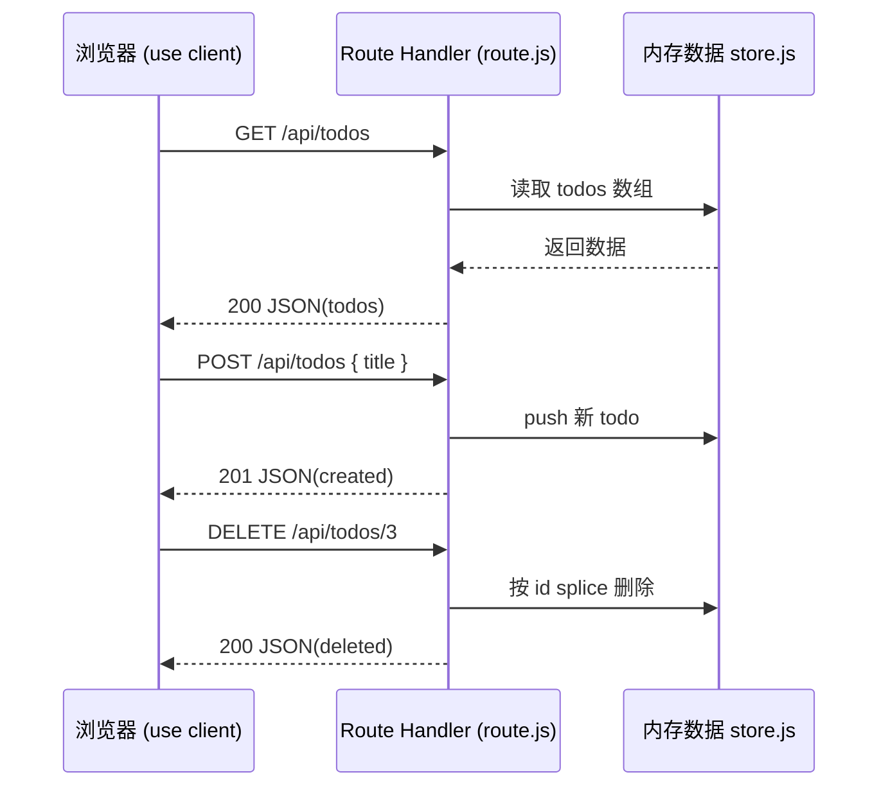

# 07 · API 路由 / Route Handlers（Next.js Route Handlers）

> 在 `app` 目录放 `route.js`，导出与 HTTP 方法同名的函数，就得到一个后端接口。

## 📖 知识讲解

### 1. `route.js` 约定

App Router 里，一个路由段要么是**页面**（`page.js`），要么是**接口**（`route.js`）。在 `route.js` 里导出与 HTTP 方法同名的函数即可：

```js
export async function GET(request) { /* ... */ }
export async function POST(request) { /* ... */ }
```

支持的方法：`GET / POST / PUT / PATCH / DELETE / HEAD / OPTIONS`。文件路径就是接口 URL，例如 `app/api/todos/route.js` → `/api/todos`。

### 2. Request / Response 与 NextRequest / NextResponse

处理函数接收 Web 标准的 `Request`，返回 Web 标准的 `Response`：

- 读 JSON 请求体：`const body = await request.json();`
- 返回 JSON：`Response.json({ ok: true })`
- 设置状态码：`Response.json(data, { status: 201 })`

Next 在此基础上扩展了 `NextRequest` / `NextResponse`（从 `next/server` 导入），提供 `NextResponse.json()`、cookies、重定向等便利方法。两者可混用，本模块用 `NextResponse.json()`。

### 3. 动态段 `[id]`

`app/api/todos/[id]/route.js` → `/api/todos/:id`。参数从处理函数第二个参数 `ctx.params` 拿，**Next 16 里 params 是异步的，要 `await`**：

```js
export async function GET(request, ctx) {
  const { id } = await ctx.params;
}
```

### 4. 默认不缓存 与 `force-static`

Route Handler **默认不缓存**（每次请求都执行，动态）。若某个 `GET` 返回的是静态、可缓存的内容，可 opt-in：

```js
export const dynamic = "force-static";
```

本模块要读写实时内存数据，因此保持默认（动态）。

### 5. route 与 page 不能同段共存

同一个路由段下 `route.js` 与 `page.js` **不能同时存在**（会冲突）。一个段只能是页面或接口二选一。因此接口通常放在独立的 `/api/...` 段下。

## 🔄 流程图 / 原理图

浏览器（Client Component）调用 Route Handler：



## 💻 代码说明

- `app/layout.js`：根布局。
- `app/api/todos/store.js`：模块级内存数组（模拟数据库），被两个 route 共享。
- `app/api/todos/route.js`：`GET` 返回全部；`POST` 读 body、校验、追加，返回 201。
- `app/api/todos/[id]/route.js`：`GET` 按 id 返回单条（404 处理）；`DELETE` 按 id 删除。
- `app/page.js`：`'use client'` 组件，`useEffect` 首次加载列表，表单 `POST` 新增、按钮 `DELETE` 删除，用 `useState` 管理列表。

## ▶️ 运行方式

```bash
npm install
npm run dev
# 打开 http://localhost:3000
```

也可直接测接口：

```bash
curl http://localhost:3000/api/todos
curl -X POST http://localhost:3000/api/todos -H 'Content-Type: application/json' -d '{"title":"写文档"}'
curl -X DELETE http://localhost:3000/api/todos/1
```

## ⚠️ 常见坑 / 最佳实践

- **route.js 与 page.js 不能同段共存**：接口放独立 `/api` 段。
- **params 要 await**：Next 16 里 `const { id } = await ctx.params;`。
- **默认不缓存**：GET 想缓存要 `export const dynamic = 'force-static'`；写操作(POST/DELETE)本就不缓存。
- **内存数据会丢**：模块级数组仅供教学，进程重启即重置；生产用数据库。
- **读 body 用 `await request.json()`**：别忘了对应请求要带 `Content-Type: application/json`。
- **状态码语义**：新建返回 201、找不到返回 404、参数错误返回 400，接口更规范。

## 🔗 官方文档

- Route Handlers：https://nextjs.org/docs/app/building-your-application/routing/route-handlers
- `route.js` API 参考：https://nextjs.org/docs/app/api-reference/file-conventions/route
- `NextResponse`：https://nextjs.org/docs/app/api-reference/functions/next-response
- `NextRequest`：https://nextjs.org/docs/app/api-reference/functions/next-request
