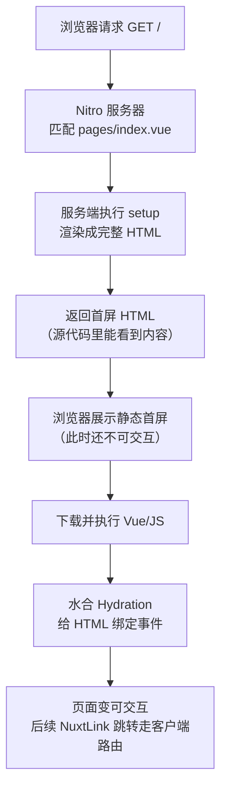
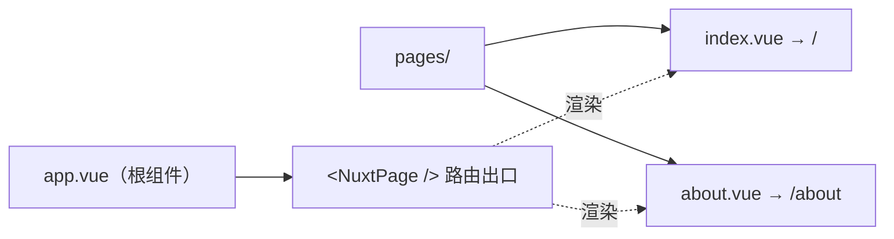

# 08 · 第一个 Nuxt 应用（Nuxt Getting Started）

> 用最小的文件跑起一个默认服务端渲染（SSR）的 Nuxt 应用，理解 `app.vue` / `pages/` / `server/` 三大目录约定与文件路由。

## 📖 知识讲解

[Nuxt](https://nuxt.com) 是基于 Vue 3 + Vite + Nitro 的全栈框架，主打「**约定优于配置**」：你按照约定放文件，框架自动帮你接好路由、SSR、数据获取、构建等一切。

### 脚手架
官方创建命令（了解即可，本模块已直接写好可运行的最小文件）：

```bash
npm create nuxt@latest my-app
```

### 三大目录约定
| 目录 / 文件 | 作用 |
| --- | --- |
| `app.vue` | 应用**根组件**，最先渲染。放全站布局。有 `pages/` 时必须包含 `<NuxtPage />` 作为路由出口。 |
| `pages/` | **文件即路由**：文件结构自动生成路由表，无需手写路由配置。 |
| `server/` | 服务端代码（如 `server/api/*` 接口）。本模块未用，见 09 模块。 |
| `nuxt.config.ts` | 全局配置。最小只需 `defineNuxtConfig({ devtools: { enabled: true } })`。 |

### 文件路由映射
```
pages/index.vue        ->  /
pages/about.vue        ->  /about
pages/users/[id].vue   ->  /users/:id   （动态参数）
```

### 默认 SSR（服务端渲染）
Nuxt **默认开启 SSR**：首屏请求时，页面在**服务器**上被渲染成完整 HTML 发给浏览器（利于 SEO、首屏更快），随后浏览器加载 JS 对这段 HTML 做「**水合（hydration）**」，绑定事件让它变得可交互。之后的页内跳转由客户端路由接管，不再整页刷新。

> 本模块首页把 `new Date().toISOString()` 显示出来：查看网页源代码就能直接看到时间字符串，证明 HTML 是服务端渲染好的。

### 其他开箱即用能力
- **自动导入**：`NuxtLink`、`NuxtPage` 等组件与 `useHead`、`useRequestURL`、`useFetch` 等 composables 无需手写 `import`。
- **零配置 TypeScript**：直接写 `<script setup lang="ts">`。
- **Vite 构建**：开发热更新快。

## 🔄 流程图 / 原理图

Nuxt 一次首屏请求的生命周期：



目录到路由的映射：



## 💻 代码说明

- `package.json`：声明依赖 `nuxt` / `vue` 与 `dev/build/generate/preview` 脚本；`postinstall` 里的 `nuxt prepare` 会生成 `.nuxt` 类型文件。
- `nuxt.config.ts`：最小配置，只开启 DevTools。
- `app.vue`：根组件，含全站导航条 + `<NuxtPage />` 路由出口 + 全局样式。
- `pages/index.vue`：首页（`/`）。用服务端算好的时间戳与 `useRequestURL()` 演示 SSR。
- `pages/about.vue`：关于页（`/about`）。用 `<NuxtLink>` 做客户端跳转，用 `useHead` 设置页面标题。

## ▶️ 运行方式

```bash
cd 08-nuxt-getting-started
npm install
npm run dev
```

浏览器打开 **http://localhost:3000** 。
- 点击顶部「首页 / 关于」体验不刷新整页的客户端路由。
- 在首页「查看网页源代码」，确认时间字符串已在 HTML 里（SSR 证据）。

其他命令：`npm run build`（生产构建）、`npm run preview`（本地预览生产包）、`npm run generate`（静态站点生成 SSG）。

## ⚠️ 常见坑 / 最佳实践

- **有 `pages/` 就必须在 `app.vue` 放 `<NuxtPage />`**，否则页面不显示。若不需要多页面，可不建 `pages/`，直接在 `app.vue` 写内容。
- **不要手写 `vue-router` 配置**：Nuxt 自动根据 `pages/` 生成，手动改反而冲突。
- **页面跳转用 `<NuxtLink>` 而非 `<a>`**：`<a>` 会整页刷新，丢掉 SPA 体验且不预取。
- **自动导入容易「以为要 import」**：`useFetch`、`useHead`、`NuxtLink` 等都是自动的，手写 import 反而可能报重复。
- 服务端渲染阶段**没有 `window`/`document`**，直接访问会报错；需要浏览器 API 时放到 `onMounted` 或用 `import.meta.client` 守卫。
- 端口 3000 被占用时，Nuxt 会自动换端口，注意看终端输出的实际地址。

## 🔗 官方文档
- Nuxt 介绍：https://nuxt.com/docs/getting-started/introduction
- 安装与脚手架：https://nuxt.com/docs/getting-started/installation
- 目录结构：https://nuxt.com/docs/guide/directory-structure/app
- 文件路由（Routing）：https://nuxt.com/docs/getting-started/routing
- 渲染模式（SSR/SSG/SPA）：https://nuxt.com/docs/guide/concepts/rendering
- `nuxt.config.ts`：https://nuxt.com/docs/api/nuxt-config
