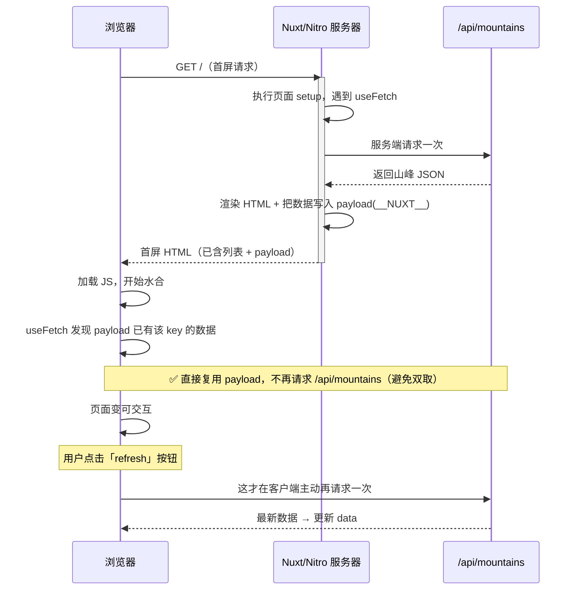

# 09 · Nuxt 数据获取（Data Fetching）

> 讲透 `$fetch` / `useFetch` / `useAsyncData` 三者区别，理解 SSR 下如何用 payload 复用避免「双取（double-fetch）」，并掌握 lazy / server / pick / transform / watch 等选项。

## 📖 知识讲解

在 Nuxt 里取数据，核心要解决一个 SSR 特有的问题：**同一个请求会不会在服务端和客户端各发一次？** 这就是「双取」。三个工具的定位如下。

### 三件套对比

| 工具 | 本质 | 自动导入 | SSR 安全（避免双取） | 适用场景 |
| --- | --- | --- | --- | --- |
| `$fetch` | [ofetch](https://github.com/unjs/ofetch) 封装的 HTTP 客户端 | ✅ | ❌ 裸用会双取 | **事件驱动**：表单提交、按钮点击后请求 |
| `useFetch` | 包了 `$fetch` 的 SSR 安全 composable | ✅ | ✅ 通过 payload 传递 | **组件初始化取数**（首选），直接 fetch 一个 URL |
| `useAsyncData` | 更底层，handler 里放任意异步逻辑 | ✅ | ✅ 通过 payload 传递 | 包装**非标准查询**：CMS/GraphQL/第三方 SDK/组合多请求 |

一句话记忆：
- **`useFetch(url)` ≈ `useAsyncData(key, () => $fetch(url))`** —— `useFetch` 是后者针对「直接请求一个 URL」的语法糖，`key` 由 URL 自动生成。
- **初始化取数用 `useFetch` / `useAsyncData`；用户点击/提交后取数用 `$fetch`。**

### 为什么裸用 `$fetch` 会双取？避免原理
在 `setup` 里直接 `const data = await $fetch('/api/x')`：
1. **服务端渲染**时执行一次 → 得到数据、渲染进 HTML；
2. 浏览器**水合**时，`setup` 会再执行一次 → **又请求一次**（服务端那次的结果没被带过来）。

`useFetch` / `useAsyncData` 的解法是：服务端取到数据后，把它**序列化进页面 payload**（HTML 里的 `__NUXT__` 数据）。客户端水合时，发现 payload 里已有对应 `key` 的数据，就**直接复用，不再发请求**。这就是避免双取的核心机制。

```mermaid
flowchart LR
    subgraph 裸用 $fetch（双取 ❌）
      A1[服务端 setup 请求一次] --> A2[客户端水合 setup 又请求一次]
    end
    subgraph useFetch / useAsyncData（一次 ✅）
      B1[服务端请求一次] --> B2[结果写入 payload]
      B2 --> B3[客户端水合直接读 payload，不再请求]
    end
```

### 关键选项
| 选项 | 作用 |
| --- | --- |
| `server` | 默认 `true`。设 `false` 则**仅客户端**取（服务端跳过，首屏无此数据）。 |
| `lazy` | 默认 `false`（阻塞导航直到取到数据）。设 `true` 则**不阻塞路由**，页面先渲染，需自行处理 `status === 'pending'` 的加载态。 |
| `pick` | 只保留返回对象中的**部分字段**，减小 payload 体积。 |
| `transform` | 对返回结果做**二次加工**（在服务端执行，结果进 payload）。与 `pick` 同用时 `transform` 先执行。 |
| `watch` | 传入响应式依赖数组，**依赖变化时自动重新请求**（如分页 `page` 变化）。 |
| `immediate` | 设 `false` 则不自动执行，需手动调 `execute()`。 |

### 返回值
`const { data, error, status, refresh, execute, clear } = await useFetch(...)`
- `data`：响应数据（ref）。
- `error`：出错时的错误对象（含 `statusCode` / `statusMessage`）。
- `status`：`idle` / `pending` / `success` / `error`，做加载态最方便。
- `refresh` / `execute`：手动重新请求。
- `clear`：清空 data/error，重置为初始状态。

## 🔄 流程图 / 原理图

`useFetch` 在 SSR 首屏取数 → payload 序列化 → 客户端水合复用的时序：



## 💻 代码说明

- `server/api/mountains.get.ts`：服务端接口，映射到 `GET /api/mountains`。返回写死的山峰数组；带 `?id=` 时返回单条，找不到用 `createError` 抛 404。只在服务器运行，不进浏览器包。
- `pages/index.vue`（列表页 `/`）：用 `useFetch('/api/mountains')` 初始化取数，`transform` 给每条加派生字段 `heightKm`；展示 `status` 并提供 `refresh` 按钮。
- `pages/detail.vue`（详情页 `/detail`）：用 `useAsyncData('mountain-1', () => $fetch('/api/mountains', { query: { id } }))` 取单条，用 `pick` 只保留 3 个字段缩小 payload。演示「把 `$fetch` 包进 `useAsyncData`」的正确姿势。
- `app.vue`：布局 + `<NuxtPage />` 路由出口。

## ▶️ 运行方式

```bash
cd 09-nuxt-data-fetching
npm install
npm run dev
```

浏览器打开 **http://localhost:3000** 。
- **验证避免双取**：打开 Network 面板，刷新列表页，你**看不到**对 `/api/mountains` 的第二次请求（数据来自 payload）；点「refresh」按钮才会看到一次客户端请求。
- **验证 pick**：在详情页确认 `data` 里没有 `country` 字段（被 `pick` 丢弃）。

## ⚠️ 常见坑 / 最佳实践

- **初始化取数别裸用 `$fetch`**：在 `setup` 顶层 `await $fetch(...)` 会双取。要么用 `useFetch`，要么把 `$fetch` 包进 `useAsyncData`。
- **`$fetch` 用于事件回调**：按钮点击、表单提交里请求就该用 `$fetch`（此时不涉及 SSR 水合，没有双取问题）。
- **`useAsyncData` 的 key 必须唯一且稳定**：不同参数（如不同 `id`）要用不同 key，否则会命中错误的缓存。
- **`lazy: true` 记得处理 pending 态**：不阻塞导航意味着首屏时 `data` 可能还是 `null`，模板里要判空或显示骨架屏。
- **`server: false` 会失去 SSR 首屏数据**：仅在「数据只对登录用户可见」「依赖浏览器 API」等场景才关服务端取数。
- **`pick` / `transform` 在服务端执行**：目的是减小传给客户端的 payload；别把敏感字段发出来后再 `pick`，`pick` 之前的完整数据仍在服务端内存里（安全过滤应放在 API 层）。
- **响应式重取用 `watch` 而非手动监听**：分页/筛选变化时给 `watch: [page]`，Nuxt 自动重新请求。

## 🔗 官方文档
- 数据获取总览：https://nuxt.com/docs/getting-started/data-fetching
- `useFetch`：https://nuxt.com/docs/api/composables/use-fetch
- `useAsyncData`：https://nuxt.com/docs/api/composables/use-async-data
- `$fetch` / ofetch：https://nuxt.com/docs/api/utils/dollarfetch
- 服务端 API 路由：https://nuxt.com/docs/guide/directory-structure/server
