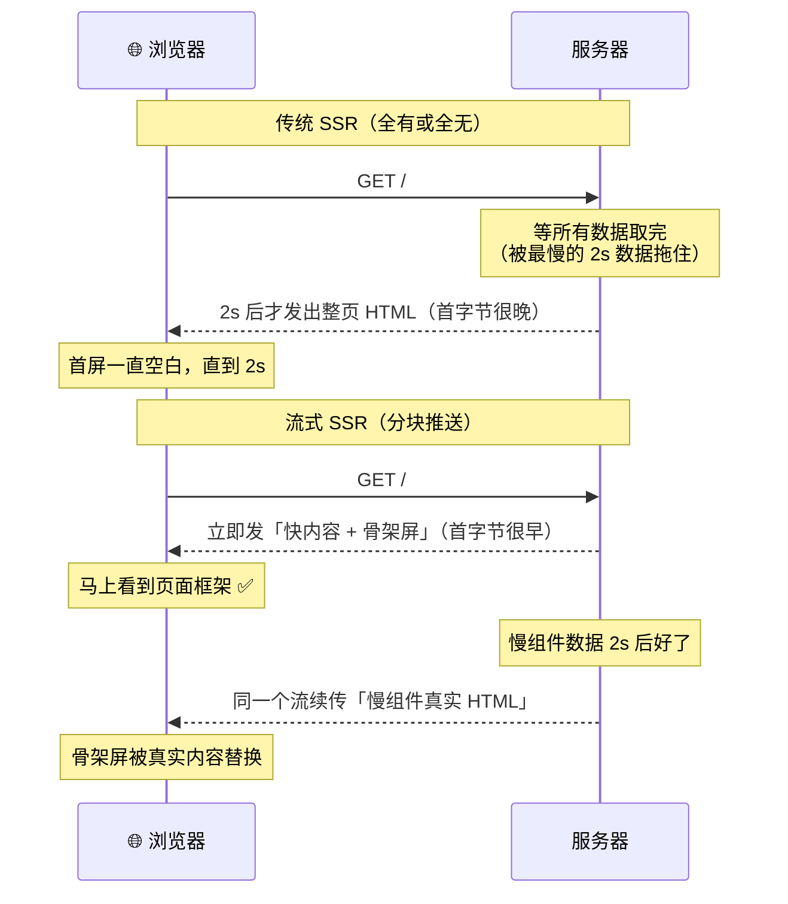
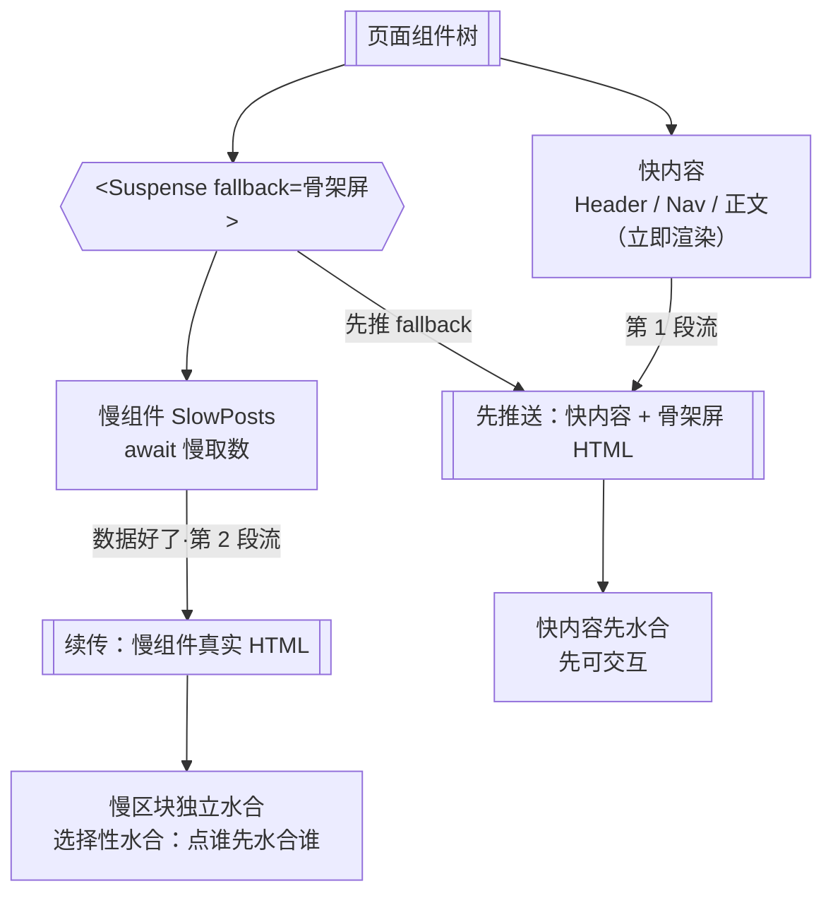

# 10 · 流式渲染 / Suspense（Streaming SSR）

> 传统 SSR 是「全有或全无」：服务器要把整页 HTML 拼完才发第一个字节，页面里最慢的那块数据拖慢了所有人。流式渲染把页面拆成块，**能先发的先发**，慢内容随后通过同一个响应流「续传」——首屏更快，还不必等最慢的部分。

## 📖 知识讲解

### 一、传统 SSR 的「瀑布式」瓶颈

传统（非流式）SSR 的流程是串行的：

1. 请求到达服务器；
2. 服务器**等所有数据都取完**（哪怕页面里只有一小块数据慢）；
3. 把**整页** HTML 一次性拼好；
4. 才发出响应的第一个字节（TTFB），浏览器才开始显示。

问题很明显：**整页的 TTFB 被页面里最慢的那一块数据决定**。首页有个「猜你喜欢」要查 2 秒，那么连页面顶部的 Logo、导航这些「本可以立刻显示」的内容，也得陪着等 2 秒。

### 二、流式渲染（Streaming SSR）：把 HTML 拆块推送

流式渲染基于 HTTP 的 **chunked transfer（分块传输）**：一个响应可以分多次、边生成边发送。React 18+ 的 `renderToPipeableStream` / `renderToReadableStream` 让服务端渲染也能这样「边渲染边流出」。

配合 **`<Suspense>`**，思路变成：

- 把页面切成「能立刻渲染的部分」和「要等数据的部分（用 `<Suspense>` 包起来）」；
- 服务器**先**把「立刻能渲染的部分 + 各 Suspense 的 `fallback`（骨架屏）」流给浏览器——用户马上看到页面框架；
- 每个被 `<Suspense>` 包住的慢组件，等它的数据好了，服务器再把**那一块**的真实 HTML 通过**同一个响应流**续传过去，浏览器用一小段内联脚本把骨架屏替换成真实内容。

收益：**TTFB / FCP 大幅提前**（首字节不再等最慢数据），且慢的部分互不阻塞。

### 三、选择性水合（Selective Hydration）

流式还带来水合层面的好处。传统 SSR 里，浏览器必须**等整棵组件树的 JS 都到齐、并从上到下一次性水合**才能交互。React 18 的**选择性水合**打破了这个串行：

- 被 `<Suspense>` 切开的区块可以**各自独立水合**，谁的 JS / HTML 先到就先水合谁；
- 用户**点击哪个还没水合的区块，React 会优先水合那一块**（把交互位置提到队列前面）。

于是「某个慢组件」既不阻塞其它区块显示，也不阻塞其它区块变得可交互。

### 四、Next.js App Router 里的两种用法

Next.js App Router 内置了流式 SSR，你有两种方式声明 Suspense 边界：

| 方式 | 粒度 | 怎么写 | 适合 |
|---|---|---|---|
| **手写 `<Suspense>`** | 局部（页面里的某一块） | 在 `page.js` 里用 `<Suspense fallback={<Skeleton/>}>` 只包住慢组件 | 页面大部分快、只有个别慢区块（如评论、推荐） |
| **`loading.js` 约定文件** | 整段路由（整页） | 在路由段目录放 `loading.js`，Next **自动**把该段 `page` 包进 `<Suspense>` | 整个页面都依赖慢取数，想要整页级骨架屏 |

`loading.js` 本质就是「Next 帮你自动写好的那层 `<Suspense>`」，`fallback` 就是 `loading.js` 导出的组件。

### 五、指标：流式如何改善 TTFB / FCP

- **TTFB（Time To First Byte）**：首字节时间。流式下，服务器发出「快内容 + 骨架屏」就算首字节到达，不再等最慢数据 → TTFB 提前。
- **FCP（First Contentful Paint）**：首次内容绘制。骨架屏 / 快内容早早到达 → FCP 提前。
- **TTI（Time To Interactive）**：可交互时间。选择性水合让先到的区块先可交互，用户点哪先水合哪 → 感知上的 TTI 提前。

## 🔄 流程图 / 原理图

### 图 1：传统 SSR vs 流式 SSR 的时间线



### 图 2：Suspense 边界如何切分快 / 慢内容并各自水合



## 💻 代码说明

本模块是一个最小 Next.js（App Router）应用，用**两条路由**分别演示「局部流式」和「整页流式」。

- `app/layout.js`：根布局，提供导航链接（首页 / `/blog`），必须返回 `<html><body>`。
- `app/page.js`（**局部流式**）：页面里 header 是「快内容」立即显示；`SlowPosts` 是一个 `await 2s` 的慢 async Server Component，用 `<Suspense fallback={<Skeleton/>}>` **只包住它**。所以骨架屏只出现在那一块，2 秒后被真实列表流式替换，页面其余部分早已可见。
- `app/blog/page.js`（**整页流式**）：页面组件**自身**顶部 `await 2s`（整页都慢）。**没有手写 `<Suspense>`**。
- `app/blog/loading.js`（**约定文件**）：因为 `/blog` 段目录下有它，Next 自动把 `blog/page.js` 包进 `<Suspense>`，用这里导出的整页骨架屏做 `fallback`。请求一到先流骨架屏，2 秒后真实页面续传替换。

对照两者，即可直观理解「手写 Suspense（局部）」与「loading.js（整页）」这两种声明 Suspense 边界的方式。

## ▶️ 运行方式

需要脚手架（Next.js），本仓库约定**不预装依赖**：

```bash
cd 10-streaming-ssr
npm install
npm run dev        # 打开 http://localhost:3000
```

观察方法：

1. 打开 **首页 `/`**：header 立刻出现，下方列表先是灰色骨架条，约 2 秒后被真实文章列表替换 —— 这是**局部流式**。
2. 打开 **`/blog`**：先看到整页骨架屏（含标题占位条），约 2 秒后整页被真实列表替换 —— 这是 **`loading.js` 的整页流式**。
3. 想更明显地感受「先到的先显示」，可在浏览器 DevTools → Network 里把网络调成 Slow 3G，或在 `Network` 面板观察响应是**分块（chunked）**到达的。

> 提示：流式效果在 `npm run dev` 与 `npm run build && npm run start` 下都成立；生产构建能更真实地反映 chunked 传输的时序。

## ⚠️ 常见坑 / 最佳实践

- **异步取数要发生在 `<Suspense>` 边界【内部】**：只有被 Suspense 包住的 async 组件挂起，流式才会先发 fallback。若把 `await` 提到边界外（如放在页面顶层且没有 loading.js），整页又退回「等它才发首字节」。
- **`loading.js` 作用于整个路由段**：它包住的是该段的 `page` 及其下层，不是某一小块。想要**局部**骨架屏，用手写 `<Suspense>`，不要指望 `loading.js`。
- **fallback 要和真实内容尺寸接近**：骨架屏高度/宽度和真实内容差太多，真实内容到达时会「跳动」，造成布局偏移（CLS）。让骨架尽量占位到位。
- **别在 Client Component 里放服务端 `await` 数据**：慢取数应在 Server Component 里做；`'use client'` 组件不能是 async Server Component。慢的客户端数据用 `use()` + Suspense 或库自带的 suspense 模式。
- **流式不等于更少的总时间**：慢数据该花 2 秒还是 2 秒。流式改善的是**首屏可见时间与交互时机（感知性能）**，不是缩短后端取数本身。
- **注意 SEO 与流式内容**：Suspense 里的慢内容是后续 chunk 才到达的。现代爬虫大多能接收完整流，但若某块内容对 SEO 极关键，评估是否让它同步直出（或走 SSG/ISR）。
- **错误边界配套**：慢组件可能取数失败，用 `error.js`（App Router 约定）或 `<ErrorBoundary>` 兜底，避免一块出错拖垮整页流。

## 🔗 官方文档

- Next.js · Loading UI 与 Streaming：https://nextjs.org/docs/app/api-reference/file-conventions/loading
- Next.js · `loading.js` 约定：https://nextjs.org/docs/app/api-reference/file-conventions/loading
- Next.js · 用 Suspense 流式传输数据：https://nextjs.org/docs/app/getting-started/fetching-data#streaming
- React · `<Suspense>`：https://react.dev/reference/react/Suspense
- React · `renderToPipeableStream`（流式 SSR API）：https://react.dev/reference/react-dom/server/renderToPipeableStream
