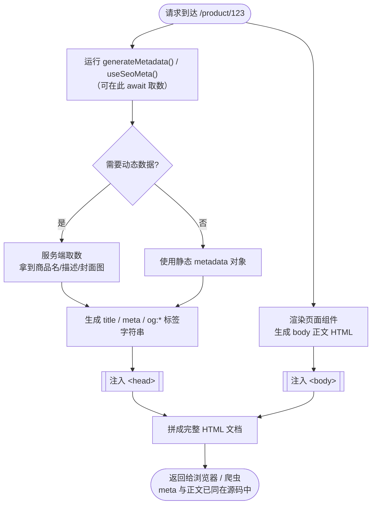

# 11 · SSR 的 SEO 优势与元数据（SEO & Meta）

> 爬虫和社交平台抓的是**首屏那份 HTML 源码**：SSR/SSG 直出的 HTML 里已经有正文和 `<meta>`，CSR 直出的是空壳——这就是 SSR 对 SEO 与分享卡片友好的根本原因。

## 📖 知识讲解

### 一、为什么 CSR 对 SEO 不友好

SEO（Search Engine Optimization，搜索引擎优化）的第一步是搜索引擎**抓取（crawl）**你的页面。爬虫发起一个普通的 HTTP 请求，拿到服务器返回的**原始 HTML 字符串**，从里面解析标题、正文、链接、`<meta>` 描述等信息。

纯 CSR（客户端渲染）应用返回的原始 HTML 大致是这样：

```html
<!doctype html>
<html>
  <head><title>My App</title></head>
  <body>
    <div id="root"></div>          <!-- 空的！正文还不存在 -->
    <script src="/bundle.js"></script>
  </body>
</html>
```

正文是 JS 下载、执行、取数之后才被塞进 `#root` 的。于是：

- **爬虫如果不执行 JS**，看到的就是一个空 `<div>`，正文、真正的标题/描述统统抓不到。
- **现代 Googlebot 确实能执行 JS**（二次渲染），但这有代价：需要排队进入渲染队列、消耗「抓取预算（crawl budget）」、存在延迟，且**并非所有爬虫都会执行 JS**（很多社交平台、Bing 的部分场景、各类第三方抓取器都不跑 JS 或跑得不完整）。
- 依赖 JS 才出现的内容 = 把 SEO 的确定性押在「爬虫愿不愿意、能不能成功跑你的 JS」上，非常不可靠。

### 二、SSR / SSG 的 SEO 优势本质

SSR（每次请求在服务端渲染）和 SSG（构建时预渲染）返回的**首屏 HTML 已经是完整的**：

```html
<!doctype html>
<html>
  <head>
    <title>iPhone 20 Pro 开箱评测 - 数码站</title>
    <meta name="description" content="全网首发 iPhone 20 Pro 详细评测……">
    <meta property="og:title" content="iPhone 20 Pro 开箱评测">
    <meta property="og:image" content="https://example.com/og/iphone20.png">
  </head>
  <body>
    <article>
      <h1>iPhone 20 Pro 开箱评测</h1>
      <p>今天我们拿到了……</p>       <!-- 正文已在源码里！ -->
    </article>
    <script src="/bundle.js"></script>  <!-- JS 仅用于「水合」使其可交互 -->
  </body>
</html>
```

任何爬虫**不执行一行 JS** 就能拿到完整标题、描述、正文、OG 图。带来两个确定性收益：

1. **SEO 友好**：搜索引擎稳定抓到内容，收录快、排名信息完整。
2. **首屏更快（FCP 更早）**：用户/爬虫收到 HTML 立刻能看到内容，无需等 JS。

> 一句话记忆：**SSR 把「渲染」从不确定的客户端，前移到了确定的服务端。爬虫拿到的不再是承诺（JS 跑完会有内容），而是结果（内容就在 HTML 里）。**

### 三、元数据（Metadata）：`<head>` 里那些标签

元数据是写进 `<head>` 的、描述页面自身的信息，主要三类：

| 类别 | 关键标签 | 作用 |
|---|---|---|
| 基础 SEO | `<title>`、`<meta name="description">` | 搜索结果里的**标题**和**摘要**；影响点击率 |
| Open Graph（OG） | `<meta property="og:title/description/image/url/type">` | 微信/微博/Facebook/LinkedIn 等**分享卡片**的标题、描述、大图 |
| Twitter Card | `<meta name="twitter:card/title/image">` | X（Twitter）分享卡片样式（`summary_large_image` 等） |

**Open Graph 与社交分享的意义**：当用户把链接粘贴到微信/微博/Slack/Discord 时，这些平台的抓取器会请求你的页面，读取 `og:*` 标签来生成那张带图带标题的「分享卡片」。这些抓取器**几乎都不执行 JS**，所以 OG 标签**必须**出现在服务端直出的 HTML 里——这正是 SSR/SSG 的强项。CSR 应用的分享卡片常常「只有一个 URL、没图没标题」，就是因为 OG 标签是 JS 后插入的、抓取器看不到。

**结构化数据（Structured Data / JSON-LD）**：在页面里嵌入一段 `<script type="application/ld+json">`，用 [schema.org](https://schema.org) 词汇描述页面实体（文章 Article、商品 Product、面包屑 BreadcrumbList、FAQ 等）。搜索引擎据此生成**富媒体结果（rich results）**：星级评分、价格、FAQ 折叠、面包屑路径等。它同样应随 HTML 直出。示例：

```html
<script type="application/ld+json">
{
  "@context": "https://schema.org",
  "@type": "Article",
  "headline": "iPhone 20 Pro 开箱评测",
  "author": { "@type": "Person", "name": "张三" },
  "datePublished": "2026-07-03"
}
</script>
```

### 四、Next.js（App Router）怎么写元数据

Next.js 16 的 App Router 用**约定式 API**：在 `layout.js` / `page.js` 里导出 `metadata` 对象（静态）或 `generateMetadata()` 函数（动态），Next 会把它们渲染进服务端 HTML 的 `<head>`。

**静态元数据**——数据在构建时已知（如关于页）：

```js
// app/about/page.js
// 直接导出一个名为 metadata 的对象，Next 自动注入 <head>
export const metadata = {
  title: '关于我们',
  description: '这是关于页的描述，会成为搜索结果摘要。',
  openGraph: {                       // 生成 og:* 系列标签
    title: '关于我们',
    description: '分享卡片上的描述',
    images: ['/og/about.png'],       // og:image
  },
  twitter: {                         // 生成 twitter:* 系列标签
    card: 'summary_large_image',
  },
};

export default function AboutPage() {
  return <main>关于页正文……</main>;
}
```

**动态元数据**——标题/描述依赖运行时数据（如商品详情页，标题里要放商品名）：

```js
// app/product/[id]/page.js
// 导出 async generateMetadata()，可 await params 拿到路由参数、再取数生成 meta
export async function generateMetadata({ params }) {
  const { id } = await params;                     // Next 16 里 params 是 Promise
  const product = await fetchProduct(id);          // 服务端取数
  return {
    title: `${product.name} - 商城`,
    description: product.summary,
    openGraph: { images: [product.coverImage] },
  };
}

export default async function ProductPage({ params }) {
  const { id } = await params;
  const product = await fetchProduct(id);
  return <h1>{product.name}</h1>;
}
```

**约定文件**（放在 `app/` 目录，Next 自动识别并生成对应产物）：

```js
// app/sitemap.js —— 生成 /sitemap.xml，告诉搜索引擎有哪些页面
export default function sitemap() {
  return [
    { url: 'https://example.com',        lastModified: new Date() },
    { url: 'https://example.com/about',  lastModified: new Date() },
  ];
}
```

```js
// app/robots.js —— 生成 /robots.txt，控制爬虫抓取规则
export default function robots() {
  return {
    rules: { userAgent: '*', allow: '/', disallow: '/admin' },
    sitemap: 'https://example.com/sitemap.xml',
  };
}
```

```jsx
// app/opengraph-image.tsx —— 动态生成 OG 分享大图（用代码画图，无需美工出图）
import { ImageResponse } from 'next/og';
export default function Image() {
  return new ImageResponse(
    (<div style={{ fontSize: 64, background: '#fff', width: '100%', height: '100%',
                   display: 'flex', alignItems: 'center', justifyContent: 'center' }}>
       我的站点
     </div>),
    { width: 1200, height: 630 }               // OG 图推荐尺寸 1200×630
  );
}
```

### 五、Nuxt（4.x）怎么写元数据

Nuxt 用组合式 API `useHead()` 和 `useSeoMeta()`，SSR 时会把这些 meta 输出到服务端 HTML 的 `<head>`。

```vue
<script setup>
// useSeoMeta：类型友好，专门写 SEO/OG/Twitter，扁平写法自动映射到正确标签
useSeoMeta({
  title: '关于我们',
  description: '这是关于页的描述。',
  ogTitle: '关于我们',                 // -> <meta property="og:title">
  ogDescription: '分享卡片描述',
  ogImage: 'https://example.com/og/about.png',
  twitterCard: 'summary_large_image', // -> <meta name="twitter:card">
});

// useHead：更通用，可写 title、任意 meta、link、script（如 JSON-LD 结构化数据）
useHead({
  htmlAttrs: { lang: 'zh-CN' },
  link: [{ rel: 'canonical', href: 'https://example.com/about' }],
});
</script>

<template>
  <main>关于页正文……</main>
</template>
```

**动态数据**（详情页，取数后设置 meta）：

```vue
<script setup>
const route = useRoute();
// useAsyncData / useFetch 在 SSR 阶段就完成取数（详见 09 模块）
const { data: product } = await useFetch(`/api/product/${route.params.id}`);

useSeoMeta({
  title: () => `${product.value.name} - 商城`,   // 用函数以便响应数据变化
  description: () => product.value.summary,
  ogImage: () => product.value.coverImage,
});
</script>
```

也可用**组件式**写法（在 `<template>` 里直接写 `<Head>`、`<Title>`、`<Meta>`）：

```vue
<template>
  <Head>
    <Title>关于我们</Title>
    <Meta name="description" content="这是关于页的描述。" />
  </Head>
</template>
```

## 🔄 流程图 / 原理图

### 图 1：爬虫抓取 CSR 空壳 vs SSR 完整 HTML

```mermaid
sequenceDiagram
    participant Bot as 🤖 爬虫 / 社交抓取器<br/>（通常不执行 JS）
    participant Srv as 服务器

    Note over Bot,Srv: CSR 应用
    Bot->>Srv: GET /product/123
    Srv-->>Bot: HTML：只有 &lt;div id="root"&gt;&lt;/div&gt;
    Note over Bot: 解析：没标题正文、没 OG 图 ❌<br/>（除非爬虫愿意排队跑 JS，不可靠）

    Note over Bot,Srv: SSR / SSG 应用
    Bot->>Srv: GET /product/123
    Note over Srv: 服务端渲染出完整 HTML<br/>含 title / description / og:image / 正文
    Srv-->>Bot: HTML：正文 + 完整 &lt;meta&gt; 全都在
    Note over Bot: 解析：内容与元数据一次拿全 ✅<br/>无需执行任何 JS
```

### 图 2：SSR 把 metadata 渲染进 `<head>` 的流程



## 💻 代码说明

本模块是**概念 + 对照**模块，**无需构建、无需安装依赖**。

- `README.md`（本文）：讲透 CSR 为何 SEO 不友好、SSR/SSG 的优势本质、Next 的 `metadata` / `generateMetadata` / `sitemap` / `robots` / `opengraph-image`、Nuxt 的 `useHead` / `useSeoMeta`、Open Graph 与 Twitter Card、结构化数据。上文的 Next / Nuxt 代码片段均为**可直接照搬到真实项目**的最小写法。
- `index.html`：一个**免构建**的直观对照 demo。左右两栏并排展示「CSR 应用返回的空壳 HTML 源码」与「SSR 应用返回的完整 HTML 源码」，用高亮和注释标出**爬虫到底看到了什么**（空 `<div>` vs 完整 `<meta>` 与正文），并附一段说明「为什么社交分享卡片在 CSR 站上常常没图没标题」。

## ▶️ 运行方式

无需任何依赖或构建，**直接双击 `index.html`** 用浏览器打开即可，对照阅读两栏 HTML 源码与注释。

想在真实项目里实践本文代码：

- Next.js：把片段放进 `app/**/page.js`，`next dev` 启动后**右键→查看网页源代码**，能在源码 `<head>` 里看到 `<title>`、`<meta property="og:...">`。
- Nuxt：把片段放进页面组件，`nuxt dev` 启动后同样查看源代码验证 meta 已直出。
- 验证 OG 卡片：用各平台的调试器，如 Facebook Sharing Debugger、X Card Validator，或微信开发者工具，粘贴你的 URL 看抓到的卡片。

## ⚠️ 常见坑 / 最佳实践

- **OG / meta 一定要服务端直出**：用 `document.title = ...` 或客户端 JS 动态改 `<head>`，对**不执行 JS 的社交抓取器无效**，分享卡片照样空白。务必用框架的 SSR 元数据 API。
- **别只依赖 Googlebot 能跑 JS**：这只覆盖 Google 一家，且有延迟和抓取预算限制；Bing、微信、微博、Slack、Discord 等大量抓取器行为各异。需要 SEO/分享的公开页面，坚持 SSR/SSG。
- **`title` 与 `description` 要每页不同**：全站共用一个标题/描述会严重损害收录与点击率。用 `generateMetadata` / `useSeoMeta` 按页面动态生成。
- **OG 图给绝对 URL 和推荐尺寸**：`og:image` 必须是完整 `https://` 绝对地址（相对路径抓取器解析不到），推荐 1200×630。
- **Next 16 里 `params` 是 Promise**：在 `generateMetadata({ params })` 里要 `await params` 才能取值，别直接 `params.id`。
- **canonical（规范链接）防重复内容**：同一内容有多个 URL（带 query、分页等）时，用 `<link rel="canonical">` 指向权威地址，避免搜索引擎判为重复内容分散权重。
- **结构化数据要与页面内容一致**：JSON-LD 里写的评分/价格必须和页面可见内容相符，否则可能被判作弊、失去富媒体结果资格。
- **sitemap 与 robots 配套**：`sitemap.xml` 列出可收录页面，`robots.txt` 里声明 sitemap 地址并挡住后台/私密路径。

## 🔗 官方文档

- Next.js · Metadata 与 `generateMetadata`：https://nextjs.org/docs/app/getting-started/metadata-and-og-images
- Next.js · Metadata 文件约定（sitemap / robots / opengraph-image）：https://nextjs.org/docs/app/api-reference/file-conventions/metadata
- Nuxt · SEO 与 Meta（`useHead` / `useSeoMeta`）：https://nuxt.com/docs/getting-started/seo-meta
- Open Graph 协议：https://ogp.me/
- X（Twitter）Cards：https://developer.x.com/en/docs/twitter-for-websites/cards/overview/abouts-cards
- Schema.org 结构化数据：https://schema.org/ 与 Google 富媒体结果指南 https://developers.google.com/search/docs/appearance/structured-data/intro-structured-data
