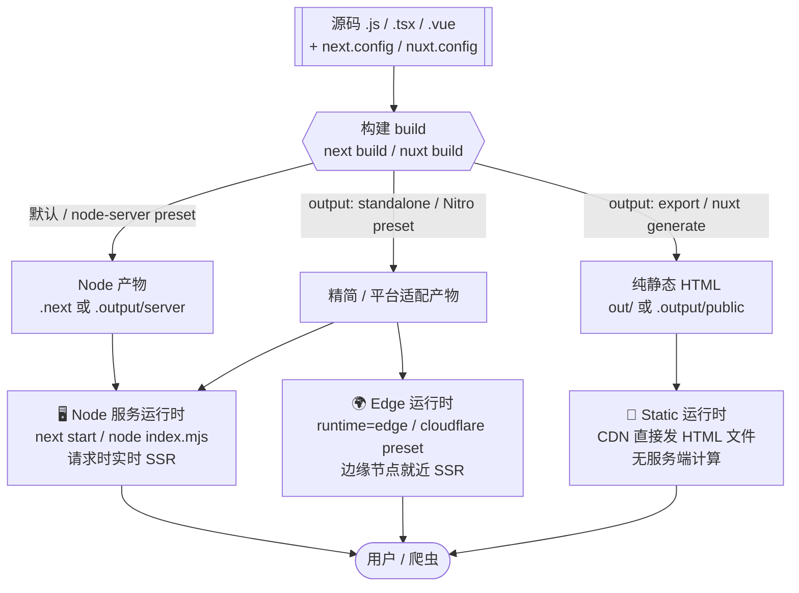
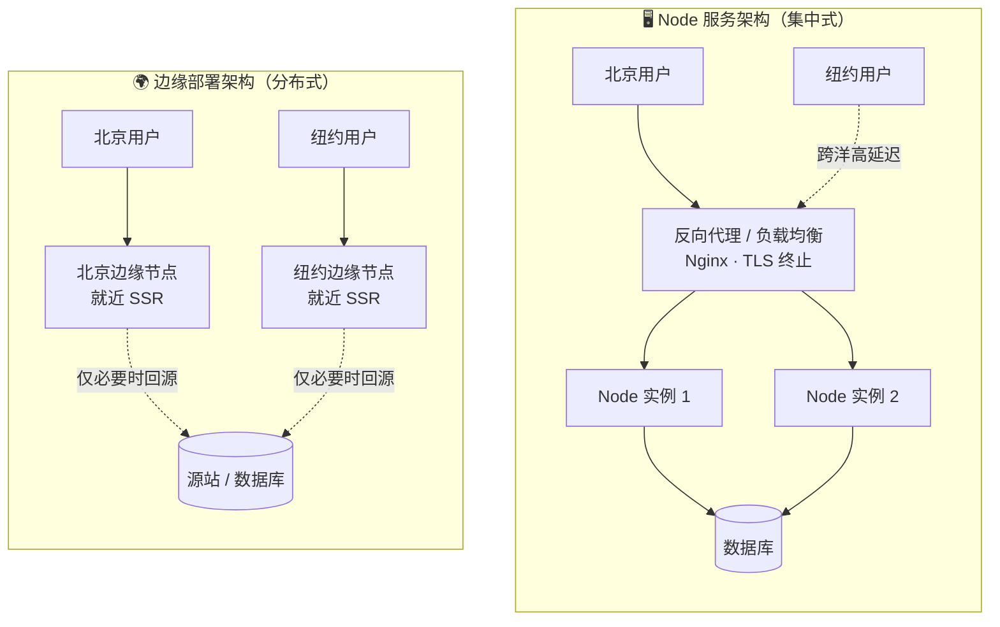

# 12 · SSR 部署：Node 服务与边缘部署（SSR Deployment）

> SSR 应用最终要「跑在某个地方」：一台常驻的 Node 服务器、全球 CDN 的边缘节点，或干脆预渲染成纯静态文件。本模块讲清三种运行时形态、各自的产物与命令，以及容器化与反向代理。

## 📖 知识讲解

### 一、先分清三个阶段：源码 → build → 运行时

任何 SSR 框架的部署都绕不开这三步：

1. **源码（source）**：你写的 `.js/.tsx/.vue` + 配置文件。
2. **构建（build）**：把源码编译、打包、优化，产出可运行的**产物（artifact）**。
3. **运行时（runtime）**：产物被真正执行、响应请求的环境。运行时有三种形态：
   - **Node 服务**：一个常驻的 Node.js 进程，监听端口，每个请求实时 SSR。
   - **Edge（边缘）**：SSR 函数部署到全球 CDN 边缘节点，就近响应。
   - **Static（静态）**：构建时就把页面预渲染成 HTML 文件，运行时只是 CDN 发文件、没有服务端计算。

**关键认知**：同一份源码，选不同的构建/部署配置，就能产出不同运行时形态。下面分 Next 和 Nuxt 说明。

### 二、Next.js 的部署形态

#### 1）默认：`next build && next start`（Node 服务）

```bash
next build     # 构建，产物在 .next/ 目录
next start      # 启动 Node 服务器（默认 3000 端口），提供 SSR + ISR + API 路由
```

这是最完整的形态：支持 SSR、ISR、API Routes、图片优化等所有特性。适合部署到任意能跑 Node 的服务器（自建 VPS、云主机、Kubernetes）。

#### 2）`output: 'standalone'`（精简自包含产物，容器首选）

在 `next.config.js` 里设 `output: 'standalone'`，`next build` 会额外生成 `.next/standalone/` 目录，里面**只包含运行所需的最小文件**（含裁剪过的 `node_modules`）和一个 `server.js`：

```bash
node .next/standalone/server.js    # 直接起服务，无需完整 node_modules
```

优势：镜像体积小、启动依赖少，是 **Docker 容器化的首选**（Dockerfile 只需拷贝 `standalone` + `static` + `public`）。

#### 3）Vercel（零配置）

Next.js 由 Vercel 开发，推送代码即自动构建部署，自动把不同页面映射成 Serverless / Edge 函数与静态资源，无需你操心运行时形态。

#### 4）Edge Runtime（边缘运行时）

在某个路由文件里导出 `runtime = 'edge'`，该路由就跑在边缘运行时（基于 Web API 的轻量环境，而非完整 Node）：

```js
export const runtime = 'edge';   // 这个路由在边缘节点执行，冷启动快、离用户近
```

代价：**没有完整 Node API**（不能用 `fs`、原生 `net` 等），第三方库若依赖 Node 内置模块会报错。适合轻量、无重依赖的逻辑（鉴权、重定向、个性化）。

#### 5）`output: 'export'`（纯静态导出，SSG）

```js
// next.config.js
module.exports = { output: 'export' };   // next build 产出纯静态 HTML 到 out/
```

把整站预渲染成静态文件（`out/` 目录），可直接丢到任何静态托管（CDN、GitHub Pages、对象存储）。**代价**：放弃 SSR、ISR、API Routes、Node 版图片优化等一切「需要服务端」的特性。适合纯内容站（文档、博客、营销页）。

### 三、Nuxt（4.x）的部署形态

Nuxt 的构建底座是 **Nitro**（服务端引擎），通过切换 **preset** 就能把同一份源码部署到不同目标。

#### 1）默认：`nuxt build` → `.output/`（Node 服务）

```bash
nuxt build                          # 产物在 .output/ 目录（默认 node-server preset）
node .output/server/index.mjs       # 启动 Node 服务器（默认 3000 端口）
```

`.output/` 结构：`server/`（Nitro 生成的服务端入口）+ `public/`（静态资源）。这是标准的 Node SSR 服务，可部署到任意 Node 环境或容器。

#### 2）Nitro preset（一份源码，多种目标）

通过环境变量 `NITRO_PRESET` 或 `nuxt.config.ts` 的 `nitro.preset` 指定目标平台，Nitro 会产出适配该平台的产物：

```bash
NITRO_PRESET=vercel            nuxt build   # 适配 Vercel
NITRO_PRESET=netlify           nuxt build   # 适配 Netlify
NITRO_PRESET=cloudflare_module nuxt build   # 适配 Cloudflare Workers（边缘）
NITRO_PRESET=node_server       nuxt build   # 标准 Node 服务（默认）
```

`cloudflare_module` 等边缘 preset 会把 SSR 打包成能在 Workers 边缘运行时执行的形态——这就是 Nuxt 的「边缘部署」。同样受边缘运行时限制（无完整 Node API）。

#### 3）`nuxt generate`（静态站点，SSG）

```bash
nuxt generate     # 预渲染所有页面成静态 HTML，产物在 .output/public/
```

产出纯静态站点，丢 CDN 即可。等价于 Next 的 `output: 'export'`：快、可缓存，但没有请求时 SSR。

### 四、Node 服务 vs 边缘部署：怎么选

| 维度 | Node 服务（常驻进程） | Edge（边缘节点） |
|---|---|---|
| 部署位置 | 通常单个/少数区域的机房 | 全球 CDN 数百个边缘节点 |
| 网络延迟 | 离节点远的用户延迟高 | 就近响应，延迟低 |
| 冷启动 | 进程常驻，基本无冷启动 | 轻量运行时，冷启动很快 |
| 运行时能力 | **完整 Node API**（fs、原生模块、长连接） | **受限**（仅 Web API 子集，无 fs 等） |
| CPU / 内存 / 时长 | 宽松（自己的服务器） | 每次调用有较严格限额 |
| 适合场景 | 重依赖、需 Node API、长任务、数据库直连 | 轻量 SSR、鉴权/重定向、个性化、全球低延迟 |
| 成本模型 | 常驻资源，按机器/时长计费 | 多按调用次数计费，闲时省钱 |

选择原则：**默认从 Node 服务起步**（能力最全、生态兼容最好）；当你需要**全球低延迟**且逻辑**足够轻、不依赖 Node 原生 API** 时，把相应路由/整站移到 Edge。二者可**混用**（大部分页面 Edge、少数重逻辑走 Node/Serverless）。

### 五、容器化与反向代理

**容器化（Docker）**：把「Node 版本 + 产物 + 启动命令」打包成镜像，做到「一次构建，处处运行」，便于 CI/CD 与横向扩容。要点：

- 用**多阶段构建（multi-stage build）**：一个阶段装依赖并 `build`，另一个阶段只拷贝运行所需产物，得到更小的镜像。
- Next 用 `output: 'standalone'` 能显著减小镜像体积（见本目录 `Dockerfile.example`）。
- 只暴露必要端口（如 3000），用非 root 用户运行。

**反向代理（Nginx / Caddy / 云负载均衡）**：生产环境一般**不把 Node 进程直接暴露到公网**，而是在前面放一层反向代理，负责：

- **TLS 终止**（HTTPS 证书在代理层处理）；
- **负载均衡**（多个 Node 实例间分发请求）；
- **静态资源缓存 / gzip / 限流**；
- 把请求转发到内网的 `http://127.0.0.1:3000`。

```nginx
# Nginx 反向代理最小示例
server {
  listen 80;
  server_name example.com;
  location / {
    proxy_pass http://127.0.0.1:3000;   # 转发到 Node SSR 进程
    proxy_set_header Host $host;
    proxy_set_header X-Forwarded-For $proxy_add_x_forwarded_for;
    proxy_set_header X-Forwarded-Proto $scheme;
  }
}
```

## 🔄 流程图 / 原理图

### 图 1：源码 → build → 产物 → 三种运行时



### 图 2：Node 服务架构 vs 边缘节点架构



## 💻 代码说明

本模块是**概念 + 配置**模块，**无需构建、无需安装依赖**。目录内的示例文件均带 `.example` 后缀，**避免被工具当成真实配置误跑**；实践时去掉后缀放进真实项目即可。

- `README.md`（本文）：讲透 Next 的 `next build && next start`、`output: 'standalone'`、Vercel/Docker、Edge Runtime、`output: 'export'`；Nuxt 的 `nuxt build` → `.output/`（Nitro）、Nitro preset、`nuxt generate`；Node 服务 vs 边缘部署对比；容器化与反向代理。
- `next.config.example.js`：带注释的 Next 配置示例，演示 `output: 'standalone'`（容器场景）与被注释掉的 `output: 'export'`（静态导出）两种选择。
- `nuxt.config.example.ts`：带注释的 Nuxt 配置示例，演示 Nitro `preset` 的切换（node-server / cloudflare 等）。
- `Dockerfile.example`：Next.js `standalone` 产物的**多阶段构建** Dockerfile，注释解释每个阶段在做什么、为什么镜像能这么小。

## ▶️ 运行方式

本模块无需运行。若要在真实项目中实践：

**Next.js（Node 服务）**

```bash
npm run build     # 等价于 next build
npm run start      # 等价于 next start，访问 http://localhost:3000
```

**Next.js（standalone + Docker）**

```bash
# 1. 在 next.config.js 里设 output: 'standalone'
# 2. 用本目录 Dockerfile.example 构建镜像
docker build -f Dockerfile.example -t my-next-app .
docker run -p 3000:3000 my-next-app
```

**Nuxt（Node 服务）**

```bash
npx nuxt build                       # 产物在 .output/
node .output/server/index.mjs        # 访问 http://localhost:3000
```

**Nuxt（切换 preset / 静态）**

```bash
NITRO_PRESET=cloudflare_module npx nuxt build   # 打包为 Cloudflare Workers 边缘产物
npx nuxt generate                                # 纯静态站点，产物在 .output/public/
```

## ⚠️ 常见坑 / 最佳实践

- **Edge 没有完整 Node API**：把用了 `fs`、`crypto`（Node 版）、数据库原生驱动的代码放进 `runtime = 'edge'` 或 Cloudflare preset 会报错。上边缘前先确认依赖只用 Web 标准 API。
- **`output: 'export'` 会静默丢功能**：一旦纯静态导出，SSR、ISR、API Routes、Node 版 `next/image` 优化全部失效。别在需要这些特性的项目里开它。
- **standalone 别忘拷 `static` 和 `public`**：`next build` 的 `standalone` 产物**不包含** `.next/static` 和 `public/`，Dockerfile 里要单独 `COPY` 进去，否则页面缺样式/静态资源。
- **容器里监听 0.0.0.0**：Next `next start` 默认可用；自定义 server 时要绑 `0.0.0.0`（或设 `HOSTNAME=0.0.0.0`），只绑 `localhost` 会导致容器外访问不到。
- **反向代理要透传协议头**：不设 `X-Forwarded-Proto` / `X-Forwarded-Host`，框架可能把 HTTPS 误判为 HTTP，导致重定向死循环或 OG/canonical 绝对 URL 出错。
- **环境变量分构建时 / 运行时**：`NEXT_PUBLIC_*` 在**构建时**被内联进产物，改了必须重新构建；纯服务端环境变量才是运行时读取。容器化时想清楚哪些变量在 build 阶段就要有。
- **多阶段构建减小镜像**：别把整个 `node_modules` 和源码打进最终镜像。用多阶段构建只留运行产物，镜像可从 GB 级降到几百 MB。
- **Nitro preset 认平台**：部署到 Vercel/Netlify/Cloudflare 时用对应 preset，别用默认 node-server 产物硬塞——平台的函数签名/文件布局不一样会跑不起来。

## 🔗 官方文档

- Next.js · 部署总览：https://nextjs.org/docs/app/getting-started/deploying
- Next.js · `output`（standalone / export）：https://nextjs.org/docs/app/api-reference/config/next-config-js/output
- Next.js · Edge Runtime：https://nextjs.org/docs/app/api-reference/edge
- Next.js · 用 Docker 部署示例：https://github.com/vercel/next.js/tree/canary/examples/with-docker
- Nuxt · 部署：https://nuxt.com/docs/getting-started/deployment
- Nitro · 部署 preset 列表：https://nitro.build/deploy
