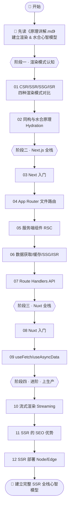
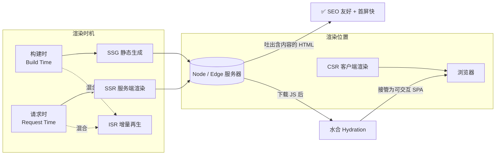

# 14 · SSR 全栈渲染（Server-Side Rendering & Full-Stack · Next.js / Nuxt）

> 前端不再只是「浏览器里跑的那部分」。当渲染从浏览器搬回服务器、当一套代码同时在 Node 和浏览器执行、当页面在毫秒级就把首屏 HTML 吐给爬虫——前端就长成了「全栈」。本工程以 **Next.js（App Router）** 和 **Nuxt** 两大主流全栈框架为主线，系统讲透 CSR/SSR/SSG/ISR 四种渲染模式、同构与水合、React Server Components、流式渲染、SEO 与部署，并配套一篇《[原理详解.md](./原理详解.md)》讲透底层机制。

## 📚 这个工程讲什么

一个现代 Web 页面到底「在哪里渲染」，直接决定了它的**首屏速度、SEO、交互延迟、服务器成本**。本工程回答四个核心问题：

1. **在哪渲染** —— CSR（浏览器）/ SSR（服务器每次请求）/ SSG（构建时）/ ISR（构建时 + 按需再生）到底差在哪，怎么选。
2. **怎么同构** —— 同一套组件如何既在 Node 端生成 HTML，又在浏览器端「接管」为可交互应用（水合 Hydration）。
3. **新范式** —— React Server Components（RSC）如何把「取数在服务端、交互在客户端」变成默认心智，以及流式渲染（Streaming SSR）如何把首屏拆块推送。
4. **上生产** —— SSR 的 SEO 优势从何而来，如何部署到 Node 服务或全球边缘节点。

技术栈与版本（已对照官方文档核对，2026-07）：

| 框架 | 版本 | 说明 |
| --- | --- | --- |
| **Next.js** | 16.2.x（App Router） | React 全栈框架，Server Components 默认 |
| **React** | 19.x | RSC / `use` API / 选择性水合 |
| **Nuxt** | 4.4.x | Vue 全栈框架，Nitro 服务端引擎 |
| **Vue** | 3.5.x | Nuxt 底层 |
| Node.js | 18+ / 20+ | 运行时 |

## 🗂 模块索引

| 模块 | 知识点 | 你将学会 | 运行方式 |
| --- | --- | --- | --- |
| [01](./01-csr-ssr-ssg-isr/) | 四种渲染模式对比 | CSR/SSR/SSG/ISR 的时机、位置、首屏、SEO、权衡与选型 | 浏览器打开 index.html |
| [02](./02-hydration/) | 同构与水合原理 | Isomorphic 应用、Hydration 过程、水合不匹配、选择性水合 | 浏览器打开 index.html |
| [03](./03-next-getting-started/) | Next.js 入门 | create-next-app、App Router 目录约定、Server Component 默认 | `npm install && npm run dev` |
| [04](./04-next-app-router/) | App Router / 文件路由 | 文件即路由、嵌套 layout、动态段 [slug]、Link 导航 | `npm install && npm run dev` |
| [05](./05-next-server-components/) | React 服务端组件（RSC） | Server vs Client、`'use client'` 边界、RSC Payload、组合模式 | `npm install && npm run dev` |
| [06](./06-next-data-fetching/) | 数据获取 / 缓存 / SSG / ISR | async 组件 fetch、默认不缓存、revalidate、generateStaticParams | `npm install && npm run dev` |
| [07](./07-next-api-routes/) | Route Handlers（API 路由） | route.js、HTTP 方法、NextRequest/NextResponse、动态段 | `npm install && npm run dev` |
| [08](./08-nuxt-getting-started/) | Nuxt 入门 | create nuxt、app.vue/pages/server 约定、SSR 默认、自动导入 | `npm install && npm run dev` |
| [09](./09-nuxt-data-fetching/) | Nuxt 数据获取 | useFetch / useAsyncData / $fetch、避免双取、lazy/pick/transform | `npm install && npm run dev` |
| [10](./10-streaming-ssr/) | 流式渲染 / Suspense | Suspense 边界、loading.js、分块推送 HTML、选择性水合 | `npm install && npm run dev` |
| [11](./11-seo-meta/) | SSR 的 SEO 优势 | 爬虫看到什么、metadata/generateMetadata、useHead/useSeoMeta、OG 卡片 | 浏览器打开 index.html |
| [12](./12-ssr-deployment/) | SSR 部署 | Node 服务、standalone、Edge 边缘、静态导出、Nitro preset | 阅读 + 配置示例 |

> 另有工程核心交付物：《[原理详解.md](./原理详解.md)》—— 讲透 CSR/SSR/SSG/ISR 本质、同构与水合过程、RSC 原理、首屏与 SEO，多张 Mermaid 原理图。**强烈建议先读它建立心智模型，再逐模块动手。**

## 🧭 学习路线

建议按编号顺序学习，四个阶段：**建立渲染心智 → 上手 Next.js → 上手 Nuxt → 进阶（流式/SEO/部署）**。



核心概念之间的关系：



## ▶️ 如何运行本工程

- **概念模块（01、02、11）**：免构建，直接用浏览器打开模块目录下的 `index.html`。
- **Next.js 模块（03–07、10）**：每个模块是独立的最小 Next.js 应用。
  ```bash
  cd 03-next-getting-started   # 或任意 Next 模块
  npm install
  npm run dev                  # 打开 http://localhost:3000
  ```
- **Nuxt 模块（08、09）**：每个模块是独立的最小 Nuxt 应用。
  ```bash
  cd 08-nuxt-getting-started
  npm install
  npm run dev                  # 打开 http://localhost:3000
  ```
- **部署模块（12）**：以文档 + 配置示例为主，阅读 README 与 `*.example` 文件。

> 提示：多个 Next/Nuxt 模块默认都用 3000 端口，一次跑一个即可；或用 `npm run dev -- -p 3001` 换端口。

## 🔗 官方文档

- Next.js App Router 文档：https://nextjs.org/docs/app
- React Server Components：https://react.dev/reference/rsc/server-components
- Nuxt 文档：https://nuxt.com/docs
- Nuxt 数据获取：https://nuxt.com/docs/getting-started/data-fetching
