# SSR 全栈渲染 · 原理详解

> 本文是 `14-ssr-fullstack` 工程的**核心交付物**，不讲「怎么用某个 API」，而是讲透 **how / why / 底层机制**：CSR/SSR/SSG/ISR 的本质、同构与水合过程、React Server Components 原理、首屏性能与 SEO。配套多张 Mermaid 原理图。已对照 Next.js 16.2.x、React 19.x、Nuxt 4.4.x 官方文档核对（2026-07）。

---

## 目录

1. [一切的起点：为什么会有 SSR](#一)
2. [四种渲染模式的本质：CSR / SSR / SSG / ISR](#二)
3. [同构（Isomorphic）与水合（Hydration）](#三)
4. [React Server Components（RSC）原理](#四)
5. [流式渲染（Streaming SSR）与选择性水合](#五)
6. [首屏性能：TTFB / FCP / LCP / TTI 到底被谁决定](#六)
7. [SEO：爬虫究竟看到了什么](#七)
8. [常见误区与最佳实践](#八)

---

## 一、一切的起点：为什么会有 SSR

### 1.1 钟摆的两端

Web 渲染的历史是一个来回摆动的钟摆：

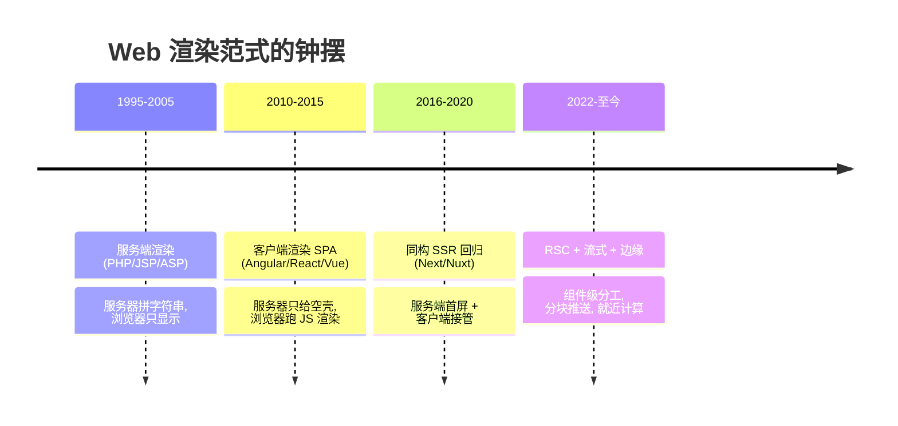

- **老式 SSR**（PHP 时代）：服务器把数据填进模板拼成完整 HTML，浏览器负责显示。首屏快、SEO 好，但**每次交互都要整页刷新**，体验差。
- **CSR / SPA**：服务器只返回一个近乎空的 `

` + 一个大 JS 包，浏览器下载 JS、执行、请求数据、再把 DOM 渲染出来。交互如丝般顺滑（局部更新、无刷新），但**首屏是白屏**（要等 JS 下载+执行+取数），**SEO 差**（爬虫拿到空壳）。
- **现代 SSR / 同构**：把两者的优点合并——**服务端先渲染出带内容的 HTML（首屏快、SEO 好），客户端再「水合」接管为 SPA（交互顺滑）**。这就是 Next.js / Nuxt 做的事。

### 1.2 SSR 要解决的三个核心矛盾

| 矛盾 | CSR 的问题 | SSR 的解法 |
| --- | --- | --- |
| **首屏速度** | 白屏等 JS，FCP 慢 | 服务端直出 HTML，FCP 快 |
| **SEO / 分享** | 爬虫看到空壳 | HTML 已含内容与 meta |
| **代价** | —— | 服务器要为每次请求做计算（成本、TTFB） |

> 记住一句话：**SSR 不是「比 CSR 好」，而是用「服务器算力」换「首屏与 SEO」**。选型永远是权衡。

---

## 二、四种渲染模式的本质：CSR / SSR / SSG / ISR

四种模式的差异，本质上只由两个维度决定：**① 在哪渲染（位置）② 何时渲染（时机）**。

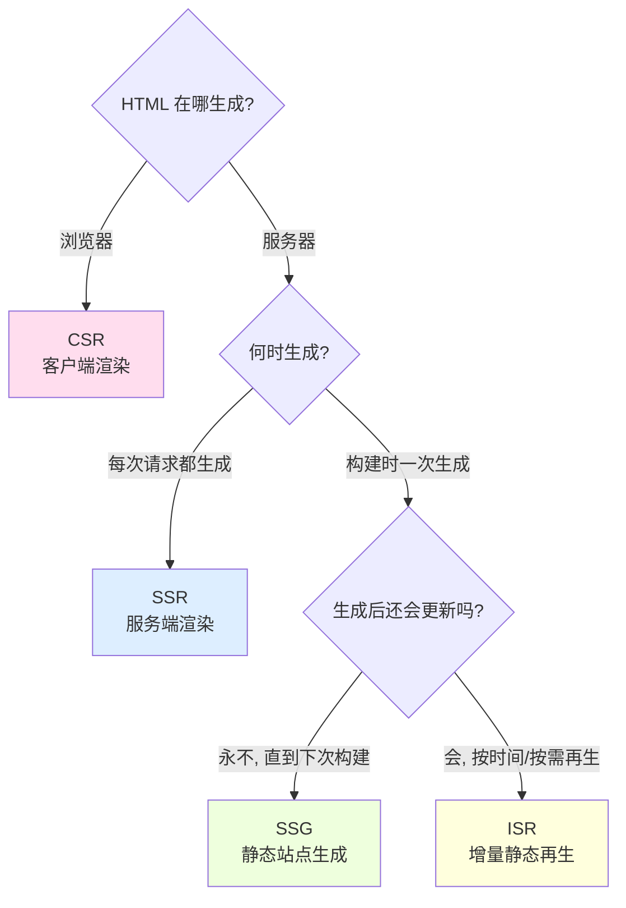

### 2.1 逐个拆解

**CSR（Client-Side Rendering）**
- 服务器返回空壳 HTML + JS bundle。浏览器执行 JS → 取数 → 渲染 DOM。
- 首屏 = 白屏 → 骨架 → 内容，取决于 JS 大小和网络。
- 适合：登录后的后台/仪表盘（不需要 SEO、内容因人而异）。

**SSR（Server-Side Rendering）**
- **每次请求**，服务器现场运行组件、取数、生成完整 HTML 返回。
- 内容永远最新；服务器有计算开销，TTFB 受取数速度影响。
- 适合：内容频繁变化且需要 SEO 的页面（新闻详情、商品详情、个性化首页）。

**SSG（Static Site Generation）**
- **构建时（build）** 就把页面渲染成静态 HTML 文件，部署到 CDN。
- 请求时直接吐 HTML，TTFB 极低、可无限扩展、零服务器计算。
- 缺点：内容更新必须**重新构建**。适合：博客、文档、营销页。

**ISR（Incremental Static Regeneration）**
- SSG 的进化：页面先用构建时的静态版本响应（快），但设置一个 `revalidate` 时间；过期后**第一个访问者仍拿到旧版本**，服务器在**后台**重新生成新版本，之后的访问者拿到新版本。
- 兼顾「静态的快」和「内容能更新」，无需整站重建。适合：商品列表、榜单等「准实时」内容。

### 2.2 CSR vs SSR 首屏时序对比

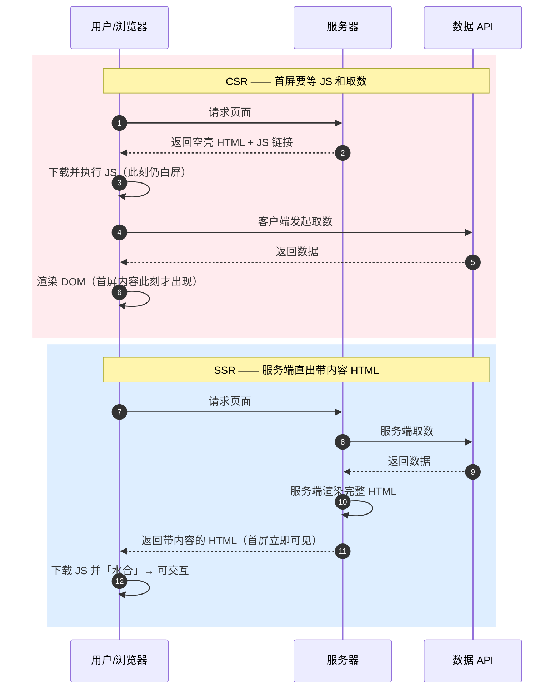

关键洞察：CSR 的首屏内容出现在**第 6 步**（浏览器侧），SSR 的首屏内容在**第 4 步**（HTML 一到就可见）。SSR 把「取数」从客户端搬到了服务端，且离数据源更近（服务器到数据库通常比浏览器到 API 快）。

### 2.3 对比总表

| 维度 | CSR | SSR | SSG | ISR |
| --- | --- | --- | --- | --- |
| HTML 生成位置 | 浏览器 | 服务器 | 服务器（构建时） | 服务器（构建时+后台再生） |
| 生成时机 | 运行时 | 每次请求 | 构建时 | 构建时 + 过期后按需 |
| 首屏内容 | 需等 JS+取数 | 直出 | 直出 | 直出 |
| 数据新鲜度 | 实时 | 每次请求最新 | 构建那一刻 | 最长 revalidate 秒延迟 |
| TTFB | 低（空壳） | 较高（要算） | 极低（CDN） | 极低（CDN） |
| SEO | 差 | 好 | 好 | 好 |
| 服务器成本 | 低 | 高 | 极低 | 低 |
| Next.js 对应 | `'use client'` + 客户端取数 | 默认动态（未缓存的 fetch） | `fetch(..., {cache:'force-cache'})` / `generateStaticParams` | `fetch(..., {next:{revalidate:N}})` |
| Nuxt 对应 | `useFetch(..,{server:false})` | 默认 SSR | `nuxt generate` | Nitro `routeRules` + ISR |

> **Next.js 16 的重要变化**：`fetch` **默认不缓存**（相当于每次请求都取新数据 = SSR 动态渲染）。要「SSG 效果」得显式 `cache: 'force-cache'`，要「ISR 效果」得 `next: { revalidate: N }`。渲染模式在 App Router 里不再是「整页设置」，而是**由数据的缓存方式在组件级别决定**。

---

## 三、同构（Isomorphic）与水合（Hydration）

### 3.1 什么是同构

**同构（Isomorphic，也叫 Universal）应用**：**同一套组件代码，既能在服务端（Node）运行生成 HTML，又能在客户端（浏览器）运行接管交互**。

这是现代 SSR 的关键——你只写一次 `<Counter/>`，Next/Nuxt 让它：
1. 在服务端跑一遍 → 生成 `<button>0</button>` 这样的 HTML；
2. 把 HTML 发给浏览器（用户立刻看到）；
3. 在浏览器再跑一遍 → 把事件监听器「贴」回这些已有的 DOM 上，让按钮能点。

第 3 步就是**水合**。

### 3.2 水合（Hydration）到底做了什么

> **官方定义（React）**：Hydration 是 React「把事件处理器附加到（服务端生成的）DOM 上，让静态 HTML 变得可交互」的过程。

关键点：**服务端已经生成了 DOM 结构，客户端不重新创建 DOM**，只是「认领」这些 DOM 节点、建立虚拟 DOM 与真实 DOM 的对应关系、绑定事件、恢复内部状态。就像给一具「有形无神」的躯壳注入灵魂（hydrate = 注水/激活）。

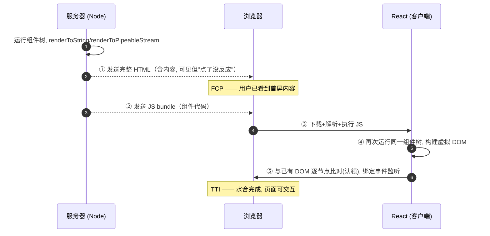

**时间线上的三个里程碑**：
- **①HTML 到达** → FCP（首屏内容可见），但此刻按钮点了没反应（还没水合）。
- **⑤水合完成** → TTI（可交互）。
- ①到⑤之间存在一段「**能看不能点**」的尴尬窗口（Uncanny Valley）——这正是 SSR 的代价，也是流式渲染和选择性水合要优化的地方。

### 3.3 水合不匹配（Hydration Mismatch）

水合的前提是：**服务端渲染出的 HTML，必须和客户端首次渲染的结果一模一样**。如果不一样，React 会警告 "Hydration failed" 并可能丢弃服务端 HTML 重新客户端渲染（性能骤降 + 闪烁）。

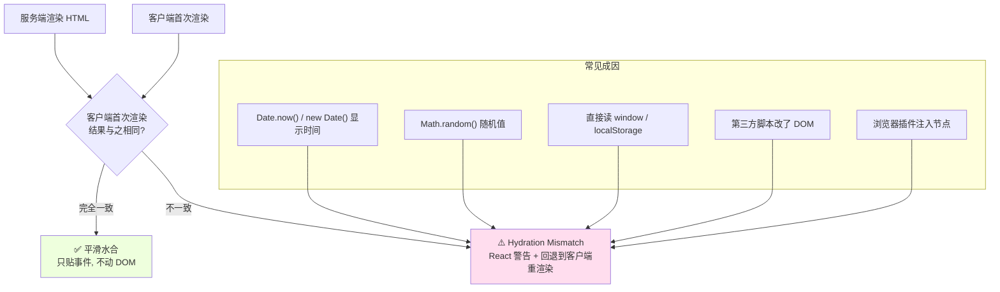

**避免方法**：
- 依赖「客户端才有的值」（时间、随机数、`window`）时，用 `useEffect` 在水合后再设置，或用框架提供的「仅客户端」渲染（Next 的 `dynamic(..., { ssr: false })`、Nuxt 的 `<ClientOnly>`）。
- Nuxt 的 `useFetch/useAsyncData` 通过 **payload 序列化**把服务端取到的数据传给客户端，保证两端渲染同样的数据 → 天然避免因「数据不同」导致的不匹配（详见第 3.5 节）。

### 3.4 水合的性能之痛

传统（React 18 之前）水合是「**全有或全无**」：
- 必须等**整个页面的 JS** 下载完 → 才能开始水合；
- 水合是**一次性、不可中断**的同步过程，会长时间阻塞主线程；
- 页面越大，「能看不能点」的窗口越长。

React 18/19 用**流式渲染 + 选择性水合**破解了它（见第五节）。

### 3.5 Nuxt 的双取问题与 payload

在 Nuxt 里，如果你在 `setup` 里裸用 `$fetch`：数据会被**取两次**——服务端渲染时取一次，客户端水合时又取一次。这既浪费又可能导致不匹配。

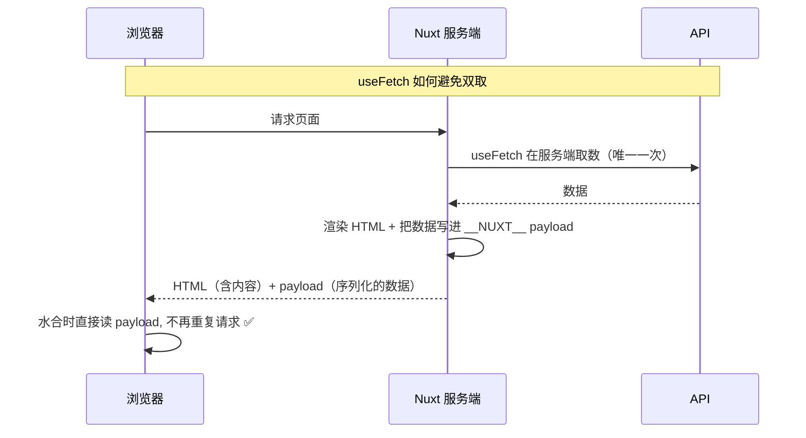

`useFetch` / `useAsyncData` 就是靠这套 payload 机制实现 SSR 安全的取数。

---

## 四、React Server Components（RSC）原理

RSC 是 React 18/19 引入、Next.js App Router 全面采用的新范式，它比「SSR」更进一步。

### 4.1 RSC ≠ SSR

初学者最大的误区是把 RSC 当成 SSR。区别在于：

| | 传统 SSR 组件 | Server Component（RSC） |
| --- | --- | --- |
| 在服务端运行 | ✅ | ✅ |
| **JS 是否发到客户端** | **是**（要水合） | **否**（代码永不进客户端 bundle） |
| 能否有 `useState`/`onClick` | 能 | **不能**（无交互） |
| 能否直接读数据库/密钥 | 不建议 | ✅ 安全 |
| 输出 | HTML（待水合） | **RSC Payload**（组件树的序列化描述） |

**核心思想**：把组件分成两类——
- **Server Component（默认）**：只在服务端运行，负责取数、访问后端资源、渲染静态结构。它的代码**根本不会被打包进浏览器**，所以能减小 JS 体积、能安全用 API Key。
- **Client Component（`'use client'`）**：需要交互（state、事件、`useEffect`、浏览器 API）的部分，才发到客户端并水合。

### 4.2 `'use client'` 是一条「边界」

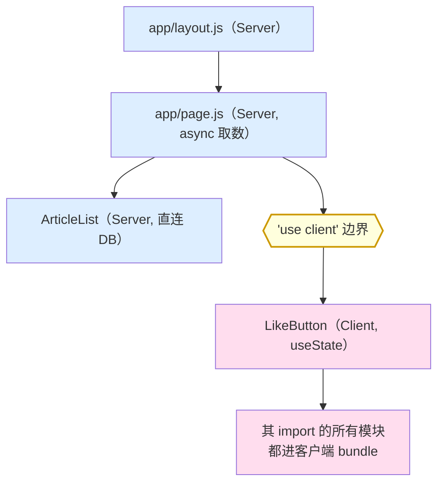

一旦某文件顶部写了 `'use client'`：
- 它**及其 import 的所有模块、它直接渲染的组件**，都会被打进客户端 bundle；
- 所以只需在「交互叶子组件」上标 `'use client'`，不用给每个子组件都加；
- **Server Component 可以作为 `children`/props 传给 Client Component**（interleaving 组合），这种「传进来的」Server 组件仍在服务端渲染、不进客户端 bundle。这是「把静态壳留在服务端、只把交互点交给客户端」的关键技巧。

### 4.3 RSC Payload 是什么

Server Component 渲染的产物不是 HTML 字符串，而是 **RSC Payload**——一种紧凑的、对「渲染后的 React 组件树」的序列化描述，包含：
1. Server Component 渲染出的结果；
2. **Client Component 应该出现在哪里的占位符** + 其 JS 文件引用；
3. Server 组件传给 Client 组件的 props。

### 4.4 首屏一次完整请求的全流程

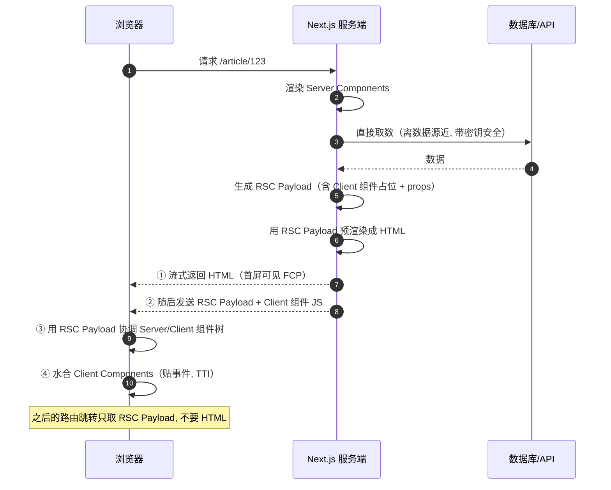

**为什么这套设计更快、更省**：
- 大量「只展示不交互」的组件（文章正文、列表骨架）永远不进客户端 bundle → **JS 更小 → 水合更快**；
- 取数在服务端、离数据源近 → **TTFB 更可控**；
- 后续导航只传 RSC Payload（比整页 HTML 小）→ **导航更快**。

---

## 五、流式渲染（Streaming SSR）与选择性水合

### 5.1 传统 SSR 的「木桶效应」

传统 `renderToString` 是**同步阻塞**的：整个页面**所有数据**都取完、**整棵树**都渲染完，才能吐出第一个字节。只要有一个慢查询，整页 TTFB 就被拖垮——这是**木桶的短板**。

### 5.2 流式渲染：把页面拆块推送

React 18 的 `renderToPipeableStream` + `<Suspense>` 让服务器可以：
1. 先把「快的部分」（header、导航、骨架）渲染好**立即推送**；
2. 慢组件用 `<Suspense fallback={...}>` 包住，先推送 fallback 占位；
3. 慢数据就绪后，把真实内容**作为后续 chunk 追加推送**，浏览器就地替换占位。

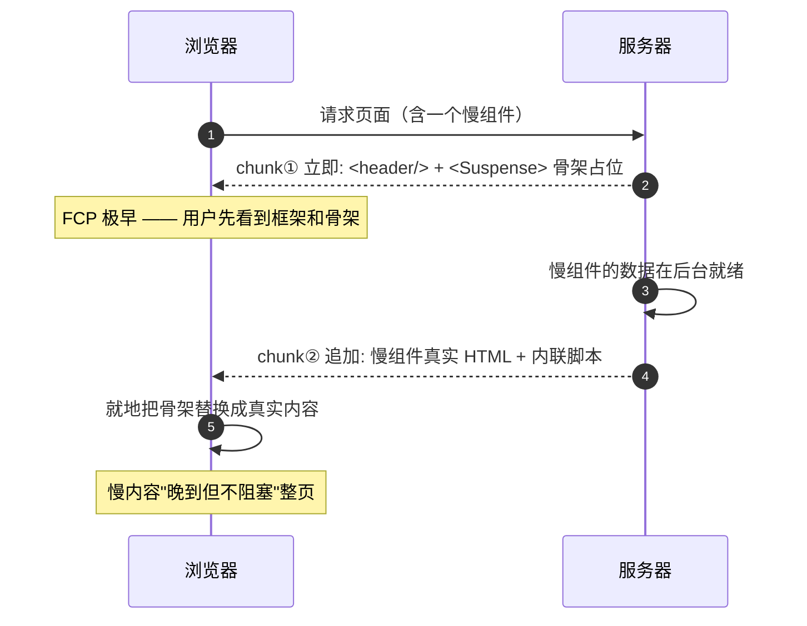

Next.js 提供两种用法：
- **`loading.js`**：放在页面同目录，框架自动用 `<Suspense>` 包裹整个 page，导航时立即显示 loading。
- **手写 `<Suspense>`**：包住某个慢组件，做更细粒度的流式，页面其余部分不受影响。

### 5.3 选择性水合（Selective Hydration）

流式还带来一个附加福利：**水合不再全有或全无**。React 18/19 可以：
- 在**部分 JS 还没到**时，就先水合已经就绪的区块；
- 根据**用户交互优先级**调整水合顺序——用户点了哪个区域，React 优先水合那块（把它插队到最前面）。

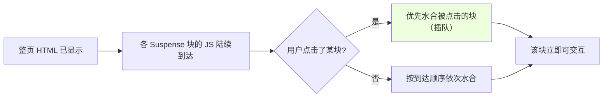

这把传统 SSR「能看不能点」的窗口从「整页级」缩小到了「区块级」，且优先响应用户真正在操作的部分。

---

## 六、首屏性能：TTFB / FCP / LCP / TTI 到底被谁决定

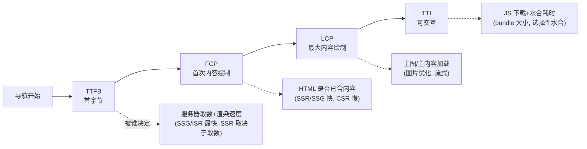

| 指标 | 含义 | CSR | SSR | SSG/ISR | 优化手段 |
| --- | --- | --- | --- | --- | --- |
| **TTFB** | 服务器返回第一个字节 | 快（空壳） | 中（要算） | 极快（CDN） | ISR/缓存、流式先吐 chunk |
| **FCP** | 第一个内容像素 | 慢（等 JS） | 快 | 快 | SSR 直出、减少阻塞资源 |
| **LCP** | 最大内容渲染 | 慢 | 快 | 快 | 图片优化、字体优化、流式 |
| **TTI** | 可交互 | 慢 | 中（要水合） | 中 | 减小 JS、RSC、选择性水合 |

一句话总结：**SSR/SSG 主要改善 FCP/LCP（看得见），但 TTI（点得动）仍受 JS 体积与水合拖累——这正是 RSC 和选择性水合要攻克的最后一公里。**

---

## 七、SEO：爬虫究竟看到了什么

### 7.1 CSR 空壳 vs SSR 完整 HTML

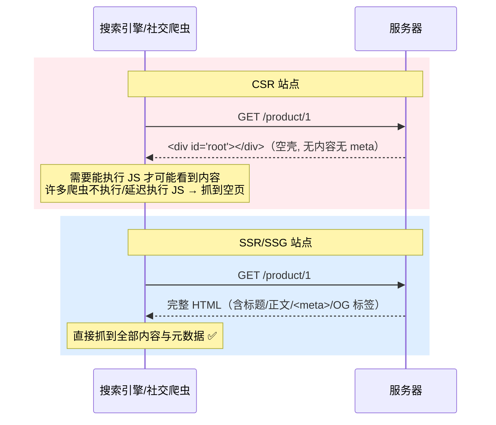

CSR 的首屏 HTML 是 `

`——**内容和 `<title>`/`<meta>` 都要靠 JS 运行后才注入**。虽然 Googlebot 有一定 JS 执行能力，但：
- 执行 JS 的抓取会被**延迟排队**、消耗爬取预算；
- 大量社交平台爬虫（微信、Twitter/X、Facebook 抓 OG 卡片时）**根本不执行 JS**；
- 结果：CSR 站点的 SEO 和「分享出去没有标题图」的问题长期存在。

SSR/SSG 把内容与 meta **在服务端就写进 HTML**，爬虫一抓即得，这就是 SSR 的 SEO 本质优势。

### 7.2 框架怎么写 meta

- **Next.js（App Router）**：在 `layout.js`/`page.js` 导出 `metadata` 对象（静态）或 `generateMetadata()`（异步动态，可根据路由参数取数生成 title/description/OG）。Next 把它渲染进服务端 HTML 的 `<head>`。还有约定文件 `sitemap.ts`、`robots.ts`、`opengraph-image.tsx`。
- **Nuxt**：用 `useHead()` / `useSeoMeta()` 或 `<Title>`/`<Meta>` 组件，SSR 时输出到 HTML `<head>`。

### 7.3 Open Graph：分享卡片

`<meta property="og:title/og:image/og:description">` 决定链接被分享到社交平台时的**标题、缩略图、描述**。这些必须在 SSR 的 HTML 里，因为抓 OG 的爬虫不跑 JS。

---

## 八、常见误区与最佳实践

### 8.1 误区澄清

| 误区 | 真相 |
| --- | --- |
| 「SSR 一定比 CSR 快」 | SSR 改善 FCP，但增加 TTFB 和服务器成本；后台/管理系统用 CSR 更合适 |
| 「RSC 就是 SSR」 | RSC 的代码**不进客户端 bundle、无水合**；SSR 组件要水合。两者常配合但不是一回事 |
| 「用了 Next 就自动 SEO 好」 | 若把整页标 `'use client'` 且客户端取数，等于退化成 CSR，SEO 优势尽失 |
| 「Next 16 的 fetch 会自动缓存」 | **恰恰相反**，16.x/15.x 的 `fetch` 默认不缓存，要显式 `force-cache` 或 `revalidate` |
| 「水合会重新创建 DOM」 | 不会，水合只是「认领」已有 DOM 并绑事件；重建 DOM 是水合失败的回退行为 |
| 「Nuxt 里 setup 里用 $fetch 就行」 | 会导致 SSR + 客户端**双取**，应用 `useFetch`/`useAsyncData` 靠 payload 避免 |

### 8.2 最佳实践

1. **按需选择渲染模式**：内容静态 → SSG；准实时 → ISR；强实时/个性化且要 SEO → SSR；纯后台无 SEO → CSR。
2. **`'use client'` 下沉到叶子**：让交互点尽量小，把静态结构留在 Server Component，最小化客户端 JS。
3. **善用流式**：慢数据用 `<Suspense>`/`loading.js` 包起来，不要让一个慢查询阻塞整页 TTFB。
4. **避免水合不匹配**：时间、随机数、`window` 相关渲染放 `useEffect`/`<ClientOnly>`。
5. **数据取用靠框架 API**：Next 用 async Server Component + `fetch` 缓存选项；Nuxt 用 `useFetch`/`useAsyncData`，避免双取。
6. **SEO 用服务端 meta**：Next 的 `generateMetadata`、Nuxt 的 `useSeoMeta`，别用客户端 JS 改标题。
7. **部署选型**：静态内容用 CDN/静态导出；动态用 Node 服务；追求全球低延迟用边缘（Edge），但注意其运行时不完整（无完整 Node API）。

---

## 🔗 参考与官方文档

- Next.js · Server and Client Components：https://nextjs.org/docs/app/getting-started/server-and-client-components
- Next.js · Fetching Data & Caching：https://nextjs.org/docs/app/getting-started/fetching-data
- Next.js · Streaming：https://nextjs.org/docs/app/guides/streaming
- React · Server Components / `use client`：https://react.dev/reference/rsc/server-components
- React · Hydration（`hydrateRoot`）：https://react.dev/reference/react-dom/client/hydrateRoot
- Nuxt · Data Fetching：https://nuxt.com/docs/getting-started/data-fetching
- Nuxt · Rendering Modes：https://nuxt.com/docs/guide/concepts/rendering
- Web Vitals（FCP/LCP/TTI）：https://web.dev/vitals/
