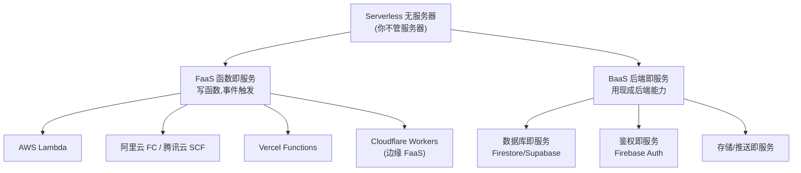
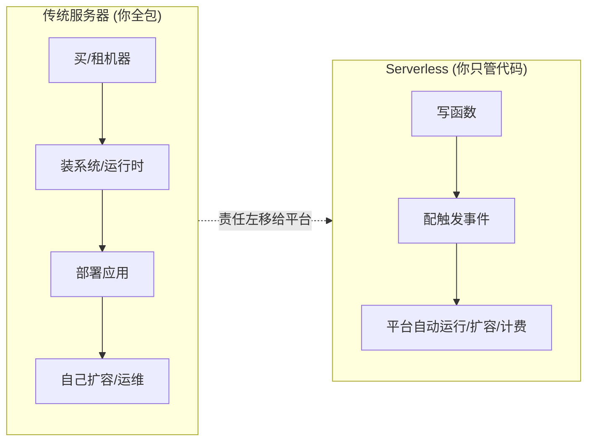

# 01 · 什么是 Serverless（无服务器 / FaaS / BaaS）

> Serverless 不是「没有服务器」，而是「你不用管服务器」。服务器还在，只是**采购、扩容、运维、闲置计费**这些活儿全交给云厂商，你只为「真正执行的那点代码」付钱。

## 📖 知识讲解

### 一、名字的误会：Serverless ≠ 没有服务器

服务器一直都在。Serverless 的真正含义是：**开发者不再关心服务器**——不装系统、不配 Nginx、不管扩容缩容、不盯 CPU 内存。你只交付代码，剩下的（在哪台机器跑、跑几份、什么时候起停）由云平台决定。

一句话对比：

| 传统方式 | Serverless |
| --- | --- |
| 你租一台服务器，7×24 开着 | 你交一段函数，用到才跑 |
| 空转也付钱 | 不用不付钱（缩容到零） |
| 流量大了要自己加机器 | 平台自动扩容（并发拉起多份） |
| 要打补丁、管系统 | 平台负责底层运维 |

### 二、Serverless 的两大支柱：FaaS + BaaS

Serverless 是个大伞，底下主要有两类：

- **FaaS（Function as a Service，函数即服务）**：你写一个个「函数」，由「事件」触发执行。代表：AWS Lambda、阿里云函数计算 FC、腾讯云 SCF、Vercel Functions、Cloudflare Workers。这是本工程的主线。
- **BaaS（Backend as a Service，后端即服务）**：连函数都不写，直接用厂商现成的后端能力——数据库、鉴权、存储、推送。代表：Firebase、Supabase、云开发。见模块 07。

真实项目常常两者混用：前端 + BaaS（数据库/鉴权）+ 少量 FaaS（处理定制逻辑）。

### 三、FaaS 的本质：把「服务」拆成「函数」

传统后端是一个**长期运行的进程**（`app.listen(3000)`），一直等着请求。FaaS 把它拆开：

- 你只写「收到请求后做什么」这段**处理函数（handler）**；
- 平台维护一个**事件路由 + 运行时**，事件来了才把你的函数拉起来跑一次，跑完可能就把环境回收；
- 你**从不写** `listen`、不管端口、不管进程常驻。

这带来两个根本特性：**按调用计费** 和 **自动弹性伸缩（含缩容到零）**。

### 四、云厂商全景（对照官方）

| 平台 | 类型 | 触发模型 | 运行时特点 |
| --- | --- | --- | --- |
| AWS Lambda | FaaS | 200+ 事件源 | 容器/MicroVM，Firecracker 隔离 |
| 阿里云函数计算 FC | FaaS | HTTP/OSS/定时/MNS | 容器化运行时 |
| 腾讯云 SCF | FaaS | API 网关/COS/定时 | 容器化运行时 |
| Vercel Functions | FaaS | HTTP（前端框架集成） | Node 运行时 + 边缘运行时 |
| Cloudflare Workers | FaaS（边缘） | HTTP（全球边缘） | V8 isolate，冷启动近零 |
| Firebase / Supabase | BaaS | SDK 直连 | 数据库/鉴权/存储即服务 |

## 🔄 流程图 / 原理图

Serverless 的概念版图（伞形结构）：



从「传统服务器」到「Serverless」，运维责任的转移：



## 💻 代码说明

本模块是概念入门，代码在后续模块。先记住 FaaS 函数的「样子」——没有 `listen`，只有一个导出的 handler：

```js
// 传统后端：一个常驻进程
// app.listen(3000)  ← Serverless 里你永远不写这行

// FaaS：只写「收到事件做什么」
exports.handler = async (event, context) => {
  return { message: 'Hello Serverless' };
};
```

`event` 是「谁触发了我、带了什么数据」，`context` 是平台注入的运行上下文。就这么简单——这正是 03 模块要跑的第一个云函数。

## ▶️ 运行方式

本模块为概念讲解，无需运行。想立刻上手看下一模块：

```bash
# 需要 Node.js 18+
node ../03-cloud-function-basic/invoke.js 你的名字
```

## ⚠️ 常见坑 / 最佳实践

- **别被名字骗了**：Serverless 有服务器，只是你不管它。
- **FaaS 函数是无状态的**：不要用全局变量在两次调用间存数据（下次可能是全新环境）。
- **不是万能银弹**：长连接、超长任务、超高频常驻负载，Serverless 未必划算或合适（见 08）。
- **FaaS 与 BaaS 常配合使用**：不要以为选了 Serverless 就只能用一种。

## 🔗 官方文档

- AWS Lambda 是什么：https://docs.aws.amazon.com/lambda/latest/dg/welcome.html
- Vercel Functions：https://vercel.com/docs/functions
- Cloudflare Workers：https://developers.cloudflare.com/workers/
- 阿里云函数计算 FC：https://help.aliyun.com/product/50980.html
- 腾讯云 SCF：https://cloud.tencent.com/product/scf
