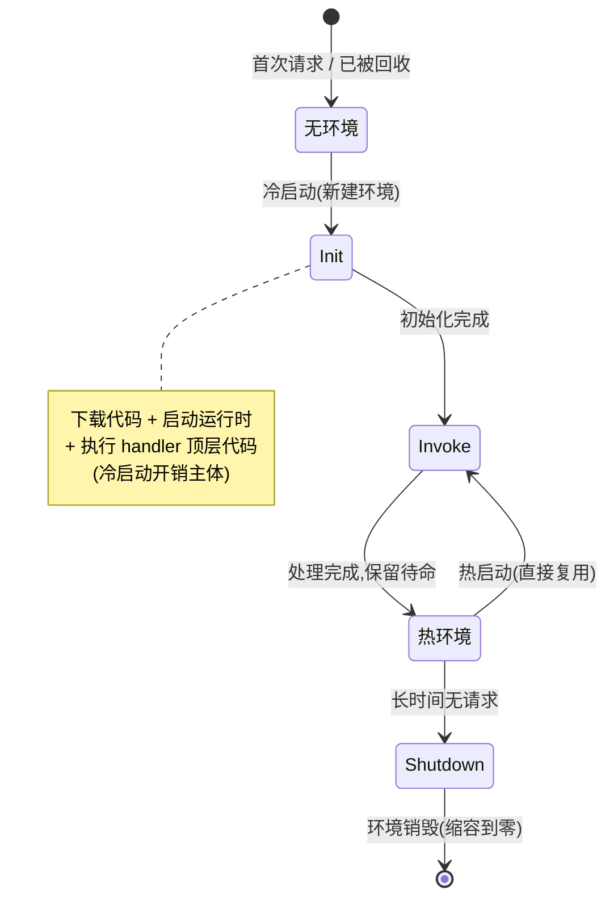
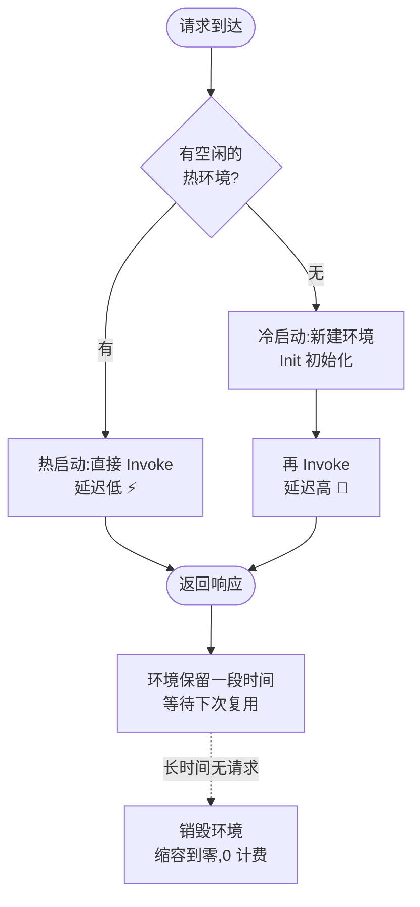

# 02 · FaaS 生命周期与冷启动（Lifecycle & Cold Start）

> 函数不用时被销毁、用时才拉起——这是 Serverless 省钱的根，也是「冷启动」延迟的源。搞懂执行环境的 **Init → Invoke → Shutdown** 三段生命周期，就能解释「为什么第一次请求特别慢」以及怎么优化它。

## 📖 知识讲解

### 一、执行环境（Execution Environment）：函数的「临时住所」

云平台不会为你的函数常备一台机器。它维护一个**执行环境**（AWS 用 Firecracker MicroVM 隔离，阿里云/腾讯云用容器）：

- 有请求来 → 若没有可用环境，**新建一个**（下载代码、启动运行时、跑初始化）——这就是**冷启动**；
- 请求处理完 → 环境**不立即销毁**，保留一段时间等下一个请求——下一个请求直接复用，叫**热启动**；
- 长时间没请求 → 平台**销毁**环境，回收资源（此时缩容到零，不计费）。

### 二、生命周期三阶段（对照 AWS Lambda 官方模型）

一个执行环境的一生分三段：

1. **Init（初始化）**：只在冷启动时发生一次。
   - 下载/解压你的代码包；
   - 启动语言运行时（Node/Python…）；
   - 执行 handler **文件顶层的代码**（require 依赖、建数据库连接池、读配置）。
   - 这一段的耗时就是**冷启动开销**的主体。
2. **Invoke（调用）**：每次请求都发生。
   - 平台调用你的 `handler(event, context)`；
   - 同一环境**一次只处理一个请求**（AWS Lambda Functions 约定），并发靠多开环境。
3. **Shutdown（关闭）**：环境被回收前。
   - 平台发关闭信号，你可做收尾（关连接）。

**关键推论**：写在 handler **外面（顶层）** 的代码，冷启动跑一次、之后复用；写在 handler **里面** 的代码，每次调用都跑。所以「建连接、加载大模型、读配置」要放顶层。

### 三、冷启动 vs 热启动

| | 冷启动（Cold Start） | 热启动（Warm Start） |
| --- | --- | --- |
| 何时发生 | 无可用环境（首次/扩容/长时间空闲后） | 复用已存在的环境 |
| 要做的事 | 建环境 + Init + Invoke | 直接 Invoke |
| 延迟 | 高（几十 ms ~ 数秒） | 低（~ 原生） |
| 影响因素 | 包体积、依赖数量、语言运行时、内存规格、是否 VPC | 几乎无额外开销 |

冷启动时长的主要影响因素：**代码包越大越慢**、**依赖越多越慢**、**内存配得越小 CPU 越弱越慢**、**接入 VPC 需配网卡更慢**。语言上通常 JS/Python 冷启动较快，JVM/.NET 较重。

### 四、缓解冷启动的常见手段

- **预留并发 / 预热（Provisioned Concurrency）**：让平台提前备好一批「热」环境。
- **减小包体积**：Tree-shaking、去掉没用的依赖、按需引入。
- **顶层复用连接**：数据库连接、SDK 客户端放 handler 外，复用到下次调用。
- **选轻运行时 / 边缘运行时**：Cloudflare Workers 用 V8 isolate，冷启动近零（见 06）。
- **定时保活**：定时器每隔几分钟打一次，维持环境存活（土办法）。

## 🔄 流程图 / 原理图

执行环境的状态流转（生命周期）：



一次请求命中冷 / 热的判定与耗时对比：



## 💻 代码说明

顶层 vs handler 内，决定了什么代码只在冷启动跑一次：

```js
// ↓↓↓ 顶层代码：冷启动 Init 阶段执行一次，之后热调用复用 ↓↓↓
const db = connectDatabase();        // 建连接池,复用!
const config = loadHeavyConfig();    // 重初始化,只做一次

exports.handler = async (event, context) => {
  // ↓↓↓ 每次调用都执行 ↓↓↓
  const rows = await db.query(...);  // 复用上面的连接,不重连
  return { rows };
};
```

把 `connectDatabase()` 放进 handler 里面，就会**每次请求都重连**，既慢又可能打爆数据库连接数——这是新手最常见的性能坑。

## ▶️ 运行方式

本模块为原理讲解。可结合 03 模块观察「同一环境复用」：多次调用时 `context.requestId` 每次不同，但顶层日志只在首次打印。

```bash
node ../03-cloud-function-basic/invoke.js
```

## ⚠️ 常见坑 / 最佳实践

- **重初始化写进 handler 里**：每次调用重连数据库，慢且危险。→ 放顶层。
- **误以为全局变量能持久存数据**：只是「碰巧复用同一环境时」还在，环境一销毁就没了，不可靠。
- **包体积失控**：把整个 SDK、无用依赖打进去，冷启动被拖慢。
- **忽视并发模型**：一个环境一次一个请求，突发流量会触发大量并发冷启动。
- **VPC 冷启动更重**：需要就权衡是否真的要进 VPC。

## 🔗 官方文档

- Lambda 执行环境生命周期：https://docs.aws.amazon.com/lambda/latest/dg/lambda-runtime-environment.html
- Lambda 冷启动与预留并发：https://docs.aws.amazon.com/lambda/latest/dg/provisioned-concurrency.html
- Vercel 函数生命周期（Fluid compute 降冷启动）：https://vercel.com/docs/fluid-compute
