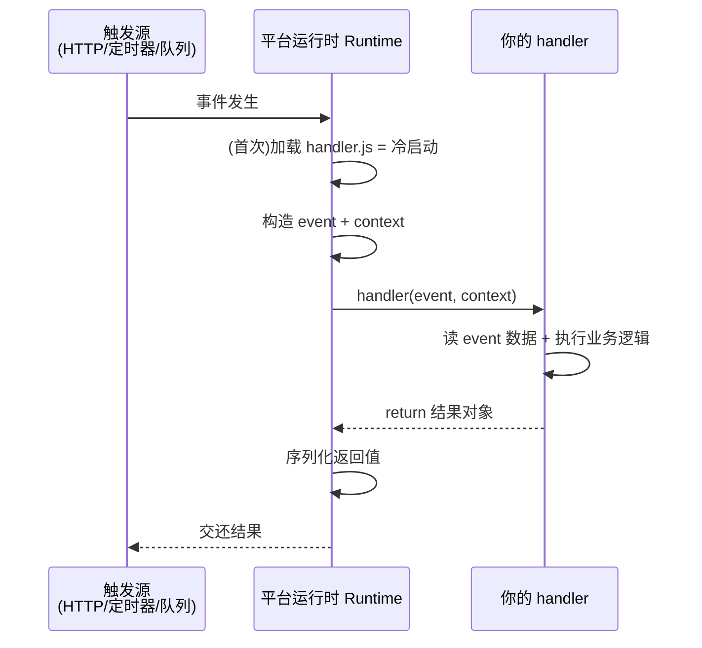
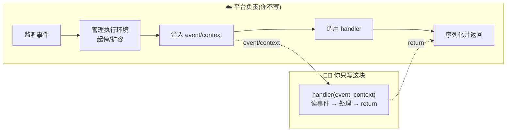

# 03 · 云函数入门（Cloud Function Basic）

> 亲手跑通人生第一个云函数：不写 `app.listen`、不管端口，只导出一个 `handler(event, context)`，由「运行时」在事件到来时调用它。本模块用几十行零依赖 Node 代码，把云平台的运行时「演」出来。

## 📖 知识讲解

### 一、云函数长什么样：只有一个 handler

传统后端是一个**常驻进程**，`app.listen(3000)` 后一直等请求。云函数把这层全删掉，你只写「收到事件后做什么」：

```js
exports.handler = async (event, context) => { ... };
```

- **`event`**：触发这次调用的**事件对象**——谁触发我、带了什么数据。HTTP 网关触发时它是请求信息，定时器触发时它是时间信息，对象存储触发时它是文件信息，结构因触发源而异。
- **`context`**：平台注入的**运行上下文**——请求 ID、函数名、内存上限、剩余可执行时间等。
- **返回值**：函数输出，平台序列化后交还给触发方。

这个 `(event, context) => result` 的签名是 AWS Lambda、阿里云 FC、腾讯云 SCF 的**通用心智模型**，各家字段略有差异但形状一致。

### 二、谁来调用 handler：运行时（Runtime）

你导出了 handler，但**从不自己调用它**。真正调用它的是平台的**运行时（Runtime）**，它做四件事：

1. 加载你的 `handler.js`（**首次加载 = 冷启动**，见 02）；
2. 构造 `event` 和 `context`；
3. 调用 `handler(event, context)`；
4. 拿到返回值，序列化后返回给触发方。

本模块的 `invoke.js` 就是把这 4 步用 Node 代码手写出来，**本地零成本模拟云运行时**。理解了它，你就理解了「你的代码」与「平台」之间的分工线在哪。

### 三、函数是无状态的（Stateless）

同一段代码可能这次跑在环境 A、下次跑在环境 B（平台随时新建/销毁执行环境）。所以：

- **不要**用全局变量在两次调用间「存业务数据」（购物车、会话），下次调用可能是全新环境，数据没了；
- 需要跨调用持久的数据，一律放**外部存储**（数据库、缓存、对象存储）；
- 顶层变量可用于**复用连接/客户端**（碰巧同环境时能省一次初始化），但不能当作可靠存储——这是「优化」不是「保证」。

## 🔄 流程图 / 原理图

运行时调用一个云函数的时序：



你写的代码 vs 平台负责的部分（分工线）：



## 💻 代码说明

**`handler.js`** —— 你的云函数，读 `event.name`、打日志、返回问候对象：

```js
exports.handler = async (event, context) => {
  const name = (event && event.name) || 'Serverless';       // 从事件取数据
  console.log('[handler] requestId =', context.requestId);   // context 由平台注入
  return { message: `Hello, ${name}!`, invokedBy: context.requestId };
};
```

**`invoke.js`** —— 手写的「运行时」，模拟平台调用 handler 的完整 4 步：

```js
const { handler } = require('./handler');
async function runtime() {
  const event = { name: process.argv[2] || 'Serverless', source: 'local-invoke' }; // ①造事件
  const context = { requestId: crypto.randomUUID(), memoryLimitInMB: 128, /* ... */ }; // ②造上下文
  const result = await handler(event, context);   // ③调用你的函数
  console.log(JSON.stringify(result, null, 2));    // ④输出结果
}
```

**`event.json`** —— 一个静态事件样例，说明「事件对象因触发源而异」。真实平台上事件由触发源自动生成，结构各不相同。

## ▶️ 运行方式

需要 Node.js 18+，零依赖：

```bash
cd 03-cloud-function-basic
node invoke.js            # 默认 name=Serverless
node invoke.js 张三        # 命令行传入 name
```

观察输出里的 `requestId` 每次都不同——正如真实平台每次调用都会给一个新请求 ID。

## ⚠️ 常见坑 / 最佳实践

- **想写 `app.listen`**：云函数没有端口、没有常驻进程，写了也没用。只导出 handler。
- **把状态存全局变量当会话用**：函数无状态，跨调用要靠外部存储。
- **忘记 handler 是 async**：涉及 IO（读库、调 API）务必 `async/await`，否则函数可能在异步完成前就返回了。
- **`event` 结构想当然**：不同触发源事件结构完全不同，用之前先 `console.log(event)` 看清楚。
- **返回值不可序列化**：返回值会被 JSON 序列化，别返回函数、循环引用、`undefined`。

## 🔗 官方文档

- AWS Lambda 编程模型（handler）：https://docs.aws.amazon.com/lambda/latest/dg/nodejs-handler.html
- AWS Lambda context 对象：https://docs.aws.amazon.com/lambda/latest/dg/nodejs-context.html
- 阿里云函数计算 事件与上下文：https://help.aliyun.com/zh/functioncompute/
- 腾讯云 SCF 函数入口：https://cloud.tencent.com/document/product/583/9210
