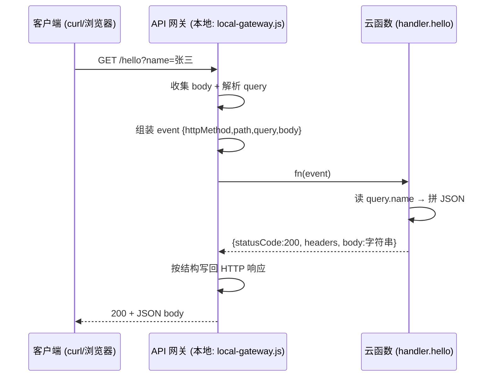
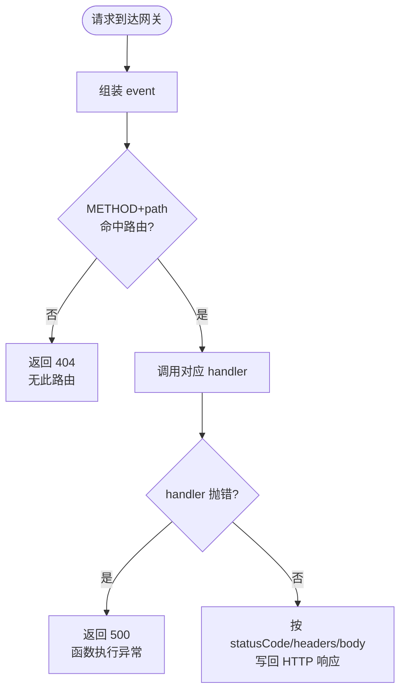

# 04 · 用云函数写 HTTP API（API with Serverless）

> 云函数不自己 `listen` 端口。要对外提供 HTTP 接口，靠的是「API 网关」把 HTTP 请求**翻译**成 `event` 喂给函数，再把函数返回的 `{ statusCode, headers, body }` **翻译**回 HTTP 响应。本模块零依赖手写这个网关，讲透「函数 ⇄ HTTP」的契约。

## 📖 知识讲解

### 一、函数不 listen，那 HTTP 请求怎么进来？

普通 Node 服务自己监听端口。云函数没有端口，中间隔着一层 **API 网关（API Gateway）**：

```
浏览器 → API 网关 →（翻译成 event）→ 云函数 →（返回结构化对象）→ API 网关 →（翻译成 HTTP）→ 浏览器
```

网关负责监听域名/端口、TLS、路由、限流、鉴权，然后把每个请求打包成一个事件对象交给函数。函数只管「拿到 event，返回一个约定结构」。

### 二、函数 ⇄ HTTP 的契约（AWS proxy 集成风格）

以 AWS API Gateway 的 **proxy 集成** 为例（业界事实标准，本模块采用同款）：

**入参 event**（网关把 HTTP 请求翻译成）：

```js
event = {
  httpMethod,              // 'GET' / 'POST' ...
  path,                    // '/hello'
  headers,                 // 请求头对象
  queryStringParameters,   // ?name=张三 → { name: '张三' }
  body,                    // 请求体「字符串」（POST 时；需自己 JSON.parse）
}
```

**返回值**（函数返回，网关翻译成 HTTP 响应）：

```js
return {
  statusCode: 200,                                  // HTTP 状态码
  headers: { 'Content-Type': 'application/json' },  // 响应头
  body: JSON.stringify({ ... }),                    // 响应体「必须是字符串」
}
```

**两个最容易踩的点**：入参 `body` 是**字符串**（要 `JSON.parse`），返回 `body` 也**必须是字符串**（要 `JSON.stringify`）——网关不替你做序列化。

### 三、契约带来的红利：同一段业务代码，本地/云上都能跑

因为函数只依赖「event 进、结构化对象出」这个契约，不依赖具体谁调用它，所以：

- 云上：AWS API Gateway 调它；
- 本地：我们手写的 `local-gateway.js` 也能调它（构造同样形状的 event）。

一份 `handler.js` 两处复用，**本地开发零成本**——这正是理解 Serverless 可测试性的关键。

## 🔄 流程图 / 原理图

一次 HTTP 请求经过网关到达云函数再返回的时序：



网关的路由与错误处理逻辑：



## 💻 代码说明

**`handler.js`** —— 两个业务函数，严格遵守 proxy 契约：

```js
// GET /hello?name=xxx
exports.hello = async (event) => {
  const name = (event.queryStringParameters && event.queryStringParameters.name) || 'world';
  return { statusCode: 200, headers: {...}, body: JSON.stringify({ message: `Hello, ${name}!` }) };
};

// POST /echo —— 注意 event.body 是字符串，要 JSON.parse；解析失败返回 400
exports.echo = async (event) => {
  let payload = {};
  try { payload = event.body ? JSON.parse(event.body) : {}; }
  catch (e) { return { statusCode: 400, headers: {...}, body: JSON.stringify({ error: 'body 必须是合法 JSON' }) }; }
  return { statusCode: 200, headers: {...}, body: JSON.stringify({ youSent: payload }) };
};
```

**`local-gateway.js`** —— 零依赖手写网关（纯 `http` 模块）：

1. 收集请求体 chunks；
2. 把 HTTP 请求**翻译成 event**（proxy 风格）；
3. 用 `METHOD path` 查极简路由表找到对应 handler；
4. 调用函数，把返回的 `{statusCode, headers, body}` **翻译回 HTTP 响应**；
5. 函数抛错 → 返回 500（真实平台亦然）。

## ▶️ 运行方式

需要 Node.js 18+，零依赖：

```bash
cd 04-api-with-serverless
node local-gateway.js
# 另开一个终端：
curl "http://localhost:3000/hello?name=张三"
curl -X POST http://localhost:3000/echo -d '{"a":1,"b":2}'
curl "http://localhost:3000/nope"          # 观察 404
curl -X POST http://localhost:3000/echo -d '不是JSON'   # 观察 400
```

## ⚠️ 常见坑 / 最佳实践

- **忘记 `JSON.parse(event.body)`**：POST body 是字符串，直接当对象用会报错。
- **返回 `body` 传了对象**：`body` 必须是字符串，忘了 `JSON.stringify` 网关会报错或返回 `[object Object]`。
- **漏设 `Content-Type` / CORS 头**：前端跨域调用要在 `headers` 里加 CORS 相关头。
- **状态码硬编码 200**：错误场景应返回对应状态码（400/404/500），别一律 200 再在 body 里塞 error。
- **把网关逻辑写进业务函数**：路由、鉴权、限流交给网关，函数专注业务，才能云上/本地复用。

## 🔗 官方文档

- AWS API Gateway + Lambda proxy 集成：https://docs.aws.amazon.com/apigateway/latest/developerguide/set-up-lambda-proxy-integrations.html
- Lambda 处理 HTTP 事件的输入输出格式：https://docs.aws.amazon.com/apigateway/latest/developerguide/http-api-develop-integrations-lambda.html
- Vercel Functions（HTTP 处理）：https://vercel.com/docs/functions
- 阿里云 FC HTTP 触发器：https://help.aliyun.com/zh/functioncompute/
