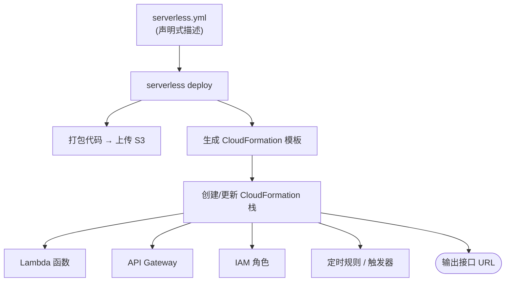
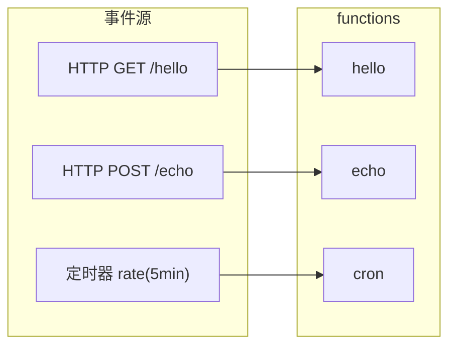

# 05 · Serverless Framework（一份 YAML 描述整套服务）

> 手动在云控制台点 Lambda、配 API Gateway、建 IAM 角色，既繁琐又不可复现。**Serverless Framework** 用一份 `serverless.yml` 声明「有哪些函数、被什么事件触发、要什么资源」，`serverless deploy` 一键把它翻译成云上基础设施（在 AWS 上即 CloudFormation 栈）。这就是 Serverless 世界的「基础设施即代码（IaC）」。

## 📖 知识讲解

### 一、为什么需要框架

只写 handler 只是第一步。要上生产，你还得：配置 API 网关路由、绑定触发器、建 IAM 权限、设环境变量、分环境（dev/prod）、打包上传、回滚……手动点控制台**不可复现、易出错、无法进版本库**。

Serverless Framework 把这些全部**声明式**地写进一个 YAML，代码进 Git，部署可复现、可回滚、可 code review。这就是 **IaC（Infrastructure as Code）** 的价值。

### 二、`serverless.yml` 五个核心块

```yaml
service: serverless-framework-demo   # ① 服务名 = 一次可独立部署的单元
frameworkVersion: '3'                # ② 锁框架大版本
provider:                            # ③ 云厂商 + 运行环境公共配置
  name: aws
  runtime: nodejs18.x
  region: ap-southeast-1
  memorySize: 128
  timeout: 10
  environment: { STAGE: dev }
functions:                           # ④ 本服务的函数 + 各自触发事件
  hello:
    handler: src/handler.hello       # 文件路径.导出名
    events:
      - httpApi: { path: /hello, method: get }
  cron:
    handler: src/handler.cron
    events:
      - schedule: rate(5 minutes)    # 定时触发,展示事件驱动的另一面
plugins:                             # ⑤ 插件,扩展能力
  - serverless-offline               #    本地模拟网关
```

- **service**：一组函数 + 资源的部署单元；
- **provider**：目标云、运行时、地域、默认内存/超时、公共环境变量；
- **functions**：每个函数的入口（`文件.导出名`）与**触发事件**（`httpApi` / `schedule` / 队列 / 存储…）；
- **plugins**：如 `serverless-offline` 本地起网关、`serverless-esbuild` 打包提速。

### 三、`deploy` 背后发生了什么

`serverless deploy`（以 AWS 为例）：

1. 打包代码 → 上传到 S3；
2. 依据 `serverless.yml` **生成 CloudFormation 模板**（Lambda 函数、API Gateway、IAM 角色、CloudWatch 定时规则等）；
3. 创建/更新 **CloudFormation 栈**——由云平台原子化地把这些资源建好；
4. 输出接口 URL。

关键认知：**你写 YAML，框架生成云厂商的 IaC 模板，云平台据此创建真实资源**。一条命令背后是一整套基础设施的编排。

### 四、事件驱动：不止 HTTP

`functions.*.events` 揭示了 FaaS 的本质是**事件驱动**。除了 `httpApi`，还能被：定时器（`schedule`）、对象存储上传、消息队列、数据库变更等触发。本模块的 `cron` 函数就是定时触发——它没有 HTTP 概念，`event` 是定时器事件，也无需返回 HTTP 结构。

## 🔄 流程图 / 原理图

从 YAML 到云上资源的部署流水线：



一个 service 里事件源与函数的映射关系：



## 💻 代码说明

- **`serverless.yml`**：本模块核心，逐行中文注释了五个块与三个函数（含定时 `cron`）。
- **`src/handler.js`**：三个函数实现。`hello`/`echo` 沿用 04 的 AWS proxy 契约（因为 Framework 底层就是 Lambda）；`cron` 是定时任务，读环境变量 `process.env.STAGE`（来自 `provider.environment`），返回 `{ done: true }`。
- **`package.json`**：把常用命令封装成 npm scripts：

```json
"scripts": {
  "invoke": "serverless invoke local --function hello",  // 本地跑一次某函数
  "offline": "serverless offline",                        // 本地起网关
  "deploy": "serverless deploy",                          // 部署到云(需云凭证)
  "remove": "serverless remove"                           // 拆除整套资源
}
```

## ▶️ 运行方式

> 本模块以**配置讲解 + 命令示例**为主。真实部署需 AWS 账号与凭证，本项目**不要求 npm install / 不要求真部署**。命令仅供理解：

```bash
cd 05-serverless-framework
# 若要真跑（需自行安装依赖、配置云凭证）：
# npm install
# npx serverless offline                       # 本地起网关: http://localhost:3000
# npx serverless invoke local --function hello # 本地调用一次
# npx serverless deploy                        # 部署到 AWS(需 AWS 凭证)
# npx serverless remove                        # 拆除,避免留资源计费
```

想立刻看 handler 逻辑运行，可复用 04 的本地网关思路，或直接阅读 `src/handler.js`。

## ⚠️ 常见坑 / 最佳实践

- **部署完不 `remove`**：留着的 API Gateway / 定时器会持续占用甚至计费，练习后记得拆。
- **IAM 权限过大**：图省事给 `AdministratorAccess`，生产环境应最小权限。
- **把密钥写进 `serverless.yml` 并提交**：密钥用环境变量 / SSM 参数，别进 Git。
- **一个 service 塞几十个函数**：service 是部署单元，过大导致部署慢、变更影响面大，按业务域拆分。
- **忽略 `stage` 分环境**：dev/prod 应分 stage，避免测试流量打到生产。
- **框架大版本混用**：`frameworkVersion` 锁死，避免团队成员本地版本不一致导致部署差异。

## 🔗 官方文档

- Serverless Framework 文档：https://www.serverless.com/framework/docs
- `serverless.yml` 完整参考：https://www.serverless.com/framework/docs/providers/aws/guide/serverless.yml
- serverless-offline 插件：https://www.serverless.com/plugins/serverless-offline
- AWS CloudFormation：https://docs.aws.amazon.com/cloudformation/
