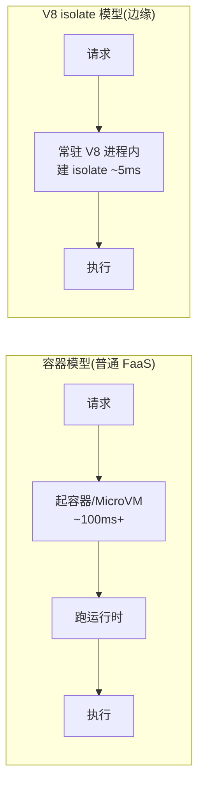

# 06 · 边缘函数（Edge Functions）

> 普通云函数跑在某个「地域（region）」的数据中心，离用户远就慢。**边缘函数**把代码分发到全球几百个 CDN 节点，在**离用户最近**的地方执行；底层用 **V8 isolate**（隔离沙箱）而非容器，冷启动近乎为零。代价是运行环境被大幅精简——不能用完整 Node API、CPU 时间和包体积都有限制。

## 📖 知识讲解

### 一、边缘 vs 普通 Serverless：位置与运行时都不同

| | 普通 Serverless 函数 | 边缘函数（Edge Function） |
| --- | --- | --- |
| 运行位置 | 某个地域（如 us-east-1）的数据中心 | 全球 300+ CDN 边缘节点，就近执行 |
| 隔离模型 | 容器 / MicroVM（一函数一环境） | **V8 isolate**（一个 V8 进程内多个轻量沙箱） |
| 冷启动 | 几十 ms ~ 数秒 | **近 0（毫秒级）** |
| 运行时 | 完整 Node.js（fs、net、全部 npm 包） | 精简 **Web 标准**（Request/Response/fetch，无 fs） |
| API 签名 | `(event, context)` | `fetch(request)` → 返回 `Response` |
| 适合 | 重逻辑、连数据库、用原生库 | 轻逻辑、低延迟、鉴权/重定向/A-B/地理定制 |

### 二、为什么边缘冷启动近零：V8 isolate

容器模型冷启动要「起一个进程/容器」，重。V8 isolate 模型（Cloudflare Workers、Vercel Edge、Deno Deploy 同源思路）不同：

- 平台维护**常驻的 V8 进程**；
- 每个 Worker 只是进程内一个**轻量隔离堆（isolate）**，创建一个 isolate 只需 ~5ms，而非起容器的几百 ms；
- 结果：冷启动近零、密度极高（一台机器跑上万个 Worker）。

代价是 isolate 里**没有完整操作系统能力**——不能读写文件系统、不能用依赖原生二进制的 npm 包、CPU 执行时间受限（毫秒级预算）、包体积受限。所以边缘函数用的是 **Web 标准 API**（浏览器里那套 `Request`/`Response`/`fetch`/`URL`），而不是 Node 的 `req`/`res`/`fs`。

### 三、Web 标准签名：从 `(event, context)` 到 `fetch(request)`

边缘函数的入口是一个 `fetch` handler，接收 Web `Request`、返回 Web `Response`：

```js
// Cloudflare Worker
export default {
  async fetch(request, env, ctx) {
    return new Response('hi', { headers: { 'content-type': 'text/plain' } });
  }
};

// Vercel Edge：用 config.runtime='edge' 开启边缘运行时
export const config = { runtime: 'edge' };
export default function handler(request) {
  return new Response('hi');
}
```

平台还会在边缘注入**地理信息**（Cloudflare 用 `cf-ipcountry` 请求头、Vercel 用 `request.geo`），让你能就近做「按国家/城市定制」的逻辑。

## 🔄 流程图 / 原理图

同一请求：普通地域函数 vs 边缘函数的路径长短：


容器模型 vs V8 isolate 模型（为何边缘冷启动近零）：



## 💻 代码说明

本模块给了三份等价实现，展示同一段边缘逻辑在不同平台的写法：

- **`cloudflare-worker.js`**：Cloudflare Workers 写法，`export default { async fetch(request, env, ctx) }`。读 `cf-ipcountry` 请求头拿访问者国家码，`env` 是绑定的环境变量/KV/R2（BaaS 能力，见 07）。
- **`vercel-edge.js`**：Vercel Edge Function 写法，靠 `export const config = { runtime: 'edge' }` 这一行把普通函数切换成边缘运行时，读 `request.geo` 拿地理信息。文件应放在 Vercel 项目的 `api/geo.js`。
- **`edge-local.js`**：零依赖本地体验。Node 18+ 已全局提供 `Request`/`Response`/`fetch`，这里写个小适配器把 Node http 请求转成 Web `Request` 交给 fetch handler，再把 Web `Response` 写回 Node——**本地就能跑边缘风格代码**。
- **`wrangler.toml`**：Cloudflare 的 CLI 工具 wrangler 的配置（函数名、入口、兼容日期）。

> 注意：前两份用平台要求的 ESM `export default` 语法，无法用 `require` 直接引入，所以 `edge-local.js` 把等价 handler 内联了一份，保证「开箱即跑」。

## ▶️ 运行方式

本地零依赖体验（Node 18+）：

```bash
cd 06-edge-functions
node edge-local.js
# 另开终端：
curl "http://localhost:3100/?name=张三"
```

真实部署（本项目**不要求安装**，命令仅供理解）：

```bash
# Cloudflare：
# npx wrangler dev       # 本地模拟边缘运行时
# npx wrangler deploy    # 推送到 Cloudflare 全球边缘
# Vercel：把 vercel-edge.js 放到 api/ 目录，vercel deploy 即得边缘接口
```

## ⚠️ 常见坑 / 最佳实践

- **在边缘用 Node API**：`fs`、`path`、依赖原生二进制的 npm 包在 isolate 里不可用，会报错。只用 Web 标准 API。
- **在边缘跑重计算 / 长任务**：CPU 时间预算是毫秒级，重活会被杀。重逻辑放普通函数或后端。
- **边缘直连传统数据库**：边缘节点分散且并发高，直连数据库易打爆连接池。用边缘友好的数据服务（HTTP/边缘数据库）或加连接池代理。
- **把大依赖打进边缘包**：包体积受限，边缘函数要小而快。
- **误以为边缘能替代一切**：边缘擅长「轻、近、快」（鉴权、重定向、A/B、地理定制、缓存改写），重业务仍需普通函数 + 数据库。

## 🔗 官方文档

- Cloudflare Workers：https://developers.cloudflare.com/workers/
- Cloudflare Workers 运行时（V8 isolate）：https://developers.cloudflare.com/workers/reference/how-workers-works/
- Vercel Edge Functions / Edge Runtime：https://vercel.com/docs/functions/runtimes/edge
- wrangler 配置：https://developers.cloudflare.com/workers/wrangler/configuration/
