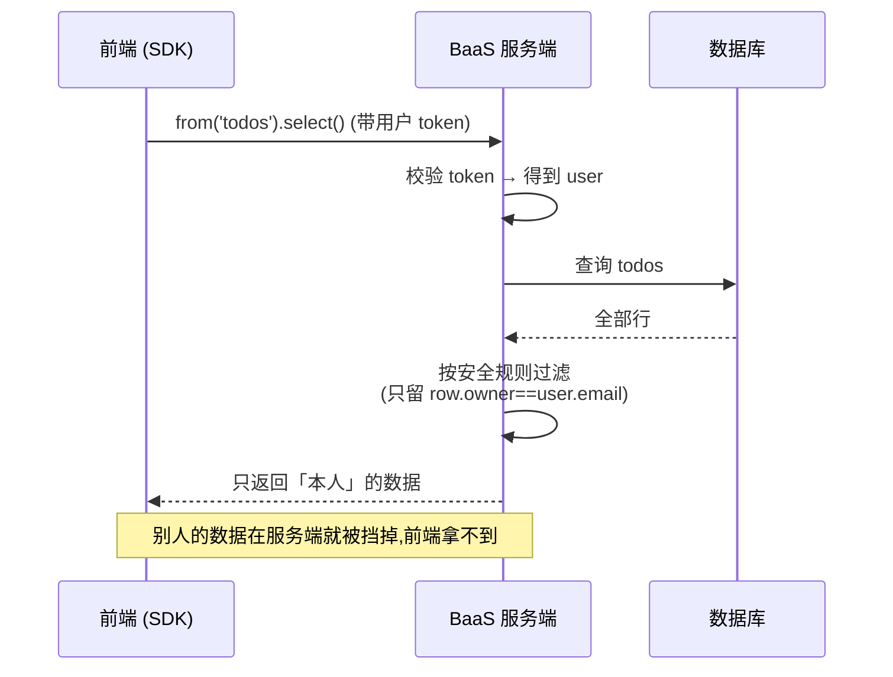

# 07 · BaaS 后端即服务（Backend as a Service）

> FaaS 让你「只写函数」，BaaS 更进一步——**连函数都不写**。数据库、鉴权、存储、实时推送，全是厂商现成的托管服务，前端直接调 SDK 读写；权限由 BaaS 用「安全规则」在服务端强制执行。代表：Firebase、Supabase、云开发。本模块用几十行内存实现「演」出 BaaS 客户端的调用手感。

## 📖 知识讲解

### 一、BaaS 是什么：把「后端」变成一项订阅服务

传统后端里你要自己：建数据库、写 CRUD 接口、做登录注册鉴权、管文件上传。BaaS 把这些都做成**开箱即用的托管服务**，你在前端直接调 SDK：

- **数据库即服务**：Firestore、Supabase（Postgres）——前端 `db.from('todos').select()` 直接读库；
- **鉴权即服务**：Firebase Auth、Supabase Auth——`auth.signUp/signIn`，一行搞定登录注册、第三方登录、JWT 签发；
- **存储即服务**：对象存储，前端直传文件；
- **实时/推送即服务**：数据变更实时推到客户端。

开发者几乎**不写服务端代码**，一个前端工程师就能独立做出带登录、带数据库的完整应用。

### 二、前端直连数据库，安全靠什么？——安全规则

「前端直接读写数据库」听起来危险：那我不是能读别人的数据、改任意字段？BaaS 的答案是**安全规则（Security Rules / Row Level Security）**——权限校验不在客户端，而在 **BaaS 服务端**强制执行：

- 你声明规则：如「只有 `row.owner === 当前用户.email` 才能读写这条 todo」；
- 每次 SDK 请求到达 BaaS，服务端**先按规则过滤/校验**，再返回；
- 客户端就算改了本地代码，也拿不到规则不允许的数据——**规则在服务端，客户端绕不过**。

Firebase 用 Security Rules（DSL），Supabase 用 Postgres 的 **RLS（Row Level Security）** 策略。心智一样：**权限下沉到数据层，服务端强制。**

### 三、BaaS 与 FaaS 的关系：互补，常一起用

- **BaaS** 覆盖标准能力（存数据、登录、传文件）——不用写代码；
- **FaaS** 补定制逻辑（复杂业务、第三方对接、Webhook、支付回调）——写少量函数。

典型现代架构：**前端 + BaaS（数据库/鉴权/存储）+ 少量 FaaS（定制逻辑）**，几乎无传统「后端服务器」。这也是「Serverless 全栈」最常见的落地形态。

## 🔄 流程图 / 原理图

传统后端 vs BaaS 架构对比：

```mermaid
graph TB
    subgraph 传统["传统后端(自己全写)"]
        A1["前端"] --> A2["自建 API 服务器"]
        A2 --> A3["自己写鉴权"]
        A2 --> A4["自己写 CRUD"]
        A4 --> A5[("自己运维的数据库")]
    end
    subgraph baas["BaaS(直连托管服务)"]
        B1["前端 SDK"] -->|signIn| B2["Auth 即服务"]
        B1 -->|from().select| B3["DB 即服务<br/>+ 安全规则"]
        B1 -->|upload| B4["存储即服务"]
        B3 --> B5[("托管数据库")]
    end
```

一次「前端直连数据库」请求如何被安全规则拦截：



## 💻 代码说明

`baas-demo.js` 用一个 `MockBaaS` 类模拟厂商在云端提供的后端能力，纯内存、零依赖：

```js
class MockBaaS {
  auth = {
    signUp: ({ email, password }) => { /* 注册,返回 user + token */ },
    signIn: ({ email, password }) => { /* 登录校验,返回 user + token */ },
  };
  from(table) {
    return {
      insert: (row, user) => { this.tables[table].push(row); return row; },
      // 读取时在「服务端」按安全规则过滤,前端拿不到别人的数据
      select: (user) => this.tables[table].filter((r) => this.rules[table](r, user)),
    };
  }
}
```

安全规则声明为 `todos: (row, user) => row.owner === user.email`。前端代码只调 SDK（`signUp` → `signIn` → `from('todos').insert/select`），写入了 `a@x.com` 和 `b@x.com` 两条数据，但用 `a@x.com` 登录后 `select` **只返回自己那条**——`b@x.com` 的数据被安全规则在「服务端」挡掉了。这就是 BaaS「前端直连库仍然安全」的核心机制。

## ▶️ 运行方式

需要 Node.js 18+，零依赖：

```bash
cd 07-baas
node baas-demo.js
```

观察输出：登录成功后，`我能看到的 todos` 只含 `a@x.com` 的那条，验证了安全规则的服务端过滤。

## ⚠️ 常见坑 / 最佳实践

- **把权限校验写在前端**：客户端代码可被篡改，权限必须放 BaaS 安全规则 / RLS，服务端强制。
- **安全规则默认全开**：新建项目常是「允许所有读写」的测试规则，上线前务必收紧，否则数据裸奔。
- **把私密 key 当公开 key 用**：BaaS 分「公开 anon key（受规则约束，可放前端）」和「service role key（绕过规则，只能放服务端）」，后者绝不能进前端包。
- **厂商锁定（vendor lock-in）**：BaaS 深度绑定厂商 API，迁移成本高，选型要慎重（Supabase 基于开源 Postgres，可迁移性较好）。
- **复杂事务/聚合**：BaaS 直连适合简单读写，复杂事务、跨表聚合、敏感逻辑仍建议走 FaaS/后端。

## 🔗 官方文档

- Firebase（BaaS 平台）：https://firebase.google.com/docs
- Firebase Security Rules：https://firebase.google.com/docs/rules
- Supabase：https://supabase.com/docs
- Supabase Row Level Security：https://supabase.com/docs/guides/database/postgres/row-level-security
