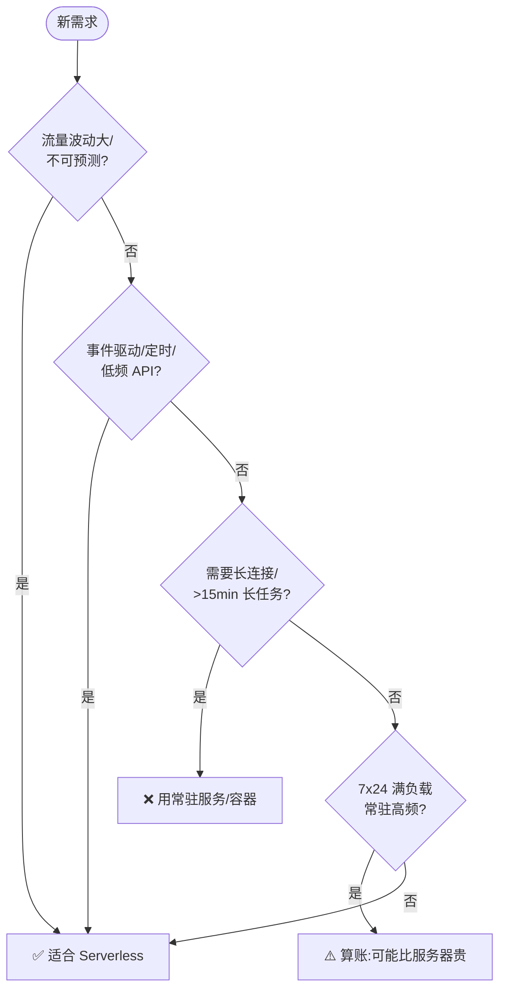
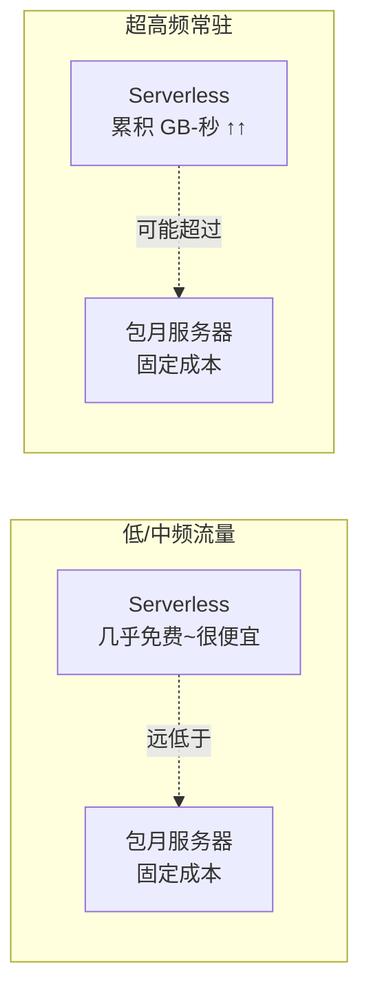

# 08 · 适用场景 · 计费模型 · 局限（Use Cases, Cost & Limits）

> Serverless 不是银弹。它在「流量波动大、事件驱动、想省运维」的场景光芒万丈，也在「长连接、超长任务、超高频常驻」的场景水土不服。本模块用一个可运行的**计费计算器**讲透 FaaS 的按量计费模型，并厘清它的适用边界与硬性限制。

## 📖 知识讲解

### 一、FaaS 的计费模型：为「真正执行的那点时间」付钱

以 AWS Lambda 为例，账单由两部分构成（对照官方定价）：

1. **请求数**：按调用次数计费（约每 100 万次 $0.20）；
2. **计算时长**：按 **GB-秒** 计费 = 分配内存(GB) × 运行时长(秒) × 调用次数。

再叠加每月**免费额度**（如 100 万次请求 + 40 万 GB-秒）。核心公式：

```
月费 = max(0, 调用数 - 免费请求) × 单价
     + max(0, GB秒 - 免费GB秒) × GB秒单价
```

**关键直觉**：
- **无请求 → 缩容到零 → 0 费用**（传统服务器空转也要付整月钱）；
- **内存翻倍 → 单价翻倍，但 CPU 也翻倍** → 可能跑得更快、总 GB-秒反而下降，账单未必涨（值得实测调优）；
- 计费**粒度极细**（毫秒级），真正做到「用多少付多少」。

### 二、什么时候用 Serverless（适用场景）

| 场景 | 为什么适合 |
| --- | --- |
| 流量**波动大 / 不可预测** | 自动弹性伸缩，波峰自动扩、波谷缩到零，不用为峰值常备机器 |
| **事件驱动**任务 | 文件上传处理、消息队列消费、定时任务，天然事件触发 |
| **API / BFF / Webhook** | 接口按调用计费，低频接口几乎免费 |
| **前端全栈**（配 BaaS） | 前端 + BaaS + 少量 FaaS，无需运维后端 |
| **快速试错 / MVP** | 零运维、按量付费，冷启动几分钟上线 |
| 突发/定时的**批处理** | 用完即走，不占常驻资源 |

### 三、什么时候别用（局限与硬限制）

| 局限 | 说明 |
| --- | --- |
| **冷启动延迟** | 首次/扩容有冷启动（见 02），对延迟极敏感的场景需预留并发或换边缘 |
| **执行时长上限** | 单次有超时上限（如 Lambda 最长 15 分钟），超长任务不适合 |
| **无法保持长连接** | 函数用完即回收，WebSocket / 长轮询等长连接需专门方案 |
| **无状态** | 不能在内存里存跨调用状态，都要靠外部存储 |
| **高频常驻负载可能更贵** | 7×24 满负载时，按量计费可能**比包月服务器还贵**（见下面临界点） |
| **供应商锁定** | 事件格式、部署方式绑定厂商，迁移有成本 |
| **可观测性 / 调试更难** | 分布式、短暂的执行环境，本地复现和排障比常驻服务复杂 |

### 四、成本临界点：Serverless 何时比服务器贵

按量付费在**低/中频**时碾压包月服务器（低频几乎免费）；但当调用极高频、函数几乎「常驻满跑」时，累积的 GB-秒费用会超过一台包月服务器的固定成本，出现**交叉点**。选型要按真实流量算账，而不是想当然。

## 🔄 流程图 / 原理图

选型决策树：这个需求该不该上 Serverless：



成本对比：按量计费 vs 包月服务器（存在交叉点）：



## 💻 代码说明

`cost-calculator.js` 实现 AWS Lambda 计费模型，支持命令行传参（次数、时长、内存）：

```js
const PRICE_PER_REQUEST = 0.20 / 1_000_000;   // 每 100 万次请求 $0.20
const PRICE_PER_GB_SECOND = 0.0000166667;     // 每 GB-秒
const FREE_REQUESTS = 1_000_000, FREE_GB_SECONDS = 400_000; // 每月免费额度

function estimate({ invocations, avgDurationMs, memoryMB }) {
  const totalGBSeconds = (memoryMB / 1024) * (avgDurationMs / 1000) * invocations;
  const billableRequests = Math.max(0, invocations - FREE_REQUESTS);      // 扣免费额度
  const billableGBSeconds = Math.max(0, totalGBSeconds - FREE_GB_SECONDS);
  return {
    requestCost: billableRequests * PRICE_PER_REQUEST,
    computeCost: billableGBSeconds * PRICE_PER_GB_SECOND,
    total: /* 两者之和 */,
  };
}
```

改传参数就能直观感受「内存/时长/次数」如何影响账单，理解 GB-秒模型。

## ▶️ 运行方式

需要 Node.js 18+，零依赖：

```bash
cd 08-use-cases-cost-limits
node cost-calculator.js                    # 默认:300万次/月,150ms,256MB
node cost-calculator.js 5000000 200 512    # 自定义:次数 时长ms 内存MB
node cost-calculator.js 100 500 128        # 低频:观察几乎 0 费用
node cost-calculator.js 500000000 300 1024 # 超高频:观察费用飙升
```

## ⚠️ 常见坑 / 最佳实践

- **想当然认为 Serverless 一定更便宜**：低频真便宜，高频常驻可能更贵，务必按真实流量算账。
- **内存配得越小越省**：不一定。内存小 CPU 弱、跑得慢，GB-秒未必低，还拖慢冷启动。适当调大反而更省更快。
- **忽视免费额度**：中小项目常年落在免费额度内，成本几乎为零。
- **长任务硬塞进函数**：超过超时上限直接被杀，长任务拆分或用 Step Functions / 队列 / 容器。
- **用 Serverless 做长连接**：WebSocket 等需专门服务，别用普通 FaaS 硬撑。
- **只看单价不看总账**：请求费 + 计算费 + 网关费 + 出网流量费 + 关联的 BaaS 费用，要看整体。

## 🔗 官方文档

- AWS Lambda 定价：https://aws.amazon.com/lambda/pricing/
- AWS Lambda 配额 / 限制：https://docs.aws.amazon.com/lambda/latest/dg/gettingstarted-limits.html
- Vercel Functions 用量与定价：https://vercel.com/docs/functions/usage-and-pricing
- Serverless 适用场景（AWS Serverless）：https://aws.amazon.com/serverless/
