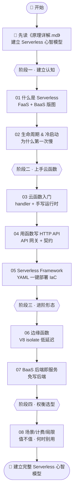
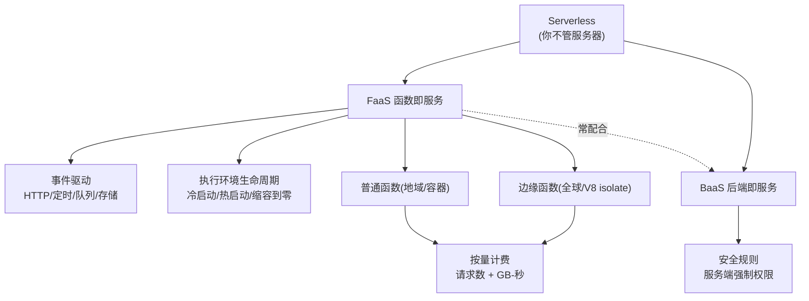

# 15 · Serverless 无服务器（FaaS / BaaS / 边缘函数）

> 「Serverless」不是没有服务器，而是**你不用管服务器**。采购、扩容、运维、闲置计费全交给云厂商，你只交付「真正执行的那点代码」，并只为它付费。本工程从「Serverless 到底是什么」讲起，带你亲手跑通云函数、用它写 HTTP API、上 Serverless Framework、玩转边缘函数与 BaaS，最后厘清计费模型与适用边界。配套一篇工程核心交付物《[原理详解.md](./原理详解.md)》，讲透 Serverless 架构本质、冷启动机制、与传统服务器/容器的对比、计费模型（多张 Mermaid 原理图）。

## 📚 这个工程讲什么

一个后端能力到底「跑在哪、由谁运维、怎么计费」，直接决定了它的**弹性、运维成本、账单和适用场景**。本工程回答四个核心问题：

1. **是什么** —— Serverless / FaaS / BaaS 到底指什么，与传统服务器、容器差在哪。
2. **怎么跑** —— 一个云函数如何被「事件」触发、被「运行时」调用；为什么第一次特别慢（冷启动）。
3. **怎么用** —— 用云函数写 HTTP API、用 Serverless Framework 一键部署、用边缘函数做低延迟、用 BaaS 免写后端。
4. **值不值** —— 按量计费模型怎么算，什么场景适合、什么场景反而更贵或不适用。

> 本工程属于**进阶层**：除每个模块的可运行 demo + README 外，工程根目录另有核心文档 **[《原理详解.md》](./原理详解.md)**。**建议先读它建立心智模型，再逐模块动手。**

技术栈与对照文档（2026-07 核对）：

| 主题 | 平台 / 工具 | 对照官方 |
| --- | --- | --- |
| FaaS 概念 / 生命周期 | AWS Lambda | docs.aws.amazon.com/lambda |
| IaC 部署 | Serverless Framework v3 | serverless.com/framework/docs |
| 前端集成函数 | Vercel Functions | vercel.com/docs/functions |
| 边缘函数 | Cloudflare Workers / Vercel Edge | developers.cloudflare.com/workers |
| BaaS | Firebase / Supabase | firebase.google.com / supabase.com |
| 运行时 | Node.js 18+ | 所有 demo 零依赖或仅示例配置 |

## 🗂 模块索引

| 模块 | 知识点 | 你将学会 | 运行方式 |
| --- | --- | --- | --- |
| [01](./01-what-is-serverless/) | 什么是 Serverless 📊 | Serverless≠无服务器、FaaS+BaaS 两大支柱、云厂商全景 | 概念讲解 |
| [02](./02-faas-lifecycle-coldstart/) | FaaS 生命周期与冷启动 📊 | 执行环境 Init/Invoke/Shutdown、冷 vs 热启动、缓解手段 | 概念讲解 |
| [03](./03-cloud-function-basic/) | 云函数入门 📊 | handler(event,context) 心智、手写运行时、无状态特性 | `node invoke.js` |
| [04](./04-api-with-serverless/) | 用云函数写 HTTP API 📊 | API 网关翻译、函数⇄HTTP 契约、本地/云上复用 | `node local-gateway.js` |
| [05](./05-serverless-framework/) | Serverless Framework 📊 | serverless.yml、IaC、deploy 背后、事件驱动 | 配置讲解 + 命令 |
| [06](./06-edge-functions/) | 边缘函数 📊 | 边缘 vs 地域、V8 isolate 冷启动近零、Web 标准签名 | `node edge-local.js` |
| [07](./07-baas/) | BaaS 后端即服务 📊 | 前端直连数据库、安全规则服务端强制、与 FaaS 互补 | `node baas-demo.js` |
| [08](./08-use-cases-cost-limits/) | 场景 / 计费 / 局限 📊 | GB-秒计费模型、适用场景、硬限制、成本临界点 | `node cost-calculator.js` |

📊 = 含重点流程图 / 原理图。更深的机制解剖见工程根目录 **[《原理详解.md》](./原理详解.md)**。

## 🗺️ 学习路线

建议按编号顺序，四个阶段：**建立心智 → 上手函数 → 进阶形态 → 权衡选型**。



核心概念之间的关系：



## ▶️ 如何运行本工程

大部分模块**零依赖**，直接用 Node.js 18+ 跑（Node 18+ 已全局提供 `fetch`/`Request`/`Response`）：

```bash
# 03 云函数入门
cd 03-cloud-function-basic && node invoke.js 张三

# 04 用函数写 API（一个终端起网关，另一个终端 curl）
cd 04-api-with-serverless && node local-gateway.js
curl "http://localhost:3000/hello?name=张三"

# 06 边缘函数（本地模拟）
cd 06-edge-functions && node edge-local.js
curl "http://localhost:3100/?name=张三"

# 07 BaaS 演示
cd 07-baas && node baas-demo.js

# 08 计费计算器
cd 08-use-cases-cost-limits && node cost-calculator.js 5000000 200 512
```

- **01、02**：纯概念讲解，读 README 即可。
- **05 Serverless Framework**：以配置讲解 + 命令示例为主，**不要求 npm install / 不要求真部署**（真部署需 AWS 账号凭证，README 里给了命令供理解）。
- **06 边缘函数**：`edge-local.js` 本地零依赖跑；`cloudflare-worker.js` / `vercel-edge.js` 是各平台真实写法示例。

> 提示：04 用 3000 端口、06 用 3100 端口，一次跑一个即可。

## 🔗 官方文档

- Serverless Framework：https://www.serverless.com/framework/docs
- AWS Lambda 开发者指南：https://docs.aws.amazon.com/lambda/latest/dg/welcome.html
- Vercel Functions：https://vercel.com/docs/functions
- Cloudflare Workers：https://developers.cloudflare.com/workers/
- Firebase / Supabase：https://firebase.google.com/docs · https://supabase.com/docs
