# Serverless 原理详解 —— 架构本质 · 冷启动机制 · 与服务器/容器对比 · 计费模型

> 这是 15 号工程的**核心交付物**。模块 README 讲「怎么用」，本文讲「how / why / 底层机制」：Serverless 的架构本质、执行环境与冷启动的内部流程、与传统服务器和容器的三方对比、按量计费的数学模型，以及常见误区。配多张 Mermaid 原理图。建议先读本文建立心智模型，再回到各模块动手。

---

## 目录

1. [架构本质：Serverless 到底「无」了什么](#一架构本质serverless-到底无了什么)
2. [执行模型：事件 → 运行时 → 函数](#二执行模型事件--运行时--函数)
3. [执行环境生命周期与冷启动机制](#三执行环境生命周期与冷启动机制)
4. [并发模型：一个环境一次一个请求](#四并发模型一个环境一次一个请求)
5. [三方对比：物理/虚机 · 容器 · Serverless](#五三方对比物理虚机--容器--serverless)
6. [边缘运行时：V8 isolate 为何冷启动近零](#六边缘运行时v8-isolate-为何冷启动近零)
7. [计费模型：GB-秒的数学](#七计费模型gb-秒的数学)
8. [FaaS + BaaS 组成的 Serverless 全栈](#八faas--baas-组成的-serverless-全栈)
9. [常见误区总清单](#九常见误区总清单)

---

## 一、架构本质：Serverless 到底「无」了什么

「Serverless」这个词有误导性——**服务器一直都在**，只是从「你的资产/责任」变成了「平台的实现细节」。它无的不是服务器，而是**你对服务器的关心**：

- **无供应（no provisioning）**：不预估容量、不买/租机器、不装系统与运行时。
- **无扩缩管理（no scaling management）**：不写扩容策略、不配负载均衡，平台按请求量自动拉起/回收实例，含**缩容到零**。
- **无闲置计费（no idle cost）**：没请求时不占资源、不付钱；传统服务器空转也要付整月。
- **无运维（no ops on infra）**：打补丁、换硬盘、保活、监控底层，平台负责。

换句话说，Serverless 把后端的**运维责任几乎全部左移给了平台**，你只保留两件事：**写函数** + **声明触发事件**。

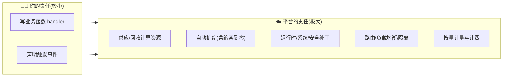

**心智公式**：传统后端 = 长期运行的进程（`app.listen`），你养着它；Serverless = 一段等待被事件唤醒的函数，平台按需唤醒它。这条从「常驻进程」到「按需函数」的转变，是理解后续一切（冷启动、无状态、按量计费）的根。

---

## 二、执行模型：事件 → 运行时 → 函数

FaaS 的执行链条有三个角色：**触发源（Event Source）→ 运行时（Runtime）→ 你的函数（Handler）**。

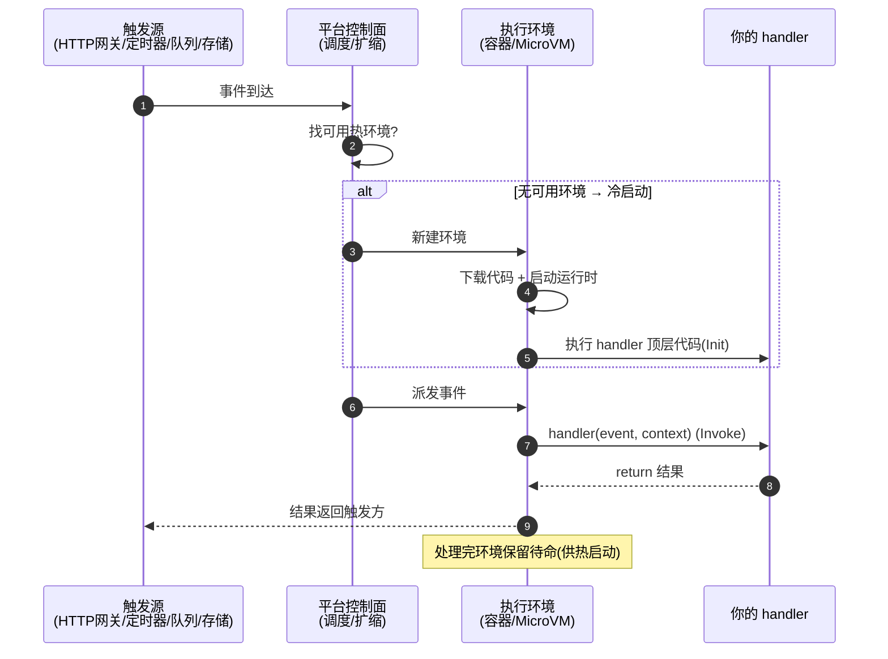

三个要点：

1. **事件驱动**：函数从不主动运行，永远是「某个事件」把它唤醒。事件源决定了 `event` 的结构（HTTP 请求 / 定时时刻 / 文件对象 / 消息体）。
2. **运行时是中间人**：你只导出 handler，是运行时负责加载它、构造 `event`/`context`、调用它、收集返回值。模块 03 的 `invoke.js` 就是手写的运行时。
3. **函数与网关解耦**：HTTP 场景下，函数不 listen 端口，API 网关把 HTTP ⇄ event/response 互译（模块 04 的契约）。正因这层解耦，同一函数本地和云上都能跑。

---

## 三、执行环境生命周期与冷启动机制

这是 Serverless 最核心、也最常被误解的机制。**执行环境（Execution Environment）** 是平台为运行你的函数临时准备的隔离沙箱（AWS 用 Firecracker MicroVM，阿里云/腾讯云用容器）。它有完整的一生：

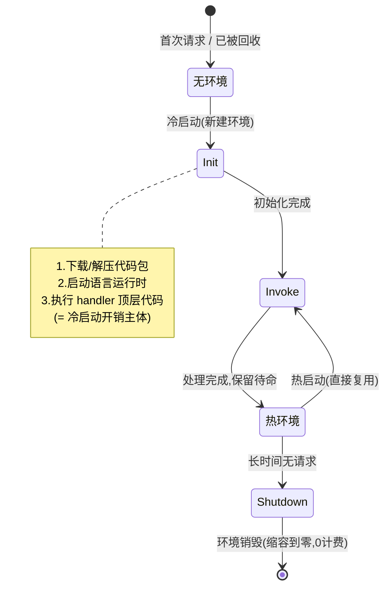

### 3.1 三个阶段（对照 AWS Lambda 官方模型）

| 阶段 | 何时 | 做什么 | 计费 |
| --- | --- | --- | --- |
| **Init 初始化** | 仅冷启动一次 | 下载代码、启动运行时、跑 handler **顶层代码**（require、建连接、读配置） | AWS 对标准初始化不单独计费，但耗时体现在冷启动延迟 |
| **Invoke 调用** | 每次请求 | 调用 `handler(event, context)` | 按执行时长计费 |
| **Shutdown 关闭** | 环境回收前 | 发关闭信号，可做收尾（关连接） | 不计费 |

### 3.2 冷启动 vs 热启动：延迟从哪来

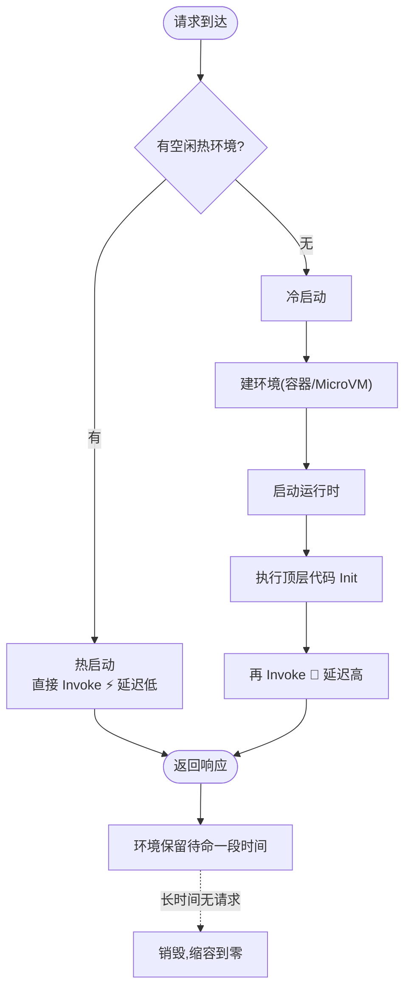

**冷启动**发生在：首次请求、并发扩容需要新环境、环境被回收后又来请求。它要「从零建环境」，延迟从几十 ms 到数秒。**热启动**复用已存在的环境，直接 Invoke，延迟接近原生。

冷启动时长的影响因素：

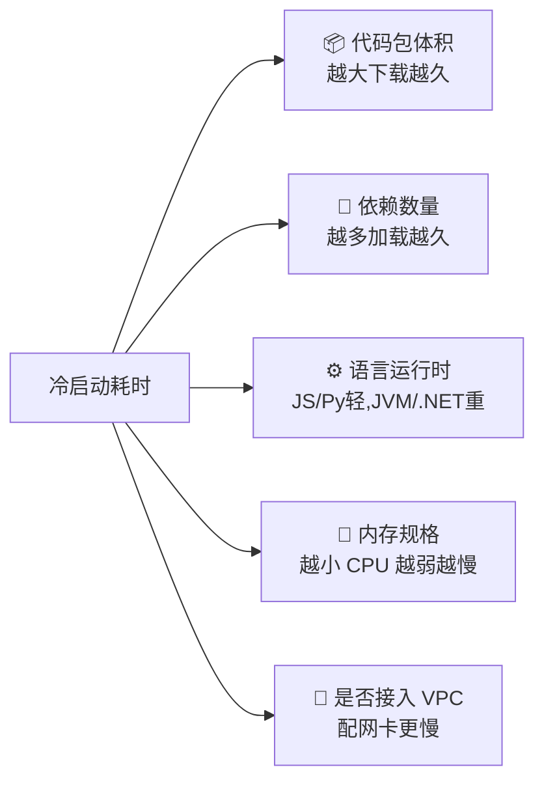

### 3.3 顶层 vs handler 内：一行之差，性能天壤

冷启动机制带来一条铁律：**放对代码位置**。

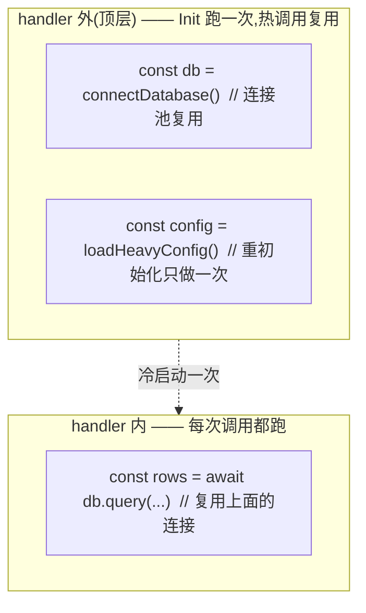

把 `connectDatabase()` 错放进 handler 里 → **每次请求都重连**，既慢又可能打爆数据库连接数。这是新手第一性能坑。

### 3.4 为什么无状态：环境不可靠地复用

顶层变量在「碰巧复用同一环境」时还在，但平台**随时可能销毁/新建**环境。所以顶层变量能用来**复用连接（优化）**，但**不能当持久存储（保证）**。跨调用要持久的数据一律进外部存储。这就是「函数无状态」的由来。

### 3.5 缓解冷启动的手段

| 手段 | 原理 |
| --- | --- |
| 预留并发 / Provisioned Concurrency | 让平台提前备好一批「热」环境待命 |
| 减小包体积 | Tree-shaking、去无用依赖、按需引入，缩短 Init 下载/加载 |
| 顶层复用连接 | 数据库/SDK 客户端放顶层，避免每次重建 |
| 选轻运行时 / 边缘 | JS/Python 比 JVM 轻；边缘 V8 isolate 冷启动近零（见第六节） |
| 定时保活 | 定时器每隔几分钟打一次维持环境存活（土办法，不推荐生产） |

---

## 四、并发模型：一个环境一次一个请求

一条常被忽略、却决定扩容行为的规则：**一个执行环境同一时刻只处理一个请求**（AWS Lambda 约定）。并发不是靠单环境多线程，而是靠**多开环境**。

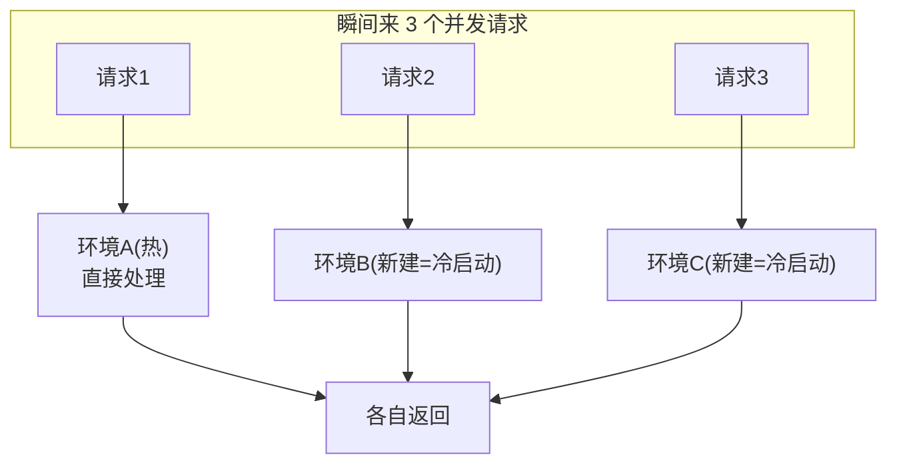

推论：

- **突发流量 = 一批并发冷启动**。原本 1 个热环境，突然来 100 个并发，平台要临时拉起 ~99 个新环境，这 99 个都要经历冷启动 → 突发时延迟毛刺明显。
- **弹性的粒度是「实例」**：每多一个并发就多一个实例，因此扩容平滑但冷启动是扩容的固有代价。
- **数据库连接数会被放大**：100 个并发实例各建一个连接 → 100 个连接，容易打爆传统数据库。故 Serverless 常配连接池代理（如 RDS Proxy）或 HTTP 型数据库。

---

## 五、三方对比：物理/虚机 · 容器 · Serverless

理解 Serverless 最好的方式是把它放进「计算抽象的演进」里看。每一层都把更多运维责任交给平台。

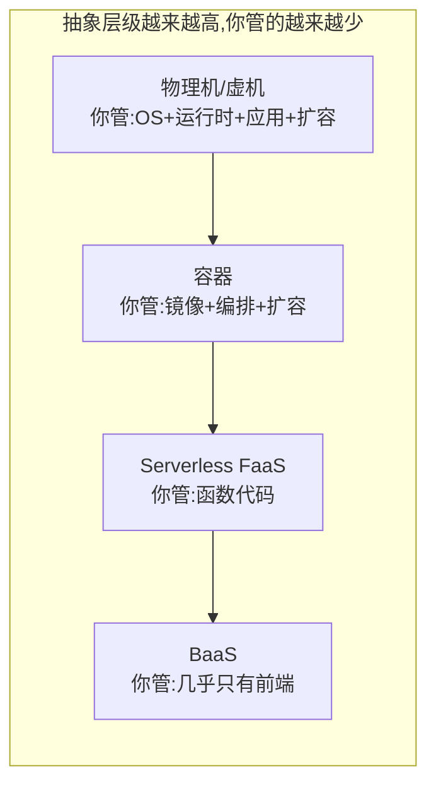

### 5.1 责任边界对比

| 维度 | 传统服务器（虚机） | 容器（K8s） | Serverless（FaaS） |
| --- | --- | --- | --- |
| 部署单元 | 整台机器 + 应用 | 镜像（应用 + 依赖 + OS 层） | 一个函数 |
| 你管什么 | OS、运行时、应用、扩容、保活 | 镜像、编排、副本数、扩缩策略 | 只有函数代码 |
| 扩缩 | 手动 / 自建自动扩容 | HPA 等，仍需配置与预留 | 平台全自动，**可缩容到零** |
| 空闲成本 | 高（常驻付费） | 中（副本常驻付费） | **零**（无请求不计费） |
| 计费粒度 | 按小时/月（实例） | 按节点/时长 | **按请求 + GB-毫秒** |
| 冷启动 | 无（常驻） | 几乎无（副本常驻） | **有**（按需拉起） |
| 启动速度 | 分钟级（起机器） | 秒级（起容器） | 毫秒~秒级（起环境） |
| 长连接/长任务 | ✅ 擅长 | ✅ 擅长 | ⚠️ 受时长上限限制 |
| 状态 | 可有状态 | 可有状态（有状态集） | **无状态** |
| 运维负担 | 重 | 中 | 极轻 |
| 适合 | 稳定高负载、需完全控制 | 微服务、需可移植与编排 | 波动流量、事件驱动、快速试错 |

### 5.2 一张图看清「谁管什么」

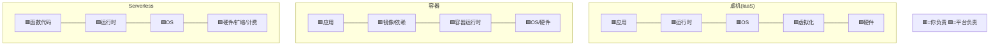

从虚机到 Serverless，红色（你的责任）越来越少。这不是「谁更好」，而是**抽象与控制的取舍**：越高层越省心，但越受平台约束（时长、运行时、供应商锁定）。

### 5.3 关键区别：容器 vs Serverless

容器和 Serverless 常被混淆，因为很多 FaaS 底层也用容器。区别在**谁管生命周期**：

- **容器**：副本**常驻**运行（哪怕没请求），你配置副本数与扩缩策略，为常驻资源付费。
- **Serverless**：环境**按需**拉起、用完回收、**缩容到零**，平台管生命周期，你只为执行时间付费。

一句话：**容器是「你养着一群随时待命的进程」，Serverless 是「平台按事件替你临时拉起再回收」。**

---

## 六、边缘运行时：V8 isolate 为何冷启动近零

普通 FaaS 跑在**某个地域**的数据中心，用**容器/MicroVM**隔离。边缘函数（Cloudflare Workers、Vercel Edge）跑在**全球 CDN 节点**，用 **V8 isolate** 隔离——这是冷启动近零的关键。

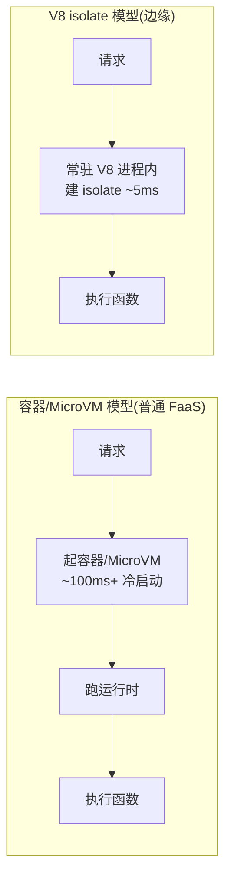

**原理**：

- 容器模型每个函数环境是一个独立进程/MicroVM，创建重（几十~几百 ms）。
- V8 isolate 模型：平台维护**常驻的 V8 进程**，每个 Worker 只是进程内一个**轻量隔离堆（isolate）**，创建仅 ~5ms，且一台机器能塞上万个 isolate，密度极高。
- 代价：isolate 里**没有完整 OS 能力**——不能读写文件系统、不能用依赖原生二进制的 npm 包、CPU 时间预算是毫秒级、包体积受限。所以边缘函数只用 **Web 标准 API**（`Request`/`Response`/`fetch`/`URL`），签名从 `(event, context)` 变成 `fetch(request)`。

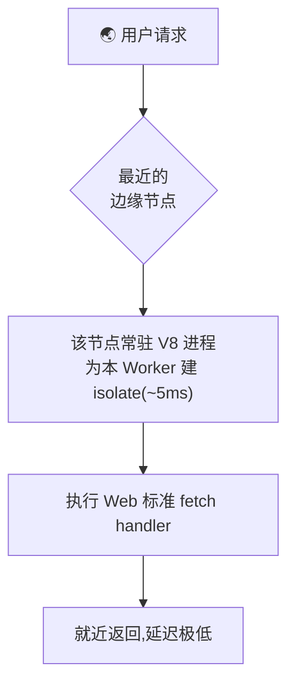

**位置 + 运行时双重优化**：位置上离用户近（少一次跨洋往返），运行时上冷启动近零。适合鉴权、重定向、A/B、地理定制、缓存改写等「轻、近、快」逻辑；重业务与数据库操作仍归普通函数。

---

## 七、计费模型：GB-秒的数学

Serverless 「按量付费」的精确含义，是理解「值不值」的基础。以 AWS Lambda 为例，账单 = **请求费 + 计算费**：

```
请求费 = max(0, 调用次数 - 免费请求额度) × 每次单价
计算费 = max(0, 总GB秒 - 免费GB秒额度) × 每GB秒单价
总GB秒 = 分配内存(GB) × 单次运行时长(秒) × 调用次数
```

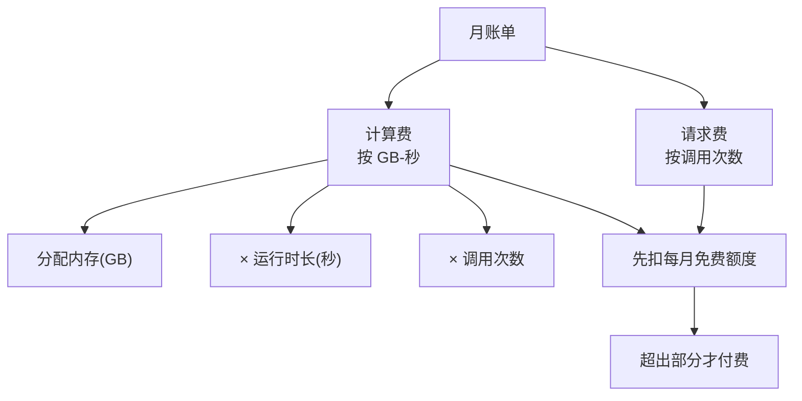

### 7.1 三个关键直觉

**① 缩容到零 = 零成本空闲。** 没请求 → 0 调用 → 0 费用。这是与「服务器空转仍付整月」最本质的差异，也是低频/波动场景 Serverless 便宜到近乎免费的原因。

**② 内存翻倍 ≠ 一定更贵。** 内存翻倍，单位时间单价翻倍，但 **CPU 也随内存线性增强**，函数可能跑得快一倍 → 时长减半 → 总 GB-秒不变，账单持平；若快得更多，反而更省。所以「配小内存省钱」是误区，应实测找性价比最优点。

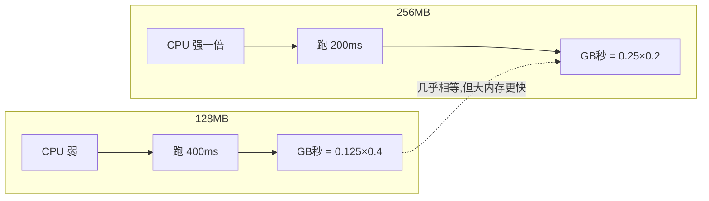

**③ 存在成本交叉点。** 低/中频时按量计费碾压包月服务器；但当调用极高频、函数几乎「常驻满跑」时，累积 GB-秒费用会超过一台包月服务器的固定成本。

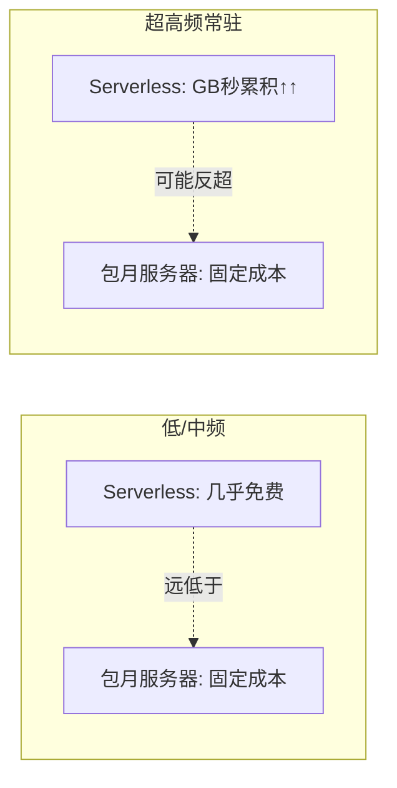

模块 08 的 `cost-calculator.js` 把这套公式做成了可跑的计算器，改参数即可直观感受。

### 7.2 别只看单价，看整体账单

真实账单还包括：API 网关调用费、出网流量费、日志存储费、关联 BaaS（数据库读写/存储）费。做成本估算要看总账，而不是只盯计算单价。

---

## 八、FaaS + BaaS 组成的 Serverless 全栈

Serverless 不只是 FaaS。**FaaS 补定制逻辑，BaaS 提供标准后端能力**，两者拼出「无服务器全栈」。

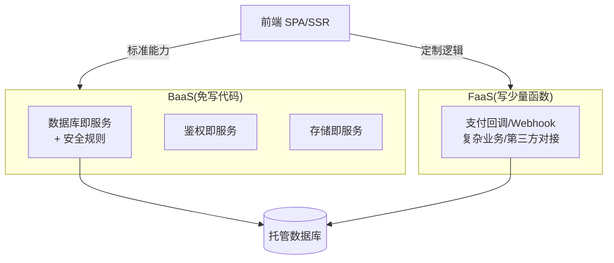

**BaaS 的安全本质**：前端能直连数据库而不失控，靠的是**安全规则/RLS 在服务端强制**——权限校验下沉到数据层，客户端改代码也绕不过（模块 07）。这与 FaaS 的「函数无状态、事件驱动」共同构成了 Serverless 的两条主线。

典型现代架构：**前端 + BaaS（存数据/登录/传文件）+ 少量 FaaS（定制逻辑）**，几乎没有传统意义上「自己运维的后端服务器」。这就是 Serverless 全栈的落地形态。

---

## 九、常见误区总清单

| 误区 | 真相 |
| --- | --- |
| Serverless = 没有服务器 | 有服务器，只是你不用管 |
| 全局变量能跨调用存业务数据 | 函数无状态，环境随时销毁，只能靠外部存储 |
| 重初始化写哪都行 | 放 handler 内=每次重来；放顶层=冷启动一次复用 |
| 内存配越小越省钱 | 内存小 CPU 弱、跑得慢，GB-秒未必低，还拖慢冷启动 |
| Serverless 一定更便宜 | 低频真便宜，超高频常驻可能比服务器更贵，要算账 |
| 冷启动没法避免只能忍 | 预留并发、减包体积、顶层复用、换边缘都能缓解 |
| 边缘函数能跑任何 Node 代码 | 边缘是精简 V8 运行时，无 fs、无原生依赖、CPU 预算小 |
| 一个环境能并发处理多请求 | 一个环境一次一个请求,并发靠多开环境 |
| 选了 Serverless 就不能用别的 | FaaS/BaaS/容器常混用,按场景组合 |
| BaaS 前端直连库不安全 | 安全规则/RLS 在服务端强制,客户端绕不过 |
| 长连接/长任务也能硬塞函数 | 有执行时长上限,长连接需专门方案 |

---

## 参考与对照官方文档

- AWS Lambda 执行环境生命周期：https://docs.aws.amazon.com/lambda/latest/dg/lambda-runtime-environment.html
- AWS Lambda 预留并发（降冷启动）：https://docs.aws.amazon.com/lambda/latest/dg/provisioned-concurrency.html
- AWS Lambda 定价（GB-秒模型）：https://aws.amazon.com/lambda/pricing/
- AWS Lambda 配额/限制：https://docs.aws.amazon.com/lambda/latest/dg/gettingstarted-limits.html
- Serverless Framework 文档：https://www.serverless.com/framework/docs
- Vercel Functions / Fluid compute：https://vercel.com/docs/functions · https://vercel.com/docs/fluid-compute
- Cloudflare Workers 运行原理（V8 isolate）：https://developers.cloudflare.com/workers/reference/how-workers-works/
- Firebase Security Rules：https://firebase.google.com/docs/rules
- Supabase Row Level Security：https://supabase.com/docs/guides/database/postgres/row-level-security
