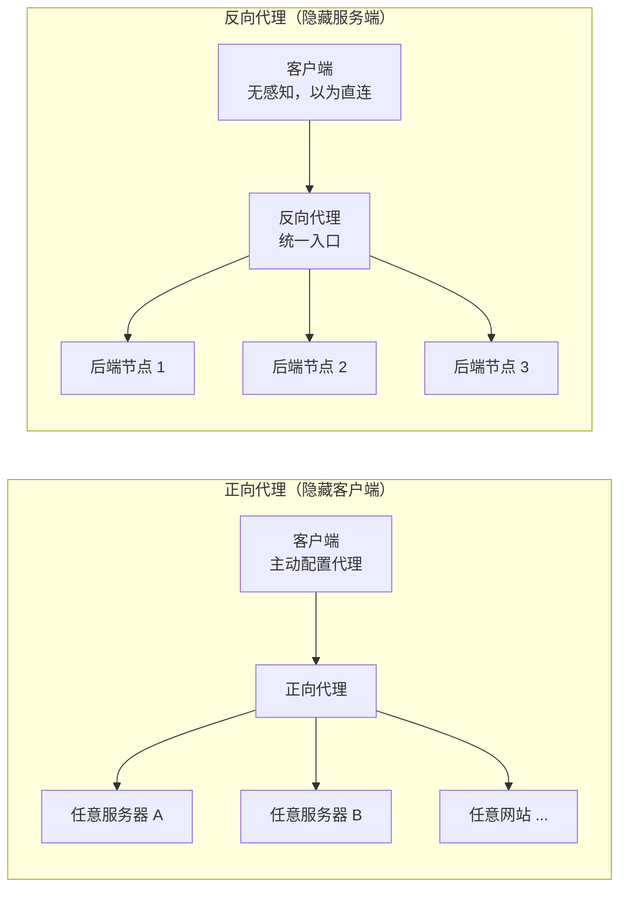
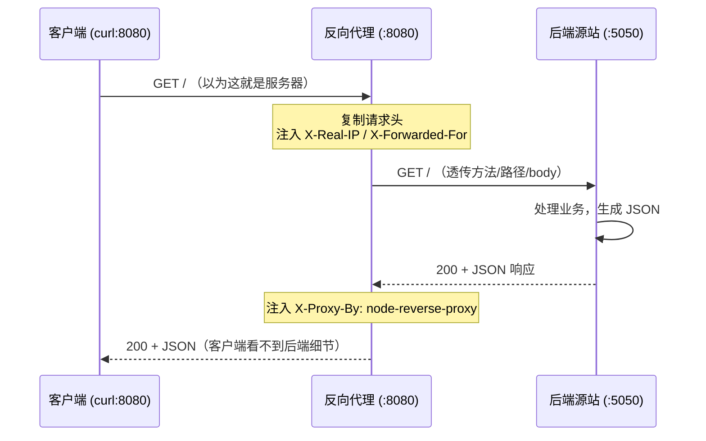

# 01 · 正向代理 vs 反向代理（Forward Proxy vs Reverse Proxy）
> 代理就是「请求的中间人」。正向代理站在**客户端**这边帮你出门，反向代理站在**服务端**这边替后端接客——搞懂谁被隐藏了，你就懂了 Nginx、CDN、网关的地基。

## 📖 知识讲解

### 一句话抓住本质
「代理」(proxy) 就是夹在客户端和服务器之间的中间人。区别只在于：**这个中间人是替谁工作、隐藏了谁。**

| 维度 | 正向代理 Forward Proxy | 反向代理 Reverse Proxy |
| --- | --- | --- |
| 站在谁一侧 | **客户端**一侧 | **服务器**一侧 |
| 代表谁 | 代表客户端去访问服务器 | 代表服务器接收请求再转发给后端 |
| 隐藏了谁 | 隐藏**客户端**（服务器不知道真实用户是谁） | 隐藏**服务端**（客户端以为代理就是服务器） |
| 客户端是否知情 | 客户端要**主动配置**代理地址 | 客户端**无感知**，以为直连服务器 |
| 典型例子 | 科学上网、公司统一出口代理、爬虫换 IP | Nginx、CDN、API 网关、负载均衡器 |

### 关键记忆点：谁被藏起来了
- **正向代理隐藏客户端**：后端服务器只看到代理的 IP，看不到真实用户。就像你让朋友帮你去店里买东西，店员只见到你朋友。
- **反向代理隐藏服务端**：用户只看到代理这个「门面」，不知道背后到底是 1 台还是 100 台服务器，也不知道具体哪台在干活。就像你打客服电话，接线员背后有一整个团队，你并不知道是谁在处理。

### 为什么反向代理是网关 / CDN / Nginx 的基础
反向代理天然处在「所有请求的必经之路」上，于是就能顺手干很多事：
- **负载均衡**：把请求分发到后端多台机器（下一模块 Nginx 会讲）。
- **隐藏与保护后端**：后端不直接暴露公网，代理层做 SSL 终结、防火墙、限流。
- **统一入口**：所有客户端只认代理一个地址，后端怎么拆分、怎么扩容都对客户端透明——这正是 **API 网关**（模块 03）的核心思想。
- **缓存与加速**：CDN 本质就是一层遍布全球的反向代理缓存。

### 易错点
- **别把「正向/反向」和「代理转发的方向」搞混**：请求方向都是客户端→代理→服务器，方向一样。区别是**代理归属哪一侧、隐藏谁**。
- **反向代理 ≠ 负载均衡**：负载均衡是反向代理**能干的一件事**，不是它本身。一个只转发到单台后端的反向代理也完全成立（本模块 demo 就是）。
- **`changeOrigin` / Host 头**：反向代理转发时经常要改写或补充 `Host`、`X-Real-IP`、`X-Forwarded-For` 头，否则后端拿不到真实来源信息（本模块 demo 里演示了注入这些头）。

## 🔄 流程图 / 原理图

### 拓扑对比：正向代理 vs 反向代理



要点：正向代理面向**外部任意服务器**（客户端可控、服务端未知集合）；反向代理面向**内部固定的后端集群**（服务端可控、客户端未知细节）。

### 反向代理转发时序



## 💻 代码说明

本模块提供一个**纯 Node、零依赖**的可运行反向代理 demo，由两个文件组成。

### `origin-server.js` —— 后端源站（监听 5050）
- 用 `http.createServer` 起一个服务，收到请求后返回一段 JSON。
- JSON 里带 `servedBy`（主机名）、`pid`（进程号）作为**主机标识**，证明「请求确实落到了这台后端」。
- 回显收到的 `host` / `x-real-ip` / `x-forwarded-for` 头，用来验证代理是否把来源信息透传过来了。

### `reverse-proxy.js` —— 反向代理（监听 8080，转发到 5050）
逐段解释关键逻辑：
```js
// 1) 复制客户端请求头，并补充「转发信息」头
const forwardHeaders = { ...clientReq.headers };
forwardHeaders['x-real-ip'] = clientReq.socket.remoteAddress;      // 真实客户端 IP
forwardHeaders['x-forwarded-for'] = clientReq.socket.remoteAddress; // 代理链

// 3) 用原生 http.request 发起到后端的请求
const proxyReq = http.request(options, (proxyRes) => {
  const responseHeaders = { ...proxyRes.headers };
  responseHeaders['x-proxy-by'] = 'node-reverse-proxy'; // 注入自定义响应头
  clientRes.writeHead(proxyRes.statusCode, responseHeaders);
  proxyRes.pipe(clientRes);   // 后端响应体流式回写给客户端
});

// 4) 客户端请求体流式透传给后端（支持 POST body）
clientReq.pipe(proxyReq);

// 5) 后端连不上时返回 502，避免客户端一直挂起
proxyReq.on('error', (err) => { /* 502 Bad Gateway */ });
```
两个 `pipe` 是精髓：**请求体流进后端、响应体流回客户端**，全程流式，不会因为大 body 爆内存。这正是所有反向代理的最小内核。

## ▶️ 运行方式

需要开**两个终端**：

```bash
# 终端 1：启动后端源站（监听 5050）
node origin-server.js

# 终端 2：启动反向代理（监听 8080，转发到 5050）
node reverse-proxy.js
```

然后在**第三个终端**发请求（注意打的是代理端口 8080，而不是后端 5050）：

```bash
# 普通 GET：应能看到 origin-server 返回的 JSON，说明代理转发成功
curl -i localhost:8080

# 观察响应头里有没有我们注入的 X-Proxy-By
curl -i localhost:8080 | grep -i x-proxy-by

# 带 body 的 POST：验证请求体也被透传
curl -i -X POST localhost:8080/api -d 'hello=world'
```

预期：响应 JSON 的 `servedBy` 是 `origin-server@...`（证明落到了后端），`receivedHeaders` 里能看到 `x-real-ip`；响应头里有 `X-Proxy-By: node-reverse-proxy`。

## ⚠️ 常见坑 / 最佳实践
- **一定要处理 `proxyReq.on('error')`**：后端挂了如果不兜底，客户端连接会一直卡住。生产里统一返回 502/504。
- **别忘了透传 body**：只 `writeHead` 不 `clientReq.pipe(proxyReq)`，POST/PUT 的请求体就丢了。
- **`X-Forwarded-For` 要追加而非覆盖**：多级代理时应是 `原值, 新IP` 的链式追加，本 demo 为简洁只写了单跳。
- **Host 头**：真实场景常需把 Host 改写成后端期望的域名（node-http-proxy 的 `changeOrigin:true` 就是干这个）。后端若按 Host 做虚拟主机路由，不改会 404。
- **生产别手写**：手写代理用于理解原理即可；真上生产用 Nginx、Envoy 或 `http-proxy` 这类成熟库，它们处理了超时、keep-alive、WebSocket 升级、错误重试等一堆边界。

## 🔗 官方文档
- Node.js `http` 模块（createServer / request）：https://nodejs.org/api/http.html
- node-http-proxy（社区反向代理库）：https://github.com/http-party/node-http-proxy
- MDN 代理服务器概念：https://developer.mozilla.org/en-US/docs/Web/HTTP/Proxy_servers_and_tunneling
- MDN `X-Forwarded-For`：https://developer.mozilla.org/en-US/docs/Web/HTTP/Headers/X-Forwarded-For
