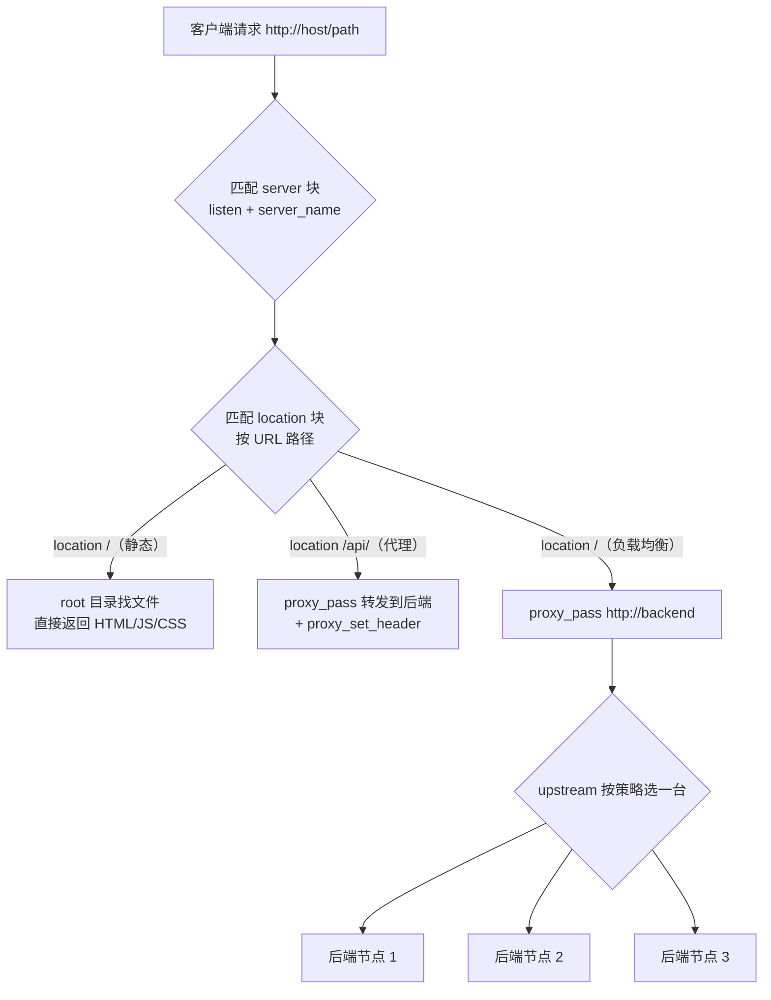
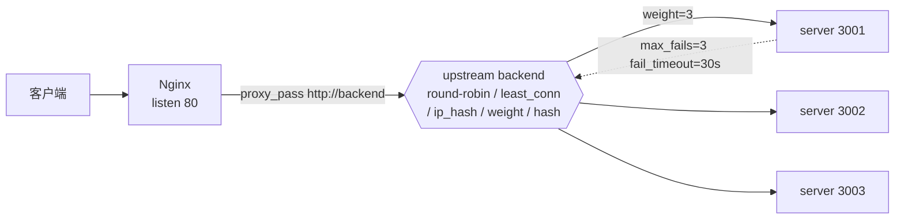

# 02 · Nginx 基础（Nginx Reverse Proxy / Load Balancing / Static Serving）
> Nginx 是最流行的反向代理服务器，一个配置文件就能同时干三件大事：**反向代理转发、多机负载均衡、静态文件服务**。搞懂它的配置结构，你就掌握了大多数线上入口层的样子。

## 📖 知识讲解

### Nginx 是什么
Nginx（读作 "engine-x"）是一个高性能的 HTTP 服务器和反向代理。它靠**事件驱动 + 异步非阻塞**的架构，用很少的内存扛住海量并发连接，所以几乎是「网站入口层」的事实标准。

### 三大用途

| 用途 | 一句话 | 关键指令 |
| --- | --- | --- |
| **静态文件服务** | 直接把磁盘上的 HTML/JS/CSS/图片吐给浏览器 | `root` + `location` + `index` |
| **反向代理** | 把请求转发给后端应用（Node/Java/Python…） | `proxy_pass` + `proxy_set_header` |
| **负载均衡** | 把请求分发到后端多台机器 | `upstream` + `proxy_pass http://组名` |

### 配置文件的结构（一定要记住这个层级）
Nginx 配置是**块状嵌套**的，从外到内：
```
全局块（worker_processes…）
└── events 块（worker_connections…）
└── http 块（所有 HTTP 配置）
    └── upstream 块（后端服务器组，负载均衡用）
    └── server 块（一个虚拟主机 = 一个站点）
        └── location 块（按 URL 路径匹配的路由规则）
```
- **server** = 一个站点（按 `listen` 端口 + `server_name` 域名区分）。
- **location** = 站点内按路径分流（`/` 走静态、`/api/` 走后端…）。

### 反向代理为什么要 `proxy_set_header`
Nginx 转发时，后端默认只看得到 Nginx 自己的信息。要让后端拿到**真实来源**，必须手动透传这几个头：

| 请求头 | 值 | 作用 |
| --- | --- | --- |
| `Host` | `$host` | 原始域名，后端按域名路由时必需 |
| `X-Real-IP` | `$remote_addr` | 真实客户端 IP（单个） |
| `X-Forwarded-For` | `$proxy_add_x_forwarded_for` | 代理链，追加式记录每一跳 |
| `X-Forwarded-Proto` | `$scheme` | 原始协议 http/https，SSL 终结后判断用 |

### 负载均衡的 5 种策略（重点）

| 策略 | 写法 | 特点 / 适用 |
| --- | --- | --- |
| 轮询（默认） | 不写关键字 | 依次分发，最简单 |
| 加权轮询 | `server ... weight=3;` | 好机器多分流量 |
| 最少连接 | `least_conn;` | 请求耗时差异大时更均衡 |
| IP 哈希 | `ip_hash;` | 同一 IP 固定落同一台（会话保持） |
| 一致性哈希 | `hash $request_uri consistent;` | 增删节点时命中率稳（缓存/CDN） |

健康检查（开源版被动式）：`server srv1 max_fails=3 fail_timeout=30s;`——30 秒内失败 3 次就暂时踢掉这台。

## 🔄 流程图 / 原理图

### Nginx 请求处理流：一个请求进来怎么走



### upstream 负载均衡拓扑



## 💻 代码说明

本模块给 3 个**带详细中文注释的配置文件**（配置参考，也可 docker 试跑）：

### `nginx.conf` —— 完整骨架 + 静态服务
含 `worker_processes` / `events` / `http` / `server` / `location` 五层结构，`location /` 用 `root` + `index` 提供静态文件。这是最小可跑的完整主配置。

### `reverse-proxy.conf` —— 反向代理
核心是 `proxy_pass http://127.0.0.1:3000;` 加上四个 `proxy_set_header`（Host / X-Real-IP / X-Forwarded-For / X-Forwarded-Proto）。还演示了用 `location /api/` 把某个路径前缀单独代理到另一个后端——这就是 API 网关的雏形。

### `load-balance.conf` —— 负载均衡
把 5 种策略**都写全并用注释切换**：默认轮询是启用状态，其余 4 种（weight / least_conn / ip_hash / 一致性 hash）注释掉备选。想换策略就把当前的注释掉、启用另一段 `upstream`。文件底部还附了 `max_fails` / `fail_timeout` / `backup` / `down` 的健康检查写法。关键点：`proxy_pass http://backend;` 里的 `backend` 是 **upstream 组名**，不是具体 IP。

## ▶️ 运行方式

这些是**配置参考文件**，不装 Nginx 也能当模板抄。若想真跑起来，用 Docker 最省事：

```bash
# 试跑静态服务骨架（把本目录 nginx.conf 挂载进容器覆盖默认配置）
docker run --rm -p 8080:80 \
  -v "$PWD/nginx.conf:/etc/nginx/nginx.conf:ro" \
  nginx

# 然后浏览器访问 http://localhost:8080 （会看到 nginx 默认欢迎页或你放的静态文件）
```

> 注意：`reverse-proxy.conf` 和 `load-balance.conf` 是 `server{}` 片段，真跑时需要放进完整 `http{}` 块里（或用 `include` 引入），并且要先有对应端口的后端服务在跑，否则代理会返回 502。作为**配置学习参考**直接读注释即可。

验证配置语法是否正确（不必启动）：
```bash
docker run --rm -v "$PWD/nginx.conf:/etc/nginx/nginx.conf:ro" nginx nginx -t
```

## ⚠️ 常见坑 / 最佳实践
- **`proxy_pass` 结尾斜杠有玄机**：`proxy_pass http://backend/;`（带 `/`）会把 location 前缀替换掉，`proxy_pass http://backend;`（不带）会原样拼接路径。路径不对多半是这里。
- **忘了 `proxy_set_header Host`**：后端按域名路由时会 404，或拿到的 Host 是上游地址。
- **`X-Forwarded-For` 用 `$proxy_add_x_forwarded_for`**：它会自动在已有链后追加，别手写成 `$remote_addr` 覆盖掉上游信息。
- **`ip_hash` 别和动态增删节点混用**：加减机器会打乱哈希分布，会话保持更推荐一致性 hash 或外部共享 session。
- **改完配置要 reload**：`nginx -s reload` 平滑重载，不要粗暴 kill。上线前先 `nginx -t` 验证语法。
- **静态服务优先用 `root` 理解成「目录前缀拼接」**：`root /data;` + 请求 `/img/a.png` → 找 `/data/img/a.png`；`alias` 才是替换。

## 🔗 官方文档
- Nginx 官网文档首页：https://nginx.org/en/docs/
- 反向代理入门（Beginner's Guide）：https://nginx.org/en/docs/beginners_guide.html
- HTTP 负载均衡：https://nginx.org/en/docs/http/load_balancing.html
- `ngx_http_upstream_module`（upstream / least_conn / ip_hash / hash / max_fails）：https://nginx.org/en/docs/http/ngx_http_upstream_module.html
- `ngx_http_proxy_module`（proxy_pass / proxy_set_header）：https://nginx.org/en/docs/http/ngx_http_proxy_module.html
