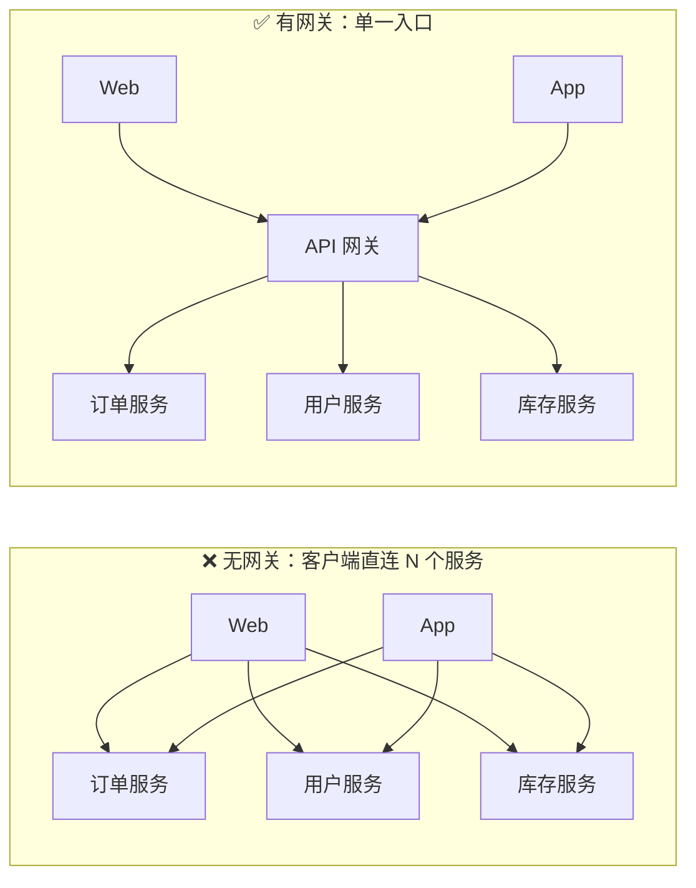
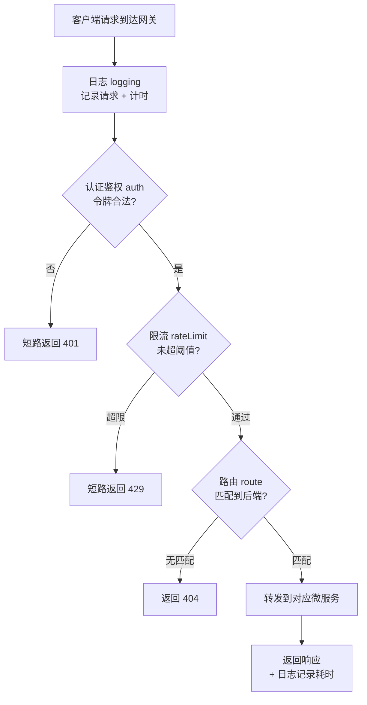

# 03 · API 网关（API Gateway）
> API 网关是微服务架构里所有客户端的**单一入口**。它把「路由、鉴权、限流、日志、聚合」这些横切关注点收拢到一层，让后端服务专注业务、让客户端只认一个地址。

## 📖 知识讲解

### 为什么微服务需要网关
微服务把一个大应用拆成一堆小服务（订单、用户、库存、支付…）。如果让前端**直连每个服务**，会立刻遇到一堆麻烦：
- 客户端要知道**几十个服务的地址**，后端一拆分/搬迁，前端就得改；
- 每个服务都要**各自实现**认证、限流、CORS、SSL……重复且容易不一致；
- 一个页面要的数据分散在多个服务，客户端得**发很多次请求**、自己拼装，移动端尤其吃亏（往返多、耗电）。

**API 网关**就是为了解决这些：在客户端和后端服务之间加一层**单一入口**，所有请求先到网关，由它统一处理再转发。

### 网关处理请求的两种方式（microservices.io）
1. **简单代理 / 路由（routing）**：把请求直接转发到对应的某一个后端服务。
2. **扇出聚合（fan-out / API composition）**：网关同时调用**多个**后端服务，把结果**聚合**成一个响应返回给客户端，省掉客户端的多次往返。

### 核心职责（对照 microservices.io / Chris Richardson）

| 职责 | 说明 |
| --- | --- |
| **路由 Routing** | 按路径/域名把请求转发到对应服务 |
| **请求聚合 Composition** | 扇出调多个服务，合并结果，减少客户端往返 |
| **协议转换 Protocol translation** | 对外 REST/HTTP，对内可转 gRPC/消息等 |
| **认证鉴权 Auth** | 统一校验身份和权限，后端只管信任网关 |
| **限流 Rate limiting** | 防刷、防打爆后端 |
| **日志 / 监控 Logging** | 统一采集访问日志、指标、链路追踪 |
| **缓存 Caching** | 缓存热点响应，减轻后端 |
| **SSL 终结 SSL termination** | 在网关做 HTTPS 解密，内网走明文更省 |
| **为不同客户端暴露不同 API** | Web / iOS / Android 可有不同粒度的接口 |

### BFF：Backends For Frontends
网关的一个常见**变体**：不做一个「万能大网关」，而是**给每一类客户端建一个专属网关**（Web 一个、iOS 一个、Android 一个）。每个 BFF 只服务它那类前端，接口可以量身裁剪，避免一个网关塞满所有客户端的特殊逻辑。

### 优点 vs 缺点

| 优点 | 缺点 |
| --- | --- |
| 屏蔽后端拆分细节，客户端只认一个入口 | 多了一层组件，要开发/部署/运维 |
| 减少客户端往返（聚合） | 增加一跳延迟（通常可忽略） |
| 横切关注点（认证/限流/日志）集中实现 | 可能成为单点 / 瓶颈，需高可用 |

## 🔄 流程图 / 原理图

### 无网关的混乱 vs 有网关的单入口



左边每个客户端都要认识每个服务，连线爆炸；右边所有客户端只连网关，后端对客户端透明。

### 一个请求经过网关的处理管线



任一阶段都可以**短路**：认证失败直接 401、超限直接 429，不再往下走——这正是本模块 demo 的核心机制。

## 💻 代码说明

`gateway-pipeline.js` 用**中间件数组**模拟网关管线，纯 Node 零依赖。

### 管线阶段（logging → auth → rateLimit → route）
每个阶段是 `(req, res, next) => {}`：调用 `next()` 放行到下一阶段，或调用 `res.end(status, body)` **短路**返回。
```js
function auth(req, res, next) {
  const token = (req.headers.authorization || '').replace('Bearer ', '');
  if (token !== 'valid-token') return res.end(401, { error: 'Unauthorized' }); // 短路
  req.user = { id: 'u_1001', name: 'alice' }; // 认证信息挂到 req，供后续阶段用
  next();
}
```

### 管线执行器
`runPipeline` 用一个 `index` 指针 + `next()` 递归把中间件串起来；`res.end` 一旦被调用就置 `ended=true`，`next()` 检测到就停止推进——实现「短路」。
```js
function next() {
  if (res.ended) return;      // 已短路，停止
  const mw = middlewares[index++];
  if (!mw) return;            // 走完了
  mw(req, res, next);         // 执行当前阶段
}
```

### 限流的实现
用一个内存 `Map` 按 `clientIp` 计数，超过 `LIMIT` 就返回 429（真实网关会用 Redis + 滑动窗口/令牌桶）。

## ▶️ 运行方式

```bash
node gateway-pipeline.js
```

控制台会依次演示 4 个场景：
- **场景 A**：正常请求 → 一路放行到 `order-service`，返回 200。
- **场景 B**：令牌无效 → 在 `auth` 阶段被 401 拦截，`rateLimit`/`route` 不再执行。
- **场景 C**：同一 IP 连打 4 次 → 前 3 次放行，第 4 次触发限流返回 429。
- **场景 D**：路径无匹配后端 → 在 `route` 阶段返回 404。

观察每个阶段打印的 `→ / ✓ / ✗` 就能看清请求是怎样穿过管线、又在哪一步被短路的。

## ⚠️ 常见坑 / 最佳实践
- **网关别塞业务逻辑**：它只做横切关注点（路由/认证/限流/日志/聚合）。把订单计算之类的业务放进网关，会让它变成新的「大泥球」。
- **网关要高可用**：单一入口意味着它挂了全站挂。生产要多副本 + 前面再放负载均衡。
- **限流用共享存储**：多实例网关各自用内存计数会漏算，应集中到 Redis 等共享存储。
- **认证下沉但要透传身份**：网关校验完，把用户身份（如 `X-User-Id`）透传给后端，后端信任网关即可，别每个服务再查一遍。
- **聚合注意超时与降级**：扇出调多个服务时，某个慢/挂了要有超时和降级，别让一个服务拖垮整个响应。
- **别过度网关化**：小系统直接用 Nginx 反向代理就够了；等服务多、客户端多、横切需求复杂时再上专门的网关（Spring Cloud Gateway、Kong、APISIX、Envoy 等）。

## 🔗 官方文档
- microservices.io · API Gateway 模式（Chris Richardson）：https://microservices.io/patterns/apigateway.html
- microservices.io · Backends For Frontends（BFF）：https://microservices.io/patterns/apigateway.html（同页 Variants 一节）
- microservices.io · API Composition 模式：https://microservices.io/patterns/data/api-composition.html
- Spring Cloud Gateway（一种常用实现）：https://docs.spring.io/spring-cloud-gateway/reference/
- Kong Gateway 文档：https://docs.konghq.com/gateway/
