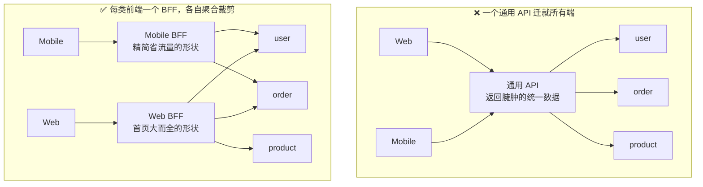
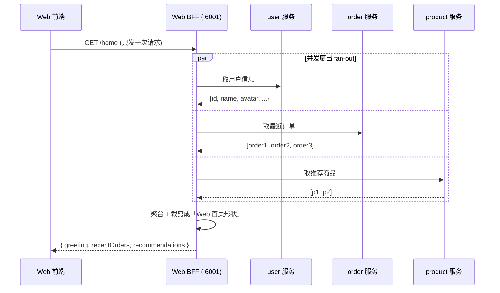

# 04 · 服务于前端的后端（Backends For Frontends / BFF）

> 给每一类前端客户端（Web、iOS、Android、第三方）各建一个「专属后端」，由它替这个前端把多个微服务的数据聚合、裁剪成正好合适的形状。

## 📖 知识讲解

### 先说痛点：一个通用 API 迁就所有客户端

假设后端拆成了 `user`、`order`、`product` 三个微服务。前端有 Web 端、手机 App、还有对外开放的第三方。传统做法是搞**一套通用 API**（One Size Fits All），所有端都调它。

问题来了：

| 客户端 | 想要什么 | 通用 API 给它的 |
|---|---|---|
| Web 首页 | 用户昵称 + 最近 3 笔订单 + 推荐商品，一次拿全 | 得自己分别调 user / order / product 三个接口，前端拼 |
| 手机 App | 屏幕小、流量贵，只要昵称和头像缩略图 | 一坨完整用户对象（几十个字段），大部分用不上还费流量 |
| 智能手表 | 只要一个未读数字 | 同样一坨臃肿数据 |

一套通用 API 想同时讨好所有端，结果是**谁都不舒服**：

- 前端要发很多次请求（往返多、首屏慢），还得在浏览器/手机里做聚合，逻辑重。
- 返回的数据形状是「后端觉得通用」的，不是「这个前端正好需要」的，字段多、层级深。
- 任何一个端要加字段，都要动这套公共 API，牵一发动全身，各端互相牵制、无法独立演进。

### BFF 是什么

**BFF（Backends For Frontends，服务于前端的后端）** 由 Sam Newman 提出、被 microservices.io（Chris Richardson）收录为 API Gateway 模式的一个变体。核心思想一句话：

> **不要一个通用网关迁就所有前端，而是给每一类前端各建一个专属网关（per-client gateway），由该前端团队自己拥有，专门为这个前端聚合、裁剪后端数据。**

于是变成：

- **Web BFF**：给 Web 端用。`/home` 一次请求，它在后端并发调 user/order/product，拼成「Web 首页正好需要的形状」返回。
- **Mobile BFF**：给 App 用。同样是首页，但只回昵称 + 头像缩略图 + 未读数，字段精简、体积小。
- **Third-party BFF / Public API**：给第三方用，字段更保守、鉴权更严。

每个 BFF 只服务它对应的那一类前端，所以可以「量身定制」。

### BFF 和 API 网关的关系

它俩是同一家族：

| | API 网关（通用） | BFF |
|---|---|---|
| 数量 | 通常一个，所有端共用 | 每类前端一个 |
| 定位 | 统一入口，做通用横切（鉴权、限流、路由、日志） | 面向某个前端的聚合裁剪层 |
| 归属 | 平台/网关团队 | **对应的前端团队自己拥有** |
| 关系 | —— | BFF 是 API Gateway 模式的**变体**（per-client gateway） |

实际项目里两者常常叠着用：外面一层通用网关做鉴权/限流，里面每类前端一个 BFF 做聚合。

### BFF 该做什么、不该做什么

- ✅ **该做**：面向该前端的**聚合（aggregation）** 与**编排（orchestration）**——扇出调用多个微服务、合并结果、裁剪字段、转换成前端友好的形状；面向该端的轻量适配。
- ❌ **不该做**：放**核心业务逻辑**。业务规则、数据一致性属于下游微服务。BFF 一旦塞业务逻辑，就会变成新的「分布式单体」，多个 BFF 之间还容易重复实现同一套逻辑。

### 好处与代价

- 好处：前端拿到**正好合适**的数据形状；减少网络往返；各端可**独立演进**（改 Web BFF 不影响 Mobile BFF）；前端团队自治。
- 代价：要维护**多套 BFF**；不同 BFF 间可能**重复逻辑**（可抽公共库缓解）；多了一跳网络。

## 🔄 流程图 / 原理图

### 图 1：通用 API vs 每端一个 BFF



对比里能一眼看出：左边 Web 和 Mobile 被迫吃同一坨数据；右边各自的 BFF 只取自己需要的那部分。

### 图 2：Web BFF 把一次前端请求扇出到三个微服务再聚合



前端只发一次 `/home`，往返、聚合、裁剪全在 BFF 里搞定。

## 💻 代码说明

本模块提供一个**纯 Node、零依赖**的可运行 demo：

| 文件 | 作用 |
|---|---|
| `services.js` | 用本地 async 函数**模拟** user / order / product 三个下游微服务，各自返回一坨「完整原始数据」。为了逼真，每个服务还加了随机延迟。导出 `getUser / getOrders / getProducts` 供 BFF 调用。也可直接 `node services.js` 打印三个服务各自的原始返回。 |
| `web-bff.js` | 一个 http 服务，监听 **6001**。收到 `GET /home` 时**并发**（`Promise.all`）调用三个服务，把结果**聚合 + 裁剪**成「Web 首页需要的形状」再返回。 |

关键点：

- **并发扇出**：三个下游用 `Promise.all` 同时发，总耗时≈最慢的那个，而不是三个相加。
- **裁剪**：下游返回几十个字段，BFF 只挑首页要用的，拼成 `{ greeting, recentOrders, recommendations }`。这就是「为这个前端量身定制形状」。
- **零依赖**：只用 Node 内置 `http`，不用装任何 npm 包。

## ▶️ 运行方式

需要 Node.js（建议 18+）。进入本目录：

```bash
cd 16-gateway-microservices/04-bff

# 方式一：直接看三个下游服务各自返回的原始数据
node services.js

# 方式二：启动 Web BFF，然后请求它的聚合接口
node web-bff.js
# 另开一个终端：
curl http://localhost:6001/home
# 或浏览器打开 http://localhost:6001/home
```

`curl` 返回的 JSON 就是「Web 首页正好需要的形状」，对比 `node services.js` 打印的原始数据，能明显看到 BFF 做的**聚合 + 裁剪**。

## ⚠️ 常见坑 / 最佳实践

- **别把业务逻辑塞进 BFF**：BFF 只做聚合/裁剪/适配。核心业务规则、数据一致性留给下游微服务，否则 BFF 会退化成「分布式单体」。
- **多个 BFF 的重复逻辑**：Web BFF 和 Mobile BFF 常有相似的聚合代码，抽成共享库/公共模块复用，但**别为了复用又合并回一个通用 BFF**——那就绕回原点了。
- **扇出要并发、要容错**：多个下游用 `Promise.all` 并发；但一个下游挂了会让整个聚合失败，生产中应给每个下游加超时、降级（`Promise.allSettled` + 兜底默认值），返回「部分数据」也比整页 500 好。
- **BFF 属于前端团队**：BFF 的价值在于「该前端团队能自己改自己的聚合，不求别人」。若 BFF 归后端平台团队管，前端每次加字段还要排期，就失去了 BFF 的意义。
- **别为每个页面都建一个 BFF**：粒度是「每类**客户端**一个」（Web / iOS / Android），不是「每个页面一个」。页面差异用 BFF 内的不同接口解决。
- **多一跳的延迟**：BFF 多了一层网络。把它和下游微服务部署得近一点（同机房/同 VPC），并对下游调用做缓存，降低延迟。

## 🔗 官方文档

- Sam Newman《Backends For Frontends》：https://samnewman.io/patterns/architectural/bff/
- microservices.io · API Gateway / BFF 模式：https://microservices.io/patterns/apigateway.html
- Chris Richardson《Microservices Patterns》一书 API Gateway 章节
