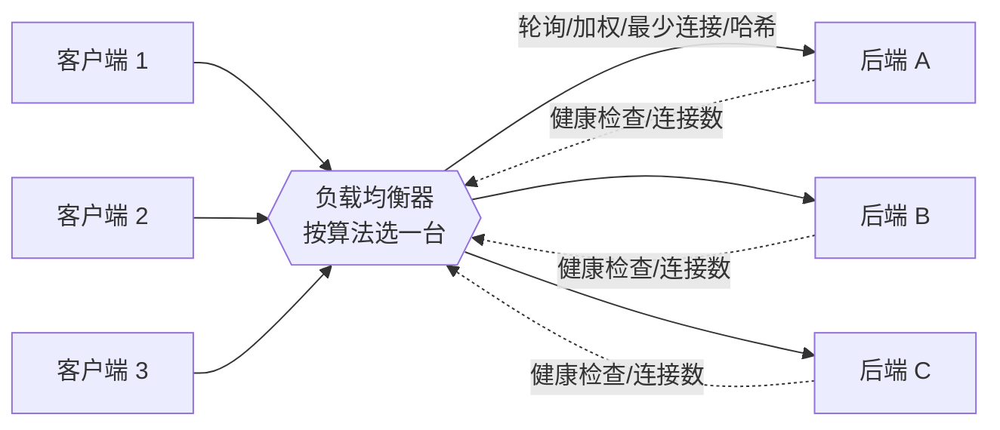
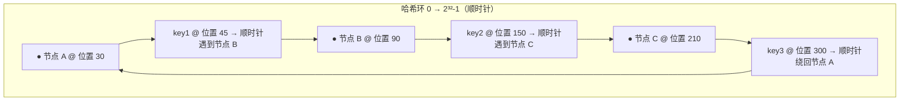

# 05 · 负载均衡算法（Load Balancing Algorithms）

> 负载均衡器把海量请求「分」给后端服务器池里的多台机器。怎么分？这一节讲轮询、加权轮询、最少连接、IP 哈希、一致性哈希五种经典算法。

## 📖 知识讲解

一台服务器扛不住，就多开几台组成「后端池（backend pool）」，前面放一个**负载均衡器（Load Balancer，LB）** 统一收请求，再按某种**算法**分发到池里的某一台。算法的目标：让流量尽量均匀、让该去同一台的请求稳定地去同一台、增删机器时波动尽量小。

### 五种经典算法

#### 1. 轮询（Round Robin）
按顺序一台一台轮着发：第 1 个请求给 A，第 2 个给 B，第 3 个给 C，第 4 个又回到 A……

- 原理：维护一个游标，每来一个请求游标 +1 取模。
- 适用：后端机器**配置相近**、每个请求开销**差不多**。
- 优点：简单、绝对均匀（按请求数）。
- 缺点：不看机器强弱，也不看当前谁忙；强弱机器混用时弱机会被压垮。

#### 2. 加权轮询（Weighted Round Robin）
给每台机器一个**权重 weight**，权重大的分到的请求多。比如 A:B:C = 3:2:1，那么每 6 个请求里 A 拿 3 个、B 拿 2 个、C 拿 1 个。

- 原理：按权重比例分配名额（可用「平滑加权轮询」让分布更均匀，避免同一台连续命中）。
- 适用：机器**配置不一**（有的 16 核有的 4 核），按性能分配。
- 优点：能照顾强弱差异。
- 缺点：权重是**静态**的，不反映实时负载。

#### 3. 最少连接（Least Connections）
把请求发给**当前活跃连接数最少**的那台。

- 原理：LB 记录每台机器的在途连接数，新请求挑最小的；请求结束连接数 -1。
- 适用：请求**处理时长差异大**（有的几毫秒有的几秒）的场景，比纯轮询更能反映真实忙闲。
- 优点：动态感知负载，忙的机器少接活。
- 缺点：LB 要维护连接计数，稍复杂；短连接场景优势不明显。

#### 4. IP 哈希（IP Hash）
对客户端 IP 做哈希再取模，**同一个 IP 总落到同一台**。

- 原理：`hash(clientIP) % N` 决定去哪台。
- 适用：需要**会话粘滞（session sticky）**、把同一用户固定到同一台（比如本地缓存了会话）。
- 优点：实现简单、天然会话保持。
- 缺点：分布可能不均（大量用户在同一出口 IP 后）；**机器数 N 一变，几乎所有映射全乱**（见下）。

#### 5. 一致性哈希（Consistent Hashing）
把「节点」和「key（比如请求 key / 客户端 IP）」都映射到一个 **0 ~ 2³²-1 的哈希环**上；一个 key 顺时针找到的**第一个节点**就是它的归属。

- 关键优点：**增删节点时，只影响环上相邻的一小段 key**，其余 key 归属不变。而普通取模 `hash % N` 在 N 变化时几乎**全部重新映射**。
- 虚拟节点（virtual nodes）：每个真实节点在环上放很多个「分身」，让 key 分布更均匀，也让某节点下线时它的负载**分摊**给多台而非全压给下一台。
- 适用：分布式缓存（Memcached/Redis 分片）、需要「key 稳定归属某节点」且节点会频繁增删的场景。

#### 普通取模 vs 一致性哈希（为什么一致性哈希抗波动）

| | 普通取模 `hash(key) % N` | 一致性哈希（哈希环） |
|---|---|---|
| N 不变时 | key 稳定落到固定节点 | 同样稳定 |
| N 变化时（增/删 1 台） | 分母 N 变了，**几乎所有 key 重映射**（缓存大面积失效） | **只有环上相邻一小段 key 迁移**，约 1/N 的 key 受影响 |
| 分布均匀性 | 取模天然均匀 | 靠**虚拟节点**才均匀 |

### 算法横向对比

| 算法 | 看机器强弱? | 看实时负载? | 会话粘滞? | 增删节点波动 | 典型场景 |
|---|---|---|---|---|---|
| 轮询 | ❌ | ❌ | ❌ | 大 | 同构机器、请求均匀 |
| 加权轮询 | ✅(静态) | ❌ | ❌ | 大 | 异构机器 |
| 最少连接 | ❌ | ✅ | ❌ | 中 | 请求时长差异大 |
| IP 哈希 | ❌ | ❌ | ✅ | **极大** | 会话保持 |
| 一致性哈希 | 靠虚拟节点 | ❌ | ✅(按 key) | **极小** | 分布式缓存分片 |

### 对应到 Nginx `upstream`

```nginx
upstream backend {
    # round-robin 是默认，什么都不写就是轮询
    server 10.0.0.1;
    server 10.0.0.2 weight=3;   # 加权轮询：这台权重 3
    # least_conn;               # 最少连接
    # ip_hash;                  # IP 哈希（会话粘滞）
    # hash $request_uri consistent;  # 一致性哈希（consistent 关键字）
}
```

## 🔄 流程图 / 原理图

### 图 1：请求如何被负载均衡器分发到后端池



### 图 2：一致性哈希环（节点 + key 顺时针落点）



要点：每个 key 在环上顺时针找到的第一个节点就是它的归属。删掉节点 B，只有「原本落在 A 之后、B 之前」这一段 key（比如 key1）会改投给 C，其余 key 纹丝不动。

## 💻 代码说明

本模块提供一个**纯 Node、零依赖**的 `load-balancer.js`，实现并演示四种算法：

| 函数 | 算法 | 演示什么 |
|---|---|---|
| `RoundRobin` | 轮询 | 一批请求分发后，各节点命中次数（应几乎相等） |
| `WeightedRoundRobin` | 加权轮询（平滑加权） | 命中次数应≈权重比例 |
| `LeastConnections` | 最少连接 | 模拟随机的连接释放，观察请求总是流向最闲的节点 |
| `ConsistentHash` | 一致性哈希（含虚拟节点） | ① key 分布；② **增/删一个节点后只有少量 key 重映射**，并和普通 `hash % N` 的重映射比例做对比 |

核心看点在最后一段：脚本会对 10000 个 key 先记录归属，再删掉一个节点，统计「有多少 key 改变了归属」，把**一致性哈希 vs 普通取模**的重映射比例并排打印。你会看到一致性哈希只有约 1/N 的 key 迁移，而普通取模几乎全变。

## ▶️ 运行方式

需要 Node.js（建议 18+）：

```bash
cd 16-gateway-microservices/05-load-balancing
node load-balancer.js
```

一次性打印四种算法的分发统计，以及一致性哈希与普通取模在「删除一个节点」后的重映射比例对比。

## ⚠️ 常见坑 / 最佳实践

- **别只按请求数均匀，要按负载均匀**：轮询按「请求数」均匀，但如果请求开销差异大，机器实际负载并不均。这种场景用「最少连接」或按响应时间的算法更好。
- **会话粘滞是双刃剑**：IP 哈希/粘滞能保住会话，但也导致负载不均，且**某台宕机时它上面的会话全丢**。更好的做法是让服务无状态（会话放 Redis），就不需要粘滞了。
- **一致性哈希务必加虚拟节点**：不加虚拟节点时，少数几个真实节点在环上分布很不均，会出现某台被压爆。每个真实节点放 100~200 个虚拟节点，分布才平滑。
- **`hash % N` 用在缓存分片是灾难**：一旦扩容/缩容，几乎所有缓存 key 重映射 → 缓存雪崩、数据库被打穿。缓存分片请用一致性哈希。
- **健康检查不能少**：无论哪种算法，都要配健康检查，把挂掉的节点摘掉，否则会持续往死节点发请求。
- **权重要随机器变化调整**：加权轮询的权重是静态的，换了机器、扩了内存要记得更新权重，否则新旧机器负载失衡。

## 🔗 官方文档

- Nginx HTTP Upstream 模块（算法/weight/least_conn/ip_hash/hash consistent）：https://nginx.org/en/docs/http/ngx_http_upstream_module.html
- 一致性哈希原始论文（Karger et al., 1997）：https://dl.acm.org/doi/10.1145/258533.258660
- Cloudflare 学习中心 · 什么是负载均衡：https://www.cloudflare.com/learning/performance/what-is-load-balancing/
