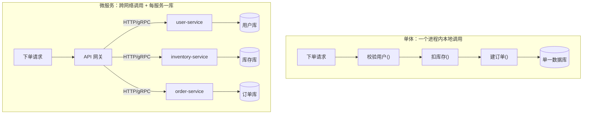
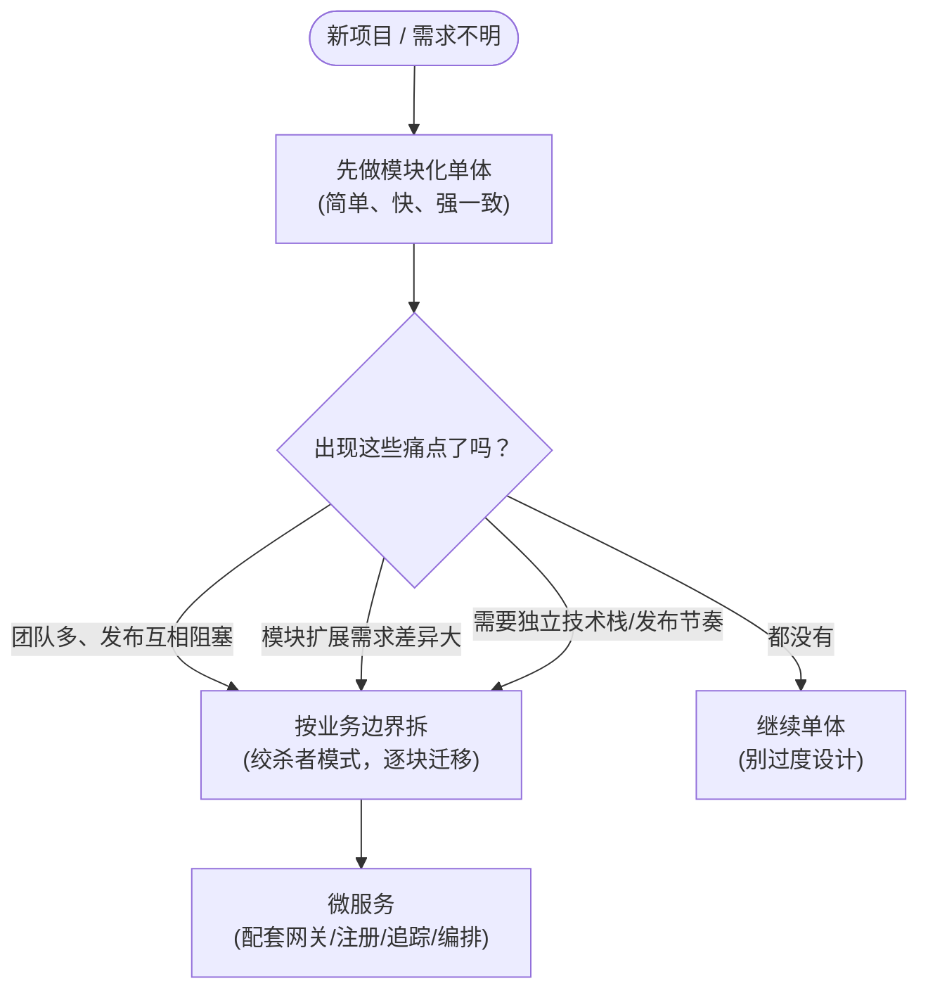

# 06 · 单体 vs 微服务（Monolith vs Microservices）

> 微服务不是「更高级」的架构，而是一种**权衡**：用「运维/分布式复杂度」换「独立部署、独立扩容、故障隔离」。这一节讲清两种架构的本质区别、微服务的收益与代价，以及「什么时候才该拆」。

## 📖 知识讲解

### 什么是单体（Monolithic）？

一个应用的**所有功能**（用户、商品、订单、支付……）编译/打包成**一个可部署单元**，跑在**一个进程**里，共享**一个数据库**。模块之间是**本地方法调用**。

- 优点：**简单**（一个仓库、一次部署、一套 IDE 调试）、**快**（进程内调用无网络开销）、**强一致**（一个数据库一个事务就搞定）。
- 缺点：随着代码和团队变大——**改一行要整体重新部署**；**无法只给热点模块扩容**（只能整个复制）；一个模块的内存泄漏/崩溃/慢查询**拖垮整个进程**；技术栈被锁死。

> 注意：单体 ≠ 烂。绝大多数项目**应该从单体起步**（Martin Fowler 的 "MonolithFirst"）。单体写得模块清晰，就是「模块化单体（modular monolith）」，同样优秀。

### 什么是微服务（Microservices）？

把系统按**业务能力（business capability）**拆成一组**小而自治**的服务，每个服务：

- **独立进程、独立部署、独立扩容**；
- 拥有**自己的数据库**（Database per Service，不共享库直连）；
- 之间通过**网络**通信（同步 REST/gRPC，或异步消息）；
- 可以用**不同的技术栈**。

微服务的**收益**：

| 收益 | 说明 |
|------|------|
| 独立部署 | 改订单服务只发订单服务，不动其他，发布频率高、风险小 |
| 独立扩容 | 哪个服务热就给哪个加实例，不用整体复制 |
| 故障隔离 | 一个服务挂了，配合熔断/降级，其他服务仍能工作 |
| 团队自治 | 一个小团队端到端负责一个服务（康威定律），并行开发 |
| 技术异构 | 计算密集用 Go/Rust，AI 用 Python，各取所长 |

微服务的**代价**（天下没有免费的架构）：

| 代价 | 说明 |
|------|------|
| 分布式复杂度 | 网络延迟、超时、重试、**部分失败（partial failure）** |
| 数据一致性难 | 跨服务没有本地事务，只能靠 Saga / 最终一致 / 事件驱动 |
| 运维成本高 | 服务注册发现、网关、链路追踪、日志聚合、CI/CD、容器编排全都要 |
| 调试更难 | 一个请求跨多个服务，要靠分布式追踪（trace id）才看得清 |
| 测试更难 | 集成测试要拉起一堆依赖服务 |

### 单体 vs 微服务 全面对比

| 维度 | 单体 Monolith | 微服务 Microservices |
|------|--------------|----------------------|
| 部署单元 | 1 个 | N 个（每服务独立） |
| 进程 / 数据库 | 单进程、单库 | 多进程、每服务一库 |
| 模块间调用 | 本地方法调用（快、强一致） | 网络调用（有延迟、会部分失败） |
| 扩容粒度 | 整体复制 | 按服务精细扩 |
| 部署频率/风险 | 整体发布，牵一发动全身 | 单服务发布，风险局部化 |
| 故障影响面 | 一处崩全崩 | 可隔离（需熔断降级配合） |
| 数据一致性 | 数据库事务，容易 | 最终一致/Saga，难 |
| 团队协作 | 大团队易冲突 | 小团队自治并行 |
| 运维复杂度 | 低 | 高（需网关/注册/追踪/编排） |
| 适合阶段 | 早期、需求不明、小团队 | 规模化、边界清晰、团队多 |

### 什么时候该拆？（避免过度设计）

不要一上来就微服务。出现下面这些**痛点**再考虑拆：

- 团队变大，多人改一个仓库频繁冲突、发布互相阻塞；
- 不同模块的**扩展需求差异巨大**（如搜索要 20 台、后台管理 1 台足够）；
- 某些模块需要**独立的发布节奏**或**不同技术栈**；
- 单体已经大到编译慢、启动慢、没人能理解全貌。

拆的原则：**按业务边界（DDD 的限界上下文 Bounded Context）拆，不是按技术分层拆**；一次拆一小块（绞杀者模式 Strangler Fig），别推倒重来。

## 🔄 流程图 / 原理图

### 图 1：同一个「下单」流程在两种架构下的差别



### 图 2：拆分决策——先单体，触发痛点再拆



## 💻 代码说明

`compare.js` 用**同一个下单流程（校验用户 → 扣库存 → 建订单）** 跑两遍，对比两种架构：

| 部分 | 演示什么 |
|------|---------|
| A. 单体 | 三步是**同进程本地函数调用**：几乎零延迟、强一致 |
| B. 微服务（正常） | 三步换成带**网络延迟**的异步「远程调用」，耗时明显变大，但每个服务可独立部署/扩容 |
| C. 微服务（故障） | 让 `inventory-service` 短暂「宕机」，演示**故障隔离**（只有它挂，user/order 没挂）与**部分失败**（订单没建成，需重试/补偿兜底） |

关键看点：

- 单体的 `placeOrder` 只是**顺序调三个本地方法**，没有网络、没有部分失败；
- 微服务版每步都走 `remoteCall()`（模拟 15~40ms 网络往返 + 可能连接被拒），你会看到**延迟累加**和**跨服务失败**这两个微服务特有的问题。

## ▶️ 运行方式

纯 Node 零依赖（建议 Node 18+）：

```bash
cd 16-gateway-microservices/06-microservices-intro
node compare.js
```

你会看到：单体几乎瞬时完成；微服务因三次网络往返变慢；库存服务宕机时下单失败，但其余服务照常运行。

## ⚠️ 常见坑 / 最佳实践

- **别为了微服务而微服务**：小团队、早期项目上微服务，会被运维和分布式复杂度拖死。先单体，痛了再拆。
- **拆分要按业务边界，不是技术分层**：把「用户/订单/库存」拆成服务是对的；把「controller/service/dao」拆成服务是灾难。
- **每服务一库，不共享数据库**：共享库直连会让服务重新耦合，一改表结构全体连坐，等于「分布式单体」——微服务最差的形态。
- **默认会「部分失败」**：网络调用必然有超时、重试、下游宕机。每一次跨服务调用都要配超时 + 重试 + 熔断降级（见模块 08）。
- **放弃强一致，拥抱最终一致**：跨服务没有本地事务，用 Saga / 事件驱动 / 消息队列（见模块 09）保证最终一致。
- **配套设施先行**：没有服务发现（07）、网关（03/10）、限流熔断（08）、链路追踪、集中日志，就别上微服务。
- **警惕「分布式单体」**：拆了服务却必须一起部署、共享库、同步强耦合调用——拿到了微服务全部的缺点，一个优点都没享受到。

## 🔗 官方文档

- microservices.io（Chris Richardson）· 微服务模式：https://microservices.io/patterns/microservices.html
- microservices.io · 单体架构模式：https://microservices.io/patterns/monolithic.html
- microservices.io · Database per Service：https://microservices.io/patterns/data/database-per-service.html
- Martin Fowler · Microservices：https://martinfowler.com/articles/microservices.html
- Martin Fowler · MonolithFirst：https://martinfowler.com/bliki/MonolithFirst.html
- Sam Newman · 《Building Microservices》：https://samnewman.io/books/building_microservices_2nd_edition/
